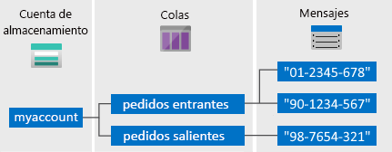

# <a name="quickstart-azure-queue-storage-client-library-v12-for-javascript"></a>Inicio rápido: Biblioteca cliente de Azure Queue Storage v12 para JavaScript

Comience a trabajar con la biblioteca cliente de Azure Queue Storage versión 12 para JavaScript. Azure Queue Storage es un servicio para almacenar grandes cantidades de mensajes para su posterior recuperación y procesamiento. Siga estos pasos para instalar el paquete y probar el código de ejemplo para realizar tareas básicas.

Use la biblioteca cliente de Azure Queue Storage v12 para JavaScript para realizar lo siguiente:

* Creación de una cola
* Adición de mensajes a una cola
* Lectura de los mensajes de una cola
* Eliminación de un mensaje de una cola
* mensajes de una cola
* Eliminación de mensajes de una cola
* Eliminación de una cola

[Documentación de referencia de API](https://docs.microsoft.com/javascript/api/@azure/storage-queue/) | [Código fuente de la biblioteca](https://github.com/Azure/azure-sdk-for-js/tree/master/sdk/storage/storage-queue) | [Paquete (administrador de paquetes de Node)](https://www.npmjs.com/package/@azure/storage-queue) | [Ejemplos](https://docs.microsoft.com/azure/storage/common/storage-samples-javascript?toc=%2fazure%2fstorage%2fqueues%2ftoc.json#queue-samples)

## <a name="prerequisites"></a>Prerrequisitos

* Una suscripción a Azure: [cree una cuenta gratuita](https://azure.microsoft.com/free/)
* Una cuenta de Azure Storage: [cree una cuenta de almacenamiento](https://docs.microsoft.com/azure/storage/common/storage-quickstart-create-account)
* [Node.js](https://nodejs.org/en/download/) actual del sistema operativo.

## <a name="setting-up"></a>Instalación

En esta sección se explica cómo preparar un proyecto para que funcione con la biblioteca cliente de Azure Queue Storage v12 para JavaScript.

### <a name="create-the-project"></a>Creación del proyecto

Cree una aplicación Node.js llamada *queues-quickstart-v12*.

1. En una ventana de la consola (como cmd, PowerShell o Bash), cree un directorio para el proyecto.

    ```console
    mkdir queues-quickstart-v12
    ```

1. Cambie al directorio *queues-quickstart-v12* recién creado.

    ```console
    cd queues-quickstart-v12
    ```

1. Cree un nuevo archivo de texto denominado *package.json*. Este archivo define el proyecto de Node.js. Guarde este archivo en el directorio *queues-quickstart-v12*. A continuación encontrará el contenido del archivo:

    ```json
    {
        "name": "queues-quickstart-v12",
        "version": "1.0.0",
        "description": "Use the @azure/storage-queue SDK version 12 to interact with Azure Queue storage",
        "main": "queues-quickstart-v12.js",
        "scripts": {
            "start": "node queues-quickstart-v12.js"
        },
        "author": "Your Name",
        "license": "MIT",
        "dependencies": {
            "@azure/storage-queue": "^12.0.0",
            "@types/dotenv": "^4.0.3",
            "dotenv": "^6.0.0"
        }
    }
    ```

    Puede poner su propio nombre en el campo `author`, si lo desea.

### <a name="install-the-package"></a>Instalar el paquete

Mientras sigue en el directorio *queues-quickstart-v12*, instale el paquete de la biblioteca cliente de Azure Queue Storage para JavaScript con el comando `npm install`.

```console
npm install
```

 Este comando lee el archivo *package.json* e instala el paquete de la biblioteca cliente de Azure Queue Storage v12 para JavaScript y todas las bibliotecas de las que depende.

### <a name="set-up-the-app-framework"></a>Instalación del marco de la aplicación

Desde el directorio del proyecto:

1. Abra otro nuevo archivo de texto en el editor de código.
1. Agregue llamadas `require` para cargar los módulos de Azure y Node.js.
1. Cree la estructura del programa, incluido un control de excepciones muy básico.

    Este es el código:

    ```javascript
    const { QueueClient } = require("@azure/storage-queue");
    const uuidv1 = require("uuid/v1");

    async function main() {
        console.log("Azure Queue storage v12 - JavaScript quickstart sample");
        // Quick start code goes here
    }

    main().then(() => console.log("\nDone")).catch((ex) => console.log(ex.message));

    ```

1. Guarde el nuevo archivo como *queues-quickstart-v12.js* en el directorio *queues-quickstart-v12*.

[!INCLUDE [storage-quickstart-credentials-include](../../../includes/storage-quickstart-credentials-include.md)]

## <a name="object-model"></a>Modelo de objetos

Azure Queue Storage es un servicio para almacenar grandes cantidades de mensajes, Un mensaje de la cola puede llegar a tener hasta 64 KB. Una cola puede contener millones de mensajes, hasta el límite de capacidad total de una cuenta de almacenamiento. Las colas se utilizan normalmente para crear un trabajo pendiente del trabajo que se va a procesar de forma asincrónica. Queue Storage ofrece tres tipos de recursos:

* La cuenta de almacenamiento
* Cola en la cuenta de almacenamiento
* Mensajes dentro de la cola

En el siguiente diagrama se muestra la relación entre estos recursos.



Use las siguientes clases de JavaScript para interactuar con estos recursos:

* [QueueServiceClient](https://docs.microsoft.com/javascript/api/@azure/storage-queue/queueserviceclient): La clase `QueueServiceClient` permite administrar todas las colas de la cuenta de almacenamiento.
* [QueueClient](https://docs.microsoft.com/javascript/api/@azure/storage-queue/queueclient): La clase `QueueClient` permite administrar y manipular una cola individual y sus mensajes.
* [QueueMessage](https://docs.microsoft.com/javascript/api/@azure/storage-queue/queuemessage): La clase `QueueMessage` representa los objetos individuales devueltos al llamar a [receiveMessages](https://docs.microsoft.com/javascript/api/@azure/storage-queue/queueclient?view=azure-node-latest#receivemessages-queuereceivemessageoptions-) en una cola.

## <a name="code-examples"></a>Ejemplos de código

Estos fragmentos de código de ejemplo muestran cómo realizar las siguientes acciones con la biblioteca cliente de Azure Queue Storage para JavaScript:

* [Obtención de la cadena de conexión](#get-the-connection-string)
* [Creación de una cola](#create-a-queue)
* [Adición de mensajes a una cola](#add-messages-to-a-queue)
* [Leer los mensajes de una cola](#peek-at-messages-in-a-queue)
* [Eliminación de un mensaje de una cola](#update-a-message-in-a-queue)
* [Recepción de mensajes de una cola](#receive-messages-from-a-queue)
* [Eliminación de mensajes de una cola](#delete-messages-from-a-queue)
* [Eliminación de una cola](#delete-a-queue)

### <a name="get-the-connection-string"></a>Obtención de la cadena de conexión

El código siguiente recupera la cadena de conexión de la cuenta de almacenamiento de la variable de entorno creada en la sección [Configuración de la cadena de conexión de almacenamiento](#configure-your-storage-connection-string).

Agregue este código dentro de la función `main`:

```javascript
// Retrieve the connection string for use with the application. The storage
// connection string is stored in an environment variable on the machine
// running the application called AZURE_STORAGE_CONNECTION_STRING. If the
// environment variable is created after the application is launched in a
// console or with Visual Studio, the shell or application needs to be 
// closed and reloaded to take the environment variable into account.
const AZURE_STORAGE_CONNECTION_STRING = process.env.AZURE_STORAGE_CONNECTION_STRING;
```

### <a name="create-a-queue"></a>Creación de una cola

Decida un nombre para la nueva cola. El código siguiente anexa un valor de UUID al nombre de la cola para asegurarse de que sea único.

> [!IMPORTANT]
> Los nombres de la cola solo puede incluir letras minúsculas, números y guiones y debe empezar por una letra o un número. Antes y después de cada guion debe ir un carácter que no sea otro guión. El nombre debe tener entre 3 y 63 caracteres. Para más información sobre la nomenclatura de las colas, consulte [Asignación de nombres a colas y metadatos](https://docs.microsoft.com/rest/api/storageservices/naming-queues-and-metadata).

Cree una instancia de la clase [QueueClient](https://docs.microsoft.com/javascript/api/@azure/storage-queue/queueclient). A continuación, llame al método [create](https://docs.microsoft.com/javascript/api/@azure/storage-queue/queueclient#create-queuecreateoptions-) para crear la cola en la cuenta de almacenamiento.

Agregue este código al final de la función `main`:

```javascript
// Create a unique name for the queue
const queueName = "quickstart" + uuidv1();

console.log("\nCreating queue...");
console.log("\t", queueName);

// Instantiate a QueueClient which will be used to create and manipulate a queue
const queueClient = new QueueClient(AZURE_STORAGE_CONNECTION_STRING, queueName);

// Create the queue
const createQueueResponse = await queueClient.create();
console.log("Queue created, requestId:", createQueueResponse.requestId);
```

### <a name="add-messages-to-a-queue"></a>Adición de mensajes a una cola

El siguiente fragmento de código agrega mensajes a la cola mediante una llamada al método [sendMessage](https://docs.microsoft.com/javascript/api/@azure/storage-queue/queueclient#sendmessage-string--queuesendmessageoptions-). También guarda la clase [QueueMessage](https://docs.microsoft.com/javascript/api/@azure/storage-queue/queuemessage) devuelta desde la tercera llamada a `sendMessage`. La clase `sendMessageResponse` devuelta se utiliza para actualizar el contenido del mensaje más adelante en el programa.

Agregue este código al final de la función `main`:

```javascript
console.log("\nAdding messages to the queue...");

// Send several messages to the queue
await queueClient.sendMessage("First message");
await queueClient.sendMessage("Second message");
const sendMessageResponse = await queueClient.sendMessage("Third message");

console.log("Messages added, requestId:", sendMessageResponse.requestId);
```

### <a name="peek-at-messages-in-a-queue"></a>Lectura de los mensajes de una cola

Lea los mensajes de la cola llamando al método [peekMessages](https://docs.microsoft.com/javascript/api/@azure/storage-queue/queueclient#peekmessages-queuepeekmessagesoptions-). El método `peekMessages` recupera uno o varios mensajes de la parte delantera de la cola, pero no modifica la visibilidad del mensaje.

Agregue este código al final de la función `main`:

```javascript
console.log("\nPeek at the messages in the queue...");

// Peek at messages in the queue
const peekedMessages = await queueClient.peekMessages({ numberOfMessages : 5 });

for (i = 0; i < peekedMessages.peekedMessageItems.length; i++) {
    // Display the peeked message
    console.log("\t", peekedMessages.peekedMessageItems[i].messageText);
}
```

### <a name="update-a-message-in-a-queue"></a>Eliminación de un mensaje de una cola

Actualice el contenido de un mensaje mediante la llamada al método [updateMessage](https://docs.microsoft.com/javascript/api/@azure/storage-queue/queueclient#updatemessage-string--string--string--undefined---number--queueupdatemessageoptions-). El método `updateMessage` puede cambiar el tiempo de espera de visibilidad y el contenido de un mensaje. El contenido del mensaje debe ser una cadena con codificación UTF-8 de hasta 64 KB de tamaño. Junto con el nuevo contenido, pase `messageId` y `popReceipt` de la respuesta que se guardó anteriormente en el código. Las propiedades `sendMessageResponse` identifican el mensaje que se va a actualizar.

```javascript
console.log("\nUpdating the third message in the queue...");

// Update a message using the response saved when calling sendMessage earlier
updateMessageResponse = await queueClient.updateMessage(
    sendMessageResponse.messageId,
    sendMessageResponse.popReceipt,
    "Third message has been updated"
);

console.log("Message updated, requestId:", updateMessageResponse.requestId);
```

### <a name="receive-messages-from-a-queue"></a>mensajes de una cola

Descargue los mensajes agregados anteriormente mediante la llamada al método [receiveMessages](https://docs.microsoft.com/javascript/api/@azure/storage-queue/queueclient#receivemessages-queuereceivemessageoptions-).  En el campo `numberOfMessages`, pase el número máximo de mensajes que se van a recibir para esta llamada.

Agregue este código al final de la función `main`:

```javascript
console.log("\nReceiving messages from the queue...");

// Get messages from the queue
const receivedMessagesResponse = await queueClient.receiveMessages({ numberOfMessages : 5 });

console.log("Messages received, requestId:", receivedMessagesResponse.requestId);
```

### <a name="delete-messages-from-a-queue"></a>Eliminación de mensajes de una cola

Elimine los mensajes de la cola una vez recibidos y procesados. En este caso, el procesamiento solo muestra el mensaje en la consola.

Para eliminar los mensajes, llame al método [deleteMessage](https://docs.microsoft.com/javascript/api/@azure/storage-queue/queueclient#deletemessage-string--string--queuedeletemessageoptions-). Los mensajes que no se eliminen explícitamente volverán a estar visibles en la cola para que se procesen.

Agregue este código al final de la función `main`:

```javascript
// 'Process' and delete messages from the queue
for (i = 0; i < receivedMessagesResponse.receivedMessageItems.length; i++) {
    receivedMessage = receivedMessagesResponse.receivedMessageItems[i];

    // 'Process' the message
    console.log("\tProcessing:", receivedMessage.messageText);

    // Delete the message
    const deleteMessageResponse = await queueClient.deleteMessage(
        receivedMessage.messageId,
        receivedMessage.popReceipt
    );
    console.log("\tMessage deleted, requestId:", deleteMessageResponse.requestId);
}
```

### <a name="delete-a-queue"></a>Eliminación de una cola

El código siguiente limpia los recursos que creó la aplicación; para ello, elimina la cola mediante el método [delete](https://docs.microsoft.com/javascript/api/@azure/storage-queue/queueclient#delete-queuedeleteoptions-).

Agregue este código al final de la función `main` y guarde el archivo:

```javascript
// Delete the queue
console.log("\nDeleting queue...");
const deleteQueueResponse = await queueClient.delete();
console.log("Queue deleted, requestId:", deleteQueueResponse.requestId);
```

## <a name="run-the-code"></a>Ejecución del código

Esta aplicación crea y agrega tres mensajes a una cola de Azure. El código muestra los mensajes en la cola y, a continuación, los recupera y los elimina antes de eliminar la cola.

En la ventana de la consola, vaya al directorio que contiene el archivo *queues-quickstart-v12.js* y, a continuación, ejecute el siguiente comando `node` para ejecutar la aplicación.

```console
node queues-quickstart-v12.js
```

La salida de la aplicación es similar a la del ejemplo siguiente:

```output
Azure Queue storage v12 - JavaScript quickstart sample

Creating queue...
         quickstartc095d120-1d04-11ea-af30-090ee231305f
Queue created, requestId: 5c0bc94c-6003-011b-7c11-b13d06000000

Adding messages to the queue...
Messages added, requestId: a0390321-8003-001e-0311-b18f2c000000

Peek at the messages in the queue...
         First message
         Second message
         Third message

Updating the third message in the queue...
Message updated, requestId: cb172c9a-5003-001c-2911-b18dd6000000

Receiving messages from the queue...
Messages received, requestId: a039036f-8003-001e-4811-b18f2c000000
        Processing: First message
        Message deleted, requestId: 4a65b82b-d003-00a7-5411-b16c22000000
        Processing: Second message
        Message deleted, requestId: 4f0b2958-c003-0030-2a11-b10feb000000
        Processing: Third message has been updated
        Message deleted, requestId: 6c978fcb-5003-00b6-2711-b15b39000000

Deleting queue...
Queue deleted, requestId: 5c0bca05-6003-011b-1e11-b13d06000000

Done
```

Recorra el código en el depurador y compruebe [Azure Portal](https://portal.azure.com) a lo largo del proceso. Compruebe la cuenta de almacenamiento para confirmar que los mensajes de la cola se crean y se eliminan.

## <a name="next-steps"></a>Pasos siguientes

En este inicio rápido, ha aprendido a crear una cola y a agregarle mensajes mediante código de JavaScript. Después aprendió a ver, recuperar y eliminar mensajes. Por último, ha aprendido a eliminar una cola de mensajes.

Para ver tutoriales, ejemplos, artículos de inicio rápido y otra documentación, visite:

> [!div class="nextstepaction"]
> [Documentación de Azure para JavaScript](https://docs.microsoft.com/azure/javascript/)

* Para más información, consulte [Biblioteca cliente de Azure Queue Storage para JavaScript](https://github.com/Azure/azure-sdk-for-js/tree/master/sdk/storage/storage-queue).
* Para ver las aplicaciones de ejemplo de Azure Queue Storage, continúe con los [ejemplos de la biblioteca cliente de Azure Queue Storage para JavaScript v12](https://github.com/Azure/azure-sdk-for-js/tree/master/sdk/storage/storage-queue/samples).
