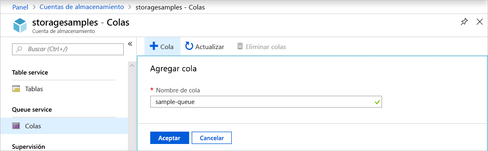
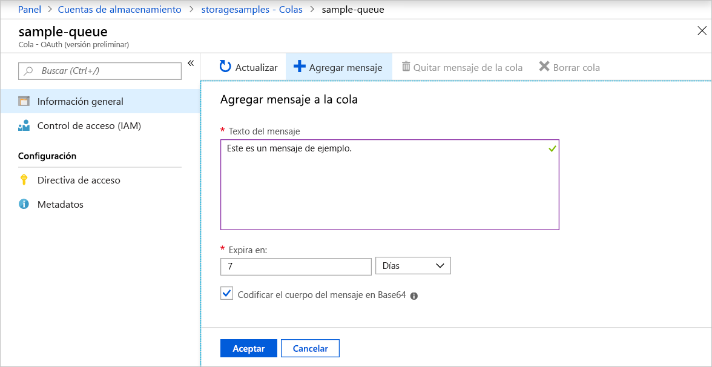
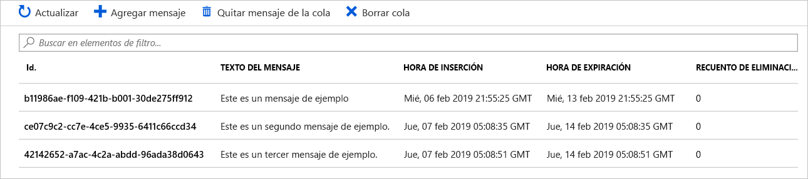
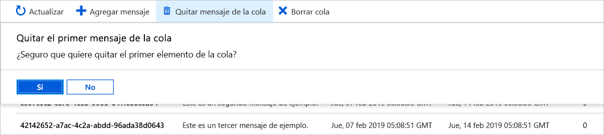

# Inicio rápido: Creación de una cola y agregación de un mensaje con Azure Portal

En este inicio rápido, obtendrá información sobre cómo usar [Azure Portal](https://portal.azure.com/) para crear una cola en Azure Storage, agregar mensajes y quitarlos de la cola.

## Requisitos previos

[!INCLUDE [storage-quickstart-prereq-include](../../../includes/storage-quickstart-prereq-include.md)]

## Creación de una cola

Para crear una cola en Azure Portal, siga estos pasos:

1. Vaya a la nueva cuenta de almacenamiento en Azure Portal.
2. En el menú izquierdo de la cuenta de almacenamiento, desplácese a la sección **Queue Service** (Servicio Cola) y, después, seleccione **Queues** (Colas).
3. Seleccione el botón **+ Cola**.
4. Escriba un nombre para la nueva cola. El nombre de la cola debe escribirse en minúsculas, comenzar por una letra o un número, y solo puede incluir letras, números y el carácter de guión (-).
6. Seleccione **Aceptar** para crear la cola.

    

## Agregar un mensaje

Después, agregue un mensaje a la cola nueva. Un mensaje puede ser de hasta 64 KB de tamaño.

1. Seleccione la nueva cola en la lista de colas de la cuenta de almacenamiento.
1. Seleccione el botón **+ Agregar mensaje** para agregar un mensaje a la cola. Escriba un mensaje en el campo **Texto del mensaje**. 
1. Especifique cuándo expira el mensaje. El tiempo máximo que un mensaje puede permanecer en la cola es de 7 días.
1. Indique si desea codificar el mensaje como Base64. Se recomienda la codificación de datos binarios.
1. Seleccione el botón **Aceptar** para agregar el mensaje.

    

## Visualización de las propiedades de los mensajes

Después de agregar un mensaje, Azure Portal muestra una lista de todos los mensajes de la cola. Puede ver el identificador, el contenido, el tiempo de inserción y la hora de expiración del mensaje. También puede ver el número de veces que este mensaje se ha quitado de la cola.

## Quitar de la cola un mensaje

Puede quitar un mensaje de la parte delantera de la cola desde Azure Portal. Cuando se quita de la cola un mensaje, se elimina. 

Al eliminar de la cola siempre se quita el último mensaje en la cola. 

## Pasos siguientes

En este inicio rápido, aprendió a crear una cola, agregar un mensaje, ver las propiedades de mensaje y quitar de la cola un mensaje en Azure Portal.

> [!div class="nextstepaction"]
> [¿Qué son las colas de Azure?](storage-queues-introduction.md)
