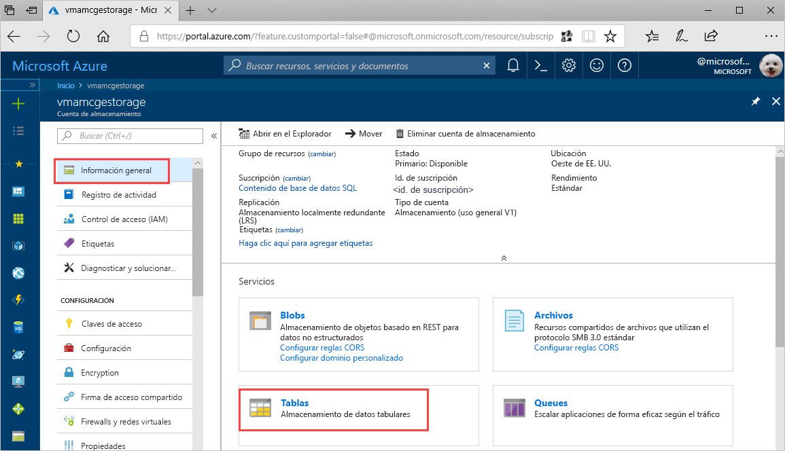
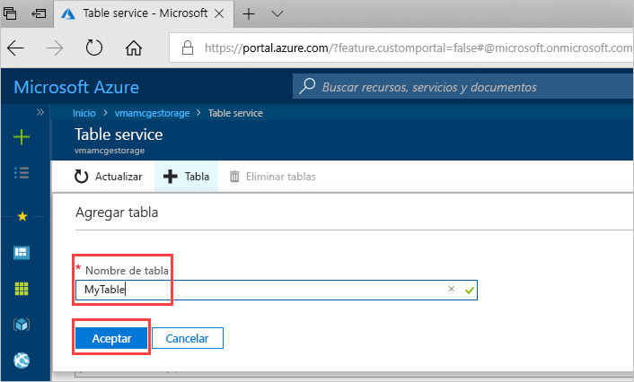

# Guía de inicio rápido: Creación de una tabla de Azure Storage en Azure Portal 

Esta guía de inicio rápido muestra cómo crear tablas y entidades en Azure Portal basado en web. En esta guía de inicio rápido se muestra cómo crear una cuenta de Azure Storage.

[!INCLUDE [quickstarts-free-trial-note](../../../includes/quickstarts-free-trial-note.md)]

## requisitos previos

Para completar esta guía de inicio rápido, cree primero una cuenta de Azure Storage en [Azure Portal](https://portal.azure.com/#create/Microsoft.StorageAccount-ARM). Si necesita ayuda para crearla, consulte [Creación de una cuenta de almacenamiento](../common/storage-quickstart-create-account.md).

## Adición de una tabla

Ahora puede usar el servicio Table service en Azure Portal para crear una tabla.

1. Haga clic en Introducción > Tablas.

   

2. Haga clic en **+ Tabla**.

   

3. Escriba un nombre para la tabla en el cuadro **Nombre de la tabla** y, a continuación, haga clic en **Aceptar**. 

   

## Pasos siguientes

- [Directrices para el diseño de tablas](table-storage-design-guidelines.md)