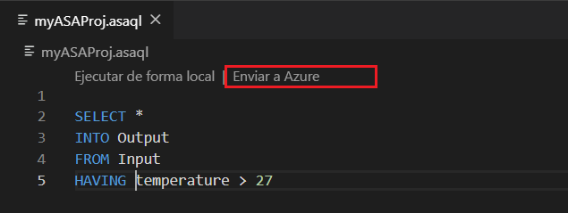

# Copia o copia de seguridad de trabajos de Azure Stream Analytics

Puede copiar o hacer una copia de seguridad de los trabajos de Azure Stream Analytics implementados mediante Visual Studio Code o Visual Studio. 

## Antes de empezar
* Si no tiene una suscripción a Azure, cree una [cuenta gratuita](https://azure.microsoft.com/free/).

* Inicie sesión en [Azure Portal](https://portal.azure.com/).

* Instale la [extensión Azure Stream Analytics para Visual Studio Code](quick-create-vs-code.md#install-the-azure-stream-analytics-tools-extension) o las [herramientas de Azure Stream Analytics para Visual Studio](quick-create-vs-code.md#install-the-azure-stream-analytics-tools-extension).  

## Visual Studio Code

1. Haga clic en el icono de **Azure** en la barra de actividades de código de Visual Studio Code y, después, expanda el nodo **Stream Analytics**. Los trabajos deben aparecer en las suscripciones.

   

2. Para exportar un trabajo a un proyecto local, busque el trabajo que desea exportar en el **explorador de Stream Analytics** en Visual Studio Code. Después seleccione una carpeta para el proyecto.

    

    El proyecto se exporta a la carpeta que seleccione y se agrega al área de trabajo actual.

    

3. Para publicar el trabajo en otra región o copia de seguridad con otro nombre, seleccione **Seleccione entre las suscripciones para publicar** en el editor de consultas (\*.asaql) y siga las instrucciones.

    

## Visual Studio

1. Siga las [instrucciones para exportar a un proyecto un trabajo de Azure Stream Analytics implementado](https://docs.microsoft.com/azure/stream-analytics/stream-analytics-vs-tools#export-jobs-to-a-project).

2. Abra el archivo \*.asaql en el editor de consultas, seleccione **Enviar a Azure** en el editor de scripts y siga las instrucciones para publicar el trabajo en otra región o copia de seguridad con un nombre nuevo.

## Pasos siguientes

* [Inicio rápido: Creación de un trabajo de Stream Analytics mediante Visual Studio Code](quick-create-vs-code.md)
* [Inicio rápido: Creación de un trabajo de Stream Analytics mediante Visual Studio](stream-analytics-quick-create-vs.md)
* [Implementación de un trabajo de Azure Stream Analytics con CI/CD mediante Azure Pipelines](stream-analytics-tools-visual-studio-cicd-vsts.md)
