# <a name="quickstart-create-an-azure-stream-analytics-cloud-job-in-visual-studio-code-preview"></a>Inicio rápido: Creación de un trabajo en la nube de Azure Stream Analytics en Visual Studio Code (versión preliminar)

En este inicio rápido se muestra cómo crear y ejecutar un trabajo de Stream Analytics mediante la extensión de Azure Stream Analytics para Visual Studio Code. El trabajo de ejemplo lee los datos de streaming desde el dispositivo de IoT Hub. Va a definir un trabajo que calcula la temperatura media cuando se sobrepasan los 27 ° y escribe los eventos de salida resultantes en un nuevo archivo del almacenamiento de blobs.

## <a name="before-you-begin"></a>Antes de empezar

* Si no tiene una suscripción a Azure, cree una [cuenta gratuita](https://azure.microsoft.com/free/).

* Inicie sesión en el [Azure Portal](https://portal.azure.com/).

* Instale [Visual Studio Code](https://code.visualstudio.com/).

## <a name="install-the-azure-stream-analytics-extension"></a>Instalación de la extensión de Azure Stream Analytics

1. Abra Visual Studio Code.

2. Desde **Extensiones** en el panel izquierdo, busque **Stream Analytics** y seleccione **Instalar** en la extensión **Azure Stream Analytics**.

3. Una vez que la extensión esté instalada, compruebe que **Herramientas de Azure Stream Analytics** está visible en **Enabled Extensions** (Extensiones habilitadas).

   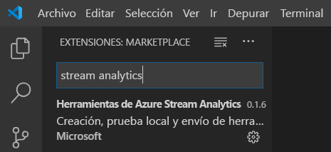

## <a name="activate-the-azure-stream-analytics-extension"></a>Activación de la extensión de Azure Stream Analytics

1. Seleccione el icono de **Azure** en la barra de actividad de VS Code. **Stream Analytics** estará visible en la barra lateral. En **Stream Analytics**, seleccione **Iniciar sesión en Azure**. 

   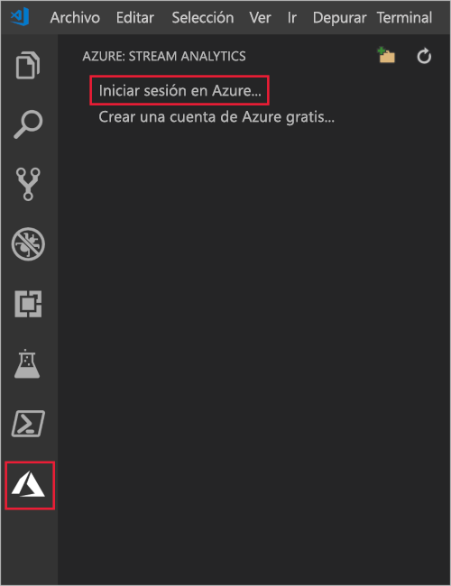

2. Cuando haya iniciado sesión, el nombre de la cuenta de Azure aparecerá en la barra de estado que se encuentra en la esquina inferior izquierda de la ventana de VS Code.

> [!NOTE]
> Las herramientas de Azure Stream Analytics iniciarán sesión automáticamente la próxima vez si no cierra la sesión. Si la cuenta tiene la autenticación de dos pasos, se recomienda usar la autenticación por teléfono en lugar de usar un PIN.
> Si tiene problemas para enumerar los recursos, puede ser útil cerrar la sesión e iniciarla de nuevo. Para cerrar la sesión, escriba el comando `Azure: Sign Out`.

## <a name="prepare-the-input-data"></a>Preparación de los datos de entrada

Antes de definir el trabajo de Stream Analytics, debe preparar los datos, que se configuran más adelante como entrada del trabajo. Para preparar los datos de entrada que requiere el trabajo, siga estos pasos:

1. Inicie sesión en el [Azure Portal](https://portal.azure.com/).

2. Seleccione **Crear un recurso** > **Internet de las cosas** > **IoT Hub**.

3. En el panel **Centro de IoT**, escriba la siguiente información:
   
   |**Configuración**  |**Valor sugerido**  |**Descripción**  |
   |---------|---------|---------|
   |Subscription  | \<Su suscripción\> |  Seleccione la suscripción de Azure que quiera usar. |
   |Resource group   |   asaquickstart-resourcegroup  |   Seleccione **Crear nuevo** y escriba un nuevo nombre de grupo de recursos para la cuenta. |
   |Region  |  \<Seleccione la región más cercana a los usuarios\> | Seleccione la ubicación geográfica donde puede hospedar la instancia de IoT Hub. Use la ubicación más cercana a los usuarios. |
   |Nombre de la instancia de IoT Hub  | MyASAIoTHub  |   Seleccione un nombre para la instancia de IoT Hub.   |

   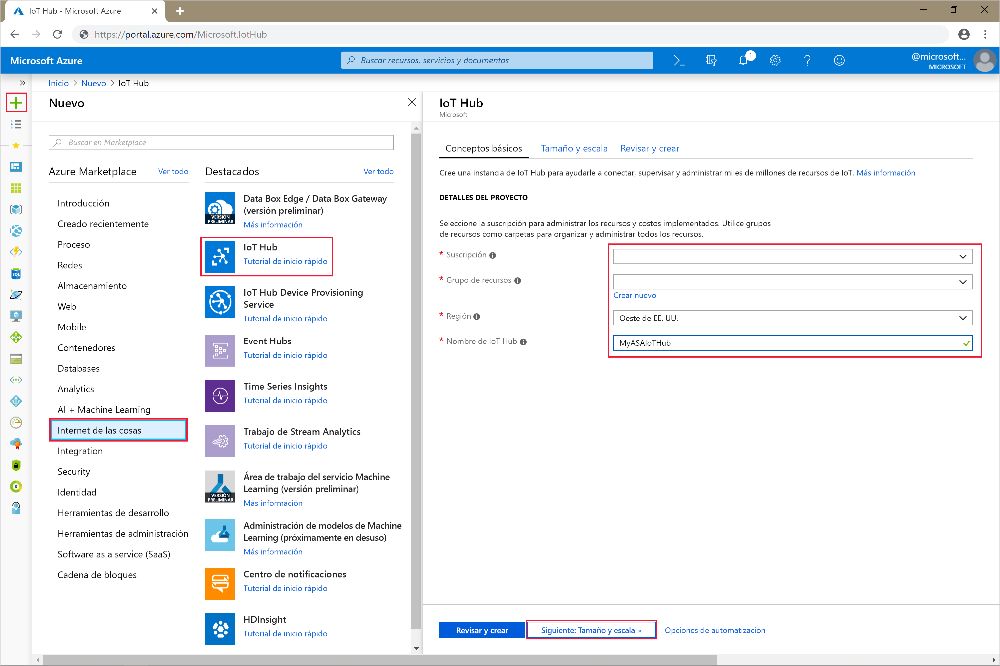

4. Seleccione **Siguiente: Establezca la escala y el tamaño**.

5. Seleccione su **Nivel de precios y de escala**. En esta guía de inicio rápido, seleccione el nivel **F1 - Free** (F1: gratis) si aún está disponible en la suscripción. Si el nivel gratis no está disponible, elija el nivel más bajo disponible. Para más información, consulte [Precios de IoT Hub](https://azure.microsoft.com/pricing/details/iot-hub/).

   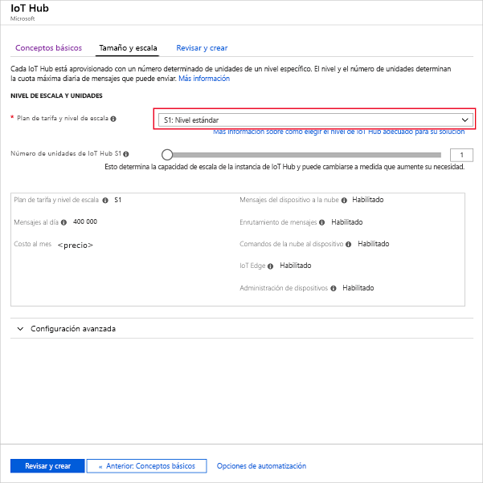

6. Seleccione **Revisar + crear**. Revise la información de IoT Hub y haga clic en **Crear**. La instancia de IoT Hub puede tardar varios minutos en crearse. Puede ver el progreso en el panel **Notificaciones**.

7. En el menú de navegación de IoT Hub, haga clic en **Agregar** en **Dispositivos IoT**. Agregue un **identificador de dispositivo** y haga clic en **Guardar**.

   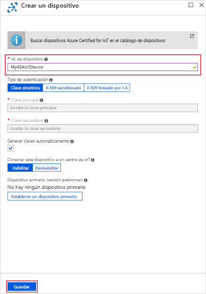

8. Después de crear el dispositivo, ábralo desde la lista **Dispositivos de IoT**. Copie el valor de **Cadena de conexión: clave principal** y guárdelo en el Bloc de notas para usarlo más adelante.

   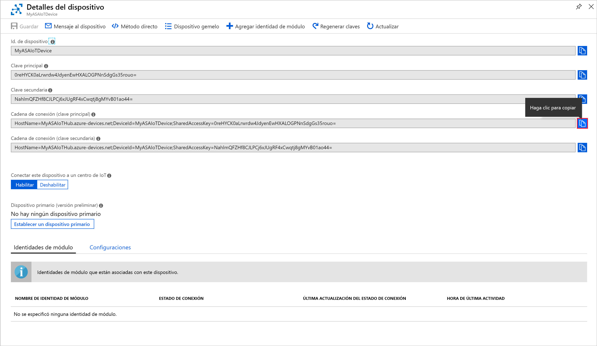

## <a name="create-blob-storage"></a>Creación de un almacenamiento de blobs

1. En la esquina superior izquierda de Azure Portal, seleccione **Crear un recurso** > **Almacenamiento** > **Cuenta de almacenamiento**.

2. En el panel **Crear cuenta de almacenamiento**, escriba un nombre, una ubicación y un grupo de recursos para la cuenta de almacenamiento. Elija la misma ubicación y grupo de recursos que los de la instancia de IoT Hub que creó. A continuación, haga clic en **Revisar y crear** para crear la cuenta.

   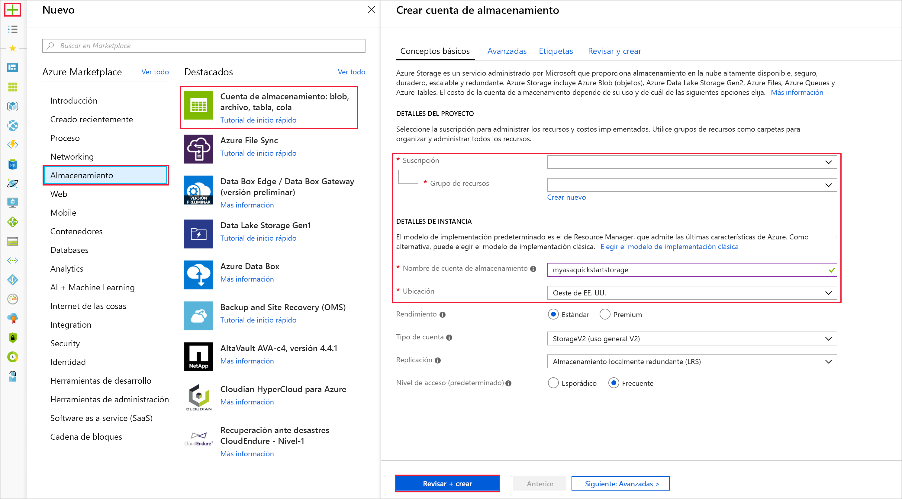

3. Una vez creada la cuenta de almacenamiento, seleccione el icono **Blobs** en el panel de **información general**.

   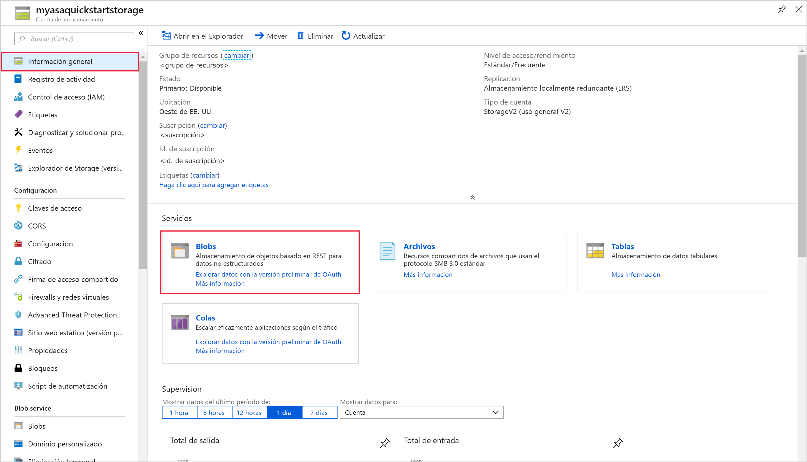

4. En la página **Blob Service**, seleccione **Contenedor** y proporcione un nombre para el contenedor, como *contenedor1*. Deje la opción **Nivel de acceso público** en **Privado (sin acceso anónimo)** y seleccione **Aceptar**.

   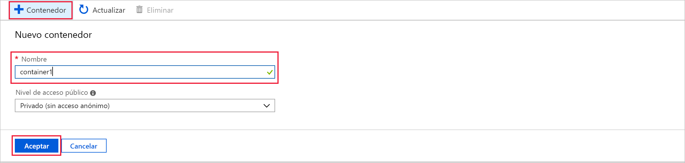

## <a name="create-a-stream-analytics-project"></a>Creación de un trabajo de Stream Analytics

1. En Visual Studio Code, presione **Ctrl+Mayús+P** para abrir la paleta de comandos. A continuación, escriba **ASA** y seleccione **ASA: Crear nuevo proyecto**.

   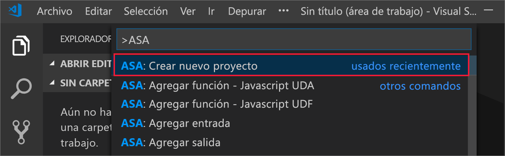

2. Escriba el nombre del proyecto, como **myASAproj**, y seleccione una carpeta para el proyecto.

    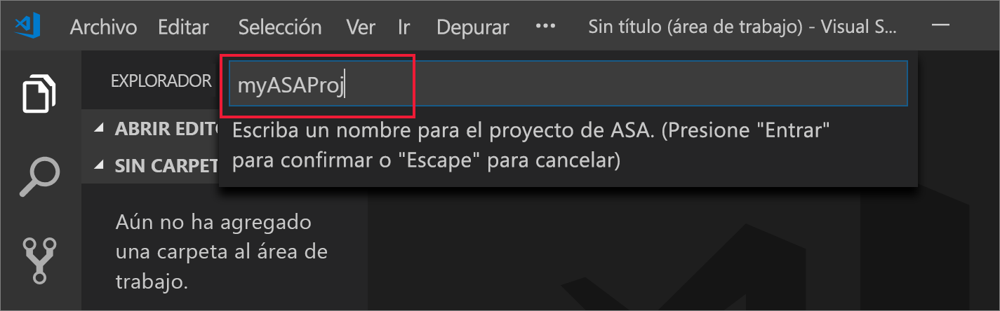

3. El nuevo proyecto se agregará al área de trabajo. Un proyecto de ASA consta del script de consulta **(*.asaql)** , un archivo **JobConfig.json** y un archivo de configuración **asaproj.json**.

   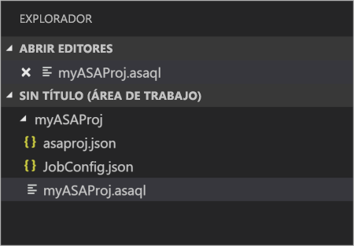

4. El archivo de configuración **asaproj.json** contiene las entradas, salidas y la información del archivo de configuración de trabajo necesarias para enviar el trabajo de Stream Analytics a Azure.

   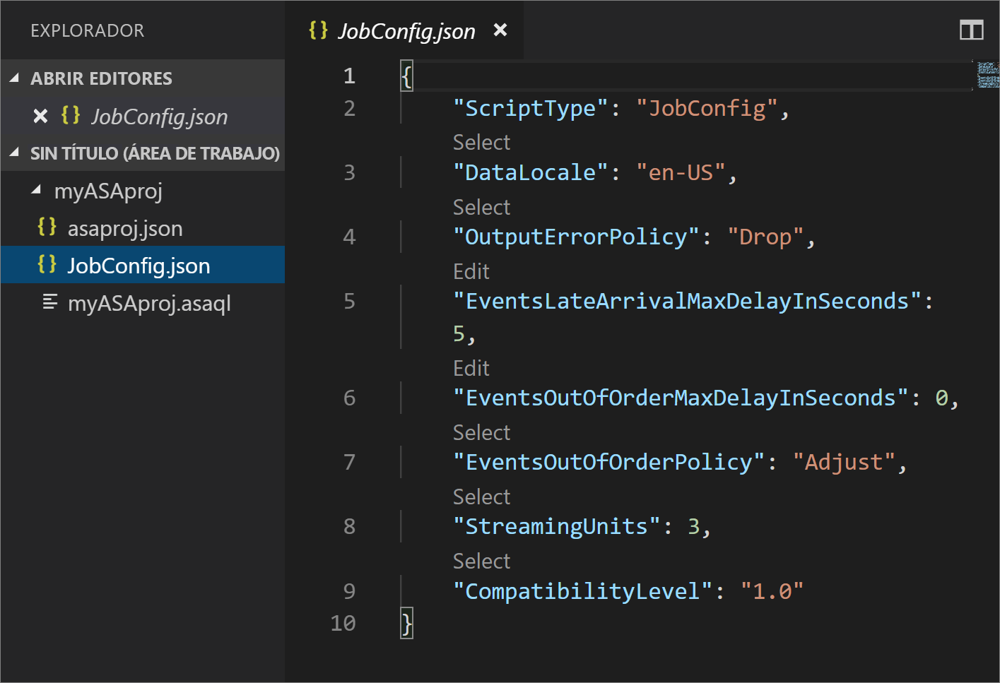

> [!Note]
> Al agregar las entradas y salidas de la paleta de comandos, se agregarán las rutas correspondientes a **asaproj.json** automáticamente. Si agrega o quita entradas o salidas en el disco directamente, deberá agregarlas o quitarlas manualmente en **asaproj.json**. Puede colocar las entradas y salidas en un mismo lugar y, a continuación, hacer referencia a ellas en distintos trabajos especificando las rutas de acceso en cada archivo **asaproj.json**.

## <a name="define-the-transformation-query"></a>Definir la consulta de transformación

1. Abra **myASAproj.asaql** desde la carpeta del proyecto.

2. Agregue la siguiente consulta:

   ```sql
   SELECT * 
   INTO Output
   FROM Input
   HAVING Temperature > 27
   ```
## <a name="test-with-sample-data"></a>Prueba con datos de ejemplo
Antes de ejecutar la consulta en la nube, puede probar la consulta con datos de ejemplo locales para comprobar la lógica de la consulta.

Siga las instrucciones de [Prueba con datos de ejemplo](vscode-local-run.md) para más información. 

 

## <a name="define-an-input"></a>Definición de una entrada

1. Seleccione **Ctrl + Mayús + P** para abrir la paleta de comandos y escriba **ASA: Agregar entrada**.

   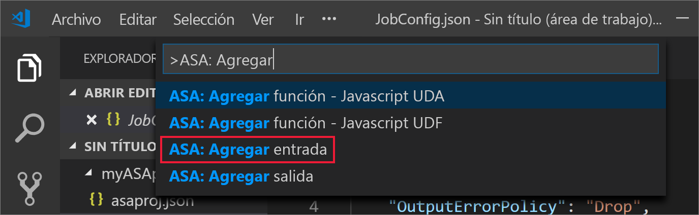

2. Seleccione **IoT Hub** como tipo de entrada.

   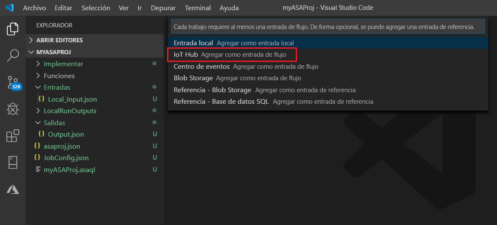

3. Seleccione el script de consulta de ASA que utilizará la entrada. Debe rellenarse automáticamente con la ruta de acceso a **myASAproj.asaql**.

   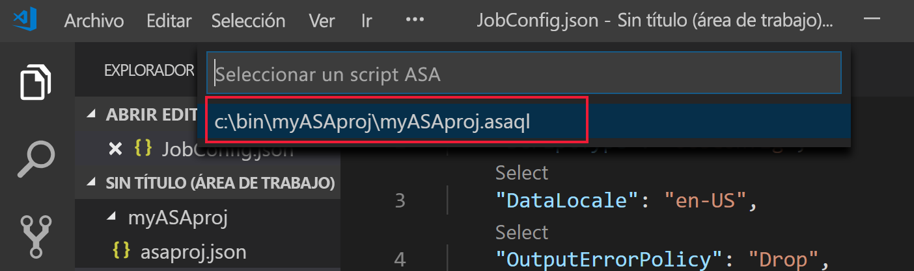

4. Escriba el nombre de archivo de entrada como **IotHub**.

5. Edite **IoTHub.json** con los valores siguientes. Conserve los valores predeterminados para los campos que no se mencionan a continuación. Puede usar CodeLens para ayudarle a escribir una cadena, seleccionar en una lista desplegable o cambiar el texto directamente en el archivo.

   |Configuración|Valor sugerido|DESCRIPCIÓN|
   |-------|---------------|-----------|
   |NOMBRE|Entrada|Escriba un nombre para identificar la entrada del trabajo.|
   |IotHubNamespace|MyASAIoTHub|Elija o escriba el nombre de su instancia de IoT Hub. Los nombres de IoT Hub se detectan automáticamente si se crean en la misma suscripción.|
   |SharedAccessPolicyName|iothubowner| |

   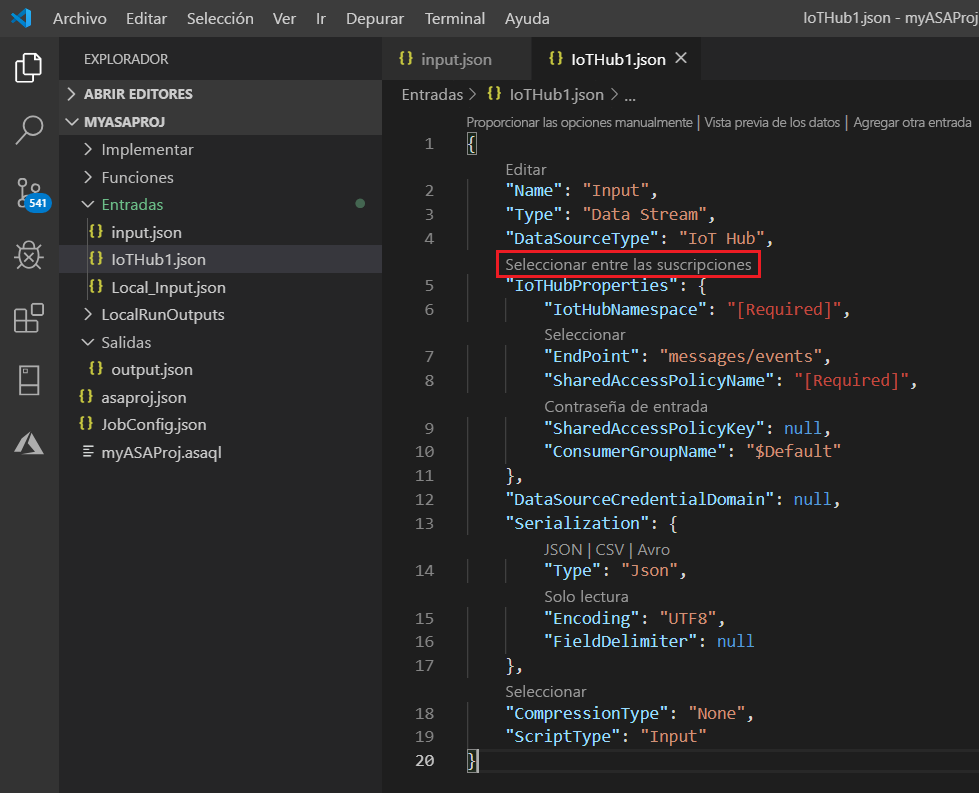


## <a name="define-an-output"></a>Definición de una salida

1. Seleccione **Ctrl+Mayús+P** para abrir la paleta de comandos. A continuación, escriba **ASA: Agregar salida**.

   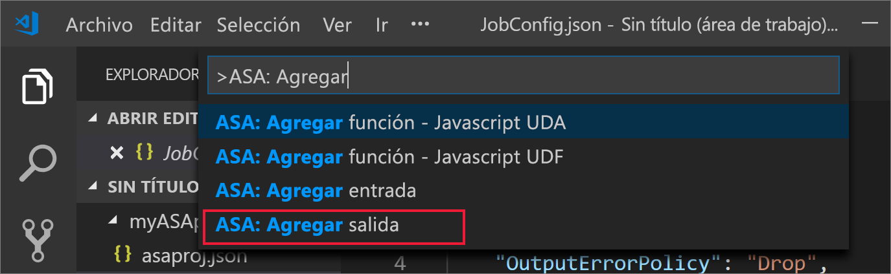

2. Seleccione **Blob Storage** como tipo de receptor.

3. Seleccione el script de consulta de ASA que utilizará esta entrada.

4. Escriba el nombre de archivo de salida como **BlobStorage**.

5. Edite **BlobStorage** con los valores siguientes. Conserve los valores predeterminados para los campos que no se mencionan a continuación. Use CodeLens para ayudarle a seleccionar en una lista desplegable o a escribir una cadena. 

   |Configuración|Valor sugerido|DESCRIPCIÓN|
   |-------|---------------|-----------|
   |NOMBRE|Output| Escriba un nombre para identificar la salida del trabajo.|
   |Cuenta de almacenamiento|asaquickstartstorage|Elija o escriba el nombre de la cuenta de almacenamiento. Los nombres de cuenta de almacenamiento se detectan automáticamente si se crean en la misma suscripción.|
   |Contenedor|Contenedor1|Seleccione el contenedor existente que creó en la cuenta de almacenamiento.|
   |Patrón de la ruta de acceso|output|Escriba el nombre de una ruta de acceso de archivo que debe crearse en el contenedor.|

 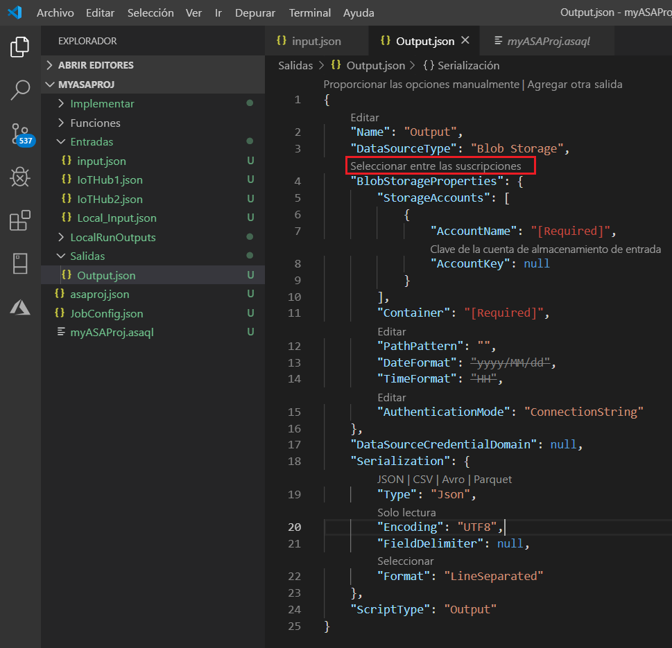

## <a name="compile-the-script"></a>Compilación del script

La compilación del script hace dos cosas: comprobar la sintaxis y generar las plantillas de Azure Resource Manager para la implementación automática.

Existen dos maneras de desencadenar la compilación del script:

1. Seleccione el script del área de trabajo y, a continuación, desencadene la compilación desde la paleta de comandos. 

   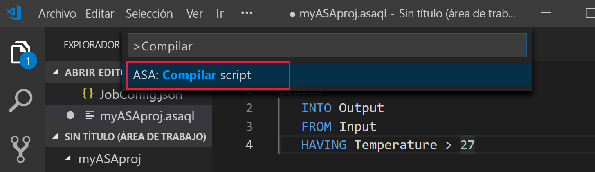

2. Haga clic con el botón derecho en el script y seleccione **ASA: Compile script** (ASA: Compilar script).

    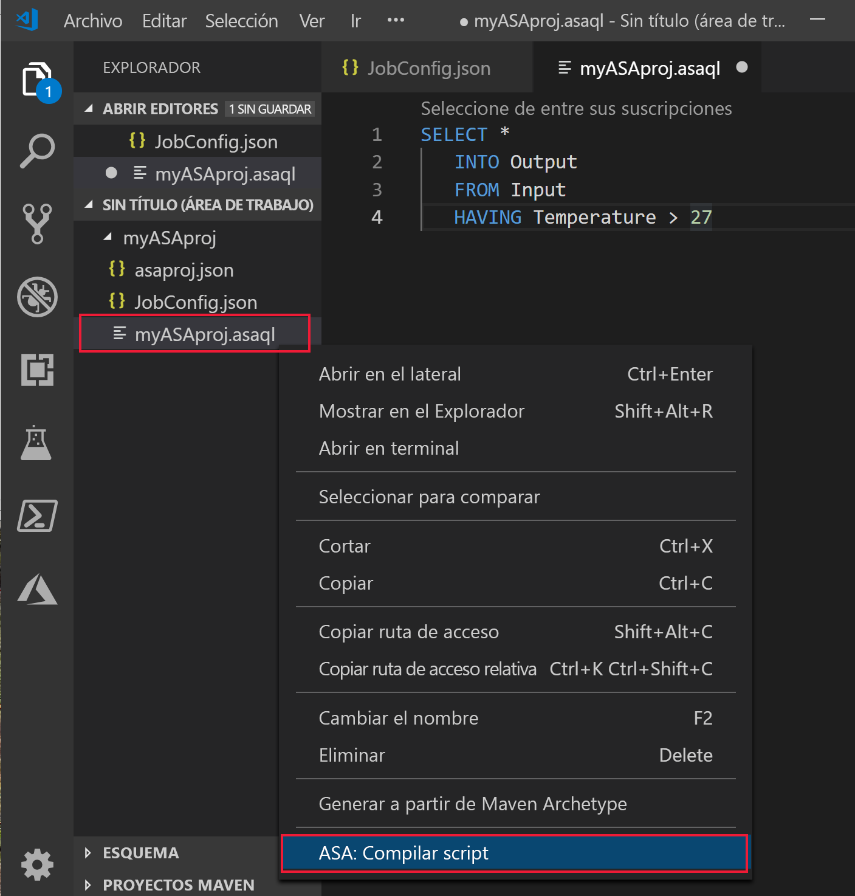

3. Después de la compilación, puede encontrar las dos plantillas de Azure Resource Manager generadas en la carpeta **Implementar** del proyecto. Estos dos archivos se usan para la implementación automática.

    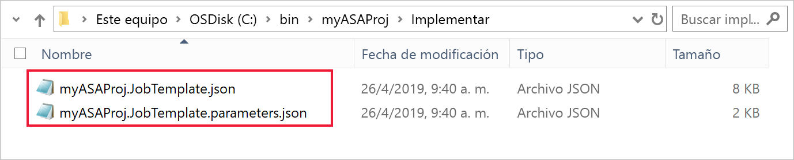

## <a name="submit-a-stream-analytics-job-to-azure"></a>Envío de un trabajo de Stream Analytics a Azure

1. En la ventana del editor de scripts de Visual Studio Code, seleccione **Select from your subscriptions** (Seleccionar entre las suscripciones).

   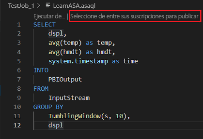

2. Seleccione la suscripción en la lista emergente.

3. Seleccione un trabajo**. A continuación, elija Crear un nuevo trabajo.

4. Escriba el nombre del trabajo, **myASAjob**, y, a continuación, siga las instrucciones para elegir el grupo de recursos y la ubicación.

5. Seleccione **Enviar a Azure**. Los registros se pueden encontrar en la ventana de salida. 

6. Cuando se cree el trabajo, podrá verlo en el **Explorador de Stream Analytics**.

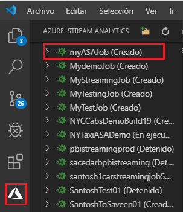


## <a name="run-the-iot-simulator"></a>Ejecutar el simulador

1. Abra el [simulador en línea de Raspberry Pi para Azure IoT](https://azure-samples.github.io/raspberry-pi-web-simulator/) en otra ventana o pestaña del explorador.

2. Reemplace el marcador de posición de la línea 15 con la cadena de conexión del dispositivo de Azure IoT Hub que guardó en la sección anterior.

3. Haga clic en **Ejecutar**. La salida debe mostrar los datos y mensajes del sensor que se envían a la instancia de IoT Hub.

   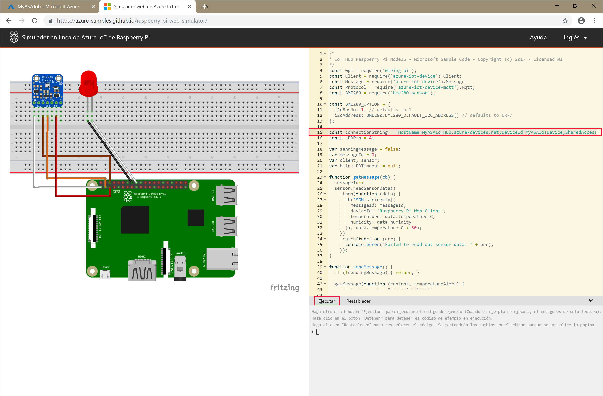

## <a name="start-the-stream-analytics-job-and-check-output"></a>Inicio del trabajo de Stream Analytics y consulta de la salida

1. Abra el **explorador de Stream Analytics** en Visual Studio Code y busque su trabajo, **myASAJob**.

2. Haga clic con el botón derecho en el nombre del trabajo. A continuación, seleccione **Iniciar** en el menú contextual.

   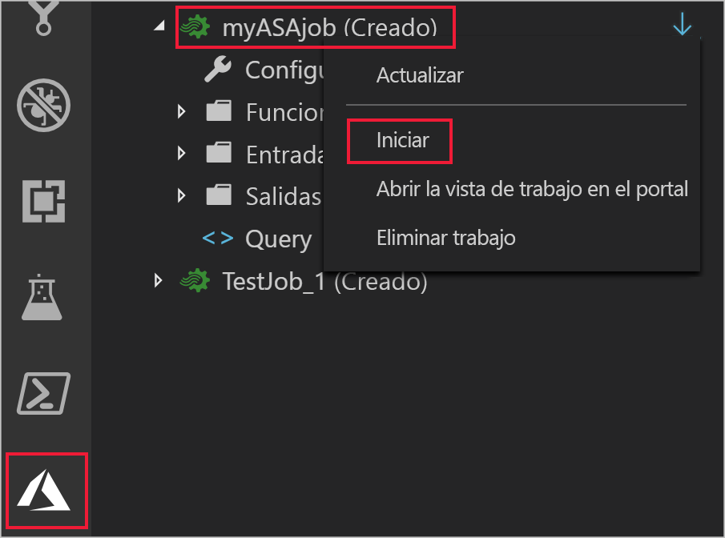

3. Elija **ahora** en la ventana emergente para iniciar el trabajo.

4. Observe que el estado del trabajo ha cambiado a **En ejecución**. Haga clic con el botón derecho en el nombre del trabajo y elija **Open Job View in Portal** (Abrir vista de trabajo en el portal) para ver las métricas de eventos de entrada y salida. Esta operación puede tardar algunos minutos.

5. Para ver los resultados, abra el almacenamiento de blobs en la extensión de Visual Studio Code o en Azure Portal.

## <a name="clean-up-resources"></a>Limpieza de recursos

Cuando no los necesite, elimine el grupo de recursos, el trabajo de streaming y todos los recursos relacionados. La eliminación del trabajo evita la facturación de las unidades de streaming utilizadas por el trabajo. Si piensa utilizar el trabajo en el futuro, puede detenerlo y volver a iniciarlo más adelante cuando sea necesario. Si no va a seguir usando este trabajo, siga estos pasos para eliminar todos los recursos creados en esta guía de inicio rápido:

1. En el menú de la izquierda de Azure Portal, seleccione **Grupos de recursos** y luego el nombre del recurso que creó.  

2. En la página del grupo de recursos, seleccione **Eliminar**, escriba el nombre del recurso que quiere eliminar en el cuadro de texto y, luego, seleccione **Eliminar**.

## <a name="next-steps"></a>Pasos siguientes

En este inicio rápido, ha implementado un sencillo trabajo de Stream Analytics mediante Visual Studio Code. También puede implementar trabajos de Stream Analytics mediante [Azure Portal](stream-analytics-quick-create-portal.md), [PowerShell](stream-analytics-quick-create-powershell.md) y Visual Studio (stream-analytics-quick-create-vs.md). 

Para información acerca de las herramientas de Azure Stream Analytics para Visual Studio, consulte el artículo siguiente:

> [!div class="nextstepaction"]
> [Uso de Visual Studio para ver trabajos de Azure Stream Analytics](stream-analytics-vs-tools.md)
