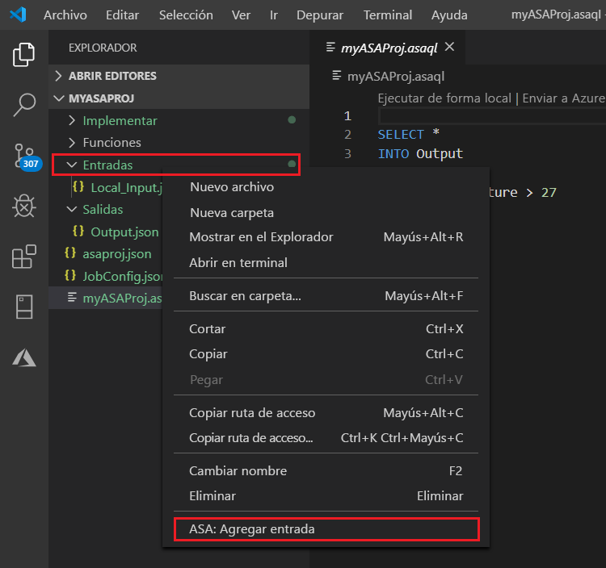
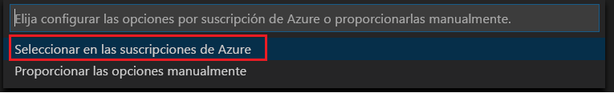
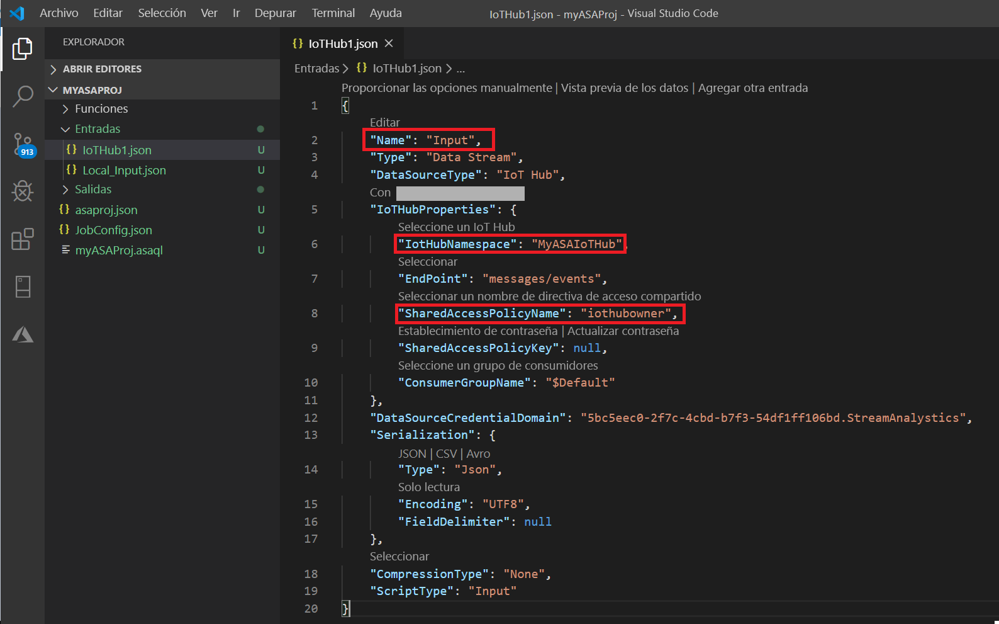
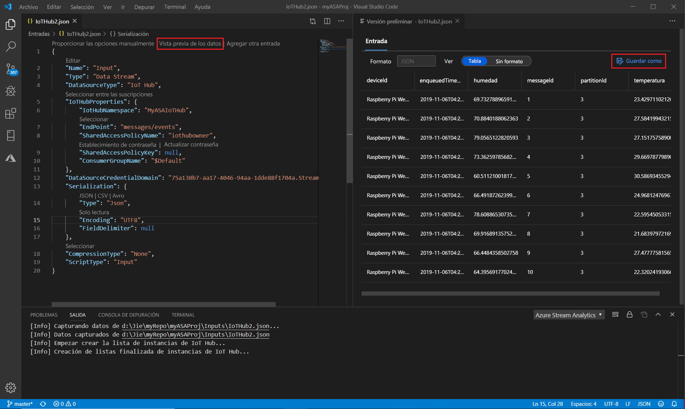

# <a name="quickstart-create-an-azure-stream-analytics-job-in-visual-studio-code-preview"></a>Inicio rápido: Creación de un trabajo de Azure Stream Analytics en Visual Studio Code (versión preliminar)

En este inicio rápido se muestra cómo crear y ejecutar un trabajo de Azure Stream Analytics mediante la extensión Azure Stream Analytics Tools for Visual Studio Code. El trabajo de ejemplo lee los datos de streaming desde el dispositivo de Azure IoT Hub. Va a definir un trabajo que calcula la temperatura media cuando se sobrepasan los 27 ° y escribe los eventos de salida resultantes en un nuevo archivo del almacenamiento de blobs.

## <a name="before-you-begin"></a>Antes de empezar

* Si no tiene una suscripción a Azure, cree una [cuenta gratuita](https://azure.microsoft.com/free/).

* Inicie sesión en [Azure Portal](https://portal.azure.com/).

* Instale [Visual Studio Code](https://code.visualstudio.com/).

## <a name="install-the-azure-stream-analytics-tools-extension"></a>Instalación de la extensión Azure Stream Analytics Tools

1. Abra Visual Studio Code.

2. Desde **Extensiones** en el panel izquierdo, busque **Stream Analytics** y seleccione **Install** (Instalar) en la extensión **Azure Stream Analytics Tools**.

3. Después de instalar la extensión, compruebe que **Azure Stream Analytics Tools** está visible en **Extensiones habilitadas**.

   

## <a name="activate-the-azure-stream-analytics-tools-extension"></a>Activación de la extensión Azure Stream Analytics Tools

1. Seleccione el icono de **Azure** en la barra de actividad de Visual Studio Code. En **Stream Analytics**, en la barra lateral, seleccione **Iniciar sesión en Azure**.

   

2. Cuando haya iniciado sesión, el nombre de la cuenta de Azure aparecerá en la barra de estado que se encuentra en la esquina inferior izquierda de la ventana de Visual Studio Code.

> [!NOTE]
> Las extensión Azure Stream Analytics Tools iniciará sesión automáticamente la próxima vez si no cierra la sesión. Si la cuenta tiene la autenticación en dos fases, se recomienda usar la autenticación telefónica en lugar de usar un PIN.
> Si tiene problemas para enumerar los recursos, puede ser útil cerrar la sesión e iniciarla de nuevo. Para cerrar la sesión, escriba el comando `Azure: Sign Out`.

## <a name="prepare-the-input-data"></a>Preparación de los datos de entrada

Antes de definir el trabajo de Stream Analytics, debe preparar los datos, que se configuran más adelante como entrada del trabajo. Para preparar los datos de entrada que requiere el trabajo, siga estos pasos:

1. Inicie sesión en [Azure Portal](https://portal.azure.com/).

2. Seleccione **Crear un recurso** > **Internet de las cosas** > **IoT Hub**.

3. En el panel **Centro de IoT**, escriba la siguiente información:

   |**Configuración**  |**Valor sugerido**  |**Descripción**  |
   |---------|---------|---------|
   |Subscription  | \<Su suscripción\> |  Seleccione la suscripción de Azure que quiera usar. |
   |Grupo de recursos   |   asaquickstart-resourcegroup  |   Seleccione **Crear nuevo** y escriba un nuevo nombre de grupo de recursos para la cuenta. |
   |Region  |  \<Seleccione la región más cercana a los usuarios\> | Seleccione la ubicación geográfica donde puede hospedar el centro de IoT. Use la ubicación más cercana a los usuarios. |
   |Nombre de la instancia de IoT Hub  | MyASAIoTHub  |   Seleccione un nombre para el centro de IoT.   |

   

4. Seleccione **Siguiente: Establezca la escala y el tamaño**.

5. Realice una selección en **Nivel de precios y de escala**. En esta guía de inicio rápido, seleccione el nivel **F1 - Free** (F1: gratis) si aún está disponible en la suscripción. Si el nivel gratis no está disponible, elija el nivel más bajo disponible. Para obtener más información, vea el artículo sobre [precios de IoT Hub](https://azure.microsoft.com/pricing/details/iot-hub/).

   

6. Seleccione **Revisar + crear**. Revise la información del centro de IoT y haga clic en **Crear**. El centro de IoT puede tardar varios minutos en crearse. Puede ver el progreso en el panel **Notificaciones**.

7. En el menú de navegación del centro de IoT, haga clic en **Agregar** en **Dispositivos de IoT**. Agregue un **identificador de dispositivo** y seleccione **Guardar**.

   

8. Después de crear el dispositivo, ábralo desde la lista **Dispositivos de IoT**. Copie la cadena en **Cadena de conexión (clave principal)** y guárdela en el Bloc de notas para usarla más adelante.

   

## <a name="run-the-iot-simulator"></a>Ejecutar el simulador

1. Abra el [simulador en línea de Raspberry Pi para Azure IoT](https://azure-samples.github.io/raspberry-pi-web-simulator/) en otra ventana o pestaña del explorador.

2. Reemplace el marcador de posición de la línea 15 con la cadena de conexión del dispositivo del centro de IoT que ha guardado anteriormente.

3. Seleccione **Run** (Ejecutar). La salida debe mostrar los datos y mensajes del sensor que se envían al centro de IoT.

   

## <a name="create-blob-storage"></a>Creación de un almacenamiento de blobs

1. En la esquina superior izquierda de Azure Portal, seleccione **Crear un recurso** > **Almacenamiento** > **Cuenta de almacenamiento**.

2. En el panel **Crear cuenta de almacenamiento**, escriba un nombre, una ubicación y un grupo de recursos para la cuenta de almacenamiento. Elija la misma ubicación y grupo de recursos que los del centro de IoT que ha creado. A continuación, haga clic en **Revisar y crear** para crear la cuenta.

   

3. Una vez creada la cuenta de almacenamiento, seleccione el icono **Blobs** en el panel de **información general**.

   

4. En la página **Blob Service**, seleccione **Contenedor** y proporcione un nombre para el contenedor, como **contenedor1**. Deje la opción **Nivel de acceso público** en **Privado (sin acceso anónimo)** y seleccione **Aceptar**.

   

## <a name="create-a-stream-analytics-project"></a>Creación de un trabajo de Stream Analytics

1. En Visual Studio Code, seleccione **Ctrl+Mayús+P** para abrir la paleta de comandos. A continuación, escriba **ASA** y seleccione **ASA: Crear nuevo proyecto**.

   

2. Escriba el nombre del proyecto, como **myASAproj**, y seleccione una carpeta.

    

3. El nuevo proyecto se agrega al área de trabajo. Un proyecto de Stream Analytics consta de tres carpetas: **Entradas**, **Salidas** y **Funciones**. También tiene el script de consulta **(*.asaql)** , un archivo **JobConfig.json** y un archivo de configuración **asaproj.json**.

    El archivo de configuración **asaproj.json** contiene las entradas, salidas y la información del archivo de configuración de trabajo necesarias para enviar el trabajo de Stream Analytics a Azure.

    

> [!Note]
> Al agregar las entradas y salidas de la paleta de comandos, se agregan automáticamente las rutas correspondientes a **asaproj.json**. Si agrega o quita entradas o salidas en el disco directamente, deberá agregarlas o quitarlas manualmente en **asaproj.json**. Puede colocar las entradas y salidas en un mismo lugar y, a continuación, hacer referencia a ellas en distintos trabajos especificando las rutas de acceso en cada archivo **asaproj.json**.

## <a name="define-the-transformation-query"></a>Definir la consulta de transformación

1. Abra **myASAproj.asaql** desde la carpeta del proyecto.

2. Agregue la siguiente consulta:

   ```sql
   SELECT *
   INTO Output
   FROM Input
   HAVING Temperature > 27
   ```

## <a name="test-the-query-locally-with-sample-data"></a>Prueba local de la consulta con datos de ejemplo

Antes de ejecutar la consulta en la nube, puede probarla localmente con un archivo de datos de ejemplo local o con los datos capturados de la entrada activa para comprobar la lógica de la consulta.

Siga las instrucciones de [Prueba local de consultas con datos de ejemplo](visual-studio-code-local-run.md) para más información.

 

## <a name="define-a-live-input"></a>Definición de una entrada activa

1. Haga clic con el botón derecho en la carpeta **Entradas** del proyecto de Stream Analytics. Después, seleccione **ASA: Agregar entrada** en el menú contextual.

    

    Seleccione **Ctrl + Mayús + P** para abrir la paleta de comandos y escriba **ASA: Agregar entrada**.

   

2. Seleccione **IoT Hub** como tipo de entrada.

   

3. Si agregó la entrada desde la paleta de comandos, elija el script de consulta de Stream Analytics que va a utilizar la entrada. Debe rellenarse automáticamente con la ruta de acceso del archivo a **myASAproj.asaql**.

   

4. Elija **Select from your Azure Subscriptions** (Seleccionar entre las suscripciones de Azure) en el menú desplegable.

    

5. Edite el archivo **IoTHub1.json** que se acaba de generar con los siguientes valores. Conserve los valores predeterminados para los campos que no se mencionan aquí.

   |Configuración|Valor sugerido|Descripción|
   |-------|---------------|-----------|
   |Nombre|Entrada|Escriba un nombre para identificar la entrada del trabajo.|
   |IotHubNamespace|MyASAIoTHub|Elija o escriba el nombre del centro de IoT. Los nombres del centro de IoT se detectan automáticamente si se crean en la misma suscripción.|
   |SharedAccessPolicyName|iothubowner| |

   Puede usar la característica CodeLens para ayudarle a escribir una cadena, seleccionar en una lista desplegable o cambiar el texto directamente en el archivo. En la captura de pantalla siguiente se muestra **Select from your Subscriptions** (Seleccionar entre las suscripciones) como ejemplo. Las credenciales se muestran automáticamente y se guardan en el administrador de credenciales local.

   

   

## <a name="preview-input"></a>Vista previa de la entrada

Seleccione **Preview data** (Vista previa de datos) en **IoTHub1.json** en la línea superior. Algunos datos de entrada se capturarán desde el centro de IoT y se mostrarán en la ventana de vista previa. Este proceso puede tardar unos minutos.

 

## <a name="define-an-output"></a>Definición de una salida

1. Seleccione **Ctrl+Mayús+P** para abrir la paleta de comandos. A continuación, escriba **ASA: Agregar salida**.

   

2. Seleccione **Blob Storage** como tipo de receptor.

3. Seleccione el script de consulta de Stream Analytics que utilizará esta entrada.

4. Escriba el nombre de archivo de salida como **BlobStorage**.

5. Edite **BlobStorage** mediante los valores siguientes. Conserve los valores predeterminados para los campos que no se mencionan aquí. Use la característica CodeLens para ayudarle a seleccionar en una lista desplegable o a escribir una cadena.

   |Configuración|Valor sugerido|Descripción|
   |-------|---------------|-----------|
   |Nombre|Output| Escriba un nombre para identificar la salida del trabajo.|
   |Cuenta de almacenamiento|asaquickstartstorage|Elija o escriba el nombre de la cuenta de almacenamiento. Los nombres de cuenta de almacenamiento se detectan automáticamente si se crean en la misma suscripción.|
   |Contenedor|Contenedor1|Seleccione el contenedor existente que creó en la cuenta de almacenamiento.|
   |Patrón de la ruta de acceso|output|Escriba el nombre de una ruta de acceso de archivo que debe crearse en el contenedor.|

   

## <a name="compile-the-script"></a>Compilación del script

La compilación del script comprueba la sintaxis y genera las plantillas de Azure Resource Manager para la implementación automática.

Existen dos maneras de desencadenar la compilación del script:

- Seleccione el script del área de trabajo y, después, compílelo en la paleta de comandos.

   

- Haga clic con el botón derecho en el script y seleccione **ASA: Compile Script**.

    

Después de la compilación, puede encontrar las dos plantillas de Azure Resource Manager generadas en la carpeta **Implementar** del proyecto. Estos dos archivos se usan para la implementación automática.


## <a name="submit-a-stream-analytics-job-to-azure"></a>Envío de un trabajo de Stream Analytics a Azure

1. En la ventana Editor de scripts del script de consulta, seleccione **Enviar a Azure**.

   

2. Seleccione la suscripción en la lista emergente.

3. Elija **Select a job** (Seleccionar un trabajo). A continuación, elija **Create New Job** (Crear nuevo trabajo).

4. Escriba el nombre del trabajo, **myASAjob**. A continuación, siga las instrucciones para elegir el grupo de recursos y la ubicación.

5. Seleccione **Enviar a Azure**. Puede encontrar los registros en la ventana de salida. 

6. Cuando se crea el trabajo, podrá verlo en el **Explorador de Stream Analytics**.

    

## <a name="start-the-stream-analytics-job-and-check-output"></a>Inicio del trabajo de Stream Analytics y consulta de la salida

1. Abra el **explorador de Stream Analytics** en Visual Studio Code y busque su trabajo, **myASAJob**.

2. Haga clic con el botón derecho en el nombre del trabajo. A continuación, seleccione **Iniciar** en el menú contextual.

   

3. Elija **Now** (Ahora) en la ventana emergente para iniciar el trabajo.

4. Observe que el estado del trabajo ha cambiado a **Running** (En ejecución). Haga clic con el botón derecho en el nombre del trabajo y seleccione **Open Job View in Portal** (Abrir vista de trabajo en el portal) para ver las métricas de eventos de entrada y salida. Esta acción puede tardar algunos minutos.

5. Para ver los resultados, abra el almacenamiento de blobs en la extensión de Visual Studio Code o en Azure Portal.

## <a name="clean-up-resources"></a>Limpieza de recursos

Cuando ya no los necesite, elimine el grupo de recursos, el trabajo de streaming y todos los recursos relacionados. La eliminación del trabajo evita la facturación de las unidades de streaming que utiliza el trabajo. 

Si piensa utilizar el trabajo en el futuro, puede detenerlo y volver a iniciarlo más adelante. Si no va a seguir usando este trabajo, siga estos pasos para eliminar todos los recursos creados en este inicio rápido:

1. En el menú de la izquierda de Azure Portal, seleccione **Grupos de recursos** y después el nombre del recurso que ha creado.  

2. En la página del grupo de recursos, seleccione **Eliminar**. En el cuadro de texto, escriba el nombre del recurso que desea eliminar y, después, seleccione **Eliminar**.

## <a name="next-steps"></a>Pasos siguientes

En este inicio rápido, ha implementado un sencillo trabajo de Stream Analytics mediante Visual Studio Code. También puede implementar trabajos de Stream Analytics mediante [Azure Portal](stream-analytics-quick-create-portal.md), [PowerShell](stream-analytics-quick-create-powershell.md) y [Visual Studio](stream-analytics-quick-create-vs.md).

Para más información sobre Azure Stream Analytics Tools for Visual Studio Code, consulte los artículos siguientes:

* [Prueba de las consultas de Azure Stream Analytics localmente en una entrada activa con Visual Studio Code](visual-studio-code-local-run-live-input.md)

* [Uso de Visual Studio Code para ver trabajos de Azure Stream Analytics](visual-studio-code-explore-jobs.md)

* [Configuración de canalizaciones de CI/CD mediante el paquete npm](setup-cicd-vs-code.md)
