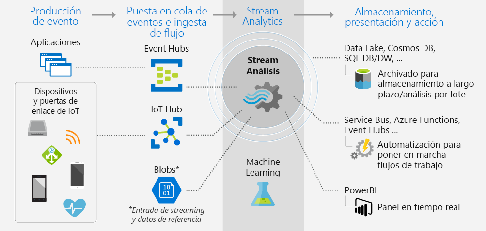
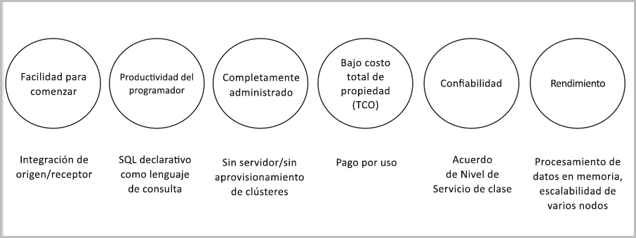

# ¿Qué es Azure Stream Analytics?

Azure Stream Analytics es un motor de procesamiento de eventos que permite examinar grandes volúmenes de streaming de datos procedentes de dispositivos. Los datos de entrada pueden proceder de dispositivos, sensores, sitios web, fuentes de redes sociales, aplicaciones, etc. También admite la extracción de información de flujos de datos y la identificación de patrones y relaciones. Dichos patrones se pueden usar para desencadenar otras acciones de bajada, como crear alertas, alimentar información a una herramienta de generación de informes o almacenarla para usarla posteriormente.

Estos son algunos ejemplos en los que se pueden utilizar Azure Stream Analytics: 

* Fusión del sensor de Internet de las cosas (IoT) y análisis en tiempo real de la telemetría de dispositivos
* Análisis clickstream y de registros web
* Análisis geoespacial para la administración de flotas y vehículos sin conductor
* Supervisión remota y mantenimiento predictivo de recursos de gran valor
* Análisis en tiempo real de datos de punto de venta para el control de inventario y la detección de anomalías

## ¿Cómo funciona Stream Analytics?

Azure Stream Analytics comienza con un origen de streaming de datos que se ingieren en Azure Event Hub, Azure IoT Hub o desde un almacén de datos como Azure Blob Storage. Para examinar los flujos, se crea un trabajo de Stream Analytics que especifica el origen de entrada que transmite los datos. El trabajo también especifica una consulta de transformación que define cómo buscar datos, patrones o relaciones. Esta consulta usa un lenguaje de consulta SQL que se utiliza para filtrar, ordenar, agregar y unir con facilidad los datos de transmisión a lo largo de un período de tiempo. Al ejecutar el trabajo, puede ajustar las opciones de ordenación de los eventos y la duración de las ventanas de tiempo cuando se realizan operaciones de agregación.

Tras analizar los datos de entrada, el usuario especifica una salida para los datos transformados y puede controlar lo que se hace en respuesta a la información que ha analizado. Por ejemplo, puede realizar acciones como:

* Enviar datos a una cola supervisada para desencadenar alertas o flujos de trabajo personalizados de bajada.
* Enviar datos al panel de Power BI para verlos en tiempo real.
* Almacene los datos en otros servicios de Azure Storage para poder entrenar un modelo de Machine Learning basado en datos históricos o realizar un análisis por lotes.

La siguiente imagen ilustra la canalización de Stream Analytics. Su trabajo de Stream Analytics puede utilizar todas las entradas y salidas, o un conjunto seleccionado de ellas. Esta imagen muestra cómo se envían los datos a Stream Analytics, se analizan y se envían para realizar otras acciones, como el almacenamiento o la presentación:

## Ventajas y principales capacidades

Azure Stream Analytics se ha diseñado para ser fácil de usar, flexible, confiable y escalable a cualquier tamaño de trabajo. Está disponible en varias regiones de Azure. La siguiente imagen muestra las principales funcionalidades de Azure Stream Analytics:

## Facilidad para empezar

Es fácil empezar a usar Azure Stream Analytics. Con pocos clics es posible conectarse a varios orígenes y receptores, y crear una canalización integral. Stream Analytics puede conectarse a [Azure Event Hubs](https://docs.microsoft.com/azure/event-hubs/) y [Azure IoT Hub](https://docs.microsoft.com/azure/iot-hub/) para la ingesta de datos de transmisión. También se puede conectar al servicio [Azure Blob Storage](https://docs.microsoft.com/azure/storage/storage-introduction) para ingerir datos históricos. Puede combinar datos de centros de eventos con otros orígenes de datos y motores de procesamiento. La entrada del trabajo también puede incluir datos de referencia estáticos o que cambien lentamente y se pueden unir los datos de transmisión a dichos datos de referencia para realizar operaciones de búsqueda.

Stream Analytics puede enrutar la salida del trabajo a muchos sistemas de almacenamiento como [Azure Blob](https://docs.microsoft.com/azure/storage/storage-introduction), [Azure SQL Database](https://docs.microsoft.com/azure/sql-database/), [Azure Data Lake Store](https://docs.microsoft.com/azure/data-lake-store/) o [Azure Cosmos DB](https://docs.microsoft.com/azure/cosmos-db/introduction). Después del almacenamiento, se pueden realizar análisis por lotes con Azure HDInsight o enviar la salida a otro servicio, como Event Hubs, para su consumo o a [Power BI](https://docs.microsoft.com/power-bi/) para la visualización en tiempo real mediante el uso de la API de streaming de Power BI.

## Productividad del programador

Azure Stream Analytics usa un lenguaje de consulta simple basado en SQL que se ha mejorado con eficaces restricciones temporales para analizar datos en movimiento. Para definir las transformaciones de los trabajos, se utiliza un simple [lenguaje de consulta de Stream Analytics](https://msdn.microsoft.com/library/azure/dn834998.aspx) declarativo que permite crear complejos análisis y consultas temporales mediante simples construcciones SQL. El lenguaje de consulta de Stream Analytics concuerda con el lenguaje SQL, por lo que el mero conocimiento de este permite empezar a crear trabajos. También se pueden crear trabajos mediante herramientas de desarrollo como Azure PowerShell, [herramientas de Stream Analytics para Visual Studio](stream-analytics-tools-for-visual-studio-install.md) o plantillas de Azure Resource Manager. Las herramientas de desarrollo permiten desarrollar consultas de transformación sin conexión y usar la [canalización de CI/CD](stream-analytics-tools-for-visual-studio-cicd.md) para enviar trabajos a Azure. 

El lenguaje de consulta de Stream Analytics ofrece una amplia matriz de funciones para analizar y procesar los datos de streaming. Este lenguaje de consulta admite la manipulación simple de datos y la agregación de funciones a las complejas funciones geoespaciales. Las consultas se pueden editar en el portal y se pueden probar con datos de ejemplo que se extraen de la secuencia en directo.

Puede ampliar la funcionalidad del lenguaje de consulta si define e invoca funciones adicionales. Puede definir que las llamadas a funciones del servicio Azure Machine Learning saquen provecho de las soluciones de Azure Machine Learning e integren las funciones definidas por el usuario (UDF) de JavaScript o los agregados definidos por el usuario para realizar cálculos complejos como parte de una consulta de Stream Analytics.

## Completamente administrada 

Azure Stream Analytics es una oferta sin servidor totalmente administrada (PaaS) en Azure. Esto significa que no es preciso aprovisionar hardware ni administrar clústeres para ejecutar los trabajos. Azure Stream Analytics administra totalmente el trabajo, para lo que se encarga de la configuración de clústeres de proceso complejos en la nube y del ajuste del rendimiento necesario para ejecutar el trabajo. La integración con Azure Event Hubs y Azure IoT Hub permite que los trabajos ingieran millones de eventos por segundo procedentes de dispositivos conectados, secuencias de clic y archivos de registro, entre otros. Mediante la característica de creación de particiones de Event Hubs, puede dividir los cálculos en pasos lógicos, cada uno de ellos con la capacidad de ser subdividido aún más para aumentar la escalabilidad.

## Ejecución en la nube o en el sistema de inteligencia perimetral

Azure Stream Analytics se puede ejecutar en la nube, para realizar análisis a gran escala, o en el sistema de inteligencia perimetral, para un análisis con latencia muy baja.
Azure Stream Analytics usa el mismo lenguaje de consulta en la nube y en el sistema de inteligencia perimetral, permitiendo a los desarrolladores compilar arquitecturas verdaderamente híbridas para el procesamiento de flujos.

## Costo total de propiedad bajo

Como servicio en la nube, Stream Analytics se optimiza por motivos de costo. No hay costos iniciales, solo se pagan las [unidades de streaming que se consuman](stream-analytics-streaming-unit-consumption.md) y la cantidad de datos procesados. No hay compromiso ni se requiere el aprovisionamiento de clústeres. Puede escalar o reducir verticalmente los trabajos de streaming en función de sus necesidades empresariales. 

## Preparado para situaciones críticas
Azure Stream Analytics está disponible en varias regiones de todo el mundo y está diseñado para ejecutar cargas de trabajo críticas al respaldar los requisitos de confiabilidad, seguridad y cumplimiento.
### Confiabilidad
Azure Stream Analytics garantiza el procesamiento de eventos exactamente una vez y la entrega de eventos por lo menos una vez, así que los eventos nunca se pierden. El procesamiento exactamente una vez está garantizado con la salida seleccionada, como se describe en [Event Delivery Guarantees](https://docs.microsoft.com/en-us/stream-analytics-query/event-delivery-guarantees-azure-stream-analytics) (Garantías de entrega de contenido). Azure Stream Analytics presenta funcionalidades de recuperación integradas en caso de que se produzca un error en la entrega de un evento. Además, Stream Analytics proporciona puntos de comprobación integrados para mantener el estado del trabajo y proporciona resultados repetibles.

Como servicio administrado, Stream Analytics garantiza un procesamiento de eventos con una disponibilidad del 99,9 % por minuto. Para más información, consulte la página [Acuerdo de Nivel de Servicio de Stream Analytics](https://azure.microsoft.com/support/legal/sla/stream-analytics/v1_0/) para obtener más detalles. 

### Seguridad
En cuanto a seguridad, Azure Stream Analytics cifra todas las comunicaciones entrantes y salientes y es compatible con TLS 1.2. También se cifran los puntos de control integrados. Stream Analytics no almacena los datos entrantes, ya que todo el procesamiento se realiza en memoria. 

### Cumplimiento normativo
Azure Stream Analytics sigue varias certificaciones de cumplimiento, como se describe en la [información general de cumplimiento de Azure](https://gallery.technet.microsoft.com/Overview-of-Azure-c1be3942). 

## Rendimiento

Stream Analytics puede procesar millones de eventos por segundo y ofrecer resultados con baja latencia.
Permite el escalado vertical y horizontal para controlar las aplicaciones grandes de procesamiento de eventos complejos y en tiempo real. Stream Analytics mejora el rendimiento mediante la creación de particiones, lo que permite que las consultas complejas se puedan procesar en paralelo y ejecutar en varios nodos de streaming.
Azure Stream Analytics se basa en [Trill](https://github.com/Microsoft/Trill), un motor de análisis de streaming de alto rendimiento y en memoria desarrollado en colaboración con Microsoft Research. 

## Pasos siguientes

Ya tiene información general acerca de Azure Stream Analytics. A continuación, puede profundizar y crear su primer trabajo de Stream Analytics:

* [Creación de un trabajo de Stream Analytics mediante Azure Portal](stream-analytics-quick-create-portal.md).
* [Creación de un trabajo de Stream Analytics mediante Azure PowerShell](stream-analytics-quick-create-powershell.md).
* [Creación de un trabajo de Stream Analytics mediante Visual Studio](stream-analytics-quick-create-vs.md).

