# <a name="quickstart-create-a-stream-analytics-job-by-using-the-azure-portal"></a>Inicio rápido: Creación de un trabajo de Stream Analytics mediante Azure Portal

En esta guía de inicio rápido se muestra cómo empezar a crear un trabajo de Stream Analytics. En esta guía de inicio rápido va a definir un trabajo de Stream Analytics que lee datos de streaming en tiempo real y filtra mensajes que indican una temperatura superior a 27. El trabajo de Stream Analytics lee los datos de un dispositivo de IoT Hub, los transforma y los escribe a su vez en un contenedor de Blob Storage. Un simulador en línea de Raspberry Pi genera los datos de entrada de esta guía de inicio rápido. 

## <a name="before-you-begin"></a>Antes de empezar

* Si no tiene una suscripción a Azure, cree una [cuenta gratuita](https://azure.microsoft.com/free/).

* Inicie sesión en el [Azure Portal](https://portal.azure.com/).

## <a name="prepare-the-input-data"></a>Preparación de los datos de entrada

Antes de definir el trabajo de Stream Analytics, debe preparar los datos de entrada. Los datos del sensor en tiempo real se ingieren en IoT Hub, que posteriormente se configura como la entrada del trabajo. Para preparar los datos de entrada que requiere el trabajo, siga estos pasos:

1. Inicie sesión en el [Azure Portal](https://portal.azure.com/).

2. Seleccione **Crear un recurso** > **Internet de las cosas** > **IoT Hub**.

3. En el panel **Centro de IoT**, escriba la siguiente información:
   
   |**Configuración**  |**Valor sugerido**  |**Descripción**  |
   |---------|---------|---------|
   |Subscription  | \<Su suscripción\> |  Seleccione la suscripción de Azure que quiera usar. |
   |Grupos de recursos   |   asaquickstart-resourcegroup  |   Seleccione **Crear nuevo** y escriba un nuevo nombre de grupo de recursos para la cuenta. |
   |Region  |  \<Seleccione la región más cercana a los usuarios\> | Seleccione la ubicación geográfica donde puede hospedar la instancia de IoT Hub. Use la ubicación más cercana a los usuarios. |
   |Nombre de la instancia de IoT Hub  | MyASAIoTHub  |   Seleccione un nombre para la instancia de IoT Hub.   |

   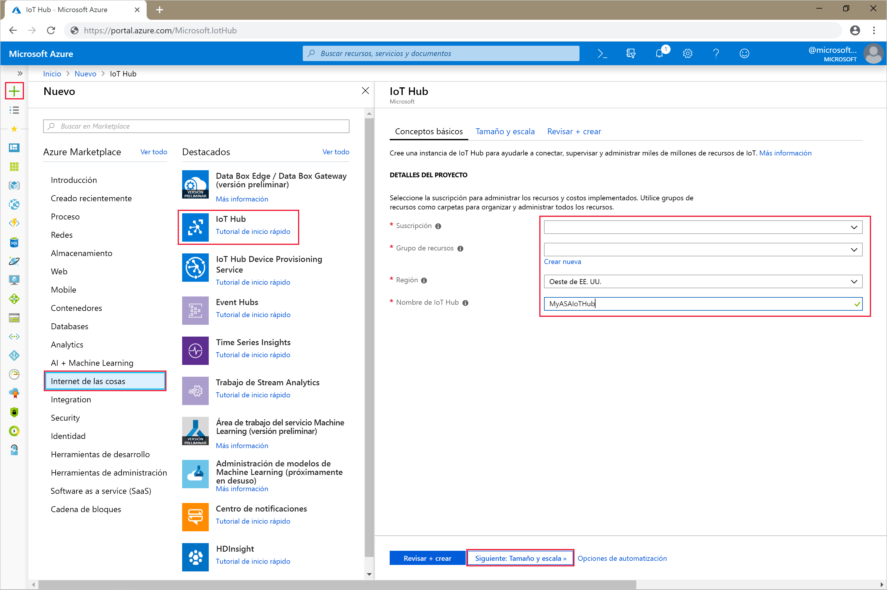

4. Seleccione **Siguiente: Establezca la escala y el tamaño**.

5. Seleccione su **Nivel de precios y de escala**. En esta guía de inicio rápido, seleccione el nivel **F1 - Free** (F1: gratis) si aún está disponible en la suscripción. Para más información, consulte [Precios de IoT Hub](https://azure.microsoft.com/pricing/details/iot-hub/).

   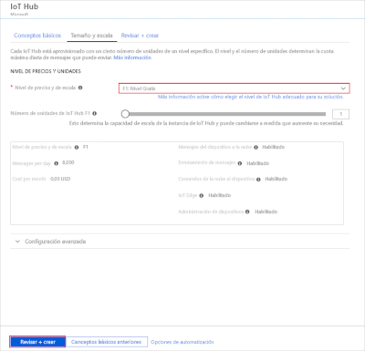

6. Seleccione **Revisar + crear**. Revise la información de IoT Hub y haga clic en **Crear**. La instancia de IoT Hub puede tardar varios minutos en crearse. Puede ver el progreso en el panel **Notificaciones**.

7. En el menú de navegación de IoT Hub, haga clic en **Agregar** en **Dispositivos IoT**. Agregue un **identificador de dispositivo** y haga clic en **Guardar**.

   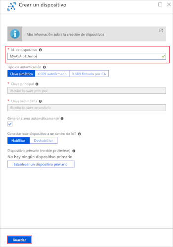

8. Después de crear el dispositivo, ábralo desde la lista **Dispositivos de IoT**. Copie el valor de **Cadena de conexión: clave principal** y guárdelo en el Bloc de notas para usarlo más adelante.

   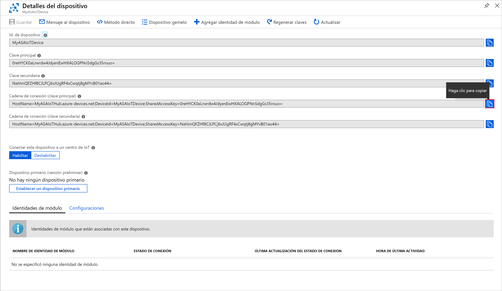

## <a name="create-blob-storage"></a>Creación de un almacenamiento de blobs

1. En la esquina superior izquierda de Azure Portal, seleccione **Crear un recurso** > **Almacenamiento** > **Cuenta de almacenamiento**.

2. En el panel **Crear cuenta de almacenamiento**, escriba un nombre, una ubicación y un grupo de recursos para la cuenta de almacenamiento. Elija la misma ubicación y grupo de recursos que los de la instancia de IoT Hub que creó. A continuación, haga clic en **Revisar y crear** para crear la cuenta.

   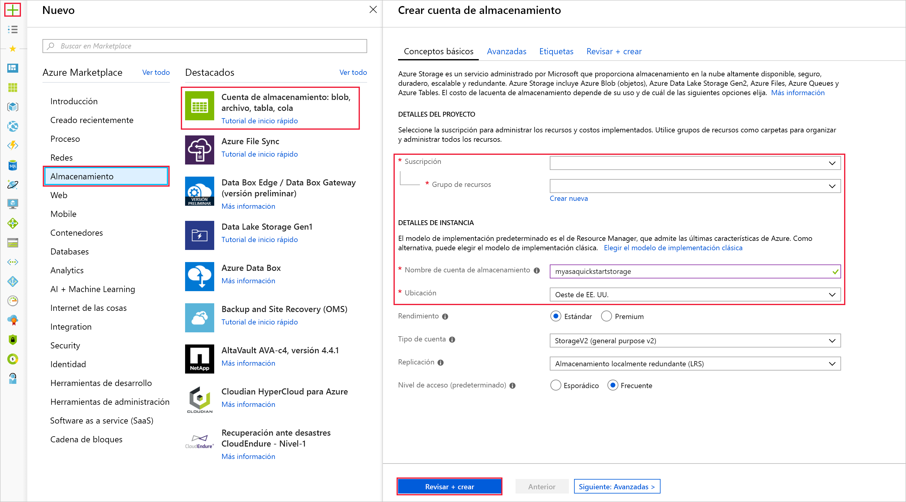

3. Una vez creada la cuenta de almacenamiento, seleccione el icono **Blobs** en el panel de **información general**.

   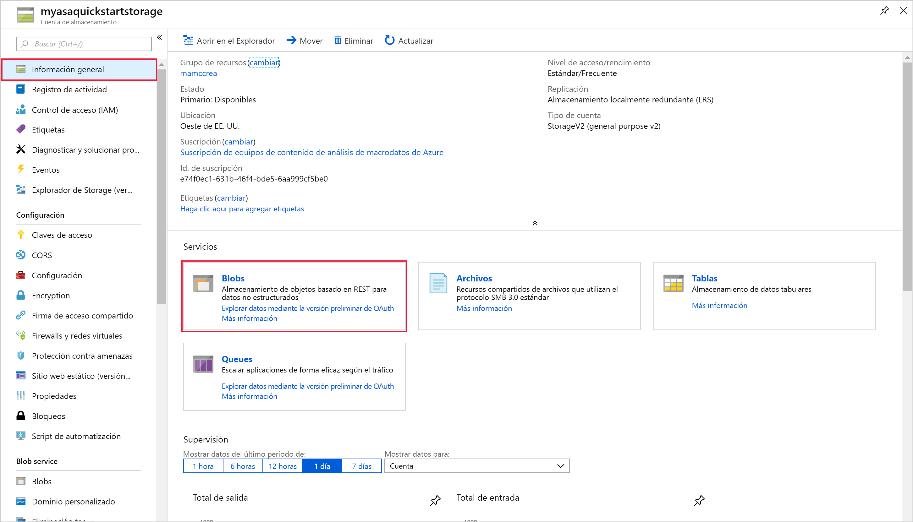

4. En la página **Blob Service**, seleccione **Contenedor** y proporcione un nombre para el contenedor, como *contenedor1*. Deje la opción **Nivel de acceso público** en **Privado (sin acceso anónimo)** y seleccione **Aceptar**.

   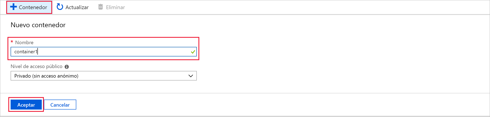

## <a name="create-a-stream-analytics-job"></a>Creación de un trabajo de Stream Analytics

1. Inicie sesión en el Portal de Azure.

2. Haga clic en **Crear un recurso** en la esquina superior izquierda de Azure Portal.  

3. Seleccione **Analytics** > **Trabajo de Stream Analytics** en la lista de resultados.  

4. Rellene la página del trabajo de Stream Analytics con la siguiente información:

   |**Configuración**  |**Valor sugerido**  |**Descripción**  |
   |---------|---------|---------|
   |Nombre del trabajo   |  MyASAJob   |   Escriba un nombre para identificar el trabajo de Stream Analytics. Debe tener una longitud de entre 3 y 63 caracteres, y solo puede incluir caracteres alfanuméricos, guiones y guiones bajos. |
   |Subscription  | \<Su suscripción\> |  Seleccione la suscripción de Azure que quiere usar para este trabajo. |
   |Grupos de recursos   |   asaquickstart-resourcegroup  |   Seleccione el mismo grupo de recursos que el de IoT Hub. |
   |Location  |  \<Seleccione la región más cercana a los usuarios\> | Seleccione la ubicación geográfica donde puede hospedar su trabajo de Stream Analytics. Para obtener un mejor rendimiento y reducir el costo de la transferencia de datos, use la ubicación más cercana a los usuarios. |
   |Unidades de streaming  | 1  |   Las unidades de streaming representan los recursos informáticos que se necesitan para ejecutar un trabajo. De forma predeterminada, este valor se establece en 1. Para información sobre el escalado de unidades de streaming, consulte el artículo [Descripción y ajuste de las unidades de streaming](stream-analytics-streaming-unit-consumption.md).   |
   |Entorno de hospedaje  |  Nube  |   Los trabajos de Stream Analytics se pueden implementar en la nube o en dispositivos perimetrales. Si elige la nube, podrá implementar en la nube de Azure y si elige implementar en un dispositivo perimetral, podrá hacerlo en un dispositivo de IoT Edge. |

   

5. Active la casilla **Anclar al panel** para colocar su trabajo en el panel y, luego, seleccione **Crear**.  

6. Verá una notificación que dice *Implementación en curso...* en la parte superior derecha de la ventana del explorador. 

## <a name="configure-job-input"></a>Configuración de la entrada del trabajo

En esta sección, configurará una entrada de dispositivo de IoT Hub al trabajo de Stream Analytics. Use la instancia de IoT Hub que creó en la sección anterior de la guía de inicio rápido.

1. Vaya a su trabajo de Stream Analytics.  

2. Seleccione **Entradas** > **Add Stream input** >  (Agregar entrada de flujo) **IoT Hub**.  

3. Rellene la página **IoT Hub** con los siguientes valores:

   |**Configuración**  |**Valor sugerido**  |**Descripción**  |
   |---------|---------|---------|
   |Alias de entrada  |  IoTHubInput   |  Escriba un nombre para identificar la entrada del trabajo.   |
   |Subscription   |  \<Su suscripción\> |  Seleccione la suscripción de Azure que tiene la cuenta de almacenamiento que creó. La cuenta de almacenamiento puede estar en la misma suscripción, o en otra diferente. En este ejemplo se da por supuesto que ha creado la cuenta de almacenamiento en la misma suscripción. |
   |IoT Hub  |  MyASAIoTHub |  Escriba el nombre de la instancia de IoT Hub que creó en la sección anterior. |

4. Deje el resto de opciones con los valores predeterminados y seleccione **Guardar** para guardar la configuración.  

   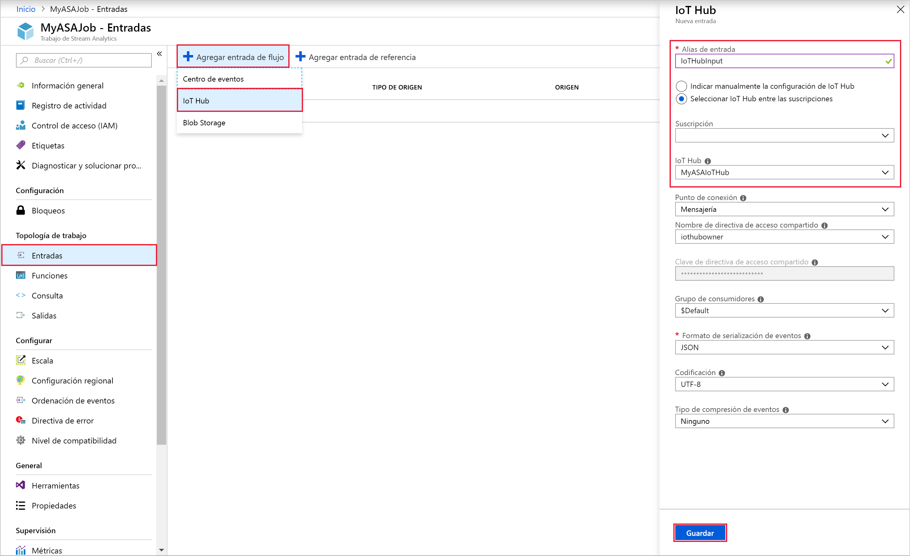
 
## <a name="configure-job-output"></a>Configuración de la salida del trabajo

1. Vaya al trabajo de Stream Analytics que creó anteriormente.  

2. Seleccione **Salidas** > **Agregar** > **Blob Storage**.  

3. Rellene la página **Blob Storage** con los siguientes valores:

   |**Configuración**  |**Valor sugerido**  |**Descripción**  |
   |---------|---------|---------|
   |Alias de salida |   BlobOutput   |   Escriba un nombre para identificar la salida del trabajo. |
   |Subscription  |  \<Su suscripción\>  |  Seleccione la suscripción de Azure que tiene la cuenta de almacenamiento que creó. La cuenta de almacenamiento puede estar en la misma suscripción, o en otra diferente. En este ejemplo se da por supuesto que ha creado la cuenta de almacenamiento en la misma suscripción. |
   |Cuenta de almacenamiento |  asaquickstartstorage |   Elija o escriba el nombre de la cuenta de almacenamiento. Los nombres de cuenta de almacenamiento se detectan automáticamente si se crean en la misma suscripción.       |
   |Contenedor |   Contenedor1  |  Seleccione el contenedor existente que creó en la cuenta de almacenamiento.   |

4. Deje el resto de opciones con los valores predeterminados y seleccione **Guardar** para guardar la configuración.  

   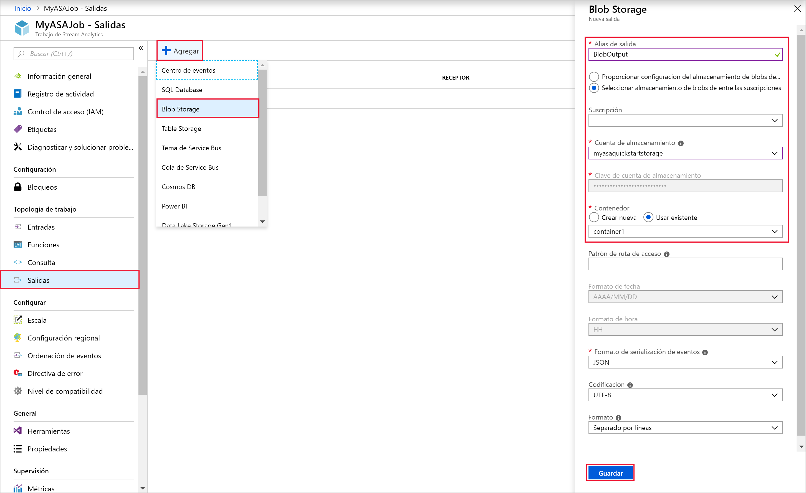
 
## <a name="define-the-transformation-query"></a>Definir la consulta de transformación

1. Vaya al trabajo de Stream Analytics que creó anteriormente.  

2. Seleccione **Consulta** y actualice la consulta de la manera siguiente:  

   ```sql
   SELECT *
   INTO BlobOutput
   FROM IoTHubInput
   HAVING Temperature > 27
   ```

3. En este ejemplo, la consulta lee los datos de IoT Hub y los copia en un archivo nuevo del blob. Seleccione **Guardar**.  

   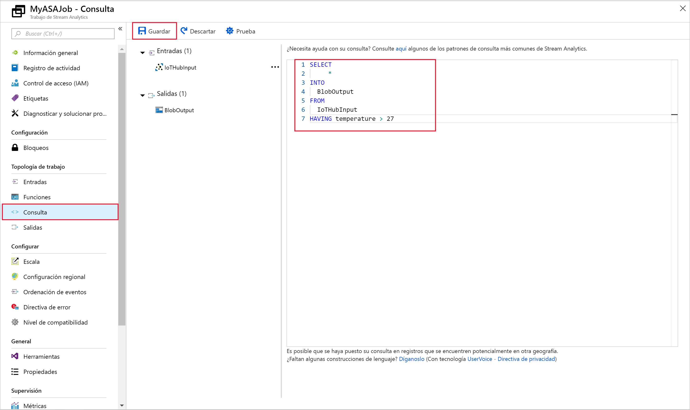

## <a name="run-the-iot-simulator"></a>Ejecutar el simulador

1. Abra el [simulador en línea de Raspberry Pi para Azure IoT](https://azure-samples.github.io/raspberry-pi-web-simulator/).

2. Reemplace el marcador de posición de la línea 15 con la cadena de conexión del dispositivo de Azure IoT Hub que guardó en la sección anterior.

3. Haga clic en **Ejecutar**. La salida debe mostrar los datos y mensajes del sensor que se envían a la instancia de IoT Hub.

   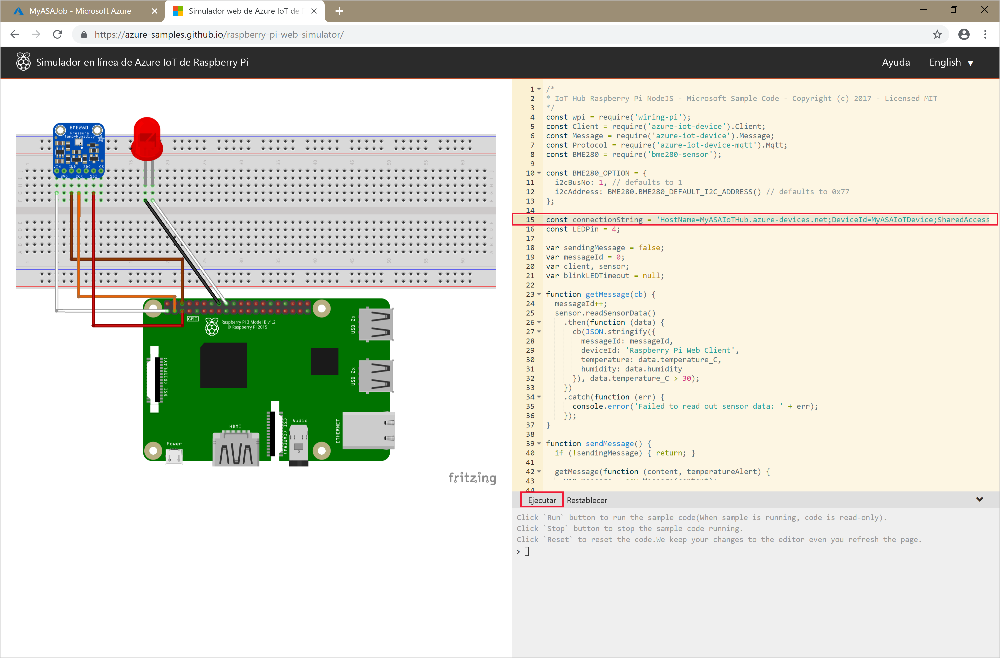

## <a name="start-the-stream-analytics-job-and-check-the-output"></a>Inicio del trabajo de Stream Analytics y consulta de la salida

1. Vuelva a la página de información general del trabajo y seleccione **Iniciar**.

2. En **Iniciar trabajo**, seleccione **Ahora**, en el campo **Hora de inicio de la salida del trabajo**. A continuación, seleccione **Iniciar** para iniciar el trabajo.

3. Al cabo de unos minutos, en el portal, busque la cuenta de almacenamiento y el contenedor que ha configurado como salida para el trabajo. Ahora puede ver el archivo de salida en el contenedor. El trabajo tarda unos minutos en iniciarse por primera vez; una vez iniciado, continuará ejecutándose a medida que llegan los datos.  

   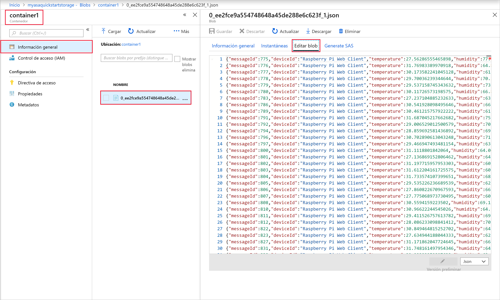

## <a name="clean-up-resources"></a>Limpieza de recursos

Cuando no los necesite, elimine el grupo de recursos, el trabajo de Stream Analytics y todos los recursos relacionados. La eliminación del trabajo evita la facturación de las unidades de streaming utilizadas por el trabajo. Si piensa utilizar el trabajo en el futuro, puede detenerlo y volver a iniciarlo más adelante cuando sea necesario. Si no va a seguir usando este trabajo, siga estos pasos para eliminar todos los recursos creados en esta guía de inicio rápido:

1. En el menú de la izquierda de Azure Portal, seleccione **Grupos de recursos** y luego el nombre del recurso que creó.  

2. En la página del grupo de recursos, seleccione **Eliminar**, escriba el nombre del recurso que quiere eliminar en el cuadro de texto y, luego, seleccione **Eliminar**.

## <a name="next-steps"></a>Pasos siguientes

En esta guía de inicio rápido, ha implementado un sencillo trabajo de Stream Analytics mediante Azure Portal. También puede implementar trabajos de Stream Analytics mediante [PowerShell](stream-analytics-quick-create-powershell.md), [Visual Studio](stream-analytics-quick-create-vs.md) y [Visual Studio Code](quick-create-vs-code.md).

Para aprender a configurar otros orígenes de entrada y realizar la detección en tiempo real, continúe con el siguiente artículo:

> [!div class="nextstepaction"]
> [Detección de fraudes en tiempo real con Azure Stream Analytics](stream-analytics-real-time-fraud-detection.md)

