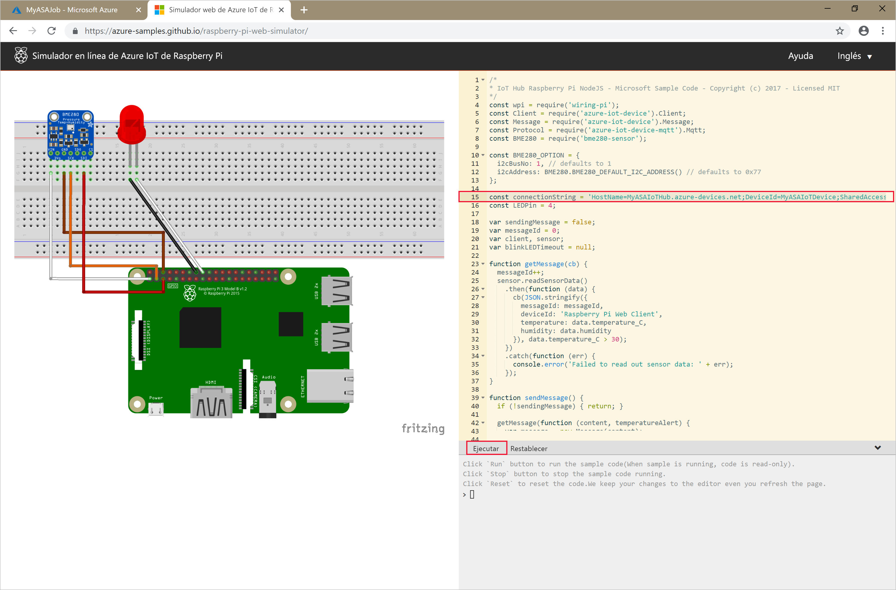

# <a name="quickstart-create-a-stream-analytics-job-using-azure-powershell"></a>Inicio rápido: Creación de un trabajo de Stream Analytics mediante Azure PowerShell

El módulo de Azure PowerShell se usa para crear y administrar recursos de Azure mediante cmdlets o scripts de PowerShell. En esta guía de inicio rápido se detalla cómo usar el módulo de Azure PowerShell para implementar y ejecutar un trabajo de Azure Stream Analytics.

El trabajo de ejemplo lee los datos de streaming desde el dispositivo de IoT Hub. Un simulador en línea de Raspberry Pi genera los datos de entrada. A continuación, el trabajo de Stream Analytics transforma los datos mediante el lenguaje de consulta de Stream Analytics para filtrar los mensajes con una temperatura superior a 27°. Por último, escribe los eventos de salida resultantes en otro archivo del almacenamiento de blob.

## <a name="before-you-begin"></a>Antes de empezar

[!INCLUDE [updated-for-az](../../includes/updated-for-az.md)]

* Si no tiene una suscripción a Azure, cree una [cuenta gratuita](https://azure.microsoft.com/free/).

* Este inicio rápido requiere el módulo Azure PowerShell. Ejecute `Get-Module -ListAvailable Az` para buscar la versión que está instalada en la máquina local. Si necesita instalarla o actualizarla, consulte el artículo sobre [cómo instalar el módulo de Azure PowerShell](https://docs.microsoft.com/powershell/azure/install-Az-ps).

* Algunas acciones de IoT Hub no son compatibles con Azure PowerShell y se deben llevar a cabo con la CLI de Azure versión 2.0.24 o posterior, y la extensión de IoT para la CLI de Azure. [Instale la CLI de Azure](https://docs.microsoft.com/cli/azure/install-azure-cli?view=azure-cli-latest) y use `az extension add --name azure-cli-iot-ext` para instalar la extensión de IoT.


## <a name="sign-in-to-azure"></a>Inicio de sesión en Azure

Inicie sesión en la suscripción de Azure con el comando `Connect-AzAccount` y escriba las credenciales de Azure en el explorador emergente:

```powershell
# Connect to your Azure account
Connect-AzAccount
```

Si tiene más de una suscripción, seleccione la que desee utilizar para este inicio rápido mediante la ejecución de los siguientes cmdlets. Asegúrese de reemplazar `<your subscription name>` por el nombre de su suscripción:

```powershell
# List all available subscriptions.
Get-AzSubscription

# Select the Azure subscription you want to use to create the resource group and resources.
Get-AzSubscription -SubscriptionName "<your subscription name>" | Select-AzSubscription
```

## <a name="create-a-resource-group"></a>Crear un grupo de recursos

Cree un grupo de recursos de Azure con [New-AzResourceGroup](https://docs.microsoft.com/powershell/module/az.resources/new-azresourcegroup). Un grupo de recursos es un contenedor lógico en el que se implementan y se administran los recursos de Azure.

```powershell
$resourceGroup = "StreamAnalyticsRG"
$location = "WestUS2"
New-AzResourceGroup `
    -Name $resourceGroup `
    -Location $location
```

## <a name="prepare-the-input-data"></a>Preparación de los datos de entrada

Antes de definir el trabajo de Stream Analytics, prepare los datos que se configuran como entrada del mismo.

El siguiente bloque de código de la CLI de Azure realiza varios comandos para preparar los datos de entrada que requiere el trabajo. Examine las secciones para comprender el código.

1. En la ventana de PowerShell, escriba el comando [az login](https://docs.microsoft.com/cli/azure/authenticate-azure-cli?view=azure-cli-latest) para iniciar sesión con su cuenta de Azure.

    Al iniciar sesión correctamente, la CLI de Azure devuelve una lista de las suscripciones. Copie la suscripción que va a usar para este inicio rápido y ejecute el comando [az account set](https://docs.microsoft.com/cli/azure/manage-azure-subscriptions-azure-cli?view=azure-cli-latest#change-the-active-subscription) para seleccionar esa suscripción. Elija la misma que seleccionó en la sección anterior con PowerShell. Asegúrese de reemplazar `<your subscription name>` por el nombre de su suscripción.

    ```azurecli
    az login

    az account set --subscription "<your subscription>"
    ```

2. Para crear un centro de IoT Hub, use el comando [az iot hub create](../iot-hub/iot-hub-create-using-cli.md#create-an-iot-hub). En este ejemplo se va a crear un centro de IoT Hub llamado **MyASAIoTHub**. Dado que los nombres de IoT Hub son únicos, tiene que asignarle su propio nombre de IoT Hub. Establezca la SKU en F1 para usar el nivel gratuito si está disponible con su suscripción. Si no es así, elija el siguiente nivel más bajo.

    ```azurecli
    az iot hub create --name "<your IoT Hub name>" --resource-group $resourceGroup --sku S1
    ```

    Una vez creado el centro de IoT Hub, obtenga la cadena de conexión de IoT Hub mediante el comando [az iot hub show-connection-string](https://docs.microsoft.com/cli/azure/iot/hub?view=azure-cli-latest). Copie la cadena de conexión completa y guárdela para cuando agregue el centro de IoT Hub como entrada para el trabajo de Stream Analytics.

    ```azurecli
    az iot hub show-connection-string --hub-name "MyASAIoTHub"
    ```

3. Agregue un dispositivo a IoT Hub con el comando [az iothub device-identity create](../iot-hub/quickstart-send-telemetry-c.md#register-a-device). En este ejemplo se crea un dispositivo denominado **MyASAIoTDevice**.

    ```azurecli
    az iot hub device-identity create --hub-name "MyASAIoTHub" --device-id "MyASAIoTDevice"
    ```

4. Obtenga la cadena de conexión del dispositivo con el comando [az iot hub device-identity show-connection-string](/cli/azure/ext/azure-cli-iot-ext/iot/hub/device-identity#ext-azure-cli-iot-ext-az-iot-hub-device-identity-show-connection-string). Copie la cadena de conexión completa y guárdela para cuando cree el simulador de Raspberry Pi.

    ```azurecli
    az iot hub device-identity show-connection-string --hub-name "MyASAIoTHub" --device-id "MyASAIoTDevice" --output table
    ```

    **Ejemplo de salida:**

    ```azurecli
    HostName=MyASAIoTHub.azure-devices.net;DeviceId=MyASAIoTDevice;SharedAccessKey=a2mnUsg52+NIgYudxYYUNXI67r0JmNubmfVafojG8=
    ```

## <a name="create-blob-storage"></a>Creación de un almacenamiento de blobs

El siguiente bloque de código de Azure PowerShell usa los comandos para crear el almacenamiento de blobs que se usa para la salida del trabajo. Examine las secciones para comprender el código.

1. Cree una cuenta de almacenamiento de uso general estándar mediante el cmdlet [New-AzStorageAccount](https://docs.microsoft.com/powershell/module/az.storage/New-azStorageAccount).  En este ejemplo, se crea una cuenta de almacenamiento denominada **myasaquickstartstorage** con almacenamiento con redundancia local (LRS) y cifrado de blobs (habilitados de forma predeterminada).

2. Recupere el contexto `$storageAccount.Context` de la cuenta de almacenamiento que define la cuenta que se va a usar. Cuando trabaje con cuentas de almacenamiento, haga referencia al contexto en lugar de proporcionar varias veces las credenciales.

3. Cree un nuevo contenedor de almacenamiento con [New-AzStorageContainer](https://docs.microsoft.com/powershell/module/az.storage/new-azstoragecontainer).

4. Copie la clave de almacenamiento que indica el código y guárdela para crear la salida del trabajo de streaming más adelante.

    ```powershell
    $storageAccountName = "myasaquickstartstorage"
    $storageAccount = New-AzStorageAccount `
      -ResourceGroupName $resourceGroup `
      -Name $storageAccountName `
      -Location $location `
      -SkuName Standard_LRS `
      -Kind Storage

    $ctx = $storageAccount.Context
    $containerName = "container1"

    New-AzStorageContainer `
      -Name $containerName `
      -Context $ctx

    $storageAccountKey = (Get-AzStorageAccountKey `
      -ResourceGroupName $resourceGroup `
      -Name $storageAccountName).Value[0]

    Write-Host "The <storage account key> placeholder needs to be replaced in your output json files with this key value:"
    Write-Host $storageAccountKey -ForegroundColor Cyan
    ```

## <a name="create-a-stream-analytics-job"></a>Creación de un trabajo de Stream Analytics

Cree un trabajo de Stream Analytics con el cmdlet [New-AzStreamAnalyticsJob](https://docs.microsoft.com/powershell/module/az.streamanalytics/new-azstreamanalyticsjob). Este cmdlet toma como parámetros el nombre del trabajo, el nombre del grupo de recursos y la definición del trabajo. El nombre del trabajo puede ser cualquier nombre descriptivo que lo identifique. Solo puede contener caracteres alfanuméricos, guiones y guiones bajos, y debe tener una longitud de entre 3 y 63 caracteres. La definición del trabajo es un archivo JSON que contiene las propiedades necesarias para crear un trabajo. En su máquina local, cree un archivo denominado `JobDefinition.json` y agréguele los siguientes datos JSON:

```json
{
  "location":"WestUS2",
  "properties":{
    "sku":{
      "name":"standard"
    },
    "eventsOutOfOrderPolicy":"adjust",
    "eventsOutOfOrderMaxDelayInSeconds":10,
    "compatibilityLevel": 1.1
  }
}
```

Después, ejecute el cmdlet `New-AzStreamAnalyticsJob`. Reemplace el valor de la variable `jobDefinitionFile` por la ruta de acceso a la ubicación en la que haya almacenado el archivo JSON de definición del trabajo.

```powershell
$jobName = "MyStreamingJob"
$jobDefinitionFile = "C:\JobDefinition.json"
New-AzStreamAnalyticsJob `
  -ResourceGroupName $resourceGroup `
  -File $jobDefinitionFile `
  -Name $jobName `
  -Force
```

## <a name="configure-input-to-the-job"></a>Configuración de la entrada al trabajo

Agregue una entrada al trabajo mediante el cmdlet [New-AzStreamAnalyticsInput](https://docs.microsoft.com/powershell/module/az.streamanalytics/new-azstreamanalyticsinput). Este cmdlet toma como parámetros el nombre del trabajo, el nombre de entrada del trabajo, el nombre del grupo de recursos y la definición de entrada del trabajo. La definición de la entrada del trabajo es un archivo JSON que contiene las propiedades necesarias para configurar la entrada del trabajo. En este ejemplo, creará un almacenamiento de blobs como entrada.

En su máquina local, cree un archivo denominado `JobInputDefinition.json` y agréguele los siguientes datos JSON. No olvide reemplazar el valor de `accesspolicykey` con la parte `SharedAccessKey` de la cadena de conexión de IoT Hub que guardó en una sección anterior.

```json
{
    "properties": {
        "type": "Stream",
        "datasource": {
            "type": "Microsoft.Devices/IotHubs",
            "properties": {
                "iotHubNamespace": "MyASAIoTHub",
                "sharedAccessPolicyName": "iothubowner",
                "sharedAccessPolicyKey": "accesspolicykey",
                "endpoint": "messages/events",
                "consumerGroupName": "$Default"
                }
        },
        "compression": {
            "type": "None"
        },
        "serialization": {
            "type": "Json",
            "properties": {
                "encoding": "UTF8"
            }
        }
    },
    "name": "IoTHubInput",
    "type": "Microsoft.StreamAnalytics/streamingjobs/inputs"
}
```

Después, ejecute el cmdlet `New-AzStreamAnalyticsInput` y asegúrese de reemplazar el valor de la variable `jobDefinitionFile` por la ruta de acceso de la ubicación en la que haya almacenado el archivo JSON de definición de la entrada del trabajo.

```powershell
$jobInputName = "IoTHubInput"
$jobInputDefinitionFile = "C:\JobInputDefinition.json"
New-AzStreamAnalyticsInput `
  -ResourceGroupName $resourceGroup `
  -JobName $jobName `
  -File $jobInputDefinitionFile `
  -Name $jobInputName
```

## <a name="configure-output-to-the-job"></a>Configuración de la salida al trabajo

Agregue una entrada al trabajo mediante el cmdlet [New-AzStreamAnalyticsOutput](https://docs.microsoft.com/powershell/module/az.streamanalytics/new-azstreamanalyticsoutput). Este cmdlet toma como parámetros el nombre del trabajo, el nombre de salida del trabajo, el nombre del grupo de recursos y la definición de salida del trabajo. La definición de la salida del trabajo es un archivo JSON que contiene las propiedades necesarias para configurar la salida del trabajo. En este ejemplo se usa el almacenamiento de blobs como salida.

En su máquina local, cree un archivo denominado `JobOutputDefinition.json` y agréguele los siguientes datos JSON. Asegúrese de reemplazar el valor de `accountKey` por la clave de acceso de su cuenta de almacenamiento que sea el valor almacenado en $storageAccountKey.

```json
{
    "properties": {
        "datasource": {
            "type": "Microsoft.Storage/Blob",
            "properties": {
                "storageAccounts": [
                    {
                      "accountName": "asaquickstartstorage",
                      "accountKey": "<storage account key>"
                    }
                ],
                "container": "container1",
                "pathPattern": "output/",
                "dateFormat": "yyyy/MM/dd",
                "timeFormat": "HH"
            }
        },
        "serialization": {
            "type": "Json",
            "properties": {
                "encoding": "UTF8",
                "format": "LineSeparated"
            }
        }
    },
    "name": "BlobOutput",
    "type": "Microsoft.StreamAnalytics/streamingjobs/outputs"
}
```

Después, ejecute el cmdlet `New-AzStreamAnalyticsOutput`. Asegúrese de reemplazar el valor de la variable `jobOutputDefinitionFile` por la ruta de acceso a la ubicación en la que haya almacenado el archivo JSON de definición de la salida del trabajo.

```powershell
$jobOutputName = "BlobOutput"
$jobOutputDefinitionFile = "C:\JobOutputDefinition.json"
New-AzStreamAnalyticsOutput `
  -ResourceGroupName $resourceGroup `
  -JobName $jobName `
  -File $jobOutputDefinitionFile `
  -Name $jobOutputName -Force
```

## <a name="define-the-transformation-query"></a>Definir la consulta de transformación

Agregue una transformación al trabajo mediante el cmdlet [New-AzStreamAnalyticsTransformation](https://docs.microsoft.com/powershell/module/az.streamanalytics/new-azstreamanalyticstransformation). Este cmdlet toma como parámetros el nombre del trabajo, el nombre de transformación del trabajo, el nombre del grupo de recursos y la definición de transformación del trabajo. En su máquina local, cree un archivo denominado `JobTransformationDefinition.json` y agréguele los siguientes datos JSON. El archivo JSON contiene un parámetro de consulta que define la consulta de transformación:

```json
{
    "name":"MyTransformation",
    "type":"Microsoft.StreamAnalytics/streamingjobs/transformations",
    "properties":{
        "streamingUnits":1,
        "script":null,
        "query":" SELECT * INTO BlobOutput FROM IoTHubInput HAVING Temperature > 27"
    }
}
```

Después, ejecute el cmdlet `New-AzStreamAnalyticsTransformation`. Asegúrese de reemplazar el valor de la variable `jobTransformationDefinitionFile` por la ruta de acceso de la ubicación en la que haya almacenado el archivo JSON de definición de la transformación del trabajo.

```powershell
$jobTransformationName = "MyJobTransformation"
$jobTransformationDefinitionFile = "C:\JobTransformationDefinition.json"
New-AzStreamAnalyticsTransformation `
  -ResourceGroupName $resourceGroup `
  -JobName $jobName `
  -File $jobTransformationDefinitionFile `
  -Name $jobTransformationName -Force
```
## <a name="run-the-iot-simulator"></a>Ejecutar el simulador

1. Abra el [simulador en línea de Raspberry Pi para Azure IoT](https://azure-samples.github.io/raspberry-pi-web-simulator/).

2. Reemplace el marcador de posición de la línea 15 con la cadena de conexión completa del dispositivo de Azure IoT Hub que guardó en la sección anterior.

3. Haga clic en **Ejecutar**. La salida debe mostrar los datos y mensajes del sensor que se envían a la instancia de IoT Hub.

    

## <a name="start-the-stream-analytics-job-and-check-the-output"></a>Inicio del trabajo de Stream Analytics y consulta de la salida

Inicie el trabajo mediante el cmdlet [Start-AzStreamAnalyticsJob](https://docs.microsoft.com/powershell/module/az.streamanalytics/start-azstreamanalyticsjob). Este cmdlet toma como parámetros el nombre del trabajo, el nombre del grupo de recursos, el modo de inicio de salida y el tiempo de inicio. `OutputStartMode` acepta valores de `JobStartTime`, `CustomTime` o `LastOutputEventTime`. Para más información acerca de los elementos a los que hacen referencia cada uno de estos valores, consulte la sección de [parámetros](https://docs.microsoft.com/powershell/module/az.streamanalytics/start-azstreamanalyticsjob) de la documentación de PowerShell.

Después de ejecutar el siguiente cmdlet, devuelve `True` como salida si el trabajo se inicia. En el contenedor de almacenamiento, se crea una carpeta de salida con los datos transformados.

```powershell
Start-AzStreamAnalyticsJob `
  -ResourceGroupName $resourceGroup `
  -Name $jobName `
  -OutputStartMode 'JobStartTime'
```

## <a name="clean-up-resources"></a>Limpieza de recursos

Cuando no los necesite, elimine el grupo de recursos, el trabajo de streaming y todos los recursos relacionados. La eliminación del trabajo evita la facturación de las unidades de streaming utilizadas por el trabajo. Si planea utilizar el trabajo en el futuro, puede omitir su eliminación y simplemente detenerlo por el momento. Si no va a seguir usando este trabajo, ejecute el siguiente cmdlet para eliminar todos los recursos creados en este inicio rápido:

```powershell
Remove-AzResourceGroup `
  -Name $resourceGroup
```

## <a name="next-steps"></a>Pasos siguientes

En esta guía de inicio rápido, ha implementado un sencillo trabajo de Stream Analytics mediante PowerShell. También puede implementar trabajos de Stream Analytics mediante [Azure Portal](stream-analytics-quick-create-portal.md) y [Visual Studio](stream-analytics-quick-create-vs.md).

Para aprender a configurar otros orígenes de entrada y realizar la detección en tiempo real, continúe con el siguiente artículo:

> [!div class="nextstepaction"]
> [Detección de fraudes en tiempo real con Azure Stream Analytics](stream-analytics-real-time-fraud-detection.md)
