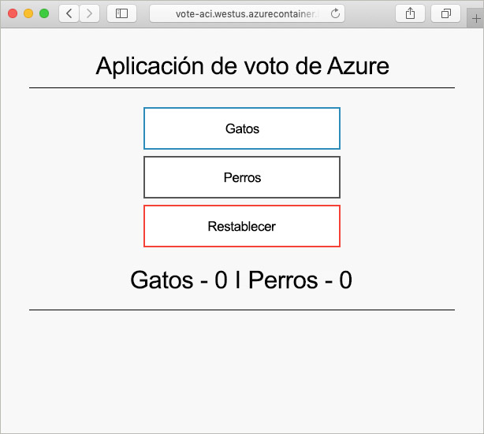

# <a name="quickstart-create-a-terraform-configuration-for-azure"></a>Inicio rápido: Creación de una configuración de Terraform para Azure

En este inicio rápido, creará recursos de Azure mediante Terraform Los pasos de este artículo le guiarán a lo largo del proceso de creación de los recursos siguientes:

> [!div class="checklist"]
> * Instancia de Azure Cosmos DB
> * Azure Container Instances
> * Aplicación que funciona en estos dos recursos

## <a name="create-first-configuration"></a>Creación de la primera configuración

En esta sección, creará la configuración para una instancia de Azure Cosmos DB.

1. Inicie sesión en [Azure Portal](https://go.microsoft.com/fwlink/p/?LinkID=525040).

1. Abra Azure Cloud Shell.

1. Inicie el editor de Cloud Shell:

    ```bash
    code main.tf
    ```

1. La configuración de este paso modela un par de recursos de Azure. Estos recursos incluyen un grupo de recursos de Azure y una instancia de Azure Cosmos DB. Se usa un entero aleatorio para crear un nombre de instancia de Cosmos DB único. Se configuran también varios valores de Cosmos DB. Para más información, consulte la [referencia de Terraform para Cosmos DB](https://www.terraform.io/docs/providers/azurerm/r/cosmosdb_account.html). Copie y pegue la siguiente configuración de Terraform en el editor:

    ```hcl
    resource "azurerm_resource_group" "vote-resource-group" {
      name     = "vote-resource-group"
      location = "westus"
    }

    resource "random_integer" "ri" {
      min = 10000
      max = 99999
    }

    resource "azurerm_cosmosdb_account" "vote-cosmos-db" {
      name                = "tfex-cosmos-db-${random_integer.ri.result}"
      location            = azurerm_resource_group.vote-resource-group.location
      resource_group_name = azurerm_resource_group.vote-resource-group.name
      offer_type          = "Standard"
      kind                = "GlobalDocumentDB"

      consistency_policy {
        consistency_level       = "BoundedStaleness"
        max_interval_in_seconds = 10
        max_staleness_prefix    = 200
      }

      geo_location {
        location          = "westus"
        failover_priority = 0
      }
    }
    ```

1. Guarde el archivo ( **&lt;Ctrl > S**) y salga del editor ( **&lt;Ctrl > Q**).

## <a name="run-the-configuration"></a>Ejecutar la configuración

En esta sección, se usan varios comandos de Terraform para ejecutar la configuración.

1. El comando [terraform init](https://www.terraform.io/docs/commands/init.html) inicializa el directorio de trabajo. En Cloud Shell, ejecute el comando siguiente:

    ```bash
    terraform init
    ```

1. Se puede usar el comando [terraform plan](https://www.terraform.io/docs/commands/plan.html) para validar la sintaxis de configuración. El parámetro `-out` dirige los resultados a un archivo. El archivo de salida se puede usar más adelante para aplicar la configuración. En Cloud Shell, ejecute el comando siguiente:

    ```bash
    terraform plan --out plan.out
    ```

1. El comando [terraform apply](https://www.terraform.io/docs/commands/apply.html) se usa para aplicar la configuración. Se especifica el archivo de salida del paso anterior. Este comando hace que se creen los recursos de Azure. En Cloud Shell, ejecute el comando siguiente:

    ```bash
    terraform apply plan.out
    ```

1. Para comprobar los resultados en Azure Portal, vaya al nuevo grupo de recursos. La nueva instancia de Azure Cosmos DB está en el nuevo grupo de recursos.

## <a name="update-configuration"></a>actualizar la configuración

En esta sección se muestra cómo actualizar la configuración para incluir una instancia de Azure Container Instances. El contenedor ejecuta una aplicación que lee y escribe datos en Cosmos DB.

1. Inicie el editor de Cloud Shell:

    ```bash
    code main.tf
    ```

1. La configuración de este paso establece dos variables de entorno: `COSMOS_DB_ENDPOINT` y `COSMOS_DB_MASTERKEY`. Estas variables contienen la ubicación y la clave para acceder a la base de datos. Los valores de estas variables se obtienen de la instancia de la base de datos que se creó en el paso anterior. Este proceso se denomina interpolación. Para más información acerca de la interpolación de Terraform, consulte [Sintaxis de interpolación](https://www.terraform.io/docs/configuration/interpolation.html). La configuración también incluye un bloque de salida, que devuelve el nombre de dominio completo (FQDN) de la instancia del contenedor. Copie y pegue el código siguiente en el editor:

    ```hcl
    resource "azurerm_container_group" "vote-aci" {
      name                = "vote-aci"
      location            = azurerm_resource_group.vote-resource-group.location
      resource_group_name = azurerm_resource_group.vote-resource-group.name
      ip_address_type     = "public"
      dns_name_label      = "vote-aci"
      os_type             = "linux"

      container {
        name   = "vote-aci"
        image  = "microsoft/azure-vote-front:cosmosdb"
        cpu    = "0.5"
        memory = "1.5"
        ports {
          port     = 80
          protocol = "TCP"
        }

        secure_environment_variables = {
          "COSMOS_DB_ENDPOINT"  = azurerm_cosmosdb_account.vote-cosmos-db.endpoint
          "COSMOS_DB_MASTERKEY" = azurerm_cosmosdb_account.vote-cosmos-db.primary_master_key
          "TITLE"               = "Azure Voting App"
          "VOTE1VALUE"          = "Cats"
          "VOTE2VALUE"          = "Dogs"
        }
      }
    }

    output "dns" {
      value = azurerm_container_group.vote-aci.fqdn
    }
    ```

1. Guarde el archivo ( **&lt;Ctrl > S**) y salga del editor ( **&lt;Ctrl > Q**).

1. Como hizo en la sección anterior, ejecute el siguiente comando para ver los cambios que se deben realizar:

    ```bash
    terraform plan --out plan.out
    ```

1. Por último, ejecute el comando `terraform apply` para aplicar la configuración.

    ```bash
    terraform apply plan.out
    ```

1. Tome nota del nombre de dominio completo de la instancia de contenedor.

## <a name="test-application"></a>Prueba de la aplicación

Para probar la aplicación, navegue hasta el FQDN de la instancia de contenedor. Debería ver resultados similares a lo siguiente:



## <a name="clean-up-resources"></a>Limpieza de recursos

Cuando ya no los necesite, elimine los recursos creados en este artículo.

Ejecute el comando [terraform destroy](https://www.terraform.io/docs/commands/destroy.html) para quitar los recursos de Azure creados en este tutorial:

```bash
terraform destroy -auto-approve
```

## <a name="next-steps"></a>Pasos siguientes

> [!div class="nextstepaction"]
> [Instalación y configuración de Terraform para aprovisionar recursos de Azure](terraform-install-configure.md).