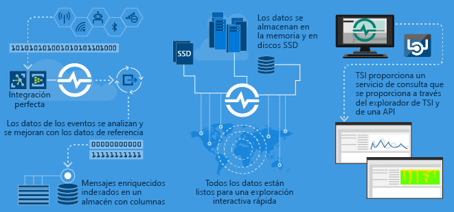
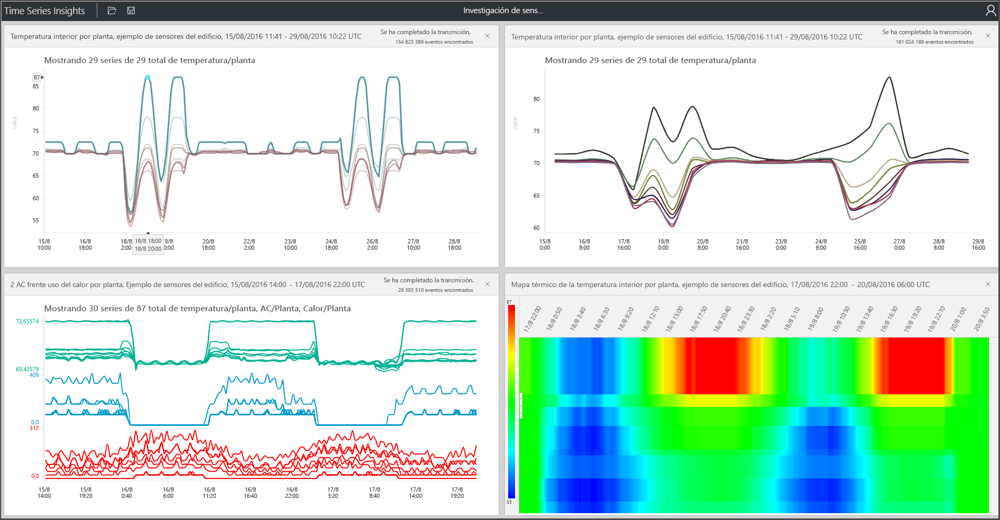

# ¿Qué es Azure Time Series Insights?

Azure Time Series Insights se usa para almacenar, visualizar y consultar grandes cantidades de datos de series temporales, como los que generan los dispositivos de IoT. Si desea almacenar, administrar, consultar o visualizar los datos de una serie temporal en la nube, probablemente Time Series Insights sea lo que busca.

Time Series Insights tiene cuatro trabajos clave:

- Está totalmente integrado con las puertas de enlace en la nube, como Azure IoT Hub y Azure Event Hubs. Y se conecta fácilmente a estos orígenes de eventos y analiza JSON desde mensajes y estructuras que tienen datos en columnas y filas limpias. Combina metadatos con telemetría e indexa los datos en un almacén en columnas.
- Time Series Insights administra el almacenamiento de los datos. Para asegurarse de que se puede acceder fácilmente a los datos en todo momento, almacena los datos en memoria y en SSD hasta 400 días. Puede consultar de forma interactiva miles de millones de eventos en segundos, a petición.
- Time Series Insights proporciona de forma estándar visualización mediante el explorador de Time Series Insights.
- Time Series Insights proporciona un servicio de consulta, tanto en el explorador de Time Series Insights como mediante el uso de API que son fáciles de integrar para insertar datos de una serie temporal en aplicaciones personalizadas.

Si crea una aplicación para consumo interno o para que la utilicen clientes externos, puede usar Time Series Insights como back-end. Puede usarla para indexar, almacenar y agregar datos de series temporales. A partir de aquí, para crear una experiencia de visualización y usuario personalizada, use el [SDK de cliente](https://github.com/microsoft/tsiclient/blob/master/docs/API.md). Time Series Insights también está equipado con varias [API de consulta](how-to-shape-query-json.md) para habilitar estos escenarios personalizados.

Los datos de serie temporal representan cómo cambia un recurso o un proceso con el tiempo. Los datos de las series temporales los indexan las marcas de tiempo y la hora es el eje más significativo en el que se organizan dichos datos. Normalmente, los datos de las series temporales llegan en orden secuencial, por lo que se tratan como inserción en lugar de actualización de la base de datos.

El almacenamiento, la indexación, la realización de consultas, el análisis y la visualización de datos de series temporales puede ser un desafío cuando los volúmenes son grandes.
Azure Time Series Insights captura y almacena cada evento nuevo como una fila y el cambio se mide eficazmente con el paso del tiempo. Como consecuencia, se puede mirar hacia atrás para extraer información del pasado que ayude a predecir cambios futuros.

## Vídeo

### Más información sobre Azure Time Series Insights, la plataforma de análisis de IoT basada en la nube. 

## Escenarios principales

- Almacenamiento de datos de serie temporal de forma escalable.

   En esencia, Time Series Insights tiene una base de datos diseñada para datos de serie temporal. Al ser escalable y estar totalmente administrado, Time Series Insights realiza el trabajo de almacenar y administrar los eventos.

- Exploración de datos casi en tiempo real.

   Time Series Insights proporciona un explorador que visualiza todos los datos que se transmiten en secuencias en un entorno. Al poco tiempo de conectarse al origen de un evento, puede ver, explorar y consultar los datos del mismo en Time Series Insights. Los datos le ayudan a validar si un dispositivo emite los datos según lo previsto y a supervisar el mantenimiento, la productividad y la eficacia global de un recurso de IoT.

- Realización del análisis de las causas principales y detección de anomalías.

   Time Series Insights tiene herramientas, como los patrones y las vistas en perspectiva, para realizar análisis en varios pasos de las causas principales y guardar dichos análisis. Time Series Insights también se puede usar con servicios de alerta, como Azure Stream Analytics, para poder ver las alertas y las anomalías detectadas casi en tiempo real en el explorador del primero.

- Obtención de una vista global de los datos de series temporales que se transmiten en secuencias desde distintas ubicaciones para poder realizar comparaciones de varios recursos o sitios.

   Puede conectar varios orígenes de eventos a un entorno de Time Series Insights. De esta forma es posible ver conjuntamente datos que se transmiten en secuencias desde varias ubicaciones dispares casi en tiempo real. Los usuarios pueden aprovechar esta visibilidad para compartir datos con líderes de negocios. Pueden colaborar mejor con expertos de dominios que pueden aplicar sus conocimientos para ayudar a solucionar problemas, aplicar procedimientos recomendados y compartir conocimientos.

- Compilación de una aplicación cliente a partir de Time Series Insights.

   Time Series Insights expone varias Query API REST que se pueden usar para compilar aplicaciones que usen datos de series temporales.

## Capacidades

- **Introducción rápida**: Azure Time Series Insights no requiere la preparación de datos por adelantado, por lo que es posible conectarse rápidamente a millones de eventos en un centro de IoT o en un centro de eventos. Tras dicha conexión puede visualizar los datos de los sensores e interactuar con ellos para validar rápidamente las soluciones de IoT. Puede interactuar con los datos sin escribir código, y no es necesario que aprenda ningún lenguaje nuevo. Time Series Insights proporciona una superficie de consulta granular y de texto libre para usuarios avanzados y una exploración en la que se usa el método de apuntar y hacer clic.

- **Información casi en tiempo real**: Time Series Insights puede ingerir millones de eventos de sensores al día con una latencia de un minuto. Time Series Insights le ayuda a obtener información de los datos de los sensores. Úselo para detectar tendencias y anomalías, realizar análisis de las causas principales y evitar costosos tiempos de inactividad. La correlación entre los datos en tiempo real y los históricos le ayuda a encontrar tendencias ocultas en los datos.

- **Compilación de soluciones personalizadas**: inserte los datos de Azure Time Series Insights en las aplicaciones existentes. También puede crear soluciones personalizadas nuevas con las API REST de Time Series Insights. Cree vistas personalizadas para compartir sus conocimientos con otros usuarios.

- **Escalabilidad**: Time Series Insights está diseñado para admitir IoT a escala. Puede incorporar de 1 a 100 millones de eventos al día, con un tiempo predeterminado de retención de 31 días. Puede visualizar y analizar flujos de datos activos casi en tiempo real, junto con datos históricos.

## Introducción

Para comenzar, siga estos pasos.

1. Aprovisione un entorno de Time Series Insights en Azure Portal.
1. Conéctese a un origen del eventos, como un centro de IoT o un centro de eventos.
1. Cargue los datos de referencia. Este no es un servicio adicional.
1. Revise y muestre los datos en minutos con el explorador de Time Series Insights.

## Explorador

Vea, analice y detecte tendencias en los datos mediante el explorador de Azure Time Series Insights.

Aprenda a usar el [explorador de Azure Time Series Insights](time-series-insights-explorer.md) para extraer conclusiones de sus datos.

## Pasos siguientes

- Explore el [entorno de demostración gratuito](./time-series-quickstart.md) en disponibilidad general de Azure Time Series Insights.

- Obtenga más información acerca de cómo [planear un entorno de Time Series Insights](time-series-insights-environment-planning.md).
