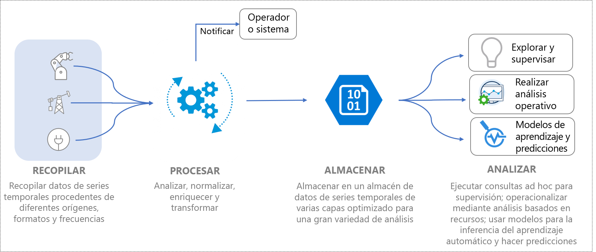
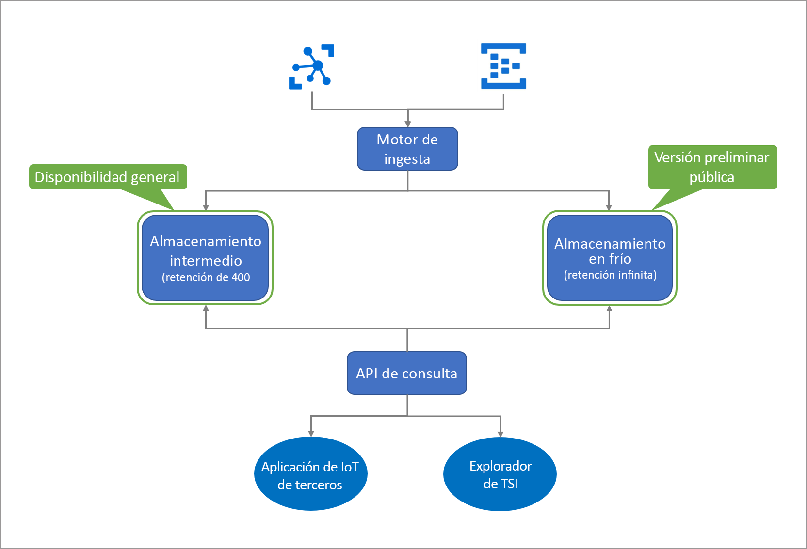

# ¿Qué es la versión preliminar de Azure Time Series Insights?

La versión preliminar de Azure Time Series Insights es una oferta de plataforma como servicio (PaaS) de un extremo a otro. Se puede usar para recopilar, procesar, almacenar, analizar y consultar los datos en la escala de Internet de las cosas (IoT), datos que están muy contextualizados y optimizados para la series temporales. 

Time Series Insights se ha diseñado para la exploración de datos ad hoc y para el análisis operativo. Es una oferta de servicio de extensible y personalizada, que satisface las necesidades de las implementaciones de IoT industriales.

## Vídeo

Más información acerca de la versión preliminar de Azure Time Series Insights.

> [!VIDEO https://channel9.msdn.com/Shows/Internet-of-Things-Show/Azure-Time-Series-Insights-e2e-solution-for-industrial-IoT-analytics/player]

## Definición de datos de IoT

A menudo, los datos de IoT industriales en organizaciones con un uso intensivo de recursos carecen de coherencia estructural debido a la naturaleza variable de los dispositivos y sensores en una configuración industrial. Los datos procedentes de estos flujos se caracterizan por incluir vacíos significativos y, a veces, mensajes dañados y lecturas falsas. Los datos de IoT suelen ser significativos en el contexto de las entradas de datos adicionales que proceden de orígenes propios o de terceros, como CRM o ERP, que agregan contexto para flujos de trabajo de un extremo a otro. Las entradas de orígenes de datos de terceros, como datos meteorológicos, pueden ayudar a aumentar los flujos de telemetría en una instalación determinada. 

Todo esto implica que solo una fracción de los datos se usa para fines operativos y empresariales, y el análisis requiere contextualización. Los datos industriales a menudo se historían para un análisis en profundidad durante períodos de tiempo más largos para comprender y correlacionar tendencias. Para convertir los datos de IoT recopilados en información útil, se requiere: 

* Procesamiento de datos para limpiar, filtrar, interpolar, transformar y preparar los datos para su análisis.
* Una estructura para poder explorar y comprender los datos, a fin de normalizarlos y contextualizarlos.
* Almacenamiento rentable para una retención duradera o infinita de datos procesados (o derivados) y sin procesar.

Estos datos proporcionan una información coherente, completa, actualizada y correcta que resulta necesaria para los informes y los análisis empresariales.

La imagen siguiente muestra un flujo de datos de IoT típico.

## Azure Time Series Insights para IoT industrial

El panorama de IoT es diverso con clientes que abarcan una gran variedad de segmentos del sector, como fabricación, automoción, energía, utilidades, edificios inteligentes y consultoría. En esta amplia gama de mercados de IoT industrial, las soluciones nativas para la nube que proporcionan análisis completos orientados a datos de IoT a gran escala siguen evolucionando. 

Azure Time Series Insights aborda esta necesidad de mercado al proporcionar una solución de análisis de IoT de un extremo a otro y llave en mano con modelos semánticos enriquecidos para contextualización de datos de series temporales, conclusiones basadas en recursos y la mejor experiencia de usuario en lo que a detección, tendencias, detección de anomalías e inteligencia operativa se refiere. 

Una plataforma de análisis operativo enriquecida combinada con nuestras funcionalidades de exploración de datos interactivas, puede usar Time Series Insights para obtener más valor de los datos recopilados de los recursos de IoT. La oferta de la versión preliminar admite: 

* Una solución de almacenamiento multicapa con compatibilidad con análisis intermedios y en frío que proporcionan a los clientes la opción de enrutar los datos entre intermedios y en frío para el análisis interactivo sobre datos intermedios, así como la inteligencia operativa en décadas de datos históricos. 

    *   Una solución de análisis intermedio muy interactiva para realizar numerosas y frecuentes consultas a través de datos con intervalos de tiempo más cortos. 
    *   Un lago de datos de serie temporal escalable, de gran rendimiento y con un costo optimizado basado en Azure Storage que permite a los clientes analizar tendencias de años de datos de series temporales en cuestión de segundos. 

* Compatibilidad con el modelo semántico que describe el dominio y los metadatos asociados con las señales derivadas y sin procesar de los recursos y dispositivos.

* Plataforma de análisis flexible para almacenar datos históricos de series temporales en la cuenta de Azure Storage propiedad del cliente, lo que permite a los clientes tener la propiedad de sus datos de IoT. Los datos se almacenan con el formato de Apache Parquet con código abierto, que permite la conectividad y la interoperabilidad en una variedad de escenarios de datos, incluidos el análisis predictivo, el aprendizaje automático y otros cálculos personalizados realizados mediante tecnologías conocidas, como Spark, Databricks y Jupyter.

* Análisis enriquecidos con mejores API de consulta y experiencia del usuario que combina conclusiones de datos basadas en activos con análisis de datos ad hoc enriquecidos con compatibilidad con interpolación, funciones escalares y de agregado, variables categóricas, gráficos de dispersión y señales de series temporales con pausas en directo para un análisis en profundidad.

*   Plataforma de nivel empresarial para admitir las necesidades de escalado, rendimiento, seguridad y confiabilidad de nuestros clientes de IoT empresariales.

* Extensibilidad y compatibilidad con la integración para el análisis de un extremo a otro. Time Series Insights proporciona una plataforma de análisis extensible para una amplia gama de escenarios de datos. El conector de Azure Time Series Insights para Power BI permite a los clientes llevar las consultas que realizan en Azure Time Series Insights directamente a Power BI para obtener una vista unificada de sus análisis de BI y series temporales en una sola pantalla.

En el siguiente diagrama se muestra el flujo de datos de alto nivel.

  

Azure Time Series Insights proporciona un modelo de precios de pago por uso escalable para el procesamiento de datos, el almacenamiento (datos y metadatos) y la consulta, lo que permite a los clientes ajustar su uso para satisfacer sus necesidades empresariales. 
 
Gracias a la introducción de estas funcionalidades de IoT industriales clave, Time Series Insights también ofrece las siguientes ventajas clave.  

| | |
| ---| ---|
| Almacenamiento multicapa para datos de series temporales a escala de IoT | Con una canalización de procesamiento de datos compartida para la ingesta de datos, puede ingerir datos en almacenes intermedios y en frío. Use el almacén intermedio para las consultas interactivas y el almacén en frío para almacenar grandes volúmenes de datos. Para más información sobre cómo aprovechar las consultas basadas en recursos de alto rendimiento, vea [Consultas de datos](./time-series-insights-update-tsq.md). |
| Modelo de serie temporal para contextualizar datos de telemetría sin procesar y derivar información basada en recursos | Puede usar el modelo de serie temporal para crear instancias, jerarquías, tipos y variables para los datos de series temporales. Para más información sobre el modelo de Time Series consulte [Modelo de Time Series](./time-series-insights-update-tsm.md).  |
| Integración suave y continua con otras soluciones de datos | Los datos del almacén en frío de Time Series Insights se [almacenan](./time-series-insights-update-storage-ingress.md) en archivo de Apache Parquet de código abierto. Esto permite la integración de datos con otras soluciones de datos, de primera entidad o de terceros, en escenarios que incluyen inteligencia empresarial, aprendizaje automático avanzado y análisis predictivo. |
| Exploración de datos casi en tiempo real | La experiencia de usuario del [explorador de la versión preliminar de Azure Time Series Insights](./time-series-insights-update-explorer.md) proporciona la visualización de todos los flujos de datos mediante la canalización de ingesta. Después de conectarse a un origen del evento, puede ver, explorar y consultar datos del evento. De este modo, puede validar si un dispositivo emite los datos según lo previsto. También puede supervisar el mantenimiento, la productividad y la eficacia general de un recurso de IoT. | 
| Extensibilidad e integración | La integración del conector de Azure Time Series Insights para Power BI está directamente disponible en la experiencia de usuario del Explorador de Time Series con la opción **Exportar**, que permite a los clientes exportar las consultas de series temporales que crean en nuestra experiencia de usuario directamente en el escritorio de Power BI y así ver los gráficos de series temporales junto con otros análisis de inteligencia empresarial. Esto abre la puerta a una nueva clase de escenarios para empresas de IoT industriales que han invertido en Power BI proporcionando un único panel en análisis de diversos orígenes de datos, incluida la serie temporal de IoT. | 
| Aplicaciones personalizadas creadas en la plataforma de Time Series Insights | Time Series Insights admite el [SDK de JavaScript](https://github.com/microsoft/tsiclient/blob/master/docs/API.md). El SDK ofrece controles enriquecidos y acceso simplificado a las consultas. Use el SDK para compilar aplicaciones personalizadas de IoT en Time Series Insights para satisfacer sus necesidades empresariales. También puede usar las [API de consulta](./time-series-insights-update-tsq.md) de Time Series Insights directamente para dirigir datos a las aplicaciones de IoT personalizadas. |

## Pasos siguientes

Introducción a la versión preliminar de Azure Time Series Insights:

> [!div class="nextstepaction"]
> [Guía de inicio rápido](./time-series-insights-update-quickstart.md)

Conozca los casos de uso:

> [!div class="nextstepaction"]
> [Casos de uso de la versión preliminar de Azure Time Series Insights](./time-series-insights-update-use-cases.md)