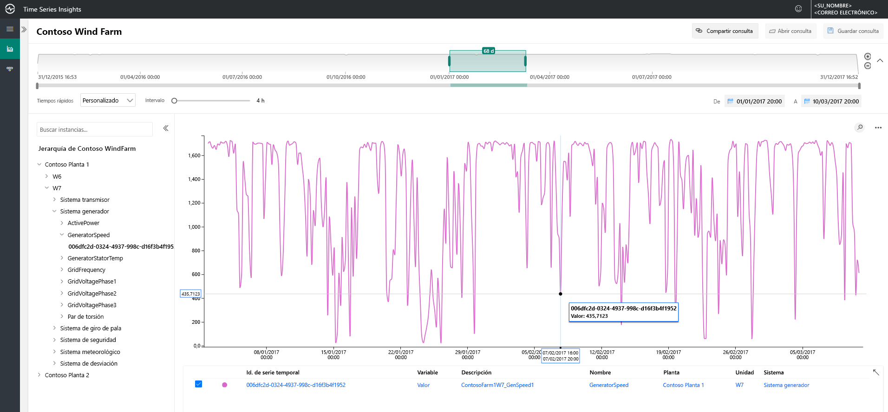
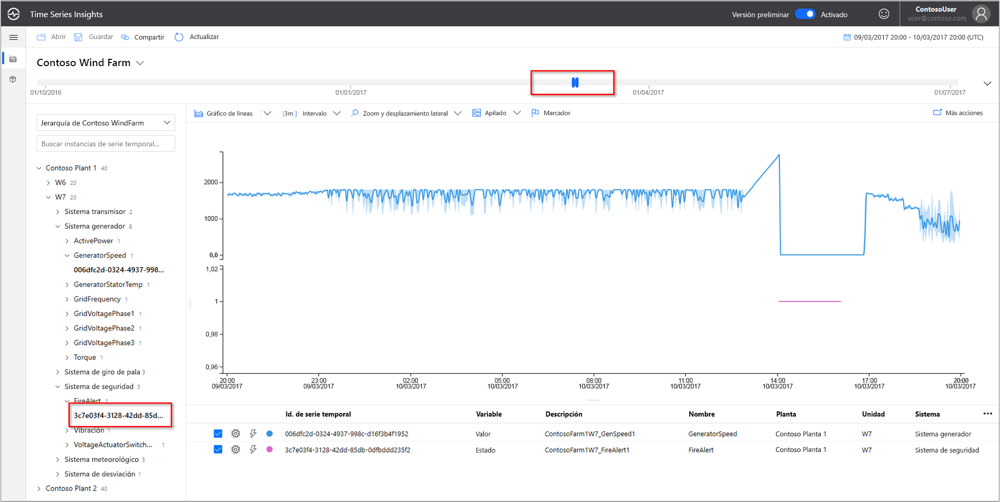
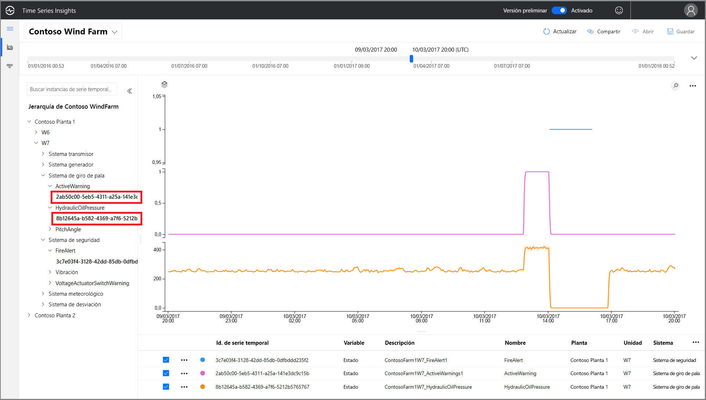
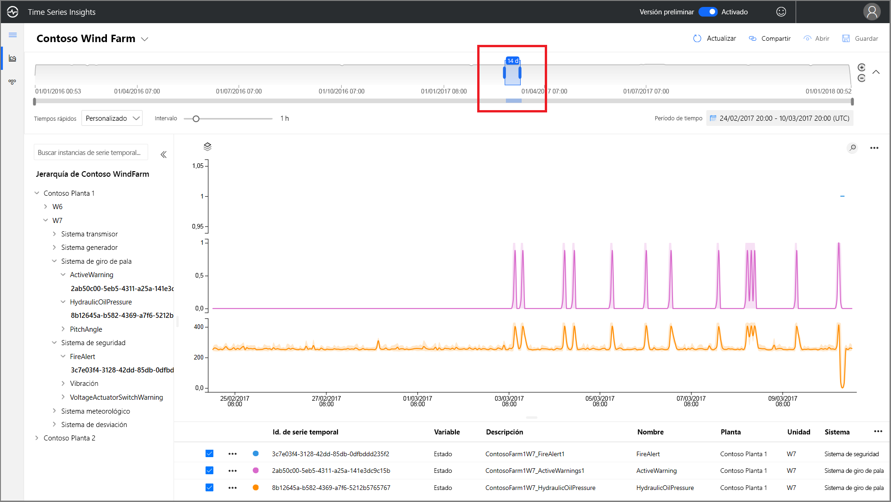
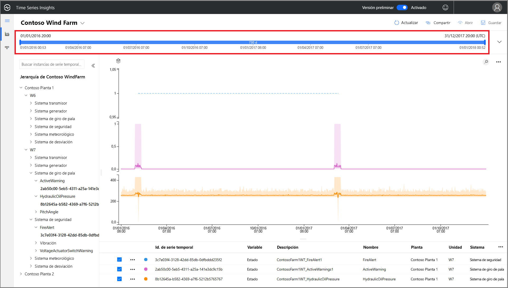
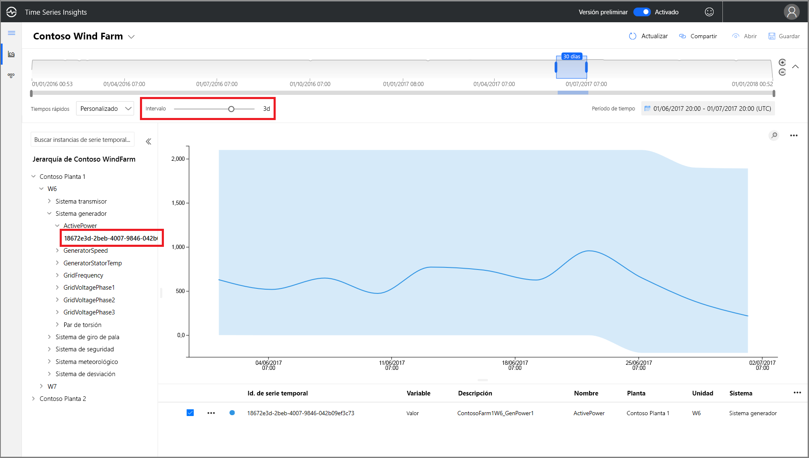
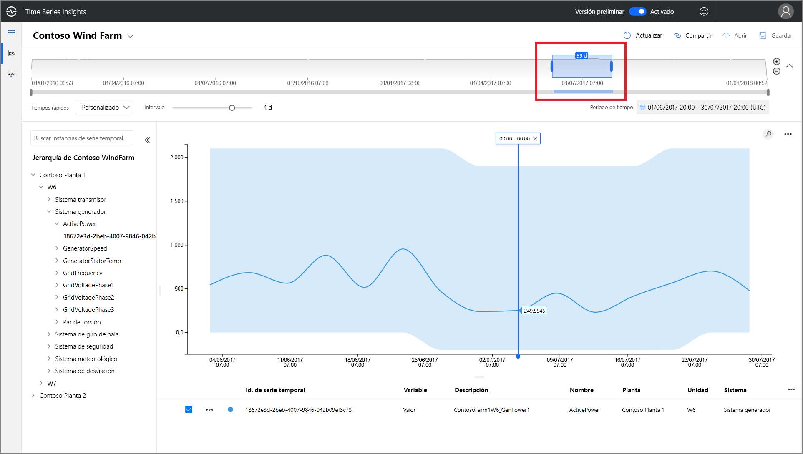
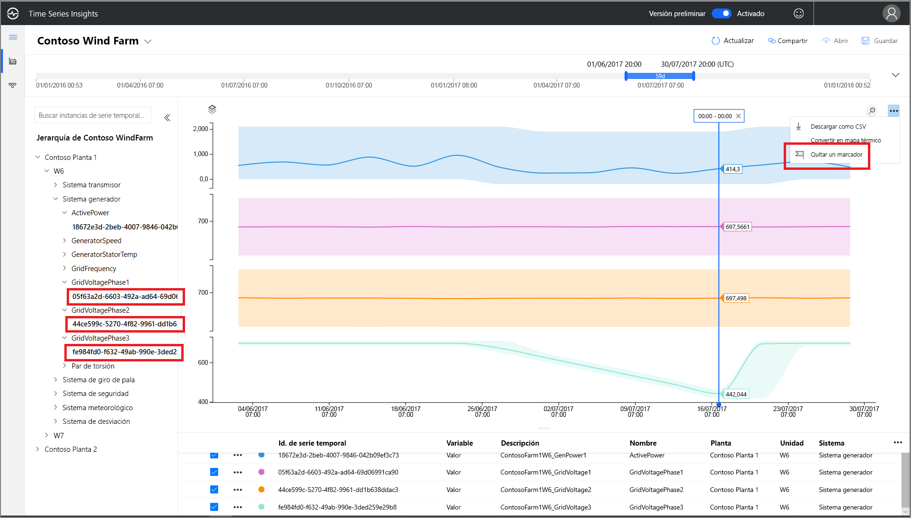
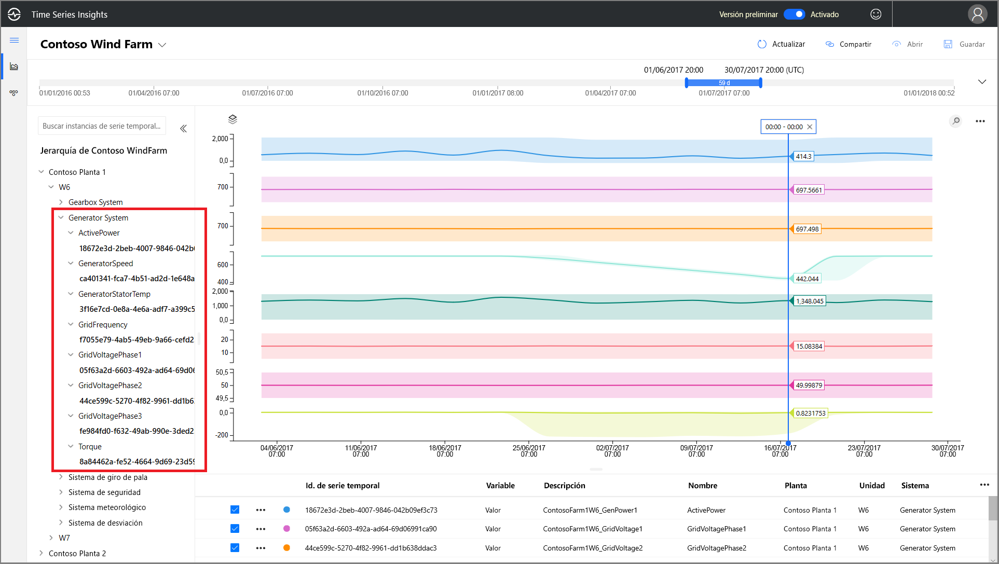

# Guía de inicio rápido: Exploración del entorno de demostración de la versión preliminar de Azure Time Series Insights

Esta guía de inicio rápido le ayuda a empezar a trabajar con Azure Time Series Insights Preview. Con la demostración gratuita, conocerá las características principales que se han agregado en Azure Time Series Insights (versión preliminar).

El entorno de demostración de la versión preliminar contiene una escenario de la empresa Contoso, que opera dos granjas de turbinas eólicas, cada una con 10 turbinas. Cada turbina tiene veinte sensores que comunican los datos cada minuto a Azure IoT Hub. Los sensores recopilan información acerca de las condiciones meteorológicas, la posición de inclinación y el paso de las palas. También sobre el rendimiento del generador, el comportamiento de la caja de cambios y los monitores de seguridad.

 Aprenderá a usar Time Series Insights para buscar información útil en los datos de Contoso. También llevará a cabo un breve análisis de la causa raíz para predecir mejor los errores críticos y realizar tareas de mantenimiento.

## Exploración del explorador de Time Series Insights en un entorno de demostración

El explorador de Time Series Insights (versión preliminar) muestra datos históricos y análisis de la causa raíz. Primeros pasos:

1. Cree una  [cuenta gratuita de Azure](https://azure.microsoft.com/free/?ref=microsoft.com&utm_source=microsoft.com&utm_medium=docs&utm_campaign=visualstudio)  si aún no tiene una.

1. Vaya al entorno  [Contoso Wind Farm demo](https://insights.timeseries.azure.com/preview/samples).  

1. Si se le solicita, inicie sesión en el explorador de Time Series Insights con las credenciales de la cuenta de Azure.

## Trabajo con datos históricos

1. Observe la turbina eólica **W7** en **Contoso Plant 1**.  

    * Actualice el intervalo de la vista a **1/1/17 20:00 a 10/03/17 20:00 (UTC)**.
    * Seleccione el sensor **Contoso Plant 1** > **W7** > **Generator System** > **GeneratorSpeed**. A continuación, revise los valores resultantes.

      

1. Recientemente, Contoso encontró un incendio en el **aerogenerador número 7**. Las opiniones sobre cuál fue la causa del incendio varían. En un examen más detallado, vemos que el sensor de alerta de incendios se activó durante el fuego.

    * Actualice el intervalo de la vista a **9/3/17 20:00 a 10/3/17 20:00 (UTC)**.
    * Seleccione el sensor **Safety System** > **FireAlert**.

      

1. Revise otros eventos en el momento del incendio para comprender qué ha sucedido. Se dieron advertencias de presión del aceite y advertencias activas justo antes del incendio.

    * Seleccione el sensor **Pitch System** > **HydraulicOilPressure**.
    * Seleccione el sensor **Pitch System** > **ActiveWarning**.

      

1. Se dieron advertencias de presión del aceite y advertencias activas justo antes del incendio. Expanda la serie temporal mostrada para ver otras señales que pudieran haber provocado el incendio. Ambos sensores variaron de forma coherente a lo largo del tiempo, lo que indica un patrón persistente y preocupante.

    * Actualice el intervalo de la vista a **24/2/17 20:00 a 10/3/17 20:00 (UTC)**.

      

1. El examen de dos años de datos históricos revela otro incendio con las mismas fluctuaciones en los sensores.

    * Actualice el intervalo de la vista a **1/1/16 a 31/12/17** (todos los datos).

      

Con Azure Time Series Insights y los datos de telemetría de los sensores, hemos descubierto una problemática tendencia a largo plazo oculta en los datos históricos. Con estas nuevas conclusiones, se puede:

> [!div class="checklist"]
> * Explicar lo que realmente sucedió.
> * Corregir el problema.
> * Poner en marcha sistemas de notificación de alertas superiores.

## Análisis de causa raíz

1. Algunos escenarios requieren un análisis sofisticado para revelar pistas sutiles en los datos. Seleccione el generador **W6** en la fecha **25/6**

    * Actualice el intervalo de la vista a **1/6/17 20:00 a 1/7/17 20:00 (UTC)**.
    * A continuación, seleccione el sensor **Contoso Plant 1** > **W6** > **Safety System** > **VoltageActuatorSwitchWarning** .

      

1. La advertencia indica un problema con la tensión de salida del generador. La potencia de salida general del generador se mueve dentro de los parámetros normales en el intervalo actual. Al aumentar el intervalo, surge otro patrón: hay una caída definitiva.

    * Elimine el sensor **VoltageActuatorSwitchWarning**.
    * Seleccione el sensor **Generator System** > **ActivePower**.
    * Actualice el intervalo a **3d**.

      

1. Si expande el intervalo de tiempo, podemos determinar si el problema se ha detenido o si continúa.

    * Amplíe el intervalo de tiempo a 60 días.

      

1. Se pueden agregar otros puntos de datos de sensores para proporcionar un mayor contexto. Cuantos más sensores podamos ver, mayor será nuestra comprensión del problema. Coloquemos un marcador para ver los valores reales. 

    * Seleccione los sensores **Generator System** > **GridVoltagePhase1**, **GridVoltagePhase2** y **GridVoltagePhase3**.
    * Coloque un marcador en el último punto de datos en el área visible.

      

    Los tres sensores de voltaje están operando de forma comparable y dentro de los parámetros normales. Parece que el sensor **GridVoltagePhase3** es el culpable.

1. Una vez agregados los datos estrechamente relacionados con el contexto, la caída de la fase 3 aparece aún más como el problema. Estamos listos para comunicar el problema al equipo de mantenimiento con un buen punto de partida sobre la causa de la advertencia.  

    * Actualice la pantalla para superponer todos los sensores de **Generator System** en la misma escala del gráfico.

       

## Pasos siguientes

Está listo para crear su propio entorno en versión preliminar de Time Series Insights:

> [!div class="nextstepaction"]
> [Planeamiento de un entorno en versión preliminar de Time Series Insights](time-series-insights-update-plan.md)

Aprenda a trabajar con la demostración y sus características:

> [!div class="nextstepaction"]
> [Explorador de Time Series Insights (versión preliminar)](time-series-insights-update-explorer.md)
