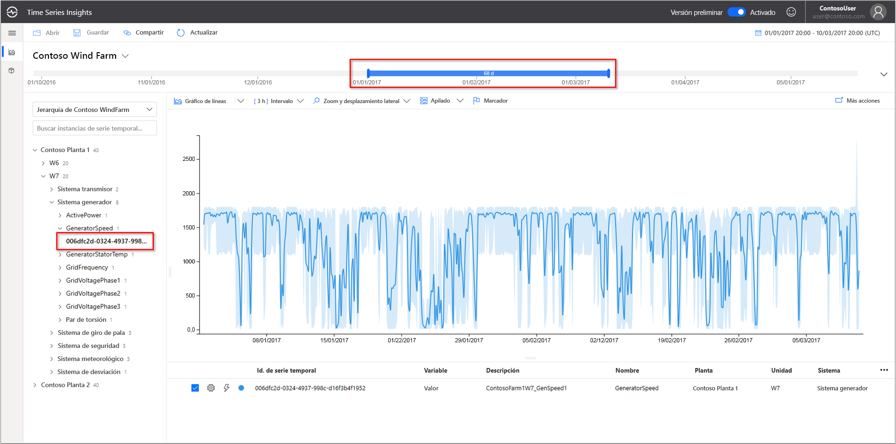
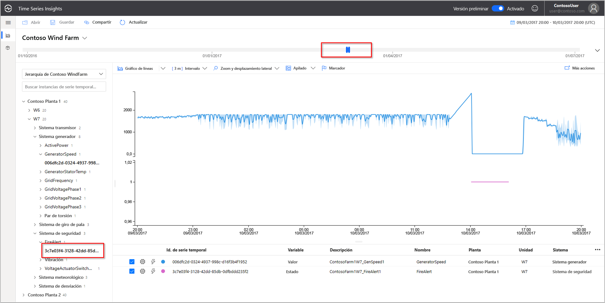
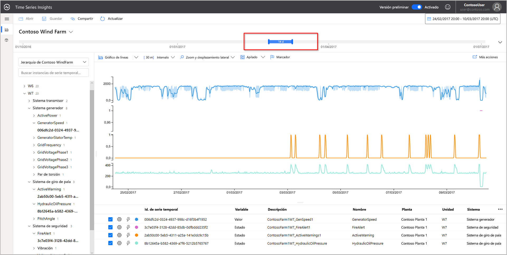
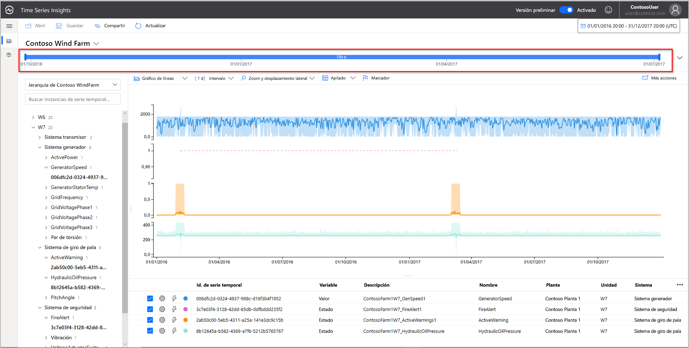
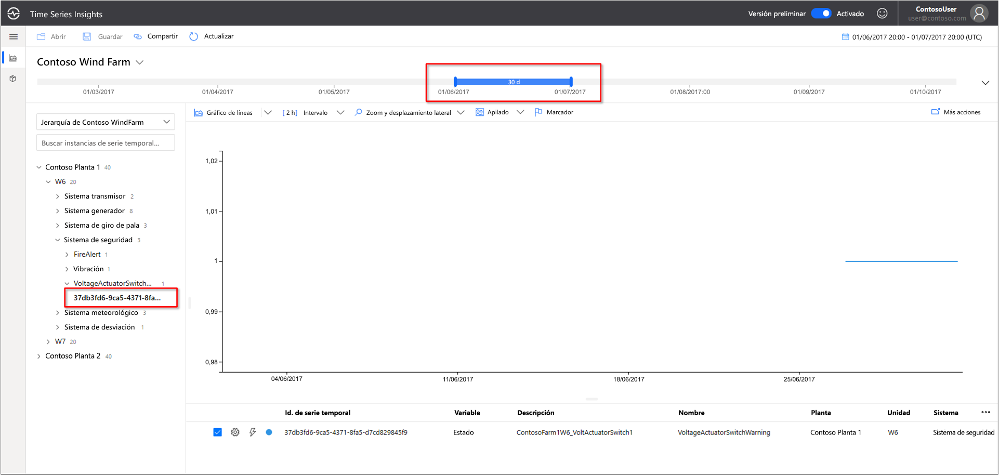
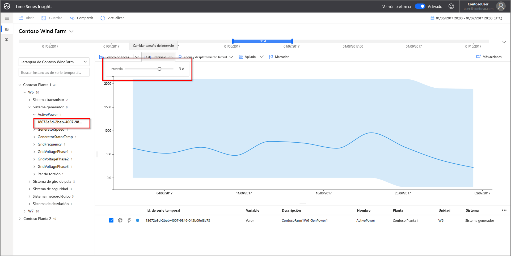
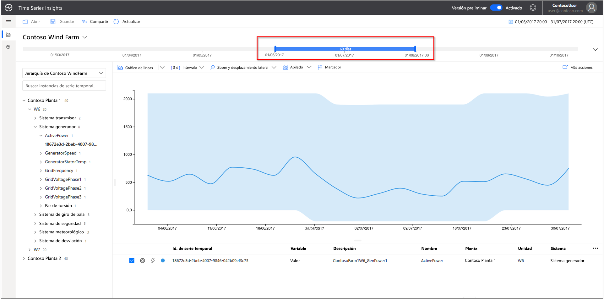
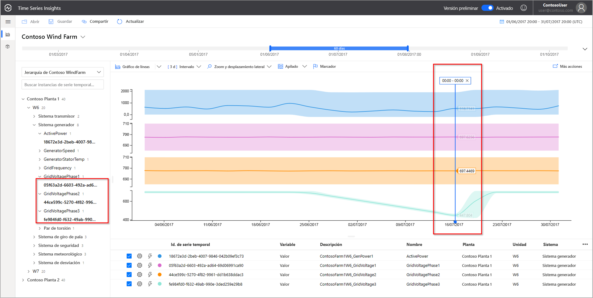
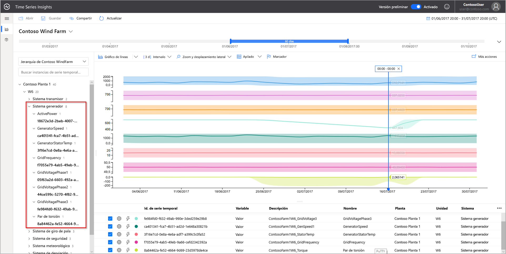

# Inicio rápido: Exploración del entorno de demostración de la versión preliminar de Azure Time Series Insights

Este inicio rápido le ayuda a empezar a trabajar con el entorno de versión preliminar de Azure Time Series Insights. En la demostración gratuita, recorrerá las características principales que se han agregado a la versión preliminar de Time Series Insights.

El entorno de demostración de la versión preliminar de Time Series Insights contiene un escenario de la empresa Contoso, que dirige dos granjas de turbinas eólicas. Cada granja tiene 10 turbinas. Cada turbina tiene veinte sensores que comunican los datos cada minuto a Azure IoT Hub. Los sensores recopilan información acerca de las condiciones meteorológicas, la posición de inclinación y el paso de las palas. También se registra información sobre el rendimiento de los generadores, el comportamiento de la caja de cambios y los monitores de seguridad.

En este inicio rápido, aprenderá a usar Time Series Insights para buscar información que requiere acción en los datos de Contoso. También llevará a cabo un breve análisis de la causa principal para predecir mejor los errores críticos y realizar tareas de mantenimiento.

> [!IMPORTANT]
> Cree una  [cuenta gratuita de Azure](https://azure.microsoft.com/free/?ref=microsoft.com&utm_source=microsoft.com&utm_medium=docs&utm_campaign=visualstudio)  si aún no tiene una.

## Exploración del explorador de Time Series Insights en un entorno de demostración

El explorador de Time Series Insights (versión preliminar) muestra datos históricos y análisis de la causa raíz. Primeros pasos:

1. Vaya al entorno de ejemplo  [Contoso Wind Farm](https://insights.timeseries.azure.com/preview/samples).  

1. Si se le solicita, inicie sesión en el explorador de Time Series Insights con las credenciales de la cuenta de Azure.

## Trabajo con datos históricos

1. En **Contoso Plant 1**, examine la turbina eólica **W7**.  

   1. Cambie el intervalo de la vista a **1/1/17 20:00:00.00 to 3/10/17 20:00:00.00 (UTC)** .
   1. Para seleccionar el sensor, elija **Contoso Plant 1** > **W7** > **Generator System** > **GeneratorSpeed**. Luego, revise los valores que se muestran.

      

1. Recientemente, Contoso encontró un incendio en el **aerogenerador número 7**. Las opiniones sobre lo que ha provocado el fuego varían. En Time Series Insights, se muestra el sensor de alerta de incendio que se activó durante el incendio.

   1. Cambie el intervalo de la vista a **3/9/17 20:00:00.00 to 3/10/17 20:00:00.00 (UTC)** .
   1. Seleccione **Safety System** > **FireAlert**.

      

1. Revise otros eventos en el momento del incendio para comprender qué ha sucedido. Se proporcionaron advertencias de presión del aceite y advertencias activas justo antes del incendio.

   1. Seleccione **Pitch System** > **HydraulicOilPressure**.
   1. Seleccione **Pitch System** > **ActiveWarning**.

      

1. Se dieron advertencias de presión del aceite y advertencias activas justo antes del incendio. Expanda la serie temporal mostrada para revisar otras señales que evidencien la causa del incendio. Ambos sensores fluctuaron sistemáticamente con el tiempo. Las fluctuaciones indican un patrón persistente y preocupante.

    * Cambie el intervalo de la vista a **2/24/17 20:00:00.00 to 3/10/17 20:00:00.00 (UTC)** .

      

1. El examen de dos años de datos históricos revela otro incendio con las mismas fluctuaciones en los sensores.

    * Cambie el intervalo de la vista a **1/1/16 to 12/31/17** (todos los datos).

      

Con Time Series Insights y los datos de telemetría de los sensores, hemos descubierto una tendencia a largo plazo oculta en los datos históricos. Con estas nuevas conclusiones, se puede:

* Explicar lo que realmente sucedió.
* Corregir el problema.
* Poner en marcha mejores sistemas de notificación de alertas.

## Análisis de la causa raíz

1. Algunos escenarios requieren un análisis sofisticado para revelar pistas sutiles en los datos. Seleccione el generador **W6** en la fecha **6/25**.

    1. Cambie el intervalo de la vista a **6/1/17 20:00:00.00 to 7/1/17 20:00:00.00 (UTC)** .
    1. Seleccione **Contoso Plant 1** > **W6** > **Safety System** > **VoltageActuatorSwitchWarning**.

       

1. La advertencia indica un problema con la tensión del generador. La potencia de salida general del generador se encuentra dentro de los parámetros normales en el intervalo actual. Al aumentar nuestro intervalo, surge otro patrón. Se evidencia una caída.

    1. Elimine el sensor **VoltageActuatorSwitchWarning**.
    1. Seleccione **Generator System** > **ActivePower**.
    1. Cambie el intervalo a **3d**.

       

1. Si expande el intervalo de tiempo, podemos determinar si el problema se ha detenido o si continúa.

    * Amplíe el intervalo de tiempo a 60 días.

      

1. Se pueden agregar otros puntos de datos de sensores para proporcionar un mayor contexto. Cuantos más sensores podamos ver, mayor será nuestra comprensión del problema. Coloquemos un marcador para mostrar los valores reales. 

    1. Seleccione **Generator System** y, luego, elija tres sensores: **GridVoltagePhase1**, **GridVoltagePhase2** y **GridVoltagePhase3**.
    1. Coloque un marcador en el último punto de datos en el área visible.

       

    Dos de los sensores de voltaje están funcionando de forma comparable y dentro de los parámetros normales. Parece que el sensor **GridVoltagePhase3** es el culpable.

1. Una vez agregados los datos estrechamente relacionados con el contexto, la caída de la fase 3 se evidencia más como la causa del problema. Ahora, tenemos un buen punto de partida sobre la causa de la advertencia. Ya estamos listos para remitir el asunto a nuestro equipo de mantenimiento.  

    * Cambie la pantalla para superponer todos los sensores de **Generator System** en la misma escala del gráfico.

      

## Limpieza de recursos

Ahora que ha completado el inicio rápido, limpie los recursos que ha creado:

1. En el menú de la izquierda de [Azure Portal](https://portal.azure.com), seleccione **Todos los recursos** y busque el grupo de recursos de Azure Time Series Insights.
1. Seleccione **Eliminar** para eliminar todo el grupo de recursos (y todos los recursos que contiene), o quite los recursos de uno en uno.

## Pasos siguientes

Está listo para crear su propio entorno de Time Series Insights: Para comenzar:

> [!div class="nextstepaction"]
> [Planeamiento de un entorno en versión preliminar de Time Series Insights](time-series-insights-update-plan.md)

Aprenda a usar la demostración y sus características:

> [!div class="nextstepaction"]
> [Explorador de Time Series Insights (versión preliminar)](time-series-insights-update-explorer.md)