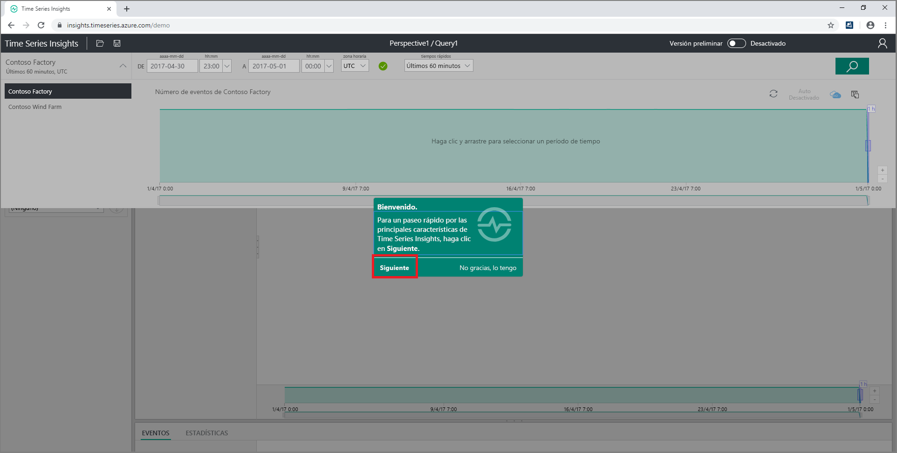
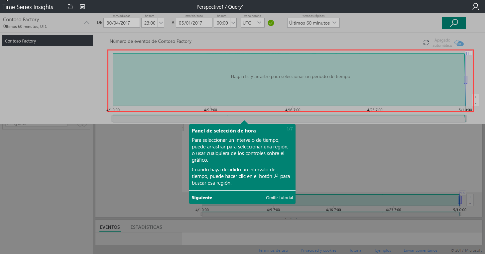
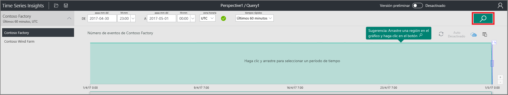
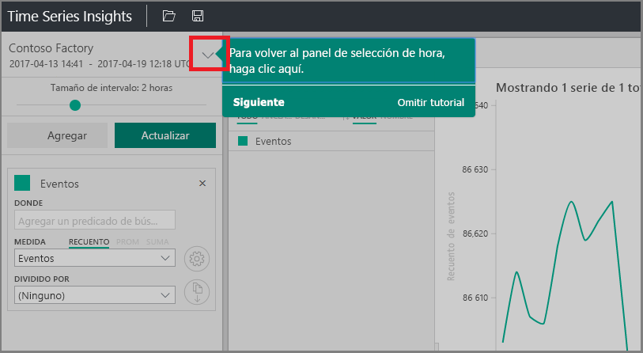
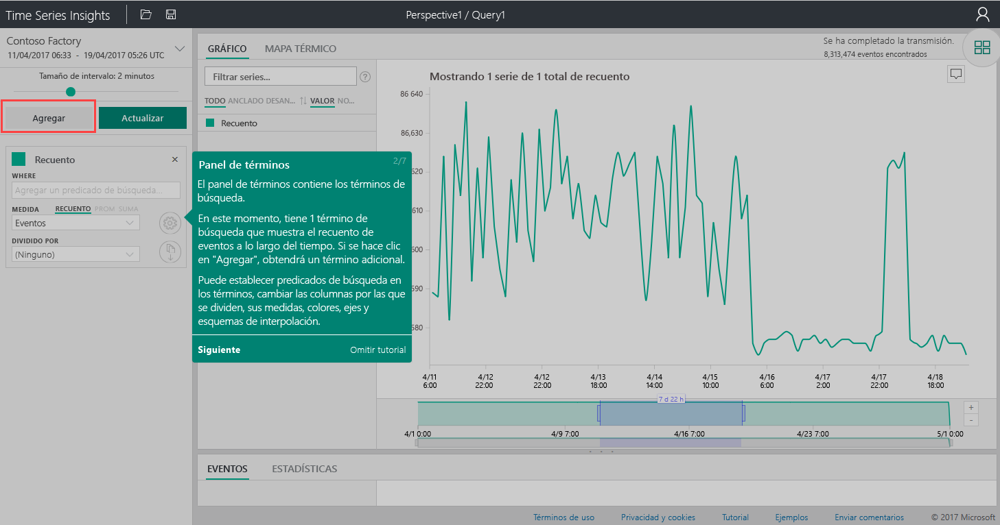
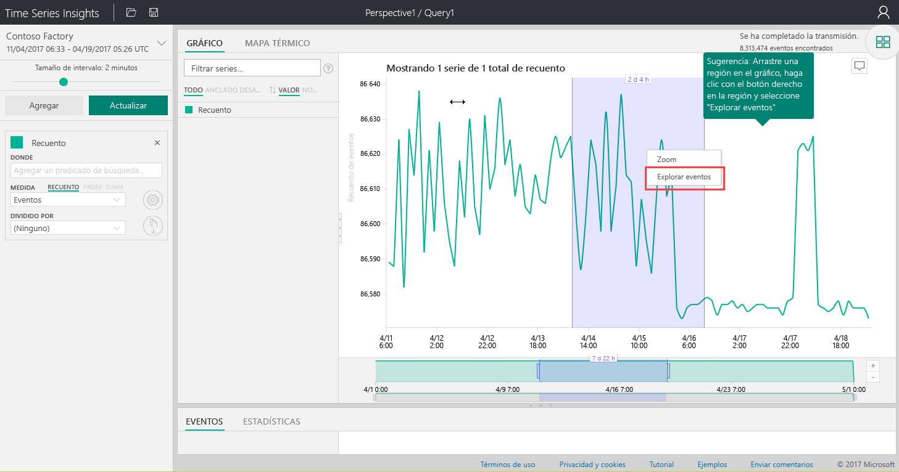
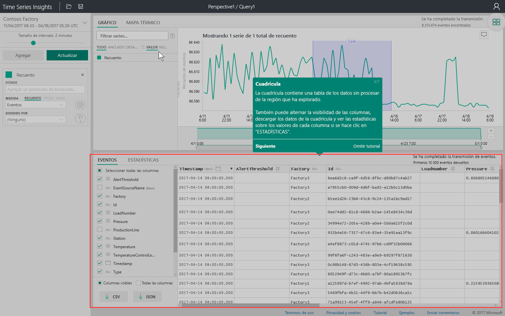
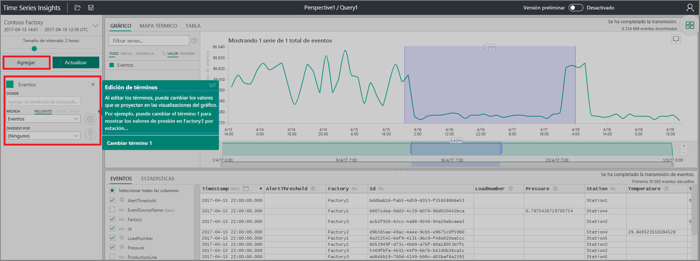
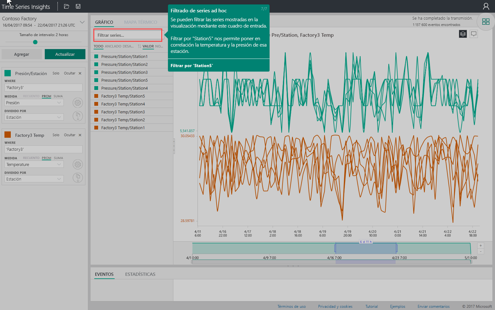

# Guía de inicio rápido: Exploración de Azure Time Series Insights

Este inicio rápido del explorador de Azure Time Series Insights muestra cómo empezar a trabajar con Time Series Insights en un entorno de demostración gratuito. Con él, aprenderá a usar el explorador web para visualizar grandes volúmenes de datos de IoT y recorrerá las características clave que están disponibles de forma general en la actualidad.

Azure Time Series Insights es un servicio de análisis, almacenamiento y administración totalmente administrado que facilita el análisis y la exploración de miles de millones de eventos de IoT de forma simultánea. Proporciona una visión global de los datos, con el fin de que se pueda validar rápidamente la solución de IoT y evitar el costoso tiempo de inactividad de los dispositivos críticos. Azure Time Series Insights facilita la detección de las tendencias ocultas, descubrir anomalías y realizar análisis de causa principal casi en tiempo real.

Para mayor flexibilidad, Azure Time Series Insights se puede agregar a una aplicación existente previamente mediante sus eficaces [API REST](./time-series-insights-update-tsq.md) y [SDK de cliente](./tutorial-create-tsi-sample-spa.md). Las API se pueden usar para almacenar, consultar y consumir datos de series temporales de la aplicación cliente que prefiera. También se puede usar el SDK de cliente para agregar los componentes de la interfaz de usuario a la aplicación existente.

En este inicio rápido del explorador de Time Series Insights se ofrece un recorrido guiado por las características que ya están disponibles con carácter general.

> [!IMPORTANT]
> Si no tiene ninguna, cree una [cuenta gratuita de Azure](https://azure.microsoft.com/free/?ref=microsoft.com&utm_source=microsoft.com&utm_medium=docs&utm_campaign=visualstudio).

## Preparación del entorno de demostración

1. En el explorador, vaya a la [demostración de la disponibilidad general](https://insights.timeseries.azure.com/demo).

1. Si se le solicita, inicie sesión en el explorador de Time Series Insights mediante las credenciales de la cuenta de Azure.

1. Aparece una página con un recorrido rápido por Time Series Insights. Seleccione **Siguiente** para comenzar el recorrido rápido.

   

## Exploración del entorno de demostración

1. Aparece el **panel de selección de hora**. Use este panel para seleccionar un período de tiempo que se va a visualizar.

   

1. Seleccione un período de tiempo y arrástrelo en la región. Luego, seleccione **Buscar**.

   

   Time Series Insights muestra una visualización de gráfico para el período de tiempo que especificó. Puede realizar diversas acciones en el gráfico de líneas. Por ejemplo, puede filtrar, anclar, ordenar y apilar.

   Para volver al **panel de selección de hora**, seleccione la flecha hacia abajo como se muestra a continuación:

   

1. Seleccione **Agregar** en el **panel de términos** para agregar un término de búsqueda nuevo.

   

1. En el gráfico, puede seleccionar una región, hacer clic con el botón derecho en la región y seleccionar **Explorar eventos**.

   

   Se muestra una cuadrícula de los datos sin procesar de la región que explora.

   

## Seleccionar y filtrar datos

1. Edite los términos para cambiar los valores del gráfico. Agregue otro término para establecer una correlación entre distintos tipos de valores.

   

1. Escriba un término de filtro en el cuadro **Filtrar series** para el filtrado de series improvisado. En esta guía de inicio rápido, escriba **Station5** para correlacionar la temperatura y la presión de esa estación.

   

Cuando termine la guía de inicio rápido, podrá experimentar con el conjunto de datos de ejemplo para crear visualizaciones distintas.

## Limpieza de recursos

Ahora que ha completado el tutorial, limpie los recursos que ha creado:

1. En el menú de la izquierda de [Azure Portal](https://portal.azure.com), seleccione **Todos los recursos** y busque el grupo de recursos de Azure Time Series Insights.
1. Seleccione **Eliminar** para eliminar todo el grupo de recursos (y todos los recursos que contiene), o quite los recursos de uno en uno.

## Pasos siguientes

Ya está listo para crear su propio entorno de Time Series Insights:
> [!div class="nextstepaction"]
> [Planeamiento del entorno de Time Series Insights](time-series-insights-environment-planning.md)
