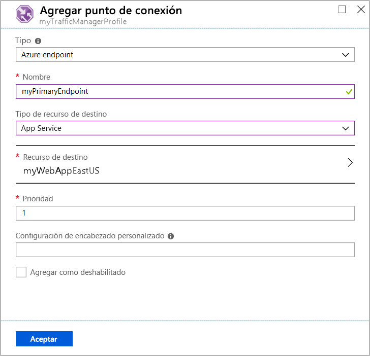
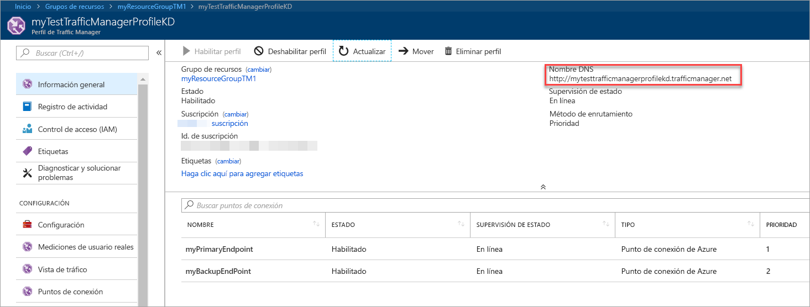
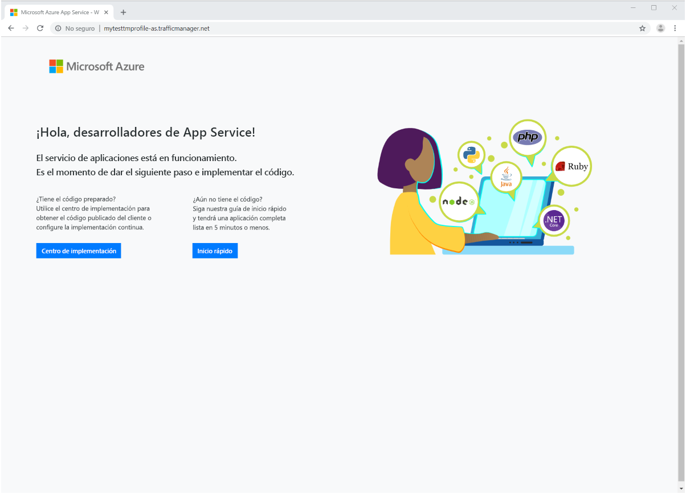

# Inicio rápido: Creación de un perfil de Traffic Manager mediante Azure Portal

En esta guía de inicio rápido se describe cómo crear un perfil de Traffic Manager que ofrece alta disponibilidad para la aplicación web.

En esta guía de inicio rápido, obtendrá información sobre dos instancias de una aplicación web. Cada una de ellas se ejecuta en una región de Azure distinta. Creará un perfil de Traffic Manager según la [prioridad del punto de conexión](traffic-manager-routing-methods.md#priority-traffic-routing-method). El perfil dirige el tráfico de usuario al sitio principal que ejecuta la aplicación web. Traffic Manager supervisa continuamente la aplicación web. Si el sitio principal no está disponible, proporciona la conmutación automática por error al sitio de copia de seguridad.

Si no tiene una suscripción a Azure, cree una [cuenta gratuita](https://azure.microsoft.com/free/?WT.mc_id=A261C142F) ahora.

## Inicio de sesión en Azure

Inicie sesión en [Azure Portal](https://portal.azure.com).

## Prerequisites

Esta guía de inicio rápido requiere que haya implementado dos instancias de una aplicación web en dos regiones de Azure distintas (*Este de EE. UU.* y *Oeste de Europa*). Cada una de ellas servirá como los puntos de conexión principal y de conmutación por error de Traffic Manager.

1. En la parte superior izquierda de la pantalla, seleccione **Crear un recurso** > **Web** > **Aplicación web**.

1. En **Crear una aplicación web**, escriba o seleccione los valores siguientes en la pestaña **Aspectos básicos**:

   - **Suscripción** > **Grupo de recursos**: Seleccione **Crear nuevo** y, a continuación, escriba **myResourceGroupTM1**.
   - **Detalles de instancia** > **Nombre**: Escriba *myWebAppEastUS*.
   - **Detalles de instancia** > **Publicar**: Seleccione **Código**.
   - **Detalles de instancia** > **Pila de runtime**: Seleccione **ASP.NET V4.7**.
   - **Detalles de instancia** > **Sistema operativo**: Seleccione **Windows**.
   - **Detalles de instancia** > **Región**:  Seleccione **Este de EE. UU**.
   - **Plan de App Service** > **Plan de Windows (Este de EE. UU.)** : Seleccione **Crear nuevo** y, a continuación, escriba **myAppServicePlanEastUS**.
   - **Plan de App Service** > **SKU y tamaño**: Seleccione **Estándar S1**.
   
3. Seleccione la pestaña **Supervisión** o **Siguiente: supervisión**.  En **Supervisión**, establezca **Application Insights** > **Habilitar Application Insights** en **No**.

4. Seleccione **Revisar y crear**.

5. Revise la configuración y, luego, haga clic en **Crear**.  Cuando la aplicación web se implementa correctamente, crea un sitio web predeterminado.

6. Siga los pasos para crear una segunda aplicación web denominada *myWebAppWestEurope*, con un **grupo de recursos** llamado *myResourceGroupTM2*, una **región** de *Oeste de Europa*, un **plan de App Service** llamado **myAppServicePlanWestEurope** y todos los demás valores iguales a los de *myWebAppEastUS*.

## Crear un perfil de Traffic Manager

Cree un perfil de Traffic Manager que dirija el tráfico de los usuarios según la prioridad del punto de conexión.

1. En la parte superior izquierda de la pantalla, seleccione **Crear un recurso** > **Redes** > **Perfil de Traffic Manager**.
2. En **Crear perfil de Traffic Manager**, escriba o seleccione estos valores:

    | Configuración | Value |
    | --------| ----- |
    | Nombre | Escriba un nombre único para el perfil de Traffic Manager.|
    | Método de enrutamiento | Seleccione **Prioridad**.|
    | Subscription | Seleccione la suscripción en la que desea aplicar el perfil de Traffic Manager. |
    | Resource group | Seleccione *myResourceGroupTM1*.|
    | Location |Este valor hace referencia a la ubicación del grupo de recursos. No tiene ningún efecto sobre el perfil de Traffic Manager que se implementará globalmente.|

3. Seleccione **Crear**.

## Incorporación de puntos de conexión de Traffic Manager

Agregue el sitio web en la región *Este de EE. UU.* como punto de conexión principal para enrutar todo el tráfico de usuario. Agregue el sitio web de *Oeste de Europa* como un punto de conexión de conmutación por error. Cuando el punto de conexión principal no está disponible, el tráfico se enruta automáticamente al punto de conexión de conmutación por error.

1. En la barra de búsqueda del portal, escriba el nombre del perfil de Traffic Manager que creó en la sección anterior.
2. Seleccione el perfil en los resultados de la búsqueda.
3. En **Perfil de Traffic Manager**, en la sección **Configuración**, seleccione **Puntos de conexión** y, a continuación, seleccione **Agregar**.
4. Escriba o seleccione estas opciones:

    | Configuración | Value |
    | ------- | ------|
    | Tipo | Seleccione **Punto de conexión de Azure**. |
    | Nombre | Escriba *myPrimaryEndpoint*. |
    | Tipo de recurso de destino | Seleccione **App Service**. |
    | Recurso de destino | Seleccione **Elegir un servicio de aplicaciones** > **Este de EE. UU.** |
    | Priority | Seleccione **1**. Todo el tráfico se dirige a este punto de conexión cuando está en buen estado. |

    

5. Seleccione **Aceptar**.
6. Para crear un punto de conexión de conmutación por error para la segunda región de Azure, repita los pasos 3 y 4 con esta configuración:

    | Configuración | Value |
    | ------- | ------|
    | Tipo | Seleccione **Punto de conexión de Azure**. |
    | Nombre | Escriba *myFailoverEndpoint*. |
    | Tipo de recurso de destino | Seleccione **App Service**. |
    | Recurso de destino | Seleccione **Elegir un servicio de aplicaciones** > **Oeste de Europa**. |
    | Priority | Seleccione **2**. Todo el tráfico se dirige a este punto de conexión de conmutación por error si el punto de conexión principal no está en estado correcto. |

7. Seleccione **Aceptar**.

Cuando haya terminado la adición de los dos puntos de conexión, estos se muestran en **Perfil de Traffic Manager**. Observe que el estado de supervisión ahora es **En línea**.

## Prueba del perfil de Traffic Manager

En esta sección, comprobará el nombre de dominio del perfil de Traffic Manager. También configurará el punto de conexión principal para que no esté disponible. Por último, podrá ver que la aplicación web sigue estando disponible. Se debe a que Traffic Manager envía el tráfico al punto de conexión de conmutación por error.

### Comprobación del nombre DNS

1. En la barra de búsqueda del portal, busque el nombre del **perfil de Traffic Manager** que creó en la sección anterior.
2. Seleccione el perfil de Traffic Manager. Aparece la página **Información general**.
3. La hoja **Perfil de Traffic Manager** muestra el nombre DNS del perfil de Traffic Manager que acaba de crear.
  
   

### Ver a Traffic Manager en acción

1. En un explorador web, escriba el nombre DNS del perfil de Traffic Manager para ver el sitio web predeterminado de la aplicación web.

    > [!NOTE]
    > En el escenario de esta guía de inicio rápido, todas las solicitudes se enrutan al punto de conexión principal. Se ha establecido en **Prioridad 1**.

    

2. Para ver la conmutación por error de Traffic Manager en acción, deshabilite el sitio principal:
    1. En la página Perfil de Traffic Manager, en la sección **Información general**, seleccione **myPrimaryEndpoint**.
    2. En *myPrimaryEndpoint*, seleccione **Deshabilitado** > **Guardar**.
    3. Cierre **myPrimaryEndpoint**. Observe que el estado ahora es **Deshabilitado**.
3. Copie el nombre DNS del perfil de Traffic Manager del paso anterior para ver el sitio web en una nueva sesión del explorador web.
4. Compruebe que la aplicación web sigue estando disponible.

El punto de conexión principal no está disponible, por lo que se ha enrutado al punto de conexión de conmutación por error.

## Limpieza de recursos

Cuando ya no los necesite, elimine los grupos de recursos, las aplicaciones web y todos los recursos relacionados. Para ello, seleccione cada elemento individual en el panel y seleccione **Eliminar** en la parte superior de cada página.

## Pasos siguientes

En esta guía de inicio rápido, ha creado un perfil de Traffic Manager. Le permite dirigir el tráfico de usuario para aplicaciones web de alta disponibilidad. Para más información sobre el enrutamiento del tráfico, continúe con los tutoriales de Traffic Manager.

> [!div class="nextstepaction"]
> [Tutoriales de Traffic Manager](tutorial-traffic-manager-improve-website-response.md)
