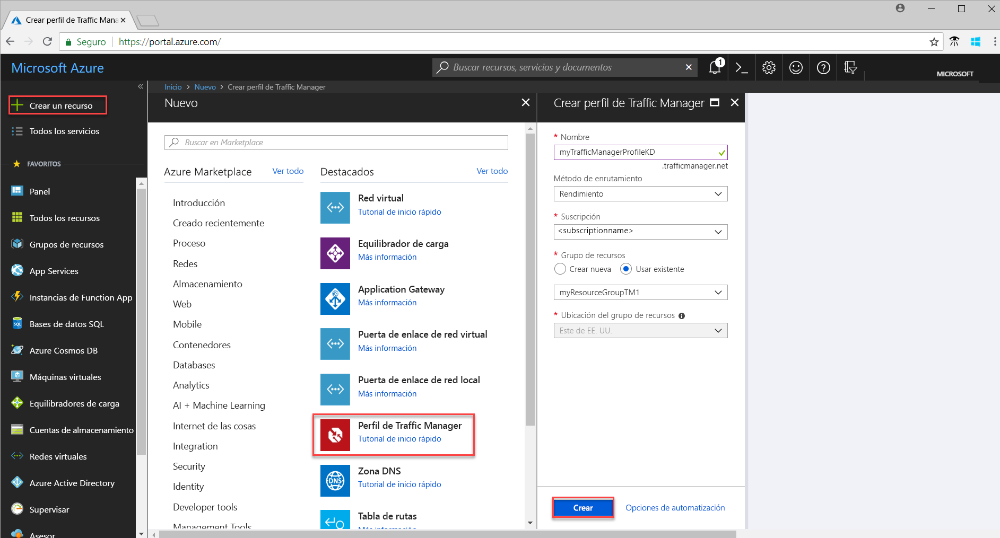
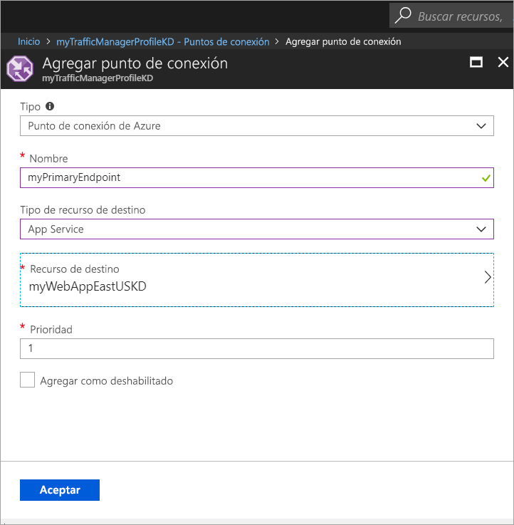

# Guía de inicio rápido: Creación de un perfil de Traffic Manager para una aplicación web de alta disponibilidad

En esta guía de inicio rápido se describe cómo crear un perfil de Traffic Manager que ofrece alta disponibilidad para la aplicación web. 

El escenario descrito en esta guía de inicio rápido incluye dos instancias de una aplicación web que se ejecutan en regiones diferentes de Azure. Se crea un perfil de Traffic Manager basado en la [prioridad del punto de conexión](traffic-manager-routing-methods.md#priority) que ayuda a dirigir el tráfico de los usuarios al sitio principal que ejecuta la aplicación. Traffic Manager supervisa continuamente la aplicación web y proporciona conmutación por error automática al sitio de copia de seguridad cuando el sitio principal no está disponible.

Si no tiene una suscripción a Azure, cree una [cuenta gratuita](https://azure.microsoft.com/free/?WT.mc_id=A261C142F) antes de empezar.

## Inicio de sesión en Azure 
Inicie sesión en Azure Portal en https://portal.azure.com.

## Requisitos previos
Esta guía de inicio rápido requiere implementar dos instancias de una aplicación web que se ejecuten en distintas regiones de Azure (*Este de EE. UU.* y *Europa Occidental*). Las dos instancias de la aplicación web sirven como puntos de conexión principal y de copia de seguridad para Traffic Manager.

1. En la parte superior izquierda de la pantalla, seleccione **Crear un recurso** > **Web** > **Aplicación web** > **Crear** .
2. En **Aplicación web**, escriba o seleccione la información siguiente y especifique la configuración predeterminada cuando no se especifica ninguna:

     | Configuración         | Valor     |
     | ---              | ---  |
     | NOMBRE           | Escriba un nombre único para la aplicación web  |
     | Grupos de recursos          | Seleccione **Nuevo** y, a continuación, escriba *myResourceGroupTM1* |
     | Plan de App Service/Ubicación         | Seleccione **Nuevo**.  En el plan de App Service, escriba *myAppServicePlanEastUS* y, a continuación, seleccione **Aceptar**. 
     |      Ubicación  |   Este de EE. UU        |
    |||

3. Seleccione **Crear**.
4. Cuando la aplicación web se implementa correctamente, se crea un sitio web predeterminado.
5. Repita los pasos 1 a 3 para crear un segundo sitio web en otra región de Azure con la configuración siguiente:

     | Configuración         | Valor     |
     | ---              | ---  |
     | NOMBRE           | Escriba un nombre único para la aplicación web  |
     | Grupos de recursos          | Seleccione **Nuevo** y, a continuación, escriba *myResourceGroupTM2* |
     | Plan de App Service/Ubicación         | Seleccione **Nuevo**.  En el plan de App Service, escriba *myAppServicePlanWestEurope* y, a continuación, seleccione **Aceptar**. 
     |      Ubicación  |   Europa occidental      |
    |||

## Crear un perfil de Traffic Manager
Cree un perfil de Traffic manager que dirija el tráfico de los usuarios según la prioridad del punto de conexión.

1. En la parte superior izquierda de la pantalla, seleccione **Crear un recurso** > **Redes** > **Perfil de Traffic Manager** > **Crear**.
2. En **Crear perfil de Traffic Manager**, escriba o seleccione la siguiente información, acepte los valores predeterminados para el resto de la configuración y, a continuación, seleccione **Crear**:
    
    | Configuración                 | Valor                                              |
    | ---                     | ---                                                |
    | NOMBRE                   | Este nombre debe ser único en la zona trafficmanager.net y generará el nombre DNS **trafficmanager.net** que se usa para acceder al perfil de Traffic Manager.|
    | Método de enrutamiento          | Seleccione el método de enrutamiento **Prioridad**.|
    | Subscription            | Seleccione su suscripción.|
    | Grupos de recursos          | Seleccione **Existente** y, a continuación, seleccione *myResourceGroupTM1*.|
    |Ubicación |Esta configuración se refiere a la ubicación del grupo de recursos y no tiene efecto alguno sobre el perfil de Traffic Manager que se implementará globalmente.|
    |||
    
    
   

## Incorporación de puntos de conexión de Traffic Manager

Agregue el sitio web en la región *Este de EE. UU.* como punto de conexión principal para enrutar todo el tráfico de usuario. Agregue el sitio web en *Europa Occidental* como un punto de conexión de copia de seguridad. Cuando el punto de conexión principal no está disponible, el tráfico se enruta automáticamente al punto de conexión secundario.

1. En la barra de búsqueda del portal, busque el nombre del perfil de Traffic Manager que creó en la sección anterior y seleccione el perfil en los resultados que aparecen.
2. En **perfil de Traffic Manager**, en la sección **Configuración**, haga clic en **Puntos de conexión** y, a continuación, haga clic en **Agregar**.
3. Escriba o seleccione la siguiente información, acepte los valores predeterminados para el resto de la configuración y luego seleccione **Aceptar**:

    | Configuración                 | Valor                                              |
    | ---                     | ---                                                |
    | Escriba                    | Punto de conexión de Azure                                   |
    | NOMBRE           | myPrimaryEndpoint                                        |
    | Tipo de recurso de destino           | App Service                          |
    | Recurso de destino          | **Elija una instancia de App Service** para mostrar la lista de las aplicaciones web de la misma suscripción. En **Recursos**, elija el servicio de aplicación que quiere agregar como el primer punto de conexión. |
    | Prioridad               | Seleccione **1**. Esto hace que todo el tráfico vaya a este punto de conexión si funciona correctamente.    |
    
4. Repita los pasos 2 y 3 para el próximo punto de conexión de Web Apps. Asegúrese de agregarlo con el valor de **prioridad** establecido en **2**.
5.  Cuando termine de agregar ambos puntos de conexión, aparecerán en **Perfil de Traffic Manager** junto con el estado de supervisión como **En línea**.

    

## Prueba del perfil de Traffic Manager
En esta sección, primero se determina el nombre de dominio del perfil de Traffic Manager y, a continuación, se observa cómo Traffic Manager realiza la conmutación por error al punto de conexión secundario cuando el punto de conexión principal no está disponible.
### Determinación del nombre DNS
1.  En la barra de búsqueda del portal, busque el nombre del **perfil de Traffic Manager** que creó en la sección anterior. Haga clic en el perfil de Traffic Manager en los resultados que aparezcan.
2. Haga clic en **Descripción general**.
3. La hoja **Perfil de Traffic Manager** muestra el nombre DNS del perfil de Traffic Manager que acaba de crear.
  
   

### Vista de Traffic Manager en acción

1. En un explorador web, escriba el nombre DNS del perfil de Traffic Manager para ver el sitio web predeterminado de la aplicación web. En este escenario de la guía de inicio rápido, todas las solicitudes se enrutan al punto de conexión principal, que se establece en **Prioridad 1**.

2. Para ver la conmutación por error de Traffic Manager en acción, deshabilite el sitio principal como se indica a continuación:
    1. En la página del perfil de Traffic Manager, seleccione **Configuración**>**Puntos de conexión**>*MyPrimaryEndpoint*.
    2. En *MyPrimaryEndpoint*, seleccione **Deshabilitado**. 
    3. El estado del punto de conexión principal *MyPrimaryEndpoint* ahora se muestra como **Deshabilitado**.
3. Copie el nombre DNS del perfil de Traffic Manager del paso anterior para ver correctamente el sitio web en un explorador web. Cuando se deshabilita el punto de conexión principal, el tráfico de usuario se enruta al punto de conexión secundario.

## Limpieza de recursos
Cuando ya no los necesite, elimine el grupo de recursos, las aplicaciones web y todos los recursos relacionados. Para ello, seleccione los grupos de recursos (*myResourceGroupTM1* y *myResourceGroupTM2*) y haga clic en **Eliminar**.

## Pasos siguientes
En esta guía de inicio rápido, ha creado un perfil de Traffic Manager que le permite dirigir el tráfico de usuario de la aplicación web de alta disponibilidad. Para más información sobre el enrutamiento del tráfico, continúe con los tutoriales de Traffic Manager.

> [!div class="nextstepaction"]
> [Tutoriales de Traffic Manager](tutorial-traffic-manager-improve-website-response.md)

