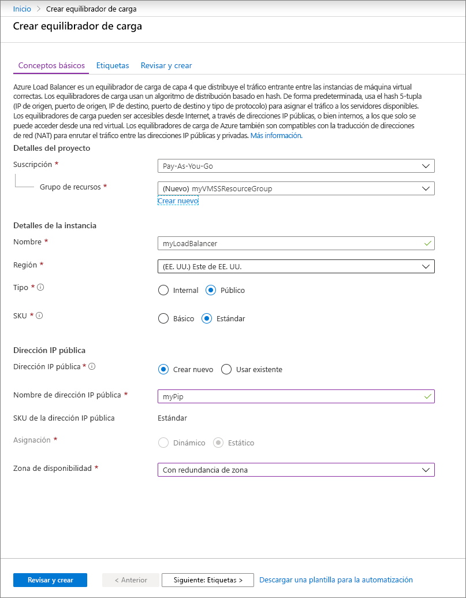
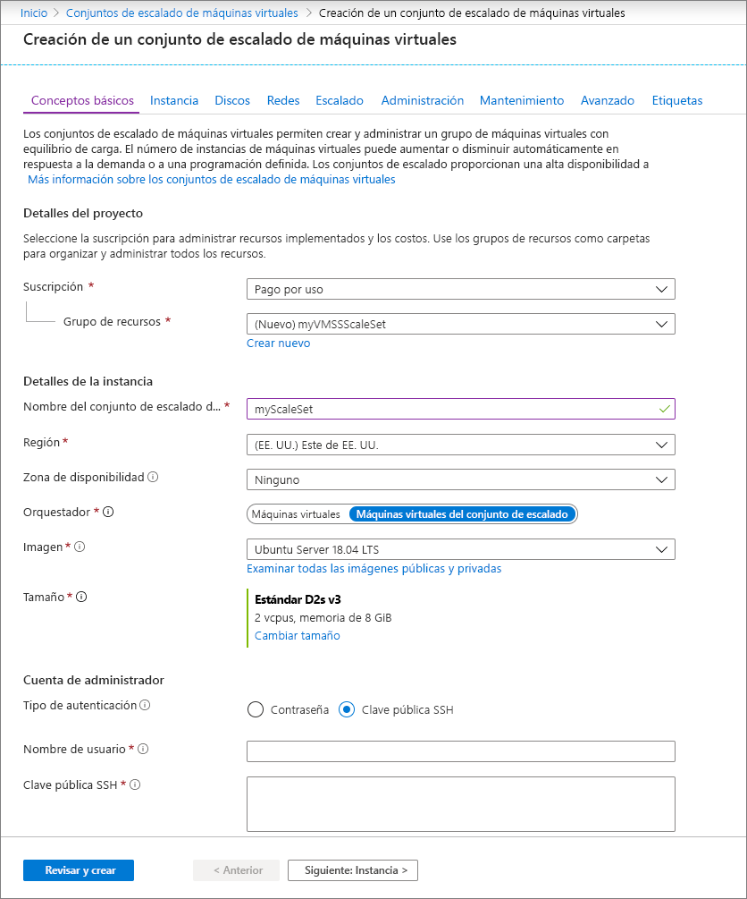

# Inicio rápido: Creación de un conjunto de escalado de máquinas virtuales en Azure Portal

El conjunto de escalado de máquinas virtuales le permite implementar y administrar un conjunto de máquinas virtuales de escalado automático idénticas. Puede escalar el número de máquinas virtuales del conjunto de escalado manualmente o definir reglas de escalado automático según el uso de recursos tales como la CPU, la demanda de memoria o el tráfico de red. Un equilibrador de carga de Azure distribuirá el tráfico a las instancias de máquina virtual del conjunto de escalado. En esta guía de inicio rápido se crea un conjunto de escalado de máquinas virtuales en Azure Portal.

Si no tiene una suscripción a Azure, cree una [cuenta gratuita](https://azure.microsoft.com/free/?WT.mc_id=A261C142F) antes de empezar.

## Inicio de sesión en Azure
Inicie sesión en Azure Portal en https://portal.azure.com.

## Creación de un equilibrador de carga

El [equilibrador de carga](../load-balancer/load-balancer-overview.md) de Azure distribuye el tráfico entrante entre las instancias de máquina virtual en estado correcto. 

En primer lugar, cree un equilibrador de carga básico público desde el portal. El nombre y la dirección IP que crea se configuran automáticamente como el front-end del equilibrador de carga.

1. En el cuadro de búsqueda, escriba **equilibrador de carga**. En **Marketplace**, en los resultados de la búsqueda, seleccione **Equilibradores de carga**.
1. En la pestaña **Conceptos básicos** de la página **Crear equilibrador de carga**, escriba o seleccione la siguiente información:

    | Configuración                 | Value   |
    | ---| ---|
    | Subscription  | Seleccione su suscripción.    |    
    | Resource group | Seleccione **Crear nuevo** y escriba *myVMSSResourceGroup* en el cuadro de texto.|
    | Nombre           | *myLoadBalancer*         |
    | Region         | Seleccione **Este de EE. UU**.       |
    | Tipo          | Seleccione **Público**.       |
    | SKU           | Seleccione **Estándar**.       |
    | Dirección IP pública | Seleccione **Crear nuevo**. |
    | Nombre de la dirección IP pública  | *MyPip*   |
    | Asignación| estática |

1. Cuando haya terminado, seleccione **Revisar y crear**. 
1. Una vez que pasa la validación, seleccione **Crear**. 

## Creación de un conjunto de escalado de máquinas virtuales
Puede implementar un conjunto de escalado con una imagen de Windows Server o Linux como RHEL, CentOS, Ubuntu o SLES.

1. Escriba **Conjunto de escalado** en el cuadro de búsqueda. En los resultados, en **Marketplace**, seleccione **Conjuntos de escalado de máquinas virtuales**. Se abre la página **Crear un conjunto de escalado de máquinas virtuales**. 
1. En la pestaña **Aspectos básicos**, en **Detalles del proyecto**, asegúrese de que esté seleccionada la suscripción correcta y luego elija **Crear nuevo** grupo de recursos. Escriba *myVMSSResourceGroup* para el nombre y seleccione **Aceptar**. 
1. Escriba *myScaleSet* como el nombre del conjunto de escalado.
1. En **Región**, seleccione una región cercana a su área.
1. Deje el valor predeterminado de **Máquinas virtuales del conjunto de escalado** para **Orquestador**.
1. Seleccione una imagen de Marketplace para **imagen**. En este ejemplo, hemos elegido *Ubuntu Server 18.04 LTS*.
1. Escriba el nombre de usuario que quiera y seleccione el tipo de autenticación que desee.
   - La **contraseña** debe tener 12 caracteres como mínimo y reunir, al menos, tres de los cuatro requisitos de complejidad siguientes: contener al menos una minúscula, una mayúscula, un número y un carácter especial. Para más información, consulte la sección acerca de los [requisitos de nombre de usuario y contraseña](../virtual-machines/windows/faq.md#what-are-the-username-requirements-when-creating-a-vm).
   - Si selecciona una imagen de disco del sistema operativo Linux, puede elegir su **clave pública SSH** en su lugar. Proporcione solo su clave pública, como *~/.ssh/id_rsa.pub*. Puede usar Azure Cloud Shell del portal para [crear y utilizar claves SSH](../virtual-machines/linux/mac-create-ssh-keys.md).
   
    

1. Seleccione **Siguiente** para pasar a las otras páginas. 
1. Deje los valores predeterminados para las páginas **Instancia** y **Discos**.
1. En la página **Redes**, en **Equilibrio de carga**, seleccione **Sí** para colocar las instancias del conjunto de escalado detrás de un equilibrador de carga. 
1. En **Opciones de equilibrio de carga**, seleccione **Azure Load Balancer**.
1. En **Seleccionar un equilibrador de carga**, seleccione *myLoadBalancer* que ha creado antes.
1. En **Select a backend pool** (Seleccionar un grupo de back-end), seleccione **Create new** (Crear nuevo), escriba *MyBackendPool* y seleccione **Create** (Crear).
1. Cuando haya terminado, seleccione **Revisar y crear**. 
1. Después de pasar la validación, seleccione **Crear** para implementar el conjunto de escalado.

## Limpieza de recursos
Cuando ya no los necesite, elimine el grupo de recursos, el conjunto de escalado y todos los recursos relacionados. Para ello, seleccione el grupo de recursos del conjunto de escalado y seleccione **Eliminar**.

## Pasos siguientes
En esta guía de inicio rápido creó un conjunto de escalado de básico en Azure Portal. Para más información, continúe con el tutorial sobre cómo crear y administrar conjuntos de escalado de máquinas virtuales de Azure.

> [!div class="nextstepaction"]
> [Creación y administración de conjuntos de escalado de máquinas virtuales de Azure](tutorial-create-and-manage-powershell.md)
