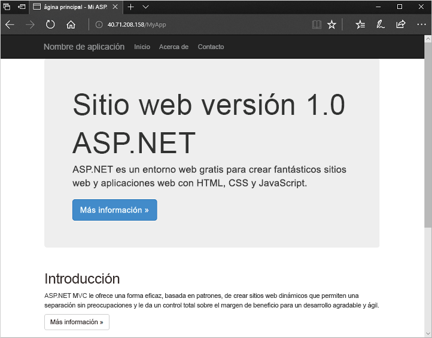

# <a name="quickstart-create-a-virtual-machine-scale-set-with-azure-powershell"></a>Inicio rápido: Creación de un conjunto de escalado de máquinas virtuales con Azure PowerShell


Un conjunto de escalado de máquinas virtuales le permite implementar y administrar un conjunto de máquinas virtuales de escalado automático idénticas. Puede escalar el número de máquinas virtuales del conjunto de escalado manualmente o definir reglas de escalado automático según el uso de recursos tales como la CPU, la demanda de memoria o el tráfico de red. Un equilibrador de carga de Azure distribuirá el tráfico a las instancias de máquina virtual del conjunto de escalado. En esta guía de inicio rápido, creará un conjunto de escalado de máquinas virtuales e implementará una aplicación de ejemplo con Azure PowerShell.

Si no tiene una suscripción a Azure, cree una [cuenta gratuita](https://azure.microsoft.com/free/?WT.mc_id=A261C142F) antes de empezar.

[!INCLUDE [cloud-shell-try-it.md](../../includes/cloud-shell-try-it.md)]


## <a name="create-a-scale-set"></a>Creación de un conjunto de escalado
Para poder crear un conjunto de escalado, cree un grupo de recursos con [New-AzResourceGroup](/powershell/module/az.resources/new-azresourcegroup). En el ejemplo siguiente, se crea un grupo de recursos denominado *myResourceGroup* en la ubicación *eastus*:

```azurepowershell-interactive
New-AzResourceGroup -ResourceGroupName "myResourceGroup" -Location "EastUS"
```

Ahora, cree un conjunto de escalado de máquinas virtuales con [New-AzVmss](/powershell/module/az.compute/new-azvmss). En el ejemplo siguiente, se crea un conjunto de escalado denominado *myScaleSet* que usa la imagen de plataforma *Windows Server 2016 Datacenter*. Los recursos de red de Azure para una red virtual, una dirección IP pública y un equilibrador de carga se crean automáticamente. Cuando se le solicite, puede establecer sus propias credenciales administrativas para las instancias de máquina virtual del conjunto de escalado:

```azurepowershell-interactive
New-AzVmss `
  -ResourceGroupName "myResourceGroup" `
  -Location "EastUS" `
  -VMScaleSetName "myScaleSet" `
  -VirtualNetworkName "myVnet" `
  -SubnetName "mySubnet" `
  -PublicIpAddressName "myPublicIPAddress" `
  -LoadBalancerName "myLoadBalancer" `
  -UpgradePolicyMode "Automatic"
```

Se tardan unos minutos en crear y configurar todos los recursos de conjunto de escalado y máquinas virtuales.


## <a name="deploy-sample-application"></a>Implementación de una aplicación de ejemplo
Para probar el conjunto de escalado, instale una aplicación web básica. La extensión de script personalizado de Azure se usa para descargar y ejecutar un script que instala IIS en las instancias de máquina virtual. Esta extensión es útil para la configuración posterior a la implementación, la instalación de software o cualquier otra tarea de configuración o administración. Para obtener más información, consulte [Información general de la extensión de script personalizado](../virtual-machines/windows/extensions-customscript.md).

Use la extensión de script personalizado para instalar un servidor web de IIS básico. Aplique la extensión de script personalizada que instala IIS según se indica a continuación:

```azurepowershell-interactive
# Define the script for your Custom Script Extension to run
$publicSettings = @{
    "fileUris" = (,"https://raw.githubusercontent.com/Azure-Samples/compute-automation-configurations/master/automate-iis.ps1");
    "commandToExecute" = "powershell -ExecutionPolicy Unrestricted -File automate-iis.ps1"
}

# Get information about the scale set
$vmss = Get-AzVmss `
            -ResourceGroupName "myResourceGroup" `
            -VMScaleSetName "myScaleSet"

# Use Custom Script Extension to install IIS and configure basic website
Add-AzVmssExtension -VirtualMachineScaleSet $vmss `
    -Name "customScript" `
    -Publisher "Microsoft.Compute" `
    -Type "CustomScriptExtension" `
    -TypeHandlerVersion 1.8 `
    -Setting $publicSettings

# Update the scale set and apply the Custom Script Extension to the VM instances
Update-AzVmss `
    -ResourceGroupName "myResourceGroup" `
    -Name "myScaleSet" `
    -VirtualMachineScaleSet $vmss
```

## <a name="allow-traffic-to-application"></a>Permitir tráfico a la aplicación

 Para permitir el acceso a la aplicación web básica, cree un grupo de seguridad de red con [New-AzNetworkSecurityRuleConfig](/powershell/module/az.network/new-aznetworksecurityruleconfig) y [New-AzNetworkSecurityGroup](/powershell/module/az.network/new-aznetworksecuritygroup). Para más información, consulte [Redes para conjuntos de escalado de máquinas virtuales de Azure](virtual-machine-scale-sets-networking.md).

 ```azurepowershell-interactive
 # Get information about the scale set
 $vmss = Get-AzVmss `
             -ResourceGroupName "myResourceGroup" `
             -VMScaleSetName "myScaleSet"

 #Create a rule to allow traffic over port 80
 $nsgFrontendRule = New-AzNetworkSecurityRuleConfig `
   -Name myFrontendNSGRule `
   -Protocol Tcp `
   -Direction Inbound `
   -Priority 200 `
   -SourceAddressPrefix * `
   -SourcePortRange * `
   -DestinationAddressPrefix * `
   -DestinationPortRange 80 `
   -Access Allow

 #Create a network security group and associate it with the rule
 $nsgFrontend = New-AzNetworkSecurityGroup `
   -ResourceGroupName  "myResourceGroup" `
   -Location EastUS `
   -Name myFrontendNSG `
   -SecurityRules $nsgFrontendRule

 $vnet = Get-AzVirtualNetwork `
   -ResourceGroupName  "myResourceGroup" `
   -Name myVnet

 $frontendSubnet = $vnet.Subnets[0]

 $frontendSubnetConfig = Set-AzVirtualNetworkSubnetConfig `
   -VirtualNetwork $vnet `
   -Name mySubnet `
   -AddressPrefix $frontendSubnet.AddressPrefix `
   -NetworkSecurityGroup $nsgFrontend

 Set-AzVirtualNetwork -VirtualNetwork $vnet

 # Update the scale set and apply the Custom Script Extension to the VM instances
 Update-AzVmss `
     -ResourceGroupName "myResourceGroup" `
     -Name "myScaleSet" `
     -VirtualMachineScaleSet $vmss
 ```

## <a name="test-your-scale-set"></a>Prueba del conjunto de escalado
Para ver el conjunto de escalado en acción, acceda a la aplicación web de ejemplo en un explorador web. Obtenga la dirección IP pública del equilibrador de carga con [Get-AzPublicIpAddress](/powershell/module/az.network/get-azpublicipaddress). En el ejemplo siguiente se muestra la dirección IP que se creó en el grupo de recursos *myResourceGroup*:

```azurepowershell-interactive
Get-AzPublicIpAddress -ResourceGroupName "myResourceGroup" | Select IpAddress
```

Escriba la dirección IP pública del equilibrador de carga en un explorador web. El equilibrador de carga distribuye el tráfico a una de las instancias de VM, como se muestra en el ejemplo siguiente:




## <a name="clean-up-resources"></a>Limpieza de recursos
Cuando ya no lo necesite, puede usar el comando [Remove-AzResourceGroup](/powershell/module/az.resources/remove-azresourcegroup) para quitar el grupo de recursos, el conjunto de escalado y todos los recursos relacionados como se indica a continuación. El parámetro `-Force` confirma que desea eliminar los recursos sin pedir confirmación adicional. El parámetro `-AsJob` devuelve el control a la petición de confirmación sin esperar a que finalice la operación.

```azurepowershell-interactive
Remove-AzResourceGroup -Name "myResourceGroup" -Force -AsJob
```


## <a name="next-steps"></a>Pasos siguientes
En esta guía de inicio rápido, creó un conjunto de escalado básico y usó la extensión de script personalizado para instalar un servidor web IIS básico en las instancias de máquina virtual. Para más información, continúe con el tutorial sobre cómo crear y administrar conjuntos de escalado de máquinas virtuales de Azure.

> [!div class="nextstepaction"]
> [Creación y administración de conjuntos de escalado de máquinas virtuales de Azure](tutorial-create-and-manage-powershell.md)
