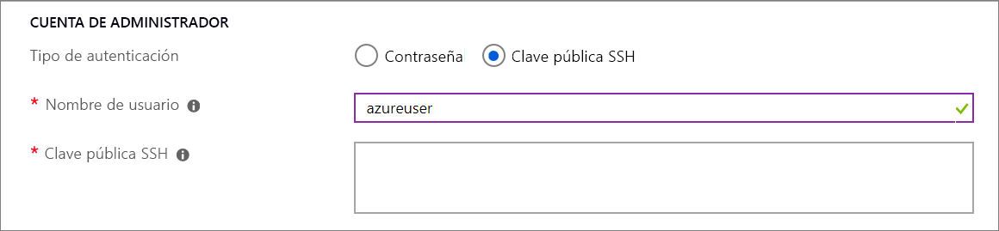

# implementación de máquinas virtuales en hosts dedicados mediante el portal

En este artículo se ofrecen instrucciones para crear un [host dedicado](dedicated-hosts.md) de Azure en el que se pueden hospedar máquinas virtuales (VM). 

[!INCLUDE [virtual-machines-common-dedicated-hosts-portal](../../../includes/virtual-machines-common-dedicated-hosts-portal.md)]

## Crear una VM

1. Elija **Crear un recurso** en la esquina superior izquierda de Azure Portal.
1. En el cuadro de búsqueda encima de la lista de recursos de Azure Marketplace, busque y seleccione **Ubuntu Server 16.04 LTS** de Canonical y, a continuación, elija **Crear**.
1. En la pestaña **Aspectos básicos**, en **Detalles del proyecto**, asegúrese de que esté seleccionada la suscripción correcta y luego seleccione *myDedicatedHostsRG* como **grupo de recursos**. 
1. En **Detalles de instancia**, escriba *myVM* en **Nombre de máquina virtual** y elija *Este de EE. UU.* como **Ubicación**.
1. En **Opciones de disponibilidad**, seleccione **Zona de disponibilidad** y seleccione *1* en la lista desplegable.
1. En cuanto al tamaño, seleccione **Cambiar tamaño**. En la lista de tamaños disponibles, elija uno de la serie Esv3, como **Standard E2s v3**. Es posible que tenga que borrar el filtro para poder ver todos los tamaños disponibles.
1. En **Cuenta de administrador**, seleccione **Clave pública SSH**, escriba el nombre de usuario y luego pegue la clave pública en el cuadro de texto. Quite los espacios en blanco finales o iniciales de la clave pública.

    

1. En **Reglas de puerto de entrada** > **Puertos de entrada públicos**, elija **Permitir los puertos seleccionados** y, luego, seleccione **SSH (22)** en la lista desplegable. 
1. En la parte superior de la página, seleccione la pestaña **Opciones avanzadas** y, en la sección **Host**, seleccione *myHostGroup* en **Grupo host** y *myHost* en **Host**. 
    
1. Deje los valores predeterminados restantes y luego seleccione el botón **Revisar + crear** en la parte inferior de la página.
1. Cuando vea el mensaje en el que se indica que la validación se ha realizado correctamente, seleccione **Crear**.

La implementación de la máquina virtual tardará unos minutos.

## Incorporación de una máquina virtual existente 

Es posible incorporar una máquina virtual existente a un host dedicado, pero para ello antes es preciso detenerla o desasignarla. Antes de mover una máquina virtual a un host dedicado, asegúrese de que se admite su configuración:

- El tamaño de la máquina virtual debe estar en la misma familia de tamaños que el host dedicado. Por ejemplo, si el host dedicado es DSv3, el tamaño de la máquina virtual puede ser Standard_D4s_v3, pero no Standard_A4_v2. 
- Es preciso que la máquina virtual se encuentre en la misma región que el host dedicado.
- La máquina virtual no puede formar parte de ningún grupo de ubicación por proximidad. Quite la máquina virtual del grupo de ubicación por proximidad antes de moverla a un host dedicado. Para más información, consulte [Traslado de una VM existente fuera de un grupo de selección de ubicación de proximidad](https://docs.microsoft.com/azure/virtual-machines/windows/proximity-placement-groups#move-an-existing-vm-out-of-a-proximity-placement-group)
- La máquina virtual no puede estar en un conjunto de disponibilidad.
- Si la máquina virtual está en una zona de disponibilidad, debe estar en la misma que el grupo host. Los valores de zona de disponibilidad de la máquina virtual y del grupo host deben coincidir.

Mueva la máquina virtual a un host dedicado desde el [portal](https://portal.azure.com).

1. Abra la página de la máquina virtual.
1. Seleccione **Stop** (Detener) para detener o desasignar la máquina virtual.
1. Seleccione **Configuration** (Configuración) en el menú de la izquierda.
1. Seleccione un grupo host y un host en los menús desplegables.
1. Cuando haya terminado, seleccione **Save** (Guardar) en la parte superior de la página.
1. Una vez que la máquina virtual se haya agregado al host, seleccione **Overview** (Información general) en el menú de la izquierda.
1. En la parte superior de la página, seleccione **Start** (Iniciar) para reiniciar la máquina virtual.

## Pasos siguientes

- Para obtener más detalles, consulte la introducción a los [hosts dedicados](dedicated-hosts.md).

- [Aquí](https://github.com/Azure/azure-quickstart-templates/blob/master/201-vm-dedicated-hosts/README.md) encontrará una plantilla de ejemplo en la que se usan zonas y dominios de error para obtener la máxima resistencia en una región.

- También puede implementar un host dedicado mediante la [CLI de Azure](dedicated-hosts-cli.md).

