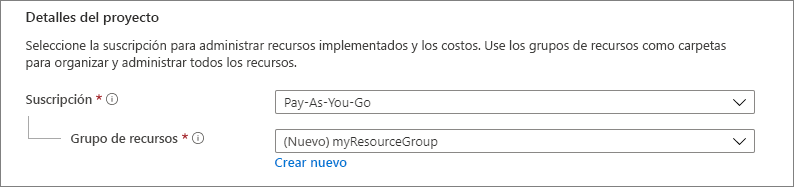
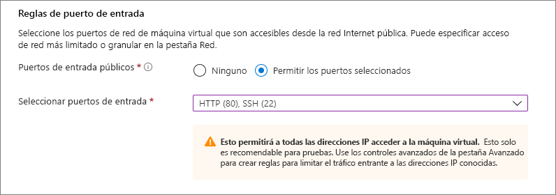
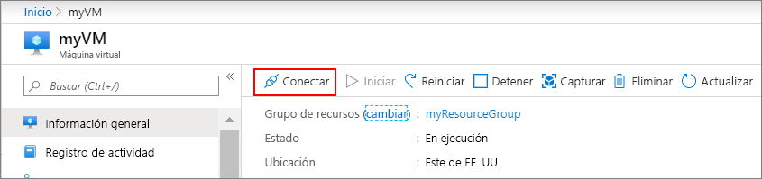

# <a name="quickstart-create-a-linux-virtual-machine-in-the-azure-portal"></a>Inicio rápido: Creación de una máquina virtual Linux en Azure Portal

Las máquinas virtuales de Azure pueden crearse mediante Azure Portal. Azure Portal es una interfaz de usuario basada en explorador para crear recursos de Azure. En este inicio rápido se muestra cómo usar Azure Portal para implementar una máquina virtual Linux en Azure que ejecuta Ubuntu 18.04 LTS. Para ver la máquina virtual en acción, conéctese a ella mediante SSH e instale el servidor web NGINX.

Si no tiene una suscripción a Azure, cree una [cuenta gratuita](https://azure.microsoft.com/free/?WT.mc_id=A261C142F) antes de empezar.

## <a name="create-ssh-key-pair"></a>Creación del par de claves SSH

Necesita un par de claves SSH para completar esta guía de inicio rápido. Si ya tiene un par de claves SSH, puede omitir este paso.

Abra un shell de Bash y utilice [ssh-keygen](https://www.ssh.com/ssh/keygen/) para crear un par de claves SSH. Si no tiene un shell de Bash en la máquina local, puede usar [Azure Cloud Shell](https://shell.azure.com/bash).


1. Inicie sesión en el [Azure Portal](https://portal.azure.com).
1. En el menú que aparece en la parte superior de la página, seleccione el icono `>_` para abrir Cloud Shell.
1. Asegúrese de que aparece **Bash** en la parte superior izquierda de Cloud Shell. Si aparece PowerShell, use la lista desplegable para seleccionar **Bash** y seleccione **Confirmar** para cambiar al shell de Bash.
1. Escriba `ssh-keygen -t rsa -b 2048` para crear la clave SSH. 
1. Se le pedirá que especifique un archivo en el que guardar el par de claves. Simplemente presione **Entrar** para guardar en la ubicación predeterminada, que se muestra entre corchetes. 
1. Se le pedirá que escriba una frase de contraseña. Puede escribir una frase de contraseña para la clave SSH o presionar **Entrar** para continuar sin una frase de contraseña.
1. El comando `ssh-keygen` genera claves públicas y privadas con el nombre predeterminado `id_rsa` en `~/.ssh directory`. El comando devuelve la ruta de acceso completa a la clave pública. Utilice la ruta de acceso a la clave pública para mostrar su contenido con `cat` escribiendo `cat ~/.ssh/id_rsa.pub`.
1. Copie el resultado de este comando y guárdelo en algún lugar para usarlo más adelante en este artículo. Esta es su clave pública, que necesitará al configurar la cuenta de administrador para iniciar sesión en la máquina virtual.

## <a name="sign-in-to-azure"></a>Inicio de sesión en Azure

Inicie sesión en [Azure Portal](https://portal.azure.com) si aún no lo ha hecho.

## <a name="create-virtual-machine"></a>Crear máquina virtual

1. Elija **Crear un recurso** en la esquina superior izquierda de Azure Portal.

1. En **Popular**, seleccione **Ubuntu Server 18.04 LTS**.

1. En la pestaña **Aspectos básicos**, en **Detalles del proyecto**, asegúrese de que esté seleccionada la suscripción correcta y luego elija **Crear nuevo** en **Grupo de recursos**. Escriba *myResourceGroup* para el nombre del grupo de recursos y luego elija **Aceptar**. 

    

1. En **Detalles de instancia**, escriba *myVM* en **Nombre de máquina virtual** y elija *Este de EE. UU.* como **Región**. Deje los demás valores predeterminados.

    

1. En **Cuenta de administrador**, seleccione **Clave pública SSH**, escriba el nombre de usuario y luego pegue la clave pública. Quite los espacios en blanco finales o iniciales de la clave pública.

    

1. En **Reglas de puerto de entrada** > **Puertos de entrada públicos**, elija **Permitir los puertos seleccionados** y luego seleccione **SSH (22)** y **HTTP (80)** en la lista desplegable. 

    

1. Deje los valores predeterminados restantes y luego seleccione el botón **Revisar + crear** en la parte inferior de la página.

1. En la página **Crear una máquina virtual** verá los detalles de la máquina virtual que va a crear. Cuando esté preparado, seleccione **Crear**.

La implementación de la máquina virtual tardará unos minutos. Cuando finalice la implementación, pase a la siguiente sección.

    
## <a name="connect-to-virtual-machine"></a>Conexión a la máquina virtual

Cree una conexión SSH con la máquina virtual.

1. Seleccione el botón **Conectar** en la página de información general de la máquina virtual. 

    

2. En la página **Conectarse a una máquina virtual**, mantenga las opciones predeterminadas para conectarse por la dirección IP a través del puerto 22. En **Login using VM local account** (Iniciar sesión mediante la cuenta local de máquina virtual), se muestra un comando de conexión. Seleccione el botón para copiar el comando. En el ejemplo siguiente se muestra el aspecto que tiene el comando de conexión SSH:

    ```bash
    ssh azureuser@10.111.12.123
    ```

3. Con el mismo shell de Bash que usó para crear el par de claves SSH (puede volver a abrir Cloud Shell seleccionando `>_` de nuevo o si va a https://shell.azure.com/bash) ) pegue el comando de conexión de SSH en el shell para crear una sesión de SSH.

## <a name="install-web-server"></a>Instalación del servidor web

Para ver la máquina virtual en acción, instale al servidor de web de NGINX. En la sesión de SSH, actualice los orígenes de paquete e instale el paquete NGINX más reciente.

```bash
sudo apt-get -y update
sudo apt-get -y install nginx
```

Cuando haya terminado, escriba `exit` para salir de la sesión de SSH.


## <a name="view-the-web-server-in-action"></a>Visualización del servidor web en acción

Use un explorador web de su elección para ver la página de bienvenida predeterminada de NGINX. Escriba la dirección IP pública de la máquina virtual como dirección web. La dirección IP pública se encuentra en la página de introducción de la máquina virtual o como parte de la cadena de conexión de SSH que usó anteriormente.


## <a name="clean-up-resources"></a>Limpieza de recursos

Cuando ya no los necesite, puede eliminar el grupo de recursos, la máquina virtual y todos los recursos relacionados. Para ello, seleccione el grupo de recursos de la máquina virtual, seleccione **Eliminar** y luego confirme el nombre del grupo de recursos para eliminar.

## <a name="next-steps"></a>Pasos siguientes

En esta guía de inicio rápido, implementó una máquina virtual sencilla, creó un grupo de seguridad de red y una regla e instaló un servidor web básico. Para más información acerca de las máquinas virtuales de Azure, continúe con el tutorial de máquinas virtuales Linux.

> [!div class="nextstepaction"]
> [Tutoriales de máquinas virtuales Linux de Azure](./tutorial-manage-vm.md)
