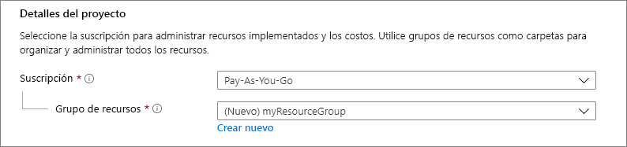
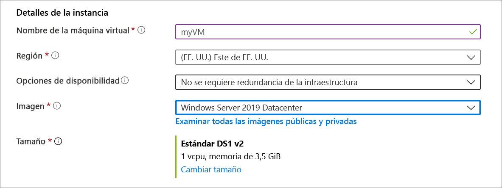
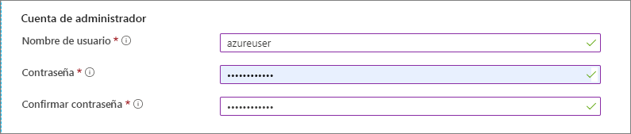
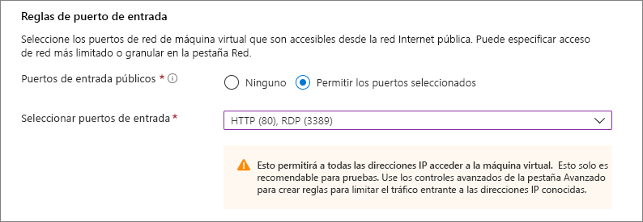
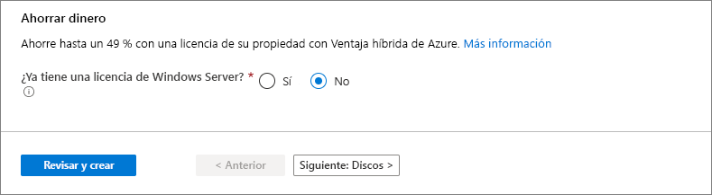
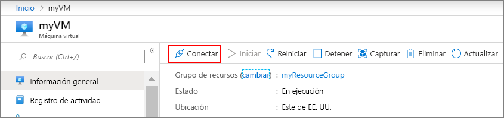

# <a name="quickstart-create-a-windows-virtual-machine-in-the-azure-portal"></a>Guía de inicio rápido: Creación de una máquina virtual Windows en Azure Portal

Las máquinas virtuales de Azure pueden crearse mediante Azure Portal. Este método proporciona una interfaz de usuario basada en explorador para crear máquinas virtuales y sus recursos asociados. En esta guía de inicio rápido se muestra cómo usar Azure Portal para implementar una máquina virtual (VM) de Azure que ejecuta Windows Server 2016. Para ver la máquina virtual en acción, conéctese a la máquina virtual mediante RDP e instale al servidor web IIS.

Si no tiene una suscripción a Azure, cree una [cuenta gratuita](https://azure.microsoft.com/free/?WT.mc_id=A261C142F) antes de empezar.

## <a name="sign-in-to-azure"></a>Inicio de sesión en Azure

Inicie sesión en Azure Portal en https://portal.azure.com.

## <a name="create-virtual-machine"></a>Crear máquina virtual

1. Elija **Crear un recurso** en la esquina superior izquierda de Azure Portal.

1. En el cuadro de búsqueda encima de la lista de recursos de Azure Marketplace, busque y seleccione **Windows Server 2016 Datacenter** y, a continuación, elija **Crear**.

1. En la pestaña **Aspectos básicos**, en **Detalles del proyecto**, asegúrese de que esté seleccionada la suscripción correcta y luego elija **Crear nuevo** grupo de recursos. Escriba *myResourceGroup* para el nombre. 

    

1. En **Detalles de instancia**, escriba *myVM* en **Nombre de máquina virtual** y elija *Este de EE. UU.* como **Ubicación**. Deje los demás valores predeterminados.

    

1. En **Cuenta de administrador**, proporcione un nombre de usuario, como *azureuser*, y una contraseña. La contraseña debe tener al menos 12 caracteres de largo y cumplir con los [requisitos de complejidad definidos](faq.md#what-are-the-password-requirements-when-creating-a-vm).

    

1. En **Reglas de puerto de entrada**, elija **Permitir los puertos seleccionados** y luego seleccione **RDP (3389)** y **HTTP** en la lista desplegable.

    

1. Deje los valores predeterminados restantes y luego seleccione el botón **Revisar + crear** en la parte inferior de la página.

    


## <a name="connect-to-virtual-machine"></a>Conexión a la máquina virtual

Cree una conexión a Escritorio remoto en la máquina virtual. Estas instrucciones indican cómo conectarse a la máquina virtual desde un equipo Windows. En un equipo Mac, necesita un cliente RDP como este [Cliente de Escritorio remoto](https://itunes.apple.com/us/app/microsoft-remote-desktop/id715768417?mt=12) de Mac App Store.

1. Haga clic en el botón **Conectar** en la página de propiedades de la máquina virtual. 

    
    
2. En la página **Connect to virtual machine** (Conexión a una máquina virtual), mantenga las opciones predeterminadas para conectarse por nombre DNS a través del puerto 3389 y haga clic en **Descargar archivo RDP**.

2. Abra el archivo RDP que descargó y haga clic en **Conectar** cuando se le solicite. 

3. En la ventana **Seguridad de Windows**, seleccione **Más opciones** y, después, **Usar otra cuenta**. Escriba el nombre de usuario como **localhost**\\*username*, escriba la contraseña que creó para la máquina virtual y luego haga clic en **Aceptar**.

4. Puede recibir una advertencia de certificado durante el proceso de inicio de sesión. Haga clic en **Sí** o en **Continuar** para crear la conexión.

## <a name="install-web-server"></a>Instalación del servidor web

Para ver la máquina virtual en acción, instale el servidor web IIS. Abra un símbolo del sistema de PowerShell en la máquina virtual y ejecute el siguiente comando:

```powershell
Install-WindowsFeature -name Web-Server -IncludeManagementTools
```

Cuando haya terminado, cierre la conexión RDP con la máquina virtual.


## <a name="view-the-iis-welcome-page"></a>Página principal de IIS

En el portal, seleccione la maquina virtual y, en su información general, utilice el botón **Haga clic para copiar** a la derecha de la dirección IP para copiarla y pegarla en una pestaña del explorador. Se abrirá la página de bienvenida de IIS predeterminada, y debería tener el siguiente aspecto:


## <a name="clean-up-resources"></a>Limpieza de recursos

Cuando ya no los necesite, puede eliminar el grupo de recursos, la máquina virtual y todos los recursos relacionados. Para ello, seleccione el grupo de recursos de la máquina virtual, seleccione **Eliminar** y luego confirme el nombre del grupo de recursos para eliminar.

## <a name="next-steps"></a>Pasos siguientes

En esta guía de inicio rápido, implementará una máquina virtual sencilla, abrirá un puerto de red para el tráfico web e instalará un servidor web básico. Para más información acerca de las máquinas virtuales de Azure, continúe con el tutorial de máquinas virtuales Windows.

> [!div class="nextstepaction"]
> [Tutoriales de máquinas virtuales Windows de Azure](./tutorial-manage-vm.md)
