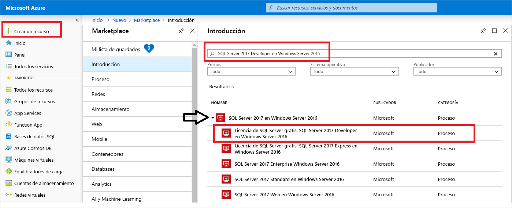
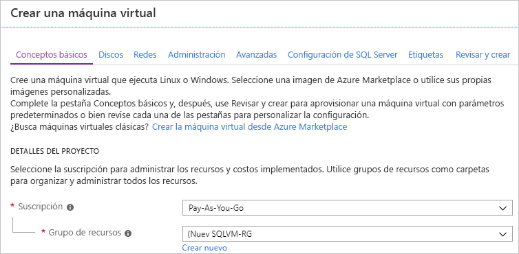
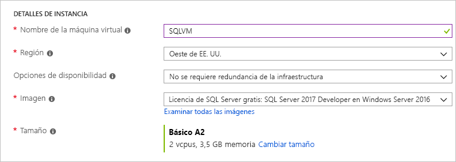
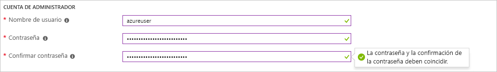
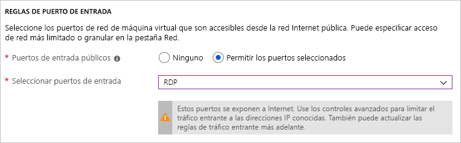
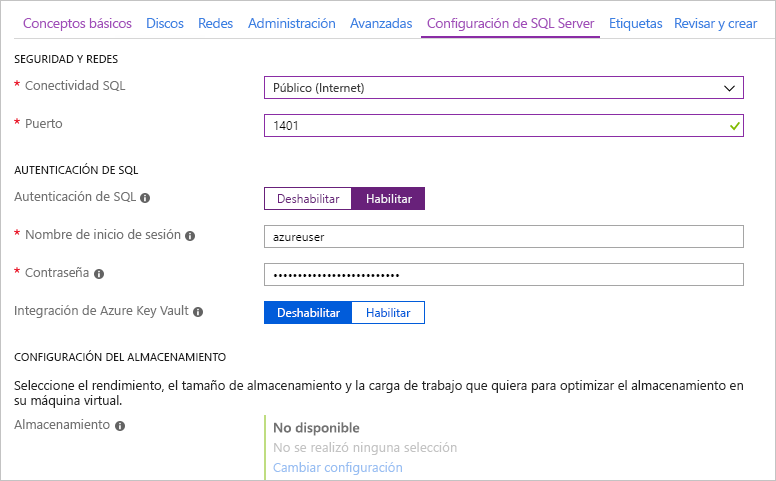
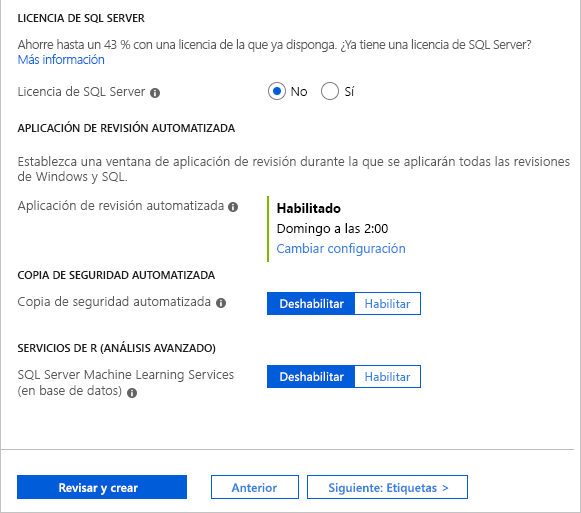

# Inicio rápido: Creación de una máquina virtual Windows de SQL Server 2017 en Azure Portal

> [!div class="op_single_selector"]
> * [Windows](quickstart-sql-vm-create-portal.md)
> * [Linux](../../linux/sql/provision-sql-server-linux-virtual-machine.md)

Esta guía de inicio rápido le ayuda a crear una máquina virtual de SQL Server en Azure Portal.

  > [!TIP]
  > - Esta guía de inicio rápido describe una manera de aprovisionar y conectarse a una máquina virtual de SQL rápidamente. Para más información sobre otras opciones de aprovisionamiento de máquinas virtuales de SQL, consulte la [guía de aprovisionamiento de máquinas virtuales Windows de SQL Server en Azure Portal](virtual-machines-windows-portal-sql-server-provision.md).
  > - Si tiene alguna pregunta sobre las máquinas virtuales de SQL Server, consulte las [Preguntas más frecuentes](virtual-machines-windows-sql-server-iaas-faq.md).

##  Obtener una suscripción de Azure

Si no tiene una suscripción a Azure, cree una [cuenta gratuita](https://azure.microsoft.com/free/?WT.mc_id=A261C142F) antes de empezar.

##  Seleccionar una imagen de máquina virtual de SQL Server

1. Inicie sesión en [Azure Portal](https://portal.azure.com) con su cuenta.

1. En Azure Portal, haga clic en **Crear un recurso**. 

1. En el cuadro de búsqueda, escriba `SQL Server 2017 Developer on Windows Server 2016` y presione ENTRAR. Expanda la opción SQL Server 2017 en Windows Server 2016. 

1. Seleccione la imagen de **Free SQL Server License: SQL Server 2017 Developer en Windows Server 2016**. La edición Developer se usa en este tutorial porque es una edición completa de SQL Server que es gratuita para desarrollo y pruebas. Solo paga por el costo de ejecutar la máquina virtual. Para conocer al detalle las consideraciones sobre precios, consulte la [guía de precios para máquinas virtuales de Azure de SQL Server](virtual-machines-windows-sql-server-pricing-guidance.md).

   

1. Seleccione **Crear**.

##  Proporcionar los detalles básicos

En la pestaña **Básico**, especifique la siguiente información:

1. En la sección **Detalles de proyecto**, seleccione su suscripción de Azure y, a continuación, seleccione **Crear nuevo** para crear un nuevo grupo de recursos. Escriba _SQLVM-RG_ para el nombre.

   

1. En **Detalles de instancia**:
    1. Escriba _SQLVM_ para el **Nombre de la máquina virtual**. 
    1. Elija una ubicación para su **Región**. 
    1. Para este inicio rápido, deje las **Opciones de disponibilidad** establecidas en _No se requiere redundancia de la infraestructura_. Para más información acerca de las opciones de disponibilidad, consulte [Regiones de Azure y disponibilidad](../../windows/regions-and-availability.md). 
    1. En la lista **Imagen** seleccione la denominada _Free SQL Server License: SQL Server 2017 Developer on Windows Server 2016_ (Licencia gratuita de SQL Server: SQL Server 2017 Developer en Windows Server 2016). 
    1. Elija **Cambiar el tamaño** para el **Tamaño** de la máquina virtual y seleccione la oferta **Básico A2**. Asegúrese de limpiar los recursos cuando haya terminado con ellos para evitar cargos inesperados. 

   

1. En **Cuenta de administrador**, proporcione un nombre de usuario, como _azureuser_, y una contraseña. La contraseña debe tener al menos 12 caracteres de largo y cumplir con los [requisitos de complejidad definidos](../../windows/faq.md#what-are-the-password-requirements-when-creating-a-vm).

   

1. En **Reglas de puerto de entrada**, elija **Permitir los puertos seleccionados** y luego seleccione **RDP (3389)** en la lista desplegable. 

   

## Configuración de SQL Server

En la pestaña **Configuración de SQL Server**, configure las siguientes opciones:

1. En **Seguridad y redes**, seleccione _Pública (Internet_) para **Conectividad SQL** y cambie el puerto a `1401` para evitar el uso de un número de puerto conocido en el escenario público. 
1. En **Autenticación de SQL**, seleccione **Habilitar**. El inicio de sesión de SQL se establece en el mismo nombre de usuario y contraseña que ha configurado para la máquina virtual. Use la configuración predeterminada para **Integración de Azure Key Vault** y **Configuración de almacenamiento**.  

   

1. Cambie cualquier otro valor si es necesario y, a continuación, seleccione **Revisar y crear**. 

   

## Creación de la máquina virtual de SQL Server

En la pestaña **Revisar y crear**, revise el resumen y seleccione **Crear** para crear la instancia de SQL Server, el grupo de recursos y los recursos especificados para esta máquina virtual.

Puede supervisar la implementación desde Azure Portal. En el botón **Notificaciones** de la parte superior de la pantalla, se muestra el estado básico de la implementación. La implementación puede tardar varios minutos. 

## Conexión con SQL Server

1. En el portal, busque la **dirección IP pública** de la VM con SQL Server en la sección **Información general** de las propiedades de la máquina virtual.

1. En otro equipo conectado a Internet, abra [SQL Server Management Studio (SSMS)](/sql/ssms/download-sql-server-management-studio-ssms).

1. En el cuadro de diálogo **Conectar al servidor** o **Conectarse al motor de base de datos**, edite el valor de **Nombre del servidor**. Escriba la dirección IP pública de la máquina virtual. A continuación, agregue una coma y el puerto personalizado **1401**, que se especificó cuando configuró la nueva máquina virtual. Por ejemplo, `11.22.33.444,1401`.

1. En el cuadro **Autenticación**, seleccione **Autenticación de SQL Server**.

1. En el cuadro **Inicio de sesión** , escriba un nombre de inicio de sesión de SQL válido.

1. En el cuadro **Contraseña** , escriba la contraseña de inicio de sesión.

1. Seleccione **Conectar**.

    

##  Iniciar sesión en la máquina virtual de forma remota

Use los pasos siguientes para conectarse a la máquina virtual de SQL Server con Escritorio remoto:

[!INCLUDE [Connect to SQL Server VM with remote desktop](../../../../includes/virtual-machines-sql-server-remote-desktop-connect.md)]

Después de conectarse a la máquina virtual de SQL Server, puede iniciar SQL Server Management Studio y conectarse con la autenticación de Windows mediante sus credenciales de administrador local. Si ha habilitado la autenticación de SQL Server, también puede conectarse con la autenticación de SQL mediante el inicio de sesión de SQL y la contraseña configurada durante el aprovisionamiento.

El acceso a la máquina le permite cambiar directamente la máquina y la configuración de SQL Server según sus necesidades. Por ejemplo, podría configurar el firewall o cambiar la configuración de SQL Server.

## Limpieza de recursos

Si no necesita que la máquina virtual de SQL se ejecute continuamente, puede detenerla cuando no esté en uso y así evitar cargos innecesarios. También puede eliminar de forma definitiva todos los recursos asociados con la máquina virtual mediante la eliminación de su grupo de recursos asociado en el portal. Como esta acción también elimina la máquina virtual definitivamente, use este comando con cuidado. Para más información, consulte [Administración de recursos de Azure en el portal](../../../azure-resource-manager/manage-resource-groups-portal.md).

## Pasos siguientes

En este inicio rápido, ha creado una máquina virtual de SQL Server 2017 en Azure Portal. Para más información sobre la migración de los datos a la nueva instancia de SQL Server, consulte el artículo siguiente.

> [!div class="nextstepaction"]
> [Migración de una base de datos a una máquina virtual SQL](virtual-machines-windows-migrate-sql.md)
