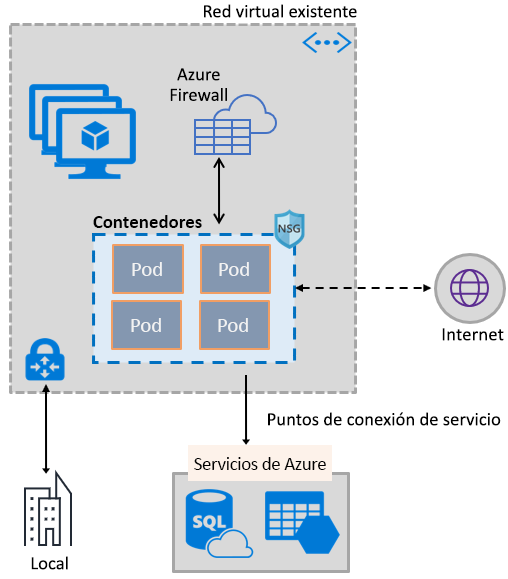
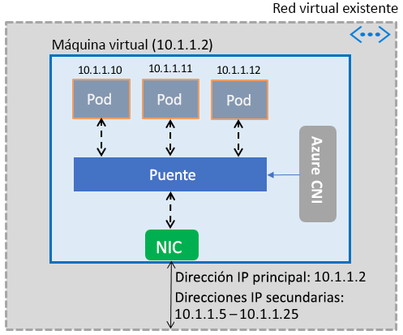

# Habilitación de contenedores para que usen las funcionalidades de Azure Virtual Network

Incorpore el amplio conjunto de funcionalidades de red de Azure a los contenedores mediante el uso de la misma pila de redes que se utiliza en las máquinas virtuales. El complemento de interfaz de red de contenedores (CNI) de Azure Virtual Network se instala en una máquina virtual de Azure. El complemento asigna direcciones IP de una red virtual a los contenedores en la máquina virtual, adjuntándolos a dicha red y conectándolos directamente a otros contenedores y recursos de red virtual. El complemento no se basa en las rutas o redes de superposición para la conectividad, y proporciona el mismo rendimiento que las máquinas virtuales. En un nivel alto, el complemento proporciona las siguientes funcionalidades:

- Se asigna una dirección IP de red virtual a cada pod, que puede constar de uno o varios contenedores.
- Los pods pueden conectarse a redes virtuales emparejadas y al entorno local mediante ExpressRoute o de una VPN de sitio a sitio. Los pods también son accesibles desde redes locales y emparejadas.
- Los pods pueden acceder a servicios como Azure Storage y Azure SQL Database, que están protegidos por los puntos de conexión de servicio de red virtual.
- Las rutas y los grupos de seguridad de red se pueden aplicar directamente a los pods.
- Los pods se pueden colocar directamente detrás de un equilibrador de carga interno o público de Azure, igual que las máquinas virtuales
- Los pods se pueden asignar a una dirección IP pública, lo que hace que sean directamente accesibles desde Internet. Los pods también pueden ellos mismos acceder a Internet.
- Funciona perfectamente con los recursos de Kubernetes como Services, los controladores de Ingress y DNS Kube. Un servicio de Kubernetes también se puede exponer de forma externa o interna mediante Azure Load Balancer.

La siguiente imagen muestra cómo el complemento proporciona funcionalidades de Azure Virtual Network a los pods:

El complemento admite las plataformas Windows y Linux.

## Conexión de los pods a una red virtual

Los pods se muestran en una máquina virtual que sea parte de una red virtual. En la interfaz de red de una máquina virtual se configuran, como direcciones secundarias, un grupo de direcciones IP para los pods. Azure CNI configura la conectividad de red básica para los pods y administra el uso de las direcciones IP en el grupo. Cuando un pod aparece en la máquina virtual, Azure CNI asigna una dirección IP disponible del grupo y se conecta el pod a un puente de software en la máquina virtual. Cuando el pod finaliza, la dirección IP se vuelve a agregar al grupo. En la siguiente imagen se muestra cómo se conectan los pod a una red virtual:

## Acceso a Internet

Para habilitar los pods para que tengan acceso a Internet, el complemento configura las reglas *iptables* para la traducción de direcciones de red (NAT) del tráfico ligado a Internet desde los pods. La dirección IP de origen del paquete se traduce a la dirección IP principal en la interfaz de red de la máquina virtual. Las máquinas virtuales Windows aplican el modo Source NAT (SNAT) automáticamente al tráfico destinado a direcciones IP fuera de la subred a la que pertenece la máquina virtual. Normalmente, se traduce todo el tráfico destinado a una dirección IP fuera del intervalo IP de la red virtual.

## límites

El complemento admite hasta 250 pods por máquina virtual y un máximo de 16 000 Pods en una red virtual. Estos límites son diferentes para [Azure Kubernetes Service](../azure-subscription-service-limits.md?toc=%2fazure%2fvirtual-network%2ftoc.json#azure-kubernetes-service-limits).

## Uso del complemento

El complemento se puede usar de las siguientes maneras para proporcionar conexión de red virtual básica para contenedores de Docker o Pods:

- **Azure Kubernetes Service**: el complemento está integrado en Azure Kubernetes Service (AKS) y puede usarse eligiendo la opción de *Redes avanzadas*. La opción de redes avanzadas le permite implementar un clúster de Kubernetes en una red virtual nueva o existente. Para más información acerca de la opción de redes avanzadas y los pasos para configurarla, consulte [Configuración de red en Azure Kubernetes Service (AKS)](../aks/networking-overview.md?toc=%2fazure%2fvirtual-network%2ftoc.json).
- **Motor de ACS**: Motor de ACS es una herramienta que genera una plantilla de Azure Resource Manager para la implementación de un clúster de Kubernetes en Azure. Para instrucciones detalladas, consulte [Implementación del complemento para un clúster de Kubernetes con ACS-Engine](deploy-container-networking.md#deploy-plug-in-for-acs-engine-kubernetes-cluster).
- **Creación de su propio clúster de Kubernetes en Azure**: el complemento se puede usar para proporcionar prestaciones de red básicas para los pods en clústeres de Kubernetes que implemente usted mismo, sin tener que depender de AKS, o de herramientas como el motor de ACS. En este caso, el complemento se instala y habilita en todas las máquinas virtuales en un clúster. Para instrucciones detalladas, consulte [Implementación del complemento para un clúster de Kubernetes que usted mismo haya implementado](deploy-container-networking.md#deploy-plug-in-for-a-kubernetes-cluster).
- **Conexión de una red virtual para contenedores de Docker en Azure**: el complemento se puede usar en casos donde no quiera crear un clúster de Kubernetes y desee crear contenedores de Docker con conexión de red virtual en máquinas virtuales. Para instrucciones detalladas, consulte [Implementación del complemento para contenedores de Docker](deploy-container-networking.md#deploy-plug-in-for-docker-containers).

## Pasos siguientes

[Implementación del complemento](deploy-container-networking.md) para clústeres de Kubernetes o contenedores de Docker