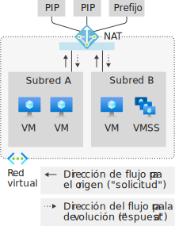
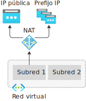
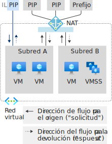
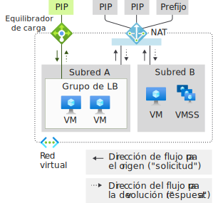
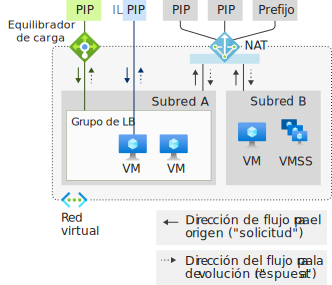
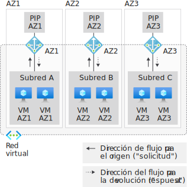
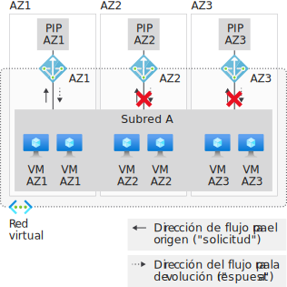
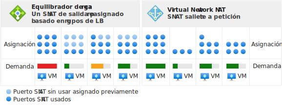
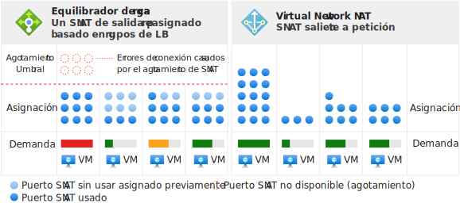

# <a name="designing-virtual-networks-with-nat-gateway-resources-public-preview"></a>Diseño de redes virtuales con recursos de puertas de enlace de NAT (versión preliminar pública)

Los recursos de puerta de enlace de NAT forman parte de [Virtual Network NAT](nat-overview.md) y proporcionan conectividad saliente a Internet para una o varias subredes de una red virtual. La subred de la red virtual indica qué puerta de enlace de NAT se usará. NAT proporciona traducción de direcciones de red de origen (SNAT) para una subred.  Los recursos de puerta de enlace de NAT especifican las direcciones IP estáticas que usan las máquinas virtuales al crear flujos de salida. Las direcciones IP estáticas proceden de recursos de direcciones IP públicas, recursos de prefijos IP públicos, o ambos. Un recurso de puerta de enlace de NAT puede usar un máximo de 16 direcciones IP desde cualquiera de ellas.


<p align="center">
  
</p>

*Ilustración: Virtual Network NAT para la salida a Internet*


>[!NOTE] 
>En este momento, Virtual Network NAT está disponible como versión preliminar pública. Actualmente solo está disponible en un conjunto limitado de [regiones](nat-overview.md#region-availability). Esta versión preliminar se ofrece sin contrato de nivel de servicio y no es aconsejable usarla para cargas de trabajo de producción. Es posible que algunas características no sean compatibles o que tengan sus funcionalidades limitadas. Para más información, consulte [Términos de uso complementarios de las versiones preliminares de Microsoft Azure](https://azure.microsoft.comsupport/legal/preview-supplemental-terms).

> [!IMPORTANT]
> Una vez que [esté habilitada la versión preliminar](./nat-overview.md#enable-preview) de Virtual Network NAT en su suscripción, use https://aka.ms/natportal para acceder al portal.

## <a name="how-to-deploy-nat"></a>Implementación de NAT

La configuración y el uso de la puerta de enlace de NAT se ha hecho sencilla a propósito:  

Recurso de puerta de enlace de NAT:
- Cree un recurso de puerta de enlace de NAT regional o con aislamiento de zona.
- Asigne direcciones IP.
- Modifique el tiempo de espera de inactividad (opcional).

Red virtual:
- Configure una subred de red virtual para que use una puerta de enlace de NAT.

No se necesitan rutas definidas por el usuario.

## <a name="resource"></a>Resource

El recurso se ha diseñado para que sea muy sencillo, como se puede ver en el siguiente ejemplo de Azure Resource Manager en un formato de tipo plantilla.  Este formato se muestra aquí para ilustrar los conceptos y la estructura.  Modifique el ejemplo para adecuarlo a sus necesidades.  No se pretende que este documento sea un tutorial.

En el siguiente diagrama se muestran las referencias en cuanto a lo que se puede escribir entre los distintos recursos de Azure Resource Manager.  La flecha indica la dirección de la referencia y parte del lugar desde el que se puede escribir. Revisar 

<p align="center">
  
</p>

*Ilustración: Modelo de objetos de Virtual Network NAT*

NAT se recomienda para la mayoría de las cargas de trabajo, salvo que se tenga una dependencia concreta de la [conectividad de salida de Load Balancer basada en grupos](../load-balancer/load-balancer-outbound-connections.md).  

Puede migrar desde escenarios del equilibrador de carga estándar, incluidas las [reglas salientes](../load-balancer/load-balancer-outbound-rules-overview.md), a una puerta de enlace de NAT. Para realizar la migración, mueva los recursos de IP pública y de prefijo de IP pública desde los servidores front-end de Load Balancer a la puerta de enlace de NAT. No se requieren direcciones IP nuevas para la puerta de enlace de NAT. Se pueden reutilizar tanto la IP pública como el prefijo estándar, siempre que el total no supere las 16 direcciones IP. Planee la migración y tenga en cuenta la interrupción del servicio durante la transición.  Si el proceso se automatiza, el periodo de interrupción se reduce considerablemente. Pruebe la migración en un entorno de ensayo primero.  Durante la transición, los flujos de entrada originados no resultan afectados.

En el siguiente ejemplo se creará un recurso de puerta de enlace de NAT llamado _myNATGateway_ en la región _Este de EE. UU. 2, AZ 1_ con un tiempo de espera de inactividad de _4 minutos_. Las direcciones IP de salida que se proporcionan son:
- Un conjunto de recursos de IP pública _myIP1_ y _myIP2_. 
- Un conjunto de recursos de prefijo de IP pública _myPrefix1_ y _myPrefix2_. 

El número total de direcciones IP que proporcionan los cuatro recursos de direcciones IP no pueden superar un total de 16 direcciones IP. Se permite cualquier número de direcciones IP entre 1 y 16.

```json
{
"name": "myNATGateway",
   "type": "Microsoft.Network/natGateways",
   "apiVersion": "2018-11-01",
   "location": "East US 2",
   "sku": { "name": "Standard" },
   "zones": [ "1" ],
   "properties": {
      "idleTimeoutInMinutes": 4, 
      "publicIPPrefixes": [
         {
            "id": "ref to myPrefix1"
         },
         {
            "id": "ref to myPrefix2"
         }
      ],
      "publicIPAddresses": [
         {
            "id": "ref to myIP1"
         },
         {
            "id": "ref to myIP2"
         }
      ]
   }
}
```

Cuando se haya creado el recurso de puerta de enlace de NAT, se puede usar en una o varias subredes de una red virtual. Especifique qué subredes usan este recurso de puerta de enlace de NAT. Una puerta de enlace de NAT no puede abarcar más de una red virtual. No es preciso asignar la misma puerta de enlace de NAT a todas las subredes de una red virtual. Se pueden configurar subredes individuales con diferentes recursos de puerta de enlace de NAT.

Los escenarios que no usen zonas de disponibilidad serán regionales (sin zona especificada). Si usa zonas de disponibilidad, puede especificar una de ellas para aislar NAT en una zona concreta. No se admite la redundancia de zonas. Examine las [zonas de disponibilidad](#availability-zones) de NAT.


```json
{
   "name": "myVNet",
   "apiVersion": "2018-11-01",
   "type": "Microsoft.Network/virtualNetworks",
   "location": "myRegion", 
   "properties": {
      "addressSpace": {
          "addressPrefixes": [
           "192.168.0.0/16"
          ]
      },
      "subnets": [
         {
            "name": "mySubnet1",
            "properties": {
               "addressPrefix": "192.168.0.0/24",
               "natGateway": {
                  "id": "ref to myNATGateway"
               }
            }
         } 
      ]
   }
}
```
Las puertas de enlace de NAT se definen con una propiedad en una subred de una red virtual. Los flujos que creen las máquinas virtuales en la subred _mySubnet1_ de la red virtual _myVNet_ usarán la puerta de enlace de NAT. Toda la conectividad de salida usará las direcciones IP asociadas con _myNatGateway_ como dirección IP de origen.


## <a name="design-guidance"></a>Guía de diseño

Lea esta sección para familiarizarse con las consideraciones para diseñar redes virtuales con NAT.  

1. [Optimización de costos](#cost-optimization)
1. [Coexistencia de entrada y salida](#coexistence-of-inbound-and-outbound)
2. [Administración de recursos básicos](#managing-basic-resources)
3. [Zonas de disponibilidad](#availability-zones)

### <a name="cost-optimization"></a>Optimización de costos

Los [puntos de conexión de servicio](virtual-network-service-endpoints-overview.md) y el [vínculo privado](../private-link/private-link-overview.md) son dos opciones que deben tenerse en cuenta para optimizar el costo donde no se necesite NAT.  La NAT de la red virtual no procesa el tráfico dirigido a los puntos de conexión de servicio o a un vínculo privado.  

Los puntos de conexión de servicio enlazan los recursos de servicio de Azure a su red virtual y controlan el acceso a los recursos de servicio de Azure. Por ejemplo, cuando se accede a Azure Storage, se usa un punto de conexión de servicio para almacenamiento, con el fin de evitar los cargos de NAT de datos procesados. Los puntos de conexión de servicio con gratuitos.

Un vínculo privado expone el servicio PaaS de Azure (o cualquier otro servicio hospedado con vínculo privado) como punto de conexión privado dentro de una red virtual.  Un vínculo privado se factura en función de la duración y de los datos procesados.

Evalúe si alguno de estos dos métodos (o ambos) se adapta bien a su escenario y úselo según sea necesario.

### <a name="coexistence-of-inbound-and-outbound"></a>Coexistencia de entrada y salida

La puerta de enlace de NAT es compatible con:

 - Equilibrador de carga estándar
 - IP pública estándar
 - Prefijo de IP pública estándar

Cuando desarrolle una implementación nueva, comience con SKU estándar.

<p align="center">
  
</p>

*Ilustración: Virtual Network NAT para la salida a Internet*

El escenario de solo salida a Internet que proporciona la puerta de enlace de NAT se puede expandir con la funcionalidad de entrada desde Internet. Todos los recursos saben la dirección en que se origina un flujo. En una subred con una puerta de enlace de NAT, esta sustituye todos los escenarios de salida a Internet. Por su parte, los escenarios de entrada desde Internet los proporciona el recurso respectivo.

#### <a name="nat-and-vm-with-instance-level-public-ip"></a>NAT y máquina virtual con IP pública de nivel de instancia

<p align="center">
  
</p>

*Ilustración: Virtual Network NAT y máquina virtual con IP pública de nivel de instancia*

| Dirección | Resource |
|:---:|:---:|
| Entrada | Máquina virtual con IP pública de nivel de instancia |
| Salida | NAT Gateway |

La máquina virtual usará una puerta de enlace de NAT para la salida.  La entrada originada no resulta afectada.

#### <a name="nat-and-vm-with-public-load-balancer"></a>NAT y máquina virtual con equilibrador de carga público

<p align="center">
  
</p>

*Ilustración: Virtual Network NAT y máquina virtual con equilibrador de carga público*

| Dirección | Resource |
|:---:|:---:|
| Entrada | Equilibrador de carga público |
| Salida | NAT Gateway |

La puerta de enlace de NAT sustituye la configuración de salida de una regla de equilibrio de carga o las reglas de salida.  La entrada originada no resulta afectada.

#### <a name="nat-and-vm-with-instance-level-public-ip-and-public-load-balancer"></a>NAT y máquina virtual con IP pública de nivel de instancia y equilibrador de carga pública

<p align="center">
  
</p>

*Ilustración: Virtual Network NAT y máquina virtual con IP pública de nivel de instancia y equilibrador de carga pública*

| Dirección | Resource |
|:---:|:---:|
| Entrada | Máquina virtual con IP pública de nivel de instancia y equilibrador de carga pública |
| Salida | NAT Gateway |

La puerta de enlace de NAT sustituye la configuración de salida de una regla de equilibrio de carga o las reglas de salida.  La máquina virtual también usará una puerta de enlace de NAT para la salida.  La entrada originada no resulta afectada.

### <a name="managing-basic-resources"></a>Administración de recursos básicos

El equilibrador de carga estándar, la IP pública y el prefijo de IP pública son compatibles con la puerta de enlace de NAT. Las puertas de enlace de NAT operan en el ámbito de una subred. La SKU básica de estos servicios se debe implementar en una subred sin una puerta de enlace de NAT. Esta separación permite que las dos variantes de SKU coexistan en la misma red virtual.

Las puertas de enlace de NAT tienen prioridad sobre los escenarios de salida de la subred. El equilibrador de carga básico o la IP pública (y todos los servicios administrados integrados con ellos) no pueden ajustarse con las traducciones correctas. La puerta de enlace de NAT toma el control sobre el tráfico de salida a Internet en una subred. El tráfico de entrada al equilibrador de carga básico y a la IP pública no está disponible. El tráfico de entrada a un equilibrador de carga básico o a una IP pública configurada en una máquina virtual no estará disponible.

### <a name="availability-zones"></a>Zonas de disponibilidad

Incluso sin zonas de disponibilidad, NAT es resistente y puede sobrevivir a los errores de varios componentes de la infraestructura. Si las zonas de disponibilidad forman parte de su escenario, debe configurar la NAT de una zona concreta.  Las operaciones del plano de control y el plano de datos están restringidos a la zona especificada. Se espera que los errores que se produzcan en una zona que no sea aquella en la que existe el escenario no tengan ningún impacto en NAT. El tráfico de salida de las máquinas virtuales de la misma zona generará un error debido al aislamiento de la zona.

<p align="center">
  
</p>

*Ilustración: Virtual Network NAT con zonas de disponibilidad*

Una puerta de enlace de NAT con una zona aislada requiere que las direcciones IP coincidan con la zona de la puerta de enlace de NAT. No se admiten recursos de la puerta de enlace de NAT con direcciones IP de otra zona o que no tengan ninguna zona.

Tanto las redes virtuales como las subredes se alinean con la región, no con la zona. Una máquina virtual tiene que estar en la misma zona que la puerta de enlace de NAT para que haya un compromiso de aislamiento de zona en las conexiones de salida. El aislamiento de zona se crea mediante la creación de una "pila" con aislamiento de zona por zona de disponibilidad. No existirá compromiso de aislamiento de zona si se cruzan zonas de una puerta de enlace de NAT zonal o se usa una puerta de enlace de NAT regional con máquinas virtuales zonales.

Cuando se implementan conjuntos de escalado de máquinas virtuales para usarlos con NAT, se implementa un conjunto de escalado zonal en su propio subconjunto y se asocia la puerta de enlace de NAT de la zona correspondiente a esa subred. Si usa conjuntos de escalado que abarcan varias zonas, NAT no proporcionará un compromiso de aislamiento de zona.  NAT no admite la redundancia de zona.  Solo se admite el aislamiento regional o de zona.

<p align="center">
  
</p>

*Ilustración: Virtual Network NAT que abarca varias zonas*

La propiedad zones no es mutable.  Vuelva a implementar el recurso de la puerta de enlace de NAT con la preferencia regional o de zona pretendida.

>[!NOTE] 
>Las direcciones IP en sí no tienen redundancia de zona si no se especifica ninguna zona.  El servidor front-end de un [equilibrador de carga estándar tiene redundancia de zona](../load-balancer/load-balancer-standard-availability-zones.md#frontend) si una dirección IP no se crea en una zona concreta.  Esto no se aplica a la NAT.  Solo se admite el aislamiento regional o de zona.

## <a name="source-network-address-translation"></a>Traducción de direcciones de red de origen

La traducción de direcciones de red de origen (SNAT) reescribe el origen de un flujo para que parta de otra dirección IP.  Los recursos de la puerta de enlace de NAT usan una variante de SNAT que habitualmente se denomina traducción de direcciones de puertos (PAT). PAT reescribe la dirección de origen y el puerto de origen. Con SNAT, no hay una relación fija entre el número de direcciones privadas y sus direcciones públicas traducidas.  

### <a name="fundamentals"></a>Aspectos básicos

Examinemos un ejemplo de cuatro flujos que explican el concepto básico.  La puerta de enlace de NAT utiliza el recurso de dirección IP pública 65.52.0.2.

| Flujo | Tupla de origen | Tupla de destino |
|:---:|:---:|:---:|
| 1 | 192.168.0.16:4283 | 65.52.0.1:80 |
| 2 | 192.168.0.16:4284 | 65.52.0.1:80 |
| 3 | 192.168.0.17.5768 | 65.52.0.1:80 |
| 4 | 192.168.0.16:4285 | 65.52.0.2:80 |

Estos flujos pueden tener el siguiente aspecto después de que se haya producido la traducción de puertos de origen:

| Flujo | Tupla de origen | Tupla de origen con SNAT | Tupla de destino | 
|:---:|:---:|:---:|:---:|
| 1 | 192.168.0.16:4283 | 65.52.0.2:234 | 65.52.0.1:80 |
| 2 | 192.168.0.16:4284 | 65.52.0.2:235 | 65.52.0.1:80 |
| 3 | 192.168.0.17.5768 | 65.52.0.2:236 | 65.52.0.1:80 |
| 4 | 192.168.0.16:4285 | 65.52.0.2:237 | 65.52.0.2:80 |

El destino verá el origen del flujo como 65.52.0.2 (tupla de origen con SNAT) con el puerto asignado que se muestra.  PAT como se muestra en la tabla anterior también se denomina SNAT de enmascaramiento de puertos.  Varios orígenes privados se enmascaran detrás de una IP y un puerto.

No asuma una dependencia de la forma concreta en que se asignan los puertos de origen.  Lo anterior es una ilustración solo del concepto fundamental.

El SNAT que proporciona NAT es diferente del [equilibrador de carga](../load-balancer/load-balancer-outbound-connections.md) en varios aspectos.

### <a name="on-demand"></a>A petición

NAT proporciona puertos SNAT a petición para nuevos flujos de tráfico de salida. Todos los puertos SNAT disponibles en el inventario los usa la máquina virtual en las subredes configuradas con NAT. 

<p align="center">
  
</p>

*Ilustración: SNAT de salida a petición de Virtual Network NAT*

Todas las configuraciones de IP de una máquina virtual pueden crear flujos de salida a petición si fuera necesario.  No es necesario realizar un planeamiento de cada instancia previo a la asignación, ni siquiera el sobreaprovisionamiento por instancia para el caso más desfavorable.  

<p align="center">
  
</p>

*Ilustración: Diferencias en escenarios de agotamiento*

Una vez que se libera un puerto SNAT, este está disponible para que lo use cualquier máquina virtual de las subredes configuradas con NAT.  La asignación a petición permite que las cargas de trabajo dinámicas y divergentes en subredes usen los puertos SNAT a medida que se necesiten.  Mientras haya un inventario de puertos SNAT disponible, los flujos de SNAT funcionarán correctamente. Las zonas activas de los puertos SNAT se benefician de que el inventario sea mayor. Los puertos SNAT se quedan sin usar en las máquinas virtuales que no los necesiten de forma activa.

### <a name="scaling"></a>Ampliación

NAT necesita un inventario de puertos SNAT suficiente para el escenario de salida completo. El escalado de NAT es primordialmente una función de la administración del inventario de puertos SNAT compartidos disponibles. Es preciso que exista inventario suficiente para afrontar el flujo máximo de salida en todas las subredes conectadas a un recurso de puerta de enlace de NAT.

SNAT asigna varias direcciones privadas a una dirección pública y usa varias direcciones IP públicas para escalar.

Un recurso de puerta de enlace de NAT usará 64 000 puertos (puertos SNAT) de una dirección IP pública.  Estos puertos SNAT se convierten en el inventario disponible para la asignación de flujo privado a público. Y agregar más direcciones IP públicas aumenta los puertos SNAT del inventario disponibles. Los recursos de puerta de enlace de NAT se pueden escalar verticalmente hasta un máximo de 16 direcciones IP y un millón de puertos SNAT.  TCP y UDP son inventarios de puertos SNAT independientes y no están relacionados.

Los recursos de puerta de enlace de NAT reutilizan los puertos de origen. Antes de realizar el escalado debe asumir que cada flujo requiere un nuevo puerto SNAT y escalar el número total de direcciones IP disponibles para el tráfico de salida.

### <a name="protocols"></a>Protocolos

Los recursos de puerta de enlace de NAT interactúan con la IP y los encabezados de transporte de IP de los flujos UDP y TCP, y son independientes de las cargas de la capa de aplicaciones.  No se admiten otros protocolos de IP.

### <a name="timers"></a>Temporizadores

El tiempo de espera de inactividad se puede ajustar de 4 minutos (valor predeterminado) a 120 minutos (2 horas) para todos los flujos.  Además, puede restablecer el temporizador inactivo con tráfico del flujo.  Un patrón recomendado para actualizar las largas conexiones inactivas y para detectar la ejecución de puntos de conexión es usar mensajes TCP Keepalive.  Estos mensajes aparecen como ACK duplicados en los puntos de conexión, tienen una sobrecarga baja y son invisibles para la capa de aplicaciones.

Para la liberación de los puertos SNAT se usan los siguientes temporizadores:

| Timer | Value |
|---|---|
| TCP FIN | 60 segundos |
| TCP RST | 10 segundos |
| TCP semiabierto | 30 segundos |

Los puertos SNAT están disponibles para volver a usarlos con la misma dirección IP y puerto de destino a los 5 segundos.

>[!NOTE] 
>Esta configuración del temporizador está sujeta a cambios. Los valores se proporcionan como ayuda para la solución de problemas y no se debe asumir una dependencia de temporizadores concretos en este momento.

## <a name="limitations"></a>Limitaciones

- NAT es compatible con la dirección IP pública de la SKU estándar, el prefijo de IP pública y los recursos del equilibrador de carga.   Ni los recursos básicos (por ejemplo, el equilibrador de carga básico) ni los productos derivados de ellos son compatibles con NAT.  Los recursos básicos se deben colocar en una subred que no esté configurada con NAT.
- Se admite la familia de direcciones IPv4.  NAT no interactúa con la familia de direcciones IPv6.
- No se admiten grupos de seguridad de red en la subred ni NIC para flujos de salida a puntos de conexión públicos mediante NAT.
- El registro de flujos de grupos de seguridad de red no se admite cuando se usa NAT.
- NAT no puede abarcar varias redes virtuales.

## <a name="preview-participation"></a>Participación en la versión preliminar

Siga estas [instrucciones para habilitar su suscripción](nat-overview.md#public-preview-participation).

## <a name="feedback"></a>Comentarios

Queremos saber cómo podemos mejorar el servicio. Comparta sus [comentarios sobre la versión preliminar pública](https://aka.ms/natfeedback).  También puede proponer lo que debemos crear después (y votar por ello) en [UserVoice para NAT](https://aka.ms/natuservoice).

## <a name="next-steps"></a>Pasos siguientes

- Más información acerca de [Virtual Network NAT](nat-overview.md).
- Tutorial para validar una puerta de enlace de NAT
  * [CLI de Azure](tutorial-create-validate-nat-gateway-cli.md)
  * [PowerShell](tutorial-create-validate-nat-gateway-cli.md)
  * [Portal](tutorial-create-validate-nat-gateway-cli.md)
- Inicio rápido para implementar recursos de puerta de enlace de NAT
  * [CLI de Azure](./quickstart-create-nat-gateway-cli.md)
  * [PowerShell](./quickstart-create-nat-gateway-powershell.md)
  * [Portal](./quickstart-create-nat-gateway-portal.md).
- Más información sobre las [zonas de disponibilidad](../availability-zones/az-overview.md).
- Más información sobre el [equilibrador de carga estándar](../load-balancer/load-balancer-standard-overview.md).
- Más información sobre las [zonas de disponibilidad y el equilibrador de carga estándar](../load-balancer/load-balancer-standard-availability-zones.md).
- Más información sobre la API de recursos de puerta de enlace de NAT
  * [API REST](https://docs.microsoft.com/rest/api/virtualnetwork/natgateways)
  * [CLI de Azure](https://docs.microsoft.com/cli/azure/network/nat/gateway?view=azure-cli-latest)
  * [PowerShell](https://docs.microsoft.com/powershell/module/az.network/new-aznatgateway).
- [Díganos en UserVoice qué es lo que cree que deberíamos crear a continuación](https://aka/natuservoice).
- [Proporcione comentarios sobre la versión preliminar pública](https://aka.ms/natfeedback).
