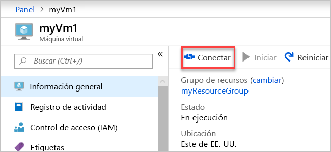

# <a name="quickstart-create-a-virtual-network-using-the-azure-portal"></a>Guía de inicio rápido: Creación de una red virtual mediante el Portal de Azure

Una red virtual permite que los recursos de Azure, como las máquinas virtuales, se comuniquen de manera privada entre sí y con Internet. En esta guía de inicio rápido aprenderá a crear una red virtual. Después de crear una red virtual, implementará dos máquinas virtuales en la red virtual. Después, se conectará a una máquina virtual desde Internet y se comunicará de forma privada entre las dos máquinas virtuales.

Si no tiene una suscripción a Azure, cree una [cuenta gratuita](https://azure.microsoft.com/free/?WT.mc_id=A261C142F) ahora.

## <a name="sign-in-to-azure"></a>Inicio de sesión en Azure

Inicie sesión en el [Azure Portal](https://portal.azure.com).

## <a name="create-a-virtual-network"></a>Creación de una red virtual

1. En la parte superior izquierda de la pantalla, seleccione **Crear un recurso** > **Redes** > **Red virtual**.

1. En **Creación de una red virtual**, escriba o seleccione esta información:

    | Configuración | Valor |
    | ------- | ----- |
    | NOMBRE | Escriba *myVirtualNetwork*. |
    | Espacio de direcciones | Escriba *10.1.0.0/16*. |
    | Subscription | Seleccione su suscripción.|
    | Grupos de recursos | Seleccione **Crear nuevo**, escriba *myResourceGroup* y, después, seleccione **Aceptar**. |
    | Ubicación | Seleccione **Este de EE. UU**.|
    | Subred: nombre | Escriba *myVirtualSubnet*. |
    | Subred: intervalo de direcciones | Escriba *10.1.0.0/24*. |

1. Deje el resto de valores predeterminados y seleccione **Crear**.

## <a name="create-virtual-machines"></a>Creación de máquinas virtuales

Cree dos máquinas virtuales en la red virtual:

### <a name="create-the-first-vm"></a>Creación de la primera máquina virtual

1. En la esquina superior izquierda de la pantalla, seleccione **Crear un recurso** > **Compute** > **Windows Server 2016 Datacenter**.

1. En **Creación de una máquina virtual: conceptos básicos**, escriba o seleccione esta información:

    | Configuración | Valor |
    | ------- | ----- |
    | **DETALLES DEL PROYECTO** | |
    | Subscription | Seleccione su suscripción. |
    | Grupos de recursos | Seleccione **MyResourceGroup**. Se ha creado en la última sección. |
    | **DETALLES DE INSTANCIA** |  |
    | Nombre de la máquina virtual | Escriba *myVm1*. |
    | Region | Seleccione **Este de EE. UU**. |
    | Opciones de disponibilidad | Deje el valor predeterminado **No se requiere redundancia de la infraestructura**. |
    | Imagen | Deje el valor predeterminado **Windows Server 2016 Datacenter**. |
    | Tamaño | Deje el valor predeterminado **Estándar DS1 v2**. |
    | **CUENTA DE ADMINISTRADOR** |  |
    | Nombre de usuario | Escriba un nombre de usuario de su elección. |
    | Password | Escriba una contraseña de su elección. La contraseña debe tener al menos 12 caracteres de largo y cumplir con los [requisitos de complejidad definidos](../virtual-machines/windows/faq.md?toc=%2fazure%2fvirtual-network%2ftoc.json#what-are-the-password-requirements-when-creating-a-vm).|
    | Confirm Password | Vuelva a escribir la contraseña. |
    | **REGLAS DE PUERTO DE ENTRADA** |  |
    | Puertos de entrada públicos | Deje el valor predeterminado **Ninguno**. |
    | **AHORRE DINERO** |  |
    | ¿Ya tiene una licencia de Windows? | Deje el valor predeterminado **No**. |

1. Seleccione **Siguiente: Discos**.

1. En **Creación de una máquina virtual: Discos**, deje los valores predeterminados y seleccione **Siguiente: Redes**.

1. En **Creación de una máquina virtual: Redes**, escriba o seleccione esta información:

    | Configuración | Valor |
    | ------- | ----- |
    | Virtual network | Deje el valor predeterminado **myVirtualNetwork**. |
    | Subred | Deje el valor predeterminado **myVirtualSubnet (10.1.0.0/24)**. |
    | Dirección IP pública | Deje el valor predeterminado **(new) myVm-ip**. |
    | Puertos de seguridad de red | Seleccione **Permitir los puertos seleccionados**. |
    | Selección de puertos de entrada | Seleccione **HTTP** y **RDP**.

1. Seleccione **Siguiente: Administración**.

1. En **Creación de una máquina virtual: Administración**, para **Cuenta de almacenamiento de diagnóstico**, seleccione **Crear nuevo**.

1. En **Crear cuenta de almacenamiento**, escriba o seleccione esta información:

    | Configuración | Valor |
    | ------- | ----- |
    | NOMBRE | Escriba *myvmstorageaccount*. |
    | Tipo de cuenta | Deje el valor predeterminado **Storage (uso general v1)**. |
    | Rendimiento | Deje el valor predeterminado **Estándar**. |
    | Replicación | Deje el valor predeterminado **Almacenamiento con redundancia local (LRS)**. |

1. Seleccione **Aceptar**.

1. Seleccione **Revisar + crear**. Se le remite a la página **Revisar y crear** y Azure valida la configuración.

1. Cuando vea **Validación superada**, seleccione **Crear**.

### <a name="create-the-second-vm"></a>Creación de la segunda máquina virtual

1. Complete los pasos 1 y 9 anteriores.

    > [!NOTE]
    > En el paso 2, para el **nombre de máquina virtual**, escriba *myVm2*.
    >
    > En el paso 7, para **Cuenta de almacenamiento de diagnóstico**, asegúrese de seleccionar **myvmstorageaccount**.

1. Seleccione **Revisar + crear**. Se le remite a la página **Revisar y crear** y Azure valida la configuración.

1. Cuando vea **Validación superada**, seleccione **Crear**.

## <a name="connect-to-a-vm-from-the-internet"></a>Conexión a una máquina virtual desde Internet

Después de haber creado *myVm1*, conéctese a ella a través de Internet.

1. En la barra de búsqueda del portal, escriba *myVm1*.

1. Seleccione el botón **Conectar**.

    

    Después de seleccionar el botón **Conectar**, se abre **Conectar a máquina virtual**.

1. Seleccione **Descargar archivo RDP**. Azure crea un archivo de Protocolo de Escritorio remoto (*.rdp*) y lo descarga en su equipo.

1. Abra el archivo *.rdp* descargado.

    1. Cuando se le pida, seleccione **Conectar**.

    1. Escriba el nombre de usuario y la contraseña que especificó al crear la máquina virtual.

        > [!NOTE]
        > Es posible que tenga que seleccionar **Más opciones** > **Usar otra cuenta** para especificar las credenciales que escribió al crear la máquina virtual.

1. Seleccione **Aceptar**.

1. Puede recibir una advertencia de certificado durante el proceso de inicio de sesión. Si recibe una advertencia de certificado, seleccione **Sí** o **Continuar**.

1. Una vez que aparezca el escritorio de la máquina virtual, minimícelo para volver a su escritorio local.

## <a name="communicate-between-vms"></a>Comunicarse entre máquinas virtuales

1. En el Escritorio remoto de *myVm1*, abra PowerShell.

1. Escriba `ping myVm2`.

    Obtendrá un mensaje similar al siguiente:

    ```powershell
    Pinging myVm2.0v0zze1s0uiedpvtxz5z0r0cxg.bx.internal.clouda
    Request timed out.
    Request timed out.
    Request timed out.
    Request timed out.

    Ping statistics for 10.1.0.5:
    Packets: Sent = 4, Received = 0, Lost = 4 (100% loss),
    ```

    Se produce un error de `ping`, porque `ping` usa el Protocolo de mensajes de control de Internet (ICMP). De manera predeterminada, el protocolo ICMP no puede atravesar el Firewall de Windows.

1. Para permitir que *myVm2* haga ping a *myVm1* en un paso posterior, escriba este comando:

    ```powershell
    New-NetFirewallRule –DisplayName “Allow ICMPv4-In” –Protocol ICMPv4
    ```

    Ese comando permite una conexión entrante de ICMP a través del Firewall de Windows:

1. Cierre la conexión de Escritorio remoto a *myVm1*.

1. Vuelva a realizar los pasos de [Conexión a una máquina virtual desde Internet](#connect-to-a-vm-from-the-internet), pero conéctese a *myVm2*.

1. Desde un símbolo del sistema, escriba `ping myvm1`.

    Obtendrá un mensaje similar al siguiente:

    ```powershell
    Pinging myVm1.0v0zze1s0uiedpvtxz5z0r0cxg.bx.internal.cloudapp.net [10.1.0.4] with 32 bytes of data:
    Reply from 10.1.0.4: bytes=32 time=1ms TTL=128
    Reply from 10.1.0.4: bytes=32 time<1ms TTL=128
    Reply from 10.1.0.4: bytes=32 time<1ms TTL=128
    Reply from 10.1.0.4: bytes=32 time<1ms TTL=128

    Ping statistics for 10.1.0.4:
        Packets: Sent = 4, Received = 4, Lost = 0 (0% loss),
    Approximate round trip times in milli-seconds:
        Minimum = 0ms, Maximum = 1ms, Average = 0ms
    ```

    Recibe respuestas de *myVm1*, porque permitió ICMP a través del Firewall de Windows en la máquina virtual *myVm1* en un paso anterior.

1. Cierre la conexión de Escritorio remoto a *myVm2*.

## <a name="clean-up-resources"></a>Limpieza de recursos

Cuando haya terminado con la red virtual y las máquinas virtuales, elimine el grupo de recursos y todos los recursos que este contiene:

1. Escriba *myResourceGroup* en el cuadro **Buscar** que se encuentra en la parte superior del portal.

1. Seleccione **myResourceGroup** cuando lo vea en los resultados de la búsqueda.

1. Seleccione **Eliminar grupo de recursos**.

1. Escriba *myResourceGroup* para **ESCRIBA EL NOMBRE DEL GRUPO DE RECURSOS** y seleccione **Eliminar**.

## <a name="next-steps"></a>Pasos siguientes

En esta guía de inicio rápido, ha creado una red virtual predeterminada y dos máquinas virtuales. Se ha conectado a una máquina virtual desde Internet y se ha comunicado de forma privada entre las dos máquinas virtuales. Para más información sobre la configuración de red virtual, consulte [Administración de una red virtual](manage-virtual-network.md).

De forma predeterminada, Azure permite una comunicación privada sin restricciones entre las máquinas virtuales. En cambio, Azure solo permite conexiones de Escritorio remoto entrantes a las máquinas virtuales Windows desde Internet. Para más información sobre cómo configurar distintos tipos de comunicaciones de red de VM, vaya al tutorial sobre el [filtrado del tráfico de red](tutorial-filter-network-traffic.md).