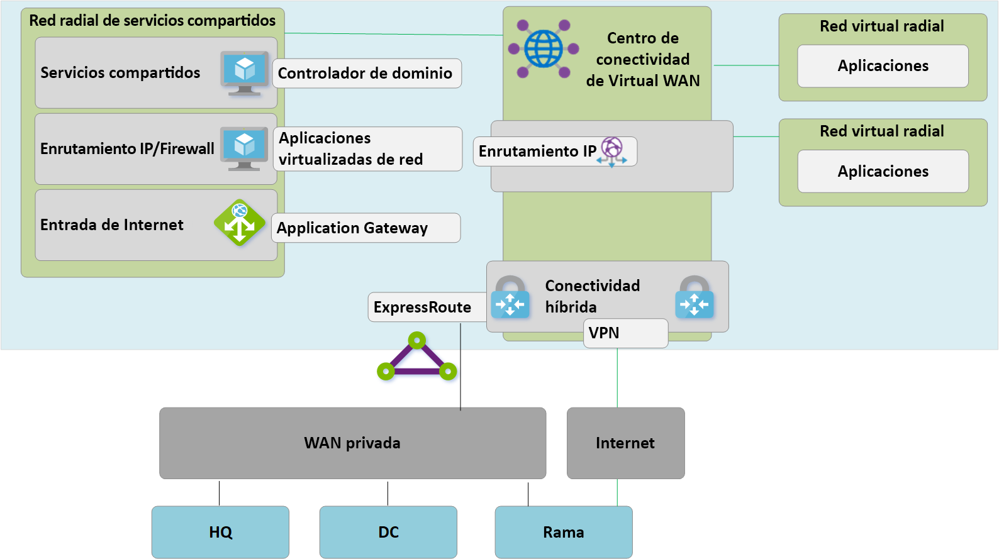
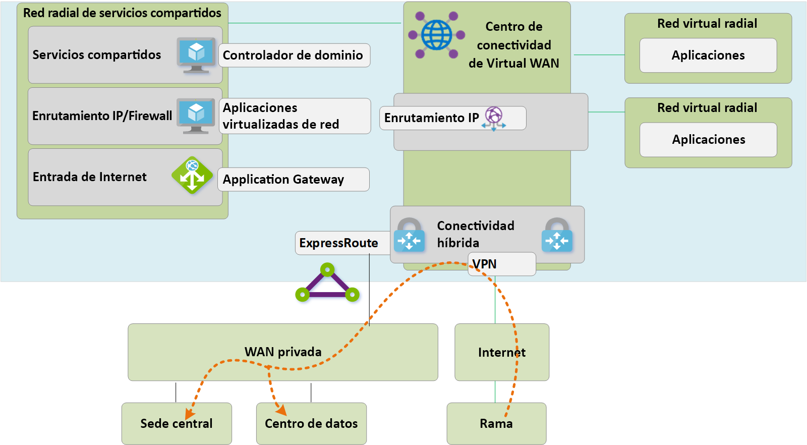
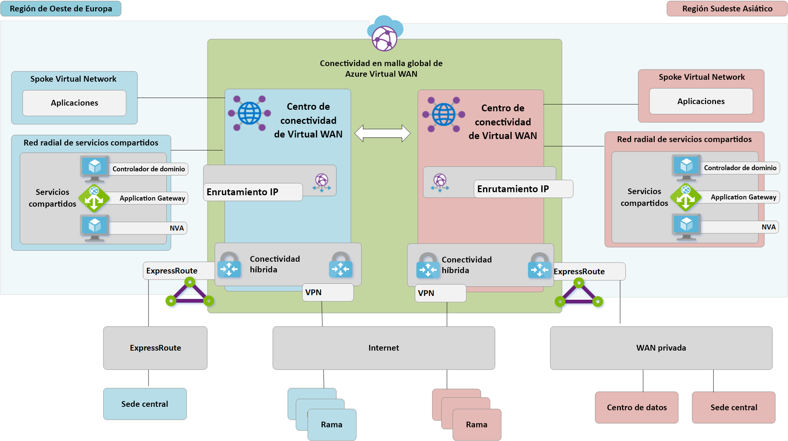
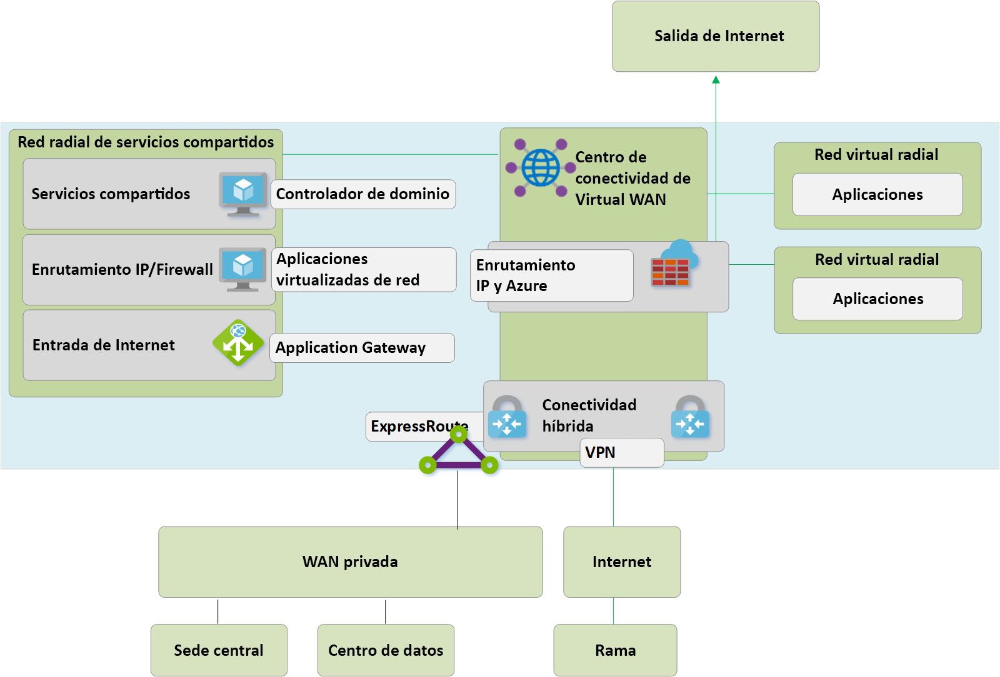

# Migración a Azure Virtual WAN
Azure Virtual WAN permite a las empresas simplificar su conectividad global y beneficiarse de la escala de la red global de Microsoft. Estas notas del producto proporcionan detalles técnicos para compañías que desean migrar de una topología en estrella tipo hub-and-spoke administrada por el cliente existente a un diseño que aprovecha los centros de conectividad de Virtual WAN administrados por Microsoft.

En el artículo [Arquitectura de red de tránsito global y Virtual WAN](virtual-wan-global-transit-network-architecture.md) se resaltan las ventajas que Azure Virtual WAN permite a las empresas adoptar una red global empresarial moderna centrada en la nube.

**Figura 1: Azure Virtual WAN**

Los miles de nuestros clientes han adoptado el modelo de conectividad en estrella tipo hub-and-spoke del centro de datos virtual (VDC) de Azure para aprovechar el comportamiento del enrutamiento transitivo predeterminado de las redes de Azure para crear redes sencillas y escalables en la nube. Azure Virtual WAN se basa en estos conceptos e incorpora nuevas funcionalidades que permiten topologías de conectividad global, no solo entre ubicaciones locales y Azure, sino que también permiten a los clientes aprovechar la escala de la red de Microsoft para aumentar sus redes globales existentes.

En este artículo se describe cómo migrar un entorno híbrido existente a una red WAN virtual.

## Escenario

Contoso es una organización financiera global con oficinas en Europa y Asia. Están pensando en trasladar sus aplicaciones existentes desde su controlador de dominio local a Azure y han creado un diseño básico basado en la arquitectura de VDC, incluidas las redes virtuales de centro administradas por el cliente para la conectividad híbrida. Como parte del traslado a tecnologías basadas en la nube, el equipo de red se ha encargado de asegurarse de que la conectividad está optimizada para el futuro.

En la figura 2 se muestra una vista de alto nivel de la red global existente, incluida la conectividad a varias regiones de Azure.

**Figura 2: Topología de red de Contoso existente**

Los siguientes puntos se pueden entender a partir de la topología de red existente:
 
- Modelo en estrella tipo hub-and-spoke que se usa en varias regiones. Uso de circuitos Premium de ExpressRoute para la conectividad a una WAN privada común.
- Algunos de estos sitios también tienen túneles de VPN directamente en Azure para llegar a las aplicaciones hospedadas en la nube de Microsoft.

## Requisitos
El equipo de redes se ha encargado de ofrecer un modelo de red global que puede admitir la migración de Contoso a la nube y debe optimizar en las áreas de costo, escala y rendimiento. En resumen, se deben cumplir los siguientes requisitos:
- Proporcione la oficina central y las sucursales con una ruta de acceso optimizada a las aplicaciones hospedadas en la nube. 
- Quite la dependencia de los controladores de dominio locales existentes para la terminación de la VPN a la vez que se conservan las siguientes rutas de acceso de conectividad:
    - **De rama a red virtual**: las oficinas conectadas a VPN deben poder acceder a las aplicaciones migradas a la nube en la región local de Azure.
    - **De rama a concentrador a concentrador a red virtual**: las oficinas conectadas a VPN deben poder acceder a las aplicaciones migradas a la nube en la región de Azure remota. 
    - **De rama a rama**: las oficinas conectadas a VPN regionales deben poder comunicarse entre sí y con los sitios de la oficina central y controlador de dominio conectados a ExpressRoute. 
    - **De rama a concentrador a concentrador a rama**: las oficinas conectadas a VPN separadas globalmente deben ser capaces de comunicarse entre sí y con los sitios de la oficina central y controlador de dominio conectados a ExpressRoute.
    - **De rama a Internet**: los sitios conectados deben poder comunicarse con Internet y este tráfico debe filtrarse y registrarse.
    - **De red virtual a red virtual**: las redes virtuales radiales de la misma región deben poder comunicarse entre sí.
    - **De red virtual a concentrador a concentrador a red virtual**: las redes virtuales radiales de las distintas regiones deben ser capaces de comunicarse entre sí.
- Proporcionar la capacidad de los usuarios móviles de Contoso (portátil y teléfono) para acceder a los recursos de la empresa mientras no se encuentren en la red corporativa.

## Arquitectura de Azure Virtual WAN

En la figura 3 se muestra una vista de alto nivel de la topología de destino actualizada con Azure Virtual WAN para cumplir los requisitos detallados en la sección anterior.

**Figura 3: Arquitectura de Azure Virtual WAN**

En resumen: 
- La oficina central de Europa sigue estando conectada a ExpressRoute, el controlador de dominio local de Europa se migra completamente a Azure y ahora se retira.
- La oficina central y el controlador de dominio de Asia permanecen conectados a una WAN privada. Azure Virtual WAN ahora se usa para aumentar la red del operador local y proporcionar conectividad global 
- Los centros de conectividad de Azure Virtual WAN se implementaron en las regiones de Azure de Europa Occidental y Asia Suroriental para proporcionar el concentrador de conectividad para los dispositivos conectados a VPN y ExpressRoute. 
- Los concentradores también proporcionan una VPN para los usuarios móviles a través de varios tipos de cliente con conectividad OpenVPN a la red de malla global, lo que permite el acceso no solo a las aplicaciones migradas a Azure, sino también a los recursos que quedan en el entorno local. 
- Conectividad a Internet para los recursos de una red virtual que proporciona Azure Virtual WAN. Conectividad a Internet para sitios remotos que proporciona Azure Virtual WAN. El desglose de Internet local se admite a través de la integración de asociados para optimizar el acceso a los servicios de SaaS como Office 365.

## Migración a Azure Virtual WAN

En esta sección se describen los distintos pasos para migrar a Azure Virtual WAN.
 
### Una región de VDC en estrella tipo hub-and-spoke

En la ilustración siguiente se muestra una topología de una sola región para Contoso antes del lanzamiento de Azure Virtual WAN.

 **Ilustración 4: Una región de VDC en estrella tipo hub-and-spoke: paso 1**

En línea con el enfoque del centro de datos virtual (VDC), la red virtual del concentrador administrado por el cliente contiene varios bloques de funciones:
- Servicios compartidos (cualquier función común requerida por varios radios): un ejemplo de lo que usa Contoso son los controladores de dominio de Windows Server de IaaS en las máquinas virtuales de infraestructura como servicio (IaaS).
- Los servicios de firewall de IP o enrutamiento los proporcionan una aplicación virtual de red de terceros que permite el enrutamiento IP de nivel 3 de topología en estrella tipo hub-and-spoke. 
- Servicios de entrada y salida de Internet, incluido Azure Application Gateway para solicitudes HTTPS entrantes y servicios de proxy de terceros que se ejecutan en máquinas virtuales para el acceso de salida filtrado a recursos de Internet.
- ExpressRoute y la puerta de enlace virtual de VPN para la conectividad con redes locales.

### Implementación de centros de conectividad de Virtual WAN

El primer paso implica la implementación de un centro de conectividad de Virtual WAN en cada región. Implemente el centro de conectividad de Virtual WAN con VPN Gateway y la puerta de enlace de ExpressRoute, tal como se describe en los siguientes artículos: 
- [Tutorial: Creación de una conexión de sitio a sitio mediante Azure Virtual WAN](virtual-wan-site-to-site-portal.md)
- [Tutorial: Creación de una asociación de ExpressRoute mediante Azure Virtual WAN](virtual-wan-expressroute-portal.md) 

> [!NOTE]
> Azure Virtual WAN debe usar la SKU estándar para habilitar algunas de las rutas de acceso de tráfico descritas en este artículo.

**Figura 5: Migración de VDC de una red en estrella tipo hub-and-spoke a una red WAN virtual: paso 2**

### Conexión de sitios remotos (ExpressRoute y VPN) a una WAN virtual

Ahora conectará el centro de conectividad de Virtual WAN a los circuitos de ExpressRoute de las empresas y se instalarán las VPN de sitio a sitio a través de Internet en las ramas remotas.

> [!NOTE]
> Los circuitos de ExpressRoute se deben actualizar al tipo de SKU Premium para conectarse a un centro de conectividad de Virtual WAN.

**Figura 6: Migración de VDC de una red en estrella tipo hub-and-spoke a una red WAN virtual: paso 3**

En este punto, el equipo de red locales comenzará a recibir rutas que reflejan el espacio de direcciones IP asignado a la red virtual del concentrador administrado por una WAN virtual. Las ramas conectadas a una VPN remota en esta fase verán dos rutas de acceso a las aplicaciones existentes en las redes virtuales radiales. Estos dispositivos deben estar configurados para seguir usando el túnel al concentrador de VDC para garantizar el enrutamiento simétrico durante la fase de transición.

### Prueba de la conectividad híbrida mediante una WAN virtual

Antes de usar el centro de conectividad de Virtual WAN administrado para la conectividad de producción, se recomienda configurar una red virtual radial de prueba y una conexión de red virtual de Virtual WAN. Compruebe que las conexiones a este entorno de prueba funcionan mediante ExpressRoute y la VPN de sitio a sitio antes de continuar con los pasos siguientes.

**Figura 7: Migración de VDC de una red en estrella tipo hub-and-spoke a una red WAN virtual: paso 4**

### Transición de la conectividad al centro de conectividad de Virtual WAN

**Figura 8: Migración de VDC de una red en estrella tipo hub-and-spoke a una red WAN virtual: paso 5**

**a**. Elimine las conexiones de emparejamiento existentes de las redes virtuales radiales al concentrador de VDC antiguo. El acceso a las aplicaciones en las redes virtuales radiales no está disponible hasta que se completen los pasos a-c.

**b**. Conecte las redes virtuales radiales al centro de conectividad de Virtual WAN mediante conexiones de red virtual.

**c**. Quite todas las rutas definidas por el usuario que se usaron previamente en redes virtuales radiales para las comunicaciones entre radios. Esta ruta de acceso está habilitada ahora por el enrutamiento dinámico disponible en el centro de conectividad de Virtual WAN.

**d**. Ahora se retiran las puertas de enlace de VPN y ExpressRoute existentes en el concentrador de VDC para permitir el paso 5.

**e**. Conecte el concentrador de VDC antiguo (red virtual del concentrador) al centro de conectividad de Virtual WAN mediante una nueva conexión de red virtual.

### El concentrador anterior se convierte en un radio de servicios compartidos

Ahora hemos rediseñado nuestra red de Azure para que el centro de conectividad de Virtual WAN sea el punto central de nuestra nueva topología.

**Figura 9: Migración de VDC de una red en estrella tipo hub-and-spoke a una red WAN virtual: paso 6**

Dado que el centro de conectividad de Virtual WAN es una entidad administrada y no permite la implementación de los recursos personalizados como máquinas virtuales, el bloque de servicios compartidos ya existe como una red virtual radial, hospedando funciones como la entrada de Internet mediante Azure Application Gateway o una aplicación virtualizada de red. El tráfico entre el entorno de servicios compartidos y las máquinas virtuales de back-end ahora pasa por el concentrador administrado por la red WAN virtual.

### Optimización de la conectividad local para el uso completo de la WAN virtual

En esta fase, Contoso ha completado principalmente las migraciones de aplicaciones empresariales en la nube de Microsoft, con solo algunas aplicaciones heredadas que permanecen en el controlador de dominio local.

**Figura 10: Migración de VDC de una red en estrella tipo hub-and-spoke a una red WAN virtual: paso 7**

 Para aprovechar toda la funcionalidad de Azure Virtual WAN, Contoso decide retirar su conexión VPN local heredada. Todas las ramas que sigan teniendo acceso a las redes de la oficina central o del controlador de dominio podrán pasar a la red global de Microsoft con el enrutamiento de tránsito integrado de Azure Virtual WAN. Global Reach de ExpressRoute es una opción alternativa para los clientes que desean aprovechar la red troncal de Microsoft para complementar sus redes WAN privadas existentes.

## Arquitectura de estado final y rutas de acceso de tráfico

**Figura 11: Red WAN virtual de dos regiones**

En esta sección se proporciona un resumen de cómo esta topología cumple los requisitos originales mediante el examen de algunos flujos de tráfico de ejemplo.

### Ruta de acceso 1

La ruta de acceso 1 describe el flujo de tráfico desde la rama VPN de sitio a sitio de Asia a la red virtual de Azure en la región de Asia Suroriental.

El tráfico se enruta de la manera siguiente:
- La rama de Asia está conectada a través de túneles resistentes habilitados para BGP de sitio a sitio en el centro de conectividad de Virtual WAN de Asia Suroriental.
- El centro de conectividad de Virtual WAN de Asia enruta el tráfico localmente a la red virtual conectada.

### Ruta de acceso 2
La ruta de acceso 2 describe el flujo de tráfico desde la oficina central europea conectada a ExpressRoute a la red virtual de Azure en la región de Asia Suroriental.

El tráfico se enruta de la manera siguiente:
- La oficina central europea está conectada mediante un circuito ExpressRoute estándar en el centro de conectividad de Virtual WAN de Oeste de Europa.
- La conectividad global de centro de conectividad a centro de conectividad de Virtual WAN permite el tránsito sin problemas del tráfico a la red virtual conectada en una región remota.

### Ruta de acceso 3
La ruta de acceso 3 describe el flujo de tráfico desde el controlador de dominio local de Asia conectado a una red WAN privada a una rama europea conectada sitio a sitio.

El tráfico se enruta de la manera siguiente:
- El controlador de dominio de Asia está conectado a un operador de red WAN privada local.
- El circuito ExpressRoute finaliza localmente en las conexiones de la WAN privada para el centro de conectividad de Virtual WAN de Asia Suroriental.
- La conectividad global de centro de conectividad a centro de conectividad de Virtual WAN permite el tránsito sin problemas de la rama de tráfico conectada al concentrador remoto en Europa.

### Ruta de acceso 4
La ruta de acceso 4 describe el flujo de tráfico desde la red virtual de Azure en la región de Asia Suroriental a la red virtual de Azure en la región de Europa Occidental.

El tráfico se enruta de la manera siguiente:
- La conectividad global de centro de conectividad a centro de conectividad de Virtual WAN permite el tránsito nativo de todas las redes virtuales de Azure conectadas sin una configuración de usuario adicional.

### Ruta de acceso 5
En la ruta de acceso 5 se describe el flujo de tráfico desde el usuario de VPN itinerante (conexión de punto a sitio) a una red virtual de Azure en la región de Europa Occidental.

El tráfico se enruta de la manera siguiente:
- Los usuarios de portátiles y de teléfonos utilizan el cliente OpenVPN para la conectividad transparente en la puerta de enlace de VPN de punto a sitio en la región Oeste de Europa.
- El centro de conectividad de Virtual WAN de Oeste de Europa enruta el tráfico localmente a la red virtual conectada.

## Seguridad y control de directivas mediante Azure Firewall

Contoso ahora ha validado la conectividad entre todas las ramas y redes virtuales que se ajustan a los requisitos descritos anteriormente en este documento. Para cumplir sus requisitos de control de seguridad y aislamiento de red, deben seguir separando y registrando el tráfico a través de la red del concentrador, ya que esta función la ha realizado un NVA. Contoso también quiere retirar los servicios de proxy existentes y utilizar los servicios nativos de Azure para el filtrado de salida de Internet. 

**Figura 12: Azure Firewall en Virtual WAN (centro virtual protegido)**

Los siguientes pasos de alto nivel son necesarios para introducir Azure Firewall en los centros de conectividad de Virtual WAN para habilitar un punto unificado de control de directivas. Este proceso y el concepto de centros virtuales protegidos se explican con todo detalle [aquí](https://go.microsoft.com/fwlink/?linkid=2107683).
- Cree una directiva de Azure Firewall.
- Vincule la directiva de firewall al centro de conectividad de Azure Virtual WAN.
El paso anterior permite que el centro de conectividad de Virtual WAN existente funcione como un centro virtual protegido e implementa los recursos de Azure Firewall necesarios.

> [!NOTE]
> Si Azure Firewall se implementa en un centro de conectividad de Virtual WAN Estándar (SKU: Estándar): Las directivas V2V, B2V, V2I y B2I FW solo se aplican en el tráfico que se origina desde las redes virtuales y las ramas conectadas al concentrador específico donde se implementa Azure FW (centro protegido). El tráfico que se origina en redes virtuales y ramas remotas que se conectan a otros centros de conectividad de Virtual WAN en la misma instancia de Virtual WAN no se aplicará el "firewall", aunque estas ramas y redes virtuales remotas estén interconectadas mediante vínculos de centro de conectividad a centro de conectividad de Virtual WAN. La compatibilidad con el firewall entre concentradores se encuentra en el mapa de ruta de Azure Virtual WAN y Firewall Manager.

Las rutas de acceso siguientes describen las rutas de acceso de conectividad habilitadas mediante el uso de los centros virtuales protegidos de Azure.

### Ruta de acceso 6
La ruta de acceso 6 describe el flujo de tráfico desde el tránsito protegido de red virtual a red virtual dentro de la misma región.

El tráfico se enruta de la manera siguiente:
- Las redes virtuales conectadas al mismo centro virtual protegido ahora enrutan el tráfico mediante Azure Firewall.
- Azure Firewall puede aplicar la directiva a estos flujos.

### Ruta de acceso 7
La ruta de acceso 7 describe el flujo de tráfico de red virtual a Internet o de un servicio de seguridad de terceros.

El tráfico se enruta de la manera siguiente:
- Las redes virtuales conectadas al centro virtual protegido pueden enviar tráfico a destinos públicos en Internet, mediante el centro protegido como punto central del acceso a Internet.
- Este tráfico se puede filtrar localmente mediante reglas de nombre de dominio completo de Azure Firewall o enviarse a un servicio de seguridad de terceros para su inspección.

### Ruta de acceso 8
La ruta de acceso 8 describe el flujo de tráfico de una rama a Internet o a un servicio de seguridad de terceros.

El tráfico se enruta de la manera siguiente:
- Las ramas conectadas al centro virtual protegido pueden enviar tráfico a destinos públicos en Internet mediante el centro protegido como punto central de acceso a Internet.
- Este tráfico se puede filtrar localmente mediante reglas de nombre de dominio completo de Azure Firewall o enviarse a un servicio de seguridad de terceros para su inspección.

 

## Pasos siguientes
Consulte más información sobre [Azure Virtual WAN](virtual-wan-about.md).
