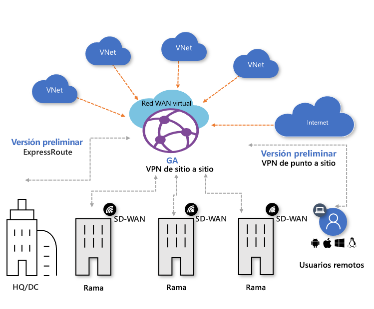

# Acerca de Azure Virtual WAN

Azure Virtual WAN es un servicio de redes que ofrece conectividad entre ramas automatizada y optimizada a y mediante Azure. Las regiones de Azure sirven como centros que se pueden elegir para conectar las distintas ramas. Puede aprovechar la red troncal de Azure para conectar también ramas y disfrutar de la conectividad de rama a red virtual. Tenemos una lista de asociados que admiten la automatización de la conectividad con la VPN de Azure Virtual WAN. Para más información, consulte el artículo sobre [los asociados y las ubicaciones de Virtual WAN](virtual-wan-locations-partners.md).

Azure Virtual WAN reúne muchos servicios de conectividad en la nube de Azure como la VPN de sitio a sitio, la VPN de usuario (de punto a sitio) y ExpressRoute en una única interfaz operativa. La conectividad con las redes virtuales de Azure se establece mediante el uso de conexiones de red virtual. Permite la [arquitectura de red de tránsito global](virtual-wan-global-transit-network-architecture.md) basada en un modelo de conectividad de tipo hub-and-spoke clásica donde el "concentrador" de la red que se hospeda en la nube permite la conectividad transitiva entre puntos de conexión que pueden estar distribuidos en distintos tipos de "radios".

En este artículo se proporciona una vista rápida de la conectividad de red en Azure Virtual WAN. Virtual WAN ofrece las siguientes ventajas:

* **Soluciones de conectividad integrada en una topología en estrella tipo hub-and-stroke:** Configuración de sitio a sitio automatizada y conectividad entre sitios locales y un centro de Azure.
* **Instalación y configuración automatizadas de radio:** conecte sin problemas las cargas de trabajo y las redes virtuales al centro de Azure.
* **Solución intuitiva de problemas:** puede ver el flujo de un extremo a otro dentro de Azure y usar esta información para realizar las acciones necesarias.

## Redes WAN virtuales de tipo Básico y Estándar

Existen dos tipos de WAN virtuales: Básico y Estándar. En la tabla siguiente se muestran las configuraciones disponibles para cada tipo.

[!INCLUDE [Basic and Standard SKUs](../../includes/virtual-wan-standard-basic-include.md)]

Para conocer los pasos para actualizar una WAN virtual, consulte [Actualización de una WAN virtual de plan Básico a Estándar](upgrade-virtual-wan.md).

## Arquitectura

Para obtener información acerca de la arquitectura de Virtual WAN y de cómo migrar a Virtual WAN, consulte los siguientes artículos:

* [Arquitectura de Virtual WAN](migrate-from-hub-spoke-topology.md)
* [Arquitectura de red de tránsito global](virtual-wan-global-transit-network-architecture.md)

## Recursos de Virtual WAN

Para configurar una red Virtual WAN de extremo a otro, debe crear los siguientes recursos:

* **virtualWAN:** El recurso virtualWAN representa una superposición virtual de la red de Azure y es una colección de varios recursos. Contiene vínculos a todos los concentradores virtuales que le gustaría tener dentro de Virtual WAN. Los recursos de Virtual WAN están aislados entre sí y no pueden contener un concentrador común. Los centros de conectividad virtuales mediante Virtual WAN no se comunican entre sí.

* **Centro:** Un concentrador virtual es una red virtual administrada por Microsoft. El concentrador contiene varios puntos de conexión de servicio para habilitar la conectividad. Desde la red local (vpnsite), puede conectarse a una instancia de VPN Gateway dentro del centro de conectividad virtual, conectar circuitos ExpressRoute a un centro de conectividad virtual o incluso conectar usuarios móviles a una puerta de enlace de punto a sitio en el centro de conectividad virtual. El concentrador es el núcleo de la red en una región. Solo puede haber un único concentrador por cada región de Azure.

  Una puerta de enlace de concentrador no es lo mismo que la puerta de enlace de red virtual que usó para ExpressRoute y VPN Gateway. Por ejemplo, cuando se usa Virtual WAN, no se crea una conexión de sitio a sitio desde un sitio local directamente a una red virtual. En su lugar, se crea una conexión de sitio a sitio en el centro. El tráfico siempre pasa a través de la puerta de enlace del concentrador. Esto significa que las redes virtuales no necesitan su propia puerta de enlace de red virtual. Virtual WAN permite que las redes virtuales obtengan provecho del escalado fácilmente mediante el concentrador virtual y su puerta de enlace.

* **Conexión de red virtual del centro:** el recurso de conexión de red virtual de centro se usa para conectar el centro sin problemas a una red virtual.

* **(Versión preliminar) Conexión de concentrador a concentrador**: todos los concentradores están conectados entre sí en una WAN virtual. Esto implica que una rama, un usuario o una red virtual conectados a un concentrador local pueden comunicarse con otra rama o red virtual mediante la arquitectura de malla completa de los concentradores conectados. También puede conectar redes virtuales dentro de un centro de conectividad virtual en tránsito mediante el concentrador virtual, así como redes virtuales a través del concentrador, con el marco conectado de concentrador a concentrador.

* **Tabla de rutas de centro:**  puede crear una ruta del centro virtual y aplicarla a la tabla de rutas del centro virtual. Puede aplicar varias rutas a la tabla de rutas del concentrador virtual.

**Recursos adicionales de Virtual WAN**

  * **Sitio:** este recurso se usa solo para las conexiones de sitio a sitio. El recurso del sitio es **vpnsite**. Representa el dispositivo VPN local y su configuración. Al trabajar con un asociado de Virtual WAN, tiene una solución integrada para exportar automáticamente esta información a Azure.

## Tipos de conectividad

Virtual WAN permite dos tipos de conectividad: VPN de sitio a sitio, VPN de usuario (de punto a sitio) y ExpressRoute.

### Conexión VPN de sitio a sitio

Cuando se crea una conexión de sitio a sitio en Virtual WAN, se puede trabajar con un asociado disponible. Si no desea usar un asociado, puede configurar la conexión manualmente. Para más información, consulte [Creación de una conexión de sitio a sitio mediante Virtual WAN](virtual-wan-site-to-site-portal.md).

#### Flujo de trabajo de asociados de Virtual WAN

Cuando se trabaja con un asociado de Virtual WAN, el flujo de trabajo es el siguiente:

1. El controlador del dispositivo de rama (VPN/SDWAN) se autentica para exportar información centrada en el sitio en Azure mediante el uso de una [entidad de servicio de Azure](../active-directory/develop/howto-create-service-principal-portal.md).
2. El controlador de dispositivo (VPN/SDWAN) de rama obtiene la configuración de conectividad de Azure y actualiza el dispositivo local. De esta forma se automatiza la descarga de la configuración, la edición y la actualización del dispositivo VPN local.
3. Una vez que el dispositivo tiene la configuración de Azure correcta, se establece una conexión de sitio a sitio (dos túneles activos) a Azure WAN. Azure admite tanto IKEv1 como IKEv2. BGP es opcional.

#### Asociados para conexiones de sitio a sitio de Virtual WAN

Para ver una lista de los asociados y las ubicaciones disponibles, consulte el artículo acerca [asociados y ubicaciones de Virtual WAN](virtual-wan-locations-partners.md).

### Conexiones de VPN de usuario (de punto a sitio)

Puede conectarse a los recursos en Azure por medio de una conexión de IPsec/IKE (IKEv2) u OpenVPN. Este tipo de conexión requiere que se configure un cliente VPN en el equipo cliente. Para más información, consulte [Creación de una conexión de punto a sitio](virtual-wan-point-to-site-portal.md).

### Conexiones de ExpressRoute
ExpressRoute permite conectar una red local a Azure mediante una conexión privada. Para crear la conexión, consulte [Create an ExpressRoute connection using Virtual WAN](virtual-wan-expressroute-portal.md) (Creación de una conexión de ExpressRoute mediante Virtual WAN).

## Ubicaciones

Para obtener información de las ubicaciones, consulte el de ubicación, consulte el artículo acerca de los [asociados y ubicaciones de Virtual WAN](virtual-wan-locations-partners.md).

## P+F

[!INCLUDE [Virtual WAN FAQ](../../includes/virtual-wan-faq-include.md)]

## Pasos siguientes

[Creación de una conexión de sitio a sitio mediante Virtual WAN](virtual-wan-site-to-site-portal.md)
