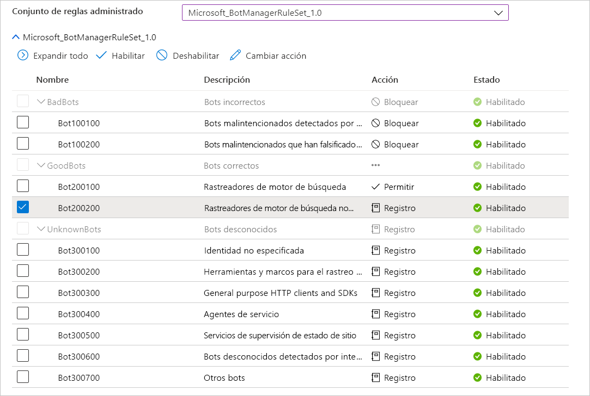

# Firewall de aplicaciones web en Azure en Azure Front Door

Firewall de aplicaciones web (WAF) de Azure en Azure Front Door proporciona protección centralizada para las aplicaciones web que se entregan globalmente con Azure Front Door. Está diseñado para proteger los servicios web frente a ataques y vulnerabilidades comunes y mantener el servicio de alta disponibilidad para los usuarios, además de ayudar a cumplir los requisitos de cumplimiento.

WAF en Front Door es una solución global y centralizada. Se implementa en las ubicaciones perimetrales de red de Azure en todo el mundo y se inspeccionan en el perímetro de red todas las solicitudes entrantes para una aplicación web con WAF habilitado que entregue Front Door. Esto permite a WAF evitar ataques malintencionados cerca de los orígenes de los ataques antes de que entren en la red virtual. Además, ofrece una protección global a escala sin sacrificar el rendimiento. Una directiva de WAF se puede vincular fácilmente con cualquier perfil de Front Door de su suscripción y se pueden implementar reglas nuevas en cuestión de minutos, lo que le permite responder rápidamente a los patrones de amenazas cambiantes.

## Reglas y directiva de WAF

Puede configurar una directiva de WAF y asociarla con uno o varios servidores front-end de Front Door para estar protegido. Una directiva de WAF consta de dos tipos de reglas de seguridad:

- Reglas personalizadas que crea el cliente.

- Conjuntos de reglas administrados que son una colección del conjunto de reglas configurado previamente y administrado por Azure.

Cuando ambos están presentes, las reglas personalizadas se procesan antes de procesar las reglas de un conjunto de reglas administrado. Una regla está formada por una condición de coincidencia, una prioridad y una acción. Los tipos de acción que se admiten son los siguientes: ALLOW, BLOCK, LOG y REDIRECT. Puede crear una directiva totalmente personalizada que cumpla sus requisitos específicos de protección de aplicaciones al combinar reglas personalizadas y administradas.

Las reglas de una directiva se procesan de forma ordenada por prioridad, donde la prioridad es un entero único que define el orden en el que se procesan las reglas. El valor entero más pequeño indica una prioridad más alta y estas se evalúan antes que las reglas con un valor entero más alto. Una vez que una regla coincide, la acción correspondiente que se ha definido en la regla se aplica a la solicitud. Una vez que se procesa esa coincidencia, no se procesan más reglas con prioridades inferiores.

Una aplicación web entregada por Front Door solo puede tener una directiva de WAF asociada a la vez. En cambio, puede tener una configuración de Front Door sin ninguna directiva de WAF asociada con ella. Si una directiva de WAF está presente, se replica a todas nuestras ubicaciones perimetrales para garantizar que haya coherencia en las directivas de seguridad en todo el mundo.

## Modos de WAF

La directiva de WAF se puede configurar para ejecutarse en los siguientes dos modos:

- **Modo de detección:** cuando se ejecuta en el modo de detección, WAF no realiza ninguna acción que no sea supervisar y registrar la solicitud y sus reglas de WAF coincidentes en los registros de WAF. Puede activar el registro de diagnósticos de Front Door (para hacerlo desde el portal, vaya a la sección **Diagnósticos** de Azure Portal).

- **Modo de prevención:** cuando se configura para ejecutarse en el modo de prevención, WAF realiza la acción especificada si una solicitud coincide con una regla y, si se encuentra una coincidencia, no se evalúa ninguna otra regla con prioridad más baja. Todas las solicitudes coincidentes también se registran en los registros de WAF.

## Acciones de WAF

Los clientes de WAF pueden optar por ejecutar desde una de las acciones cuando una solicitud coincide con las condiciones de una regla:

- **Permitir:**  la solicitud pasa por WAF y se reenvía al servidor back-end. Ninguna otra regla de prioridad más baja puede bloquear esta solicitud.
- **Bloquear:** la solicitud está bloqueada y WAF envía una respuesta al cliente sin reenviar la solicitud al servidor back-end.
- **Registrar:**  la solicitud se registra en los registros de WAF y WAF sigue evaluando las reglas de prioridad más baja.
- **Redirigir:** WAF redirige la solicitud al URI especificado. El URI especificado es una configuración de nivel de directiva. Una vez configurado, todas las solicitudes que coinciden con la acción **Redirigir** se enviarán a ese URI.

## Reglas de WAF

Una directiva de WAF puede constar de dos tipos de reglas de seguridad: reglas personalizadas (creadas por el cliente) y conjuntos de reglas administrados (un conjunto de reglas configurado previamente y administrado por Azure).

### Reglas creadas personalizadas

Puede configurar reglas personalizadas de WAF de la siguiente forma:

- **Listas de direcciones IP permitidas y denegadas:** puede configurar reglas personalizadas para controlar el acceso a las aplicaciones web en función de una lista de direcciones IP de cliente o intervalos de direcciones IP. Se admiten los tipos de direcciones IPv4 e IPv6. Esta lista puede configurarse para bloquear o permitir esas solicitudes en las que la IP de origen coincide con una IP de la lista.

- **Control de acceso basado en la ubicación geográfica:** puede configurar reglas personalizadas para controlar el acceso a las aplicaciones web en función del código de país asociado con la dirección IP de un cliente.

- **Control de acceso basado en los parámetros HTTP:** puede configurar reglas personalizadas basadas en la cadena que coincida con los parámetros de solicitud HTTP/HTTPS, como las cadenas de consulta, los argumentos POST, el URI de solicitud, el encabezado de la solicitud y el cuerpo de la solicitud.

- **Control de acceso basado en el método de solicitud:** puede configurar reglas personalizadas basadas en el método de solicitud HTTP de la solicitud, como GET, PUT o HEAD.

- **Restricción del tamaño:** puede configurar reglas personalizadas basadas en las longitudes de determinadas partes de una solicitud, como la cadena de consulta, el URI o el cuerpo de la solicitud.

- **Reglas de limitación de frecuencia:** Las reglas de control de frecuencia están diseñadas para limitar el tráfico anormalmente alto procedente de cualquier dirección IP de cliente. Puede configurar un umbral en función del número de solicitudes web que se permiten de una dirección IP de cliente durante un minuto. Esto no es lo mismo que una regla personalizada de permiso o bloqueo basada en la lista de IP que permita o bloquee todas las solicitudes de una IP de cliente. La limitación de frecuencia se puede combinar con otras condiciones de coincidencia (por ejemplo, la coincidencia de parámetros HTTP(S) para el control granular de la frecuencia).

### Conjuntos de reglas administrados por Azure

Los conjuntos de reglas administrados por Azure proporcionan una forma fácil de implementar la protección frente a un conjunto común de amenazas de seguridad. Dado que Azure administra estos conjuntos de reglas, las reglas se actualizan según sea necesario para protegerse frente a nuevas firmas de ataque. En la versión preliminar pública, el conjunto de reglas predeterminado administrado por Azure incluye reglas frente a las siguientes categorías de amenaza:

- Scripting entre sitios
- Ataques de Java
- Inclusión de archivos locales
- Ataques por inyección de PHP
- Ejecución de comandos remotos
- Inclusión de archivos remotos
- Fijación de sesión
- Protección contra la inyección de código SQL
- Atacantes de protocolo

El número de versión del conjunto de reglas predeterminado se incrementará cuando se agreguen nuevas firmas de ataque al conjunto de reglas.
El conjunto de reglas predeterminado está habilitado de forma predeterminada en el modo de detección de las directivas de WAF. Puede deshabilitar o habilitar reglas individuales en el conjunto de reglas predeterminado para satisfacer los requisitos de su aplicación. También puede establecer acciones específicas (ALLOW/BLOCK/REDIRECT/LOG) por regla. La acción predeterminada es BLOCK. Además, las reglas personalizadas pueden configurarse en la misma directiva de WAF si quiere omitir cualquiera de las reglas previamente configuradas en el conjunto de reglas predeterminado.
Las reglas personalizadas se aplican siempre antes de que se evalúen las reglas del conjunto de reglas predeterminado. Si una solicitud coincide con una regla personalizada, se aplica la acción de regla correspondiente y la solicitud se bloquea o pasa por el servidor back-end, sin invocar ninguna otra regla personalizada ni las reglas del conjunto de reglas predeterminado. Además, tiene la opción de quitar el conjunto de reglas predeterminado de las directivas de WAF.

### Regla de protección contra bots (versión preliminar)

Se puede habilitar un conjunto de reglas de protección contra bots administrado para que WAF realice acciones personalizadas en las solicitudes de direcciones IP malintencionadas conocidas. Las direcciones IP proceden de la fuente Inteligencia sobre amenazas de Microsoft. [Intelligent Security Graph](https://www.microsoft.com/security/operations/intelligence) impulsa la inteligencia sobre amenazas de Microsoft y lo usan numerosos servicios, incluido Azure Security Center.

> [!IMPORTANT]
> Actualmente, el conjunto de reglas de protección contra bots se encuentra en versión preliminar pública y se proporciona con un contrato de nivel de servicio de versión preliminar. Es posible que algunas características no sean compatibles o que tengan sus funcionalidades limitadas.  Para más información, consulte [Términos de uso complementarios de las versiones preliminares de Microsoft Azure](https://azure.microsoft.com/support/legal/preview-supplemental-terms/).

Si la protección contra bots está habilitada, las solicitudes entrantes que coincidan con las IP de cliente de bots malintencionados se registran en el registro FrontdoorWebApplicationFirewallLog. Puede acceder a los registros de WAF desde la cuenta de almacenamiento, el centro de eventos o el análisis de registros. 

## Configuración

La configuración e implementación de todos los tipos de reglas de WAF es compatible con Azure Portal, las API REST, las plantillas de Azure Resource Manager y Azure PowerShell.

## Supervisión

La supervisión de WAF en Front Door se integra con Azure Monitor para realizar un seguimiento de las alertas y supervisar con facilidad las tendencias del tráfico.

## Pasos siguientes

- Aprenda sobre el [firewall de aplicaciones web en Azure Application Gateway](../ag/ag-overview.md).