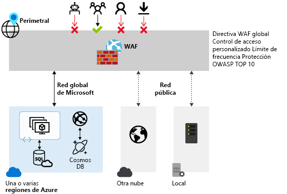

# ¿Qué es el firewall de aplicaciones web de Azure?

El firewall de aplicaciones web (WAF) ofrece una protección centralizada de las aplicaciones web contra las vulnerabilidades de seguridad más habituales. Las aplicaciones web son cada vez más el objetivo de ataques malintencionados que aprovechan vulnerabilidades habitualmente conocidas. Los scripts entre sitios y las inyecciones de código SQL están dentro de los ataques más comunes.

Evitar dichos ataques en el código de la aplicación es todo un desafío. Puede requerir un mantenimiento riguroso, revisión y supervisión en varias capas de la topología de la aplicación. Un firewall de aplicaciones web centralizado ayuda a simplificar muchísimo la administración de la seguridad. Un WAF también proporciona a los administradores de la aplicación a un mejor control de la protección contra amenazas e intrusiones.

Las soluciones de WAF pueden reaccionar más rápido ante una amenaza de la seguridad mediante la aplicación centralizada de revisiones que aborden una vulnerabilidad conocida, en lugar de proteger de manera individual cada aplicación web.

## Servicios admitidos

WAF se puede implementar con [Azure Application Gateway](../application-gateway/overview.md) y [Azure Front Door Service](../frontdoor/front-door-overview.md). Ambos servicios son equilibradores de carga de nivel 7 (HTTP/S), pero el primero es un servicio regional, mientras que el segundo es un servicio global. WAF tiene características personalizadas para cada servicio específico.

Para obtener más información, consulte la información general de WAF en cada servicio.

## Pasos siguientes

- Para más información sobre el firewall de aplicaciones web en Application Gateway, consulte [Firewall de aplicaciones web en Azure Application Gateway](./ag/ag-overview.md).
- Para más información sobre el firewall de aplicaciones web en Azure Front Door Service, consulte [Firewall de aplicaciones web en Azure Front Door Service](./afds/afds-overview.md).
