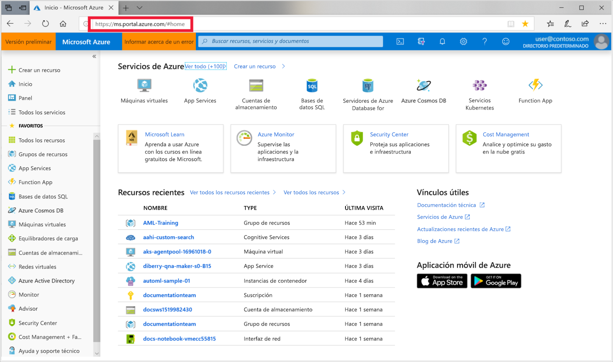
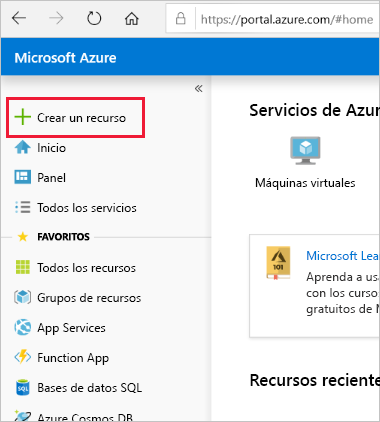
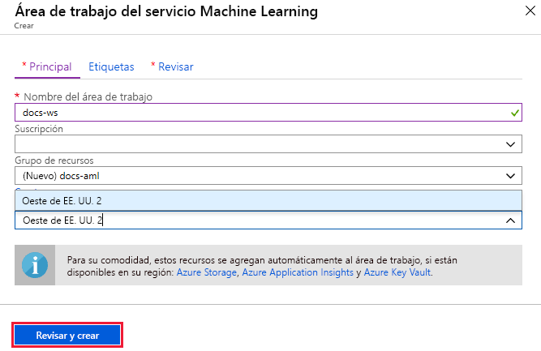

1. Inicie sesión en [Azure Portal](https://portal.azure.com/) con las credenciales de la suscripción de Azure que va a usar. 

   

1. En la esquina superior izquierda del portal, seleccione **Crear un recurso**.

   

1. Escriba **Machine Learning** en la barra de búsqueda. Seleccione el resultado de la búsqueda llamado **Área de trabajo del servicio de Machine Learning**.

   

1. En el panel **Área de trabajo del servicio ML**, seleccione **Crear** para comenzar.

    

1. En el panel **Área de trabajo del servicio de Machine Learning**, configure el área de trabajo.

   Campo|DESCRIPCIÓN
   ---|---
   Nombre del área de trabajo |Escriba un nombre único que identifique el área de trabajo. En este ejemplo, se usa **docs-ws**. Los nombres deben ser únicos en el grupo de recursos. Utilice un nombre que sea fácil de recordar y que se diferencie de las áreas de trabajo creadas por otros.  
   Subscription |Seleccione la suscripción de Azure que quiera usar.
   Grupos de recursos | Use un grupo de recursos existente en su suscripción o escriba un nombre para crear un nuevo grupo de recursos. Un grupo de recursos almacena los recursos relacionados con una solución de Azure. En este ejemplo, se usa **docs-aml**. 
   Location | Seleccione la ubicación más cercana a los usuarios y los recursos de datos. Esta ubicación es donde se crea el área de trabajo.

1. Seleccione **Revisar + crear** para comenzar el proceso de creación.

    

1. Revise la configuración del área de trabajo. Si es correcta, seleccione **Crear**. El área de trabajo puede tardar unos momentos en crearse.

1. Para comprobar el estado de la implementación, seleccione el icono Notificaciones (**campana**) en la barra de herramientas.

1. Cuando finalice el proceso, aparecerá un mensaje de implementación correcta. También está presente en la sección de notificaciones. Para ver la nueva área de trabajo, seleccione **Ir al recurso**.

   
