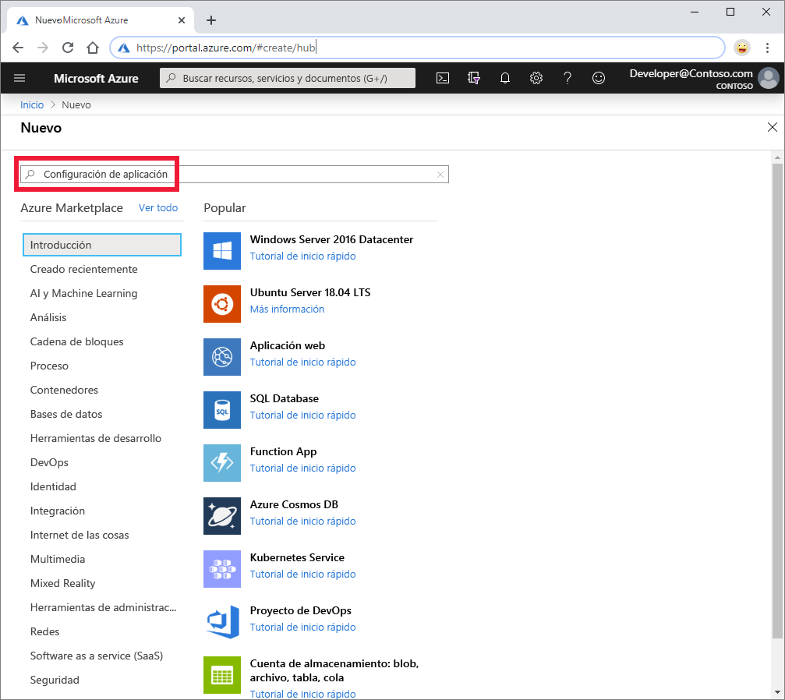
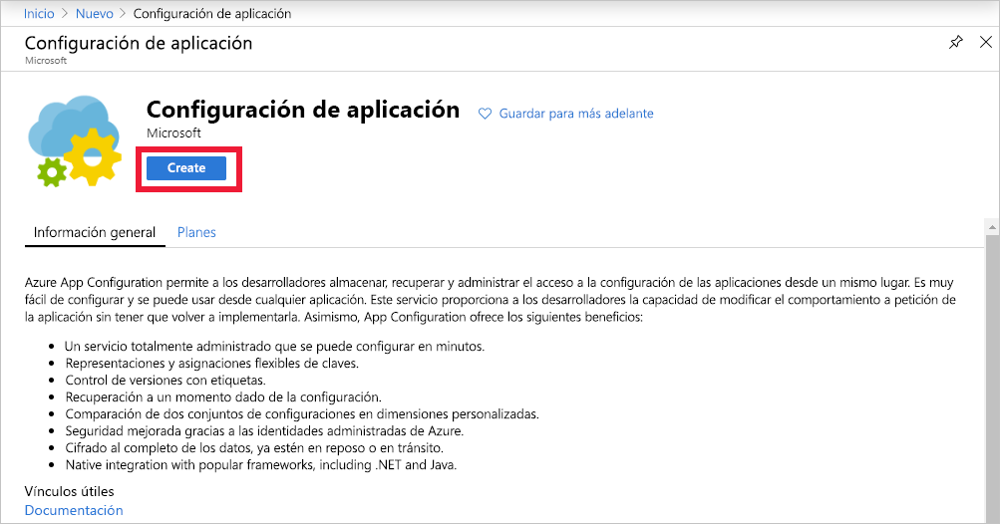
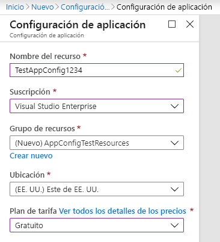

1. Para crear un almacén de App Configuration, inicie sesión en [Azure Portal](https://portal.azure.com). En la esquina superior izquierda de la página principal, seleccione **Crear un recurso**. En el cuadro **Buscar en Marketplace**, escriba **App Configuration** y presione Entrar.

    

1. Seleccione **Configuración de la aplicación** en los resultados de la búsqueda y, después, **Crear**.

    

1. En el panel **App Configuration** > **Crear**, escriba la siguiente configuración:

    | Configuración | Valor sugerido | Descripción |
    |---|---|---|
    | **Nombre del recurso** | Nombre único globalmente | Escriba un nombre de recurso único para usarlo como recurso de almacén de App Configuration. El nombre debe ser una cadena de entre 5 y 50 caracteres y solo puede contener números, letras y el carácter `-`. El nombre no puede comenzar ni terminar con el carácter `-`.  |
    | **Suscripción** | Su suscripción | Seleccione la suscripción de Azure que desee usar para probar App Configuration. Si su cuenta solo tiene una suscripción, se selecciona automáticamente y la lista **Suscripción** no aparece. |
    | **Grupos de recursos** | *AppConfigTestResources* | Seleccione o cree un grupo de recursos para el recurso del almacén de App Configuration. Este grupo es útil para organizar los distintos recursos que quiera eliminar al mismo tiempo mediante la eliminación del grupo de recursos. Para más información, consulte [Administración de los recursos de Azure a través del Portal](/azure/azure-resource-manager/resource-group-overview). |
    | **Ubicación** | *Centro de EE. UU.* | Use **Ubicación** para especificar la ubicación geográfica en la que se hospeda el almacén de App Configuration. Para optimizar el rendimiento, cree el recurso en la misma región que los demás componentes de la aplicación. |
    | **Plan de tarifa** | *Gratis* | Seleccione el plan de tarifa deseado. Para más información, consulte la [página de precios de App Configuration](https://azure.microsoft.com/pricing/details/app-configuration/).

    

1. Seleccione **Crear**. La implementación puede tardar unos minutos.

1. Una vez finaliza la implementación, seleccione **Configuración** > **Claves de acceso**. Tome nota de la cadena de conexión de la clave de solo lectura principal. Usará esta cadena de conexión más adelante para configurar la aplicación y que se comunique con el almacén de Azure App Configuration que ha creado.
