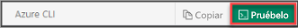

## Apertura de Azure Cloud Shell

Azure Cloud Shell es un shell interactivo gratuito que puede usar para ejecutar los pasos de este artículo. Cloud Shell incluye herramientas comunes de Azure preinstaladas y configuradas para que las use con su cuenta. Seleccione **Copiar** para copiar el código, péguelo en Cloud Shell y presione Entrar para ejecutarlo. Existen varias maneras de abrir Cloud Shell:

|  |   |
|-----------------------------------------------|---|
| Seleccione **Probarlo** en la esquina superior derecha de un bloque de código. |  |
| Abra Cloud Shell en el explorador. |  |
| Seleccione el botón **Cloud Shell** en el menú de la esquina superior derecha de [Azure Portal](https://portal.azure.com). |     |
|  |  |

