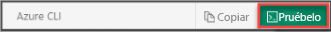

## Uso de Azure Cloud Shell

En Azure se hospeda Azure Cloud Shell, un entorno de shell interactivo que puede utilizar mediante el explorador. Puede usar Bash o PowerShell con Cloud Shell para trabajar con los servicios de Azure. Puede usar los comandos preinstalados de Cloud Shell para ejecutar el código de este artículo sin tener que instalar nada en su entorno local.

Para iniciar Azure Cloud Shell:

| Opción | Ejemplo o vínculo |
|-----------------------------------------------|---|
| Seleccione **Probarlo** en la esquina superior derecha de un bloque de código. Solo con seleccionar **Probar** no se copia automáticamente el código en Cloud Shell. |  |
| Vaya a [https://shell.azure.com](https://shell.azure.com) o seleccione el botón **Iniciar Cloud Shell** para abrir Cloud Shell en el explorador. |  |
| Seleccione el botón **Cloud Shell** en la barra de menús de la esquina superior derecha de [Azure Portal](https://portal.azure.com). |  |

Para ejecutar el código de este artículo en Azure Cloud Shell:

1. Inicie Cloud Shell.

1. Seleccione el botón **Copiar** de un bloque de código para copiar el código.

1. Pegue el código en la sesión de Cloud Shell; para ello, seleccione **Ctrl**+**Shift**+**V** en Windows y Linux, o bien seleccione **Cmd**+**Shift**+**V** en macOS.

1. Seleccione **Entrar** para ejecutar el código.
