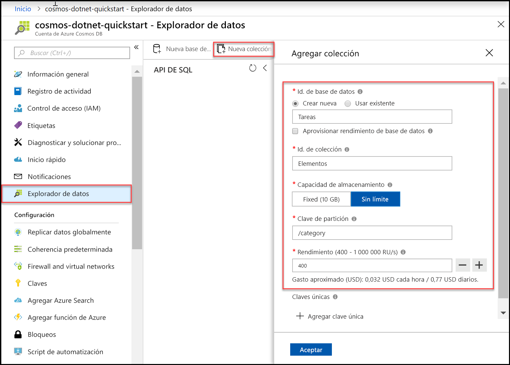

Ahora puede usar la herramienta Explorador de datos en Azure Portal para crear una base de datos y una colección. 

1. Haga clic en **Explorador de datos** > **Nueva colección**. 
    
    El área **Agregar colección** se muestra en el extremo derecho, pero es posible que haya que desplazarse hacia la derecha para verlo.

    

2. En la página **Agregar colección**, especifique la configuración de la nueva colección.

    Configuración|Valor sugerido|DESCRIPCIÓN
    ---|---|---
    Id. de base de datos|*Tareas*|Escriba *Tareas* como nombre de la nueva base de datos. Los nombres de base de datos tiene que tener entre 1 y 255 caracteres y no pueden contener /, \\; #, ?, o un espacio al final.
    Id. de colección|*Items*|Escriba *Elementos* como nombre de la nueva colección. Los identificadores de las colecciones tienen los mismos requisitos de caracteres que los nombres de las bases de datos.
    Aprovisionamiento del rendimiento de la base de datos|Déjelo en blanco|Azure Cosmos DB puede aprovisionar el rendimiento en el nivel de base de datos (todas las colecciones de una base de datos comparten el mismo rendimiento) o en el nivel de colección. Déjelo en blanco para aprovisionar el rendimiento en el nivel de colección para esta colección en particular.
    Capacidad de almacenamiento|*Sin límite*|Elija la capacidad de almacenamiento **Sin límite**. 
    Clave de partición|*/category*|Escriba "/category" como clave de partición. Establecer una clave de partición permite a Azure Cosmos DB escalar la colección para satisfacer las necesidades de almacenamiento y rendimiento de la aplicación. En general, una buena opción de clave de partición es aquella que tiene una amplia variedad de valores distintos, que da como resultado una distribución uniforme de almacenamiento y volumen de solicitudes en la carga de trabajo. [Más información sobre la creación de particiones.](../articles/cosmos-db/partitioning-overview.md)
    Throughput|*400 RU/s*|Cambie el rendimiento a 400 unidades de solicitud por segundo (RU/s). Si quiere reducir la latencia, puede escalar verticalmente el rendimiento más adelante. 
    
    Además de la configuración anterior, puede agregar opcionalmente **claves únicas** para la colección. En este ejemplo vamos a dejar el campo en blanco. Las claves únicas proporcionan a los desarrolladores la capacidad de agregar una capa de integridad de datos a la base de datos. Mediante la creación de una directiva de clave única al crear una colección, se garantiza la unicidad de uno o varios valores por clave de partición. Para más información, consulte el artículo [Claves únicas en Azure Cosmos DB](../articles/cosmos-db/unique-keys.md).
    
    Haga clic en **OK**.

    El Explorador de datos muestra la nueva base de datos y la colección.

    