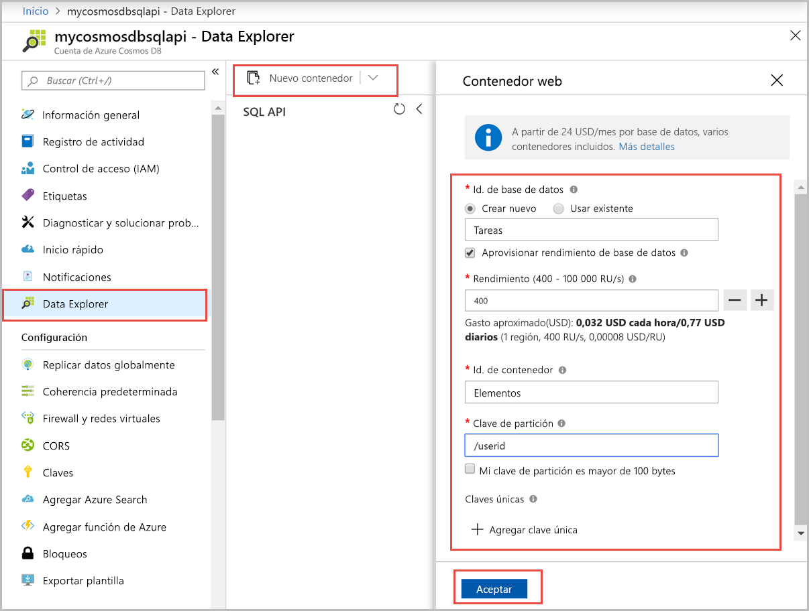

Ahora puede usar la herramienta Explorador de datos en Azure Portal para crear una base de datos y un contenedor. 

1. Seleccione **Data Explorer** > **Nuevo contenedor**. 
    
    El área **Agregar contenedor** se muestra en el extremo derecho, pero es posible que haya que desplazarse hacia la derecha para verlo.

    

2. En la página **Agregar contenedor**, especifique la configuración del nuevo contenedor.

    |Configuración|Valor sugerido|Descripción
    |---|---|---|
    |**Identificador de base de datos**|Tareas|Escriba *Tareas* como nombre de la nueva base de datos. Los nombres de base de datos tienen que tener entre 1 y 255 caracteres y no pueden contener `/, \\, #, ?` o espacios finales. Seleccione la opción **Provision database throughput** (Aprovisionar rendimiento de la base de datos) que le permite compartir el rendimiento aprovisionado de la base de datos entre todos los contenedores de esta. Esta opción también le ayudará a reducir los costos. |
    |**Rendimiento**|400|Deje el rendimiento en 400 unidades de solicitud por segundo (RU/s). Si quiere reducir la latencia, puede escalar verticalmente el rendimiento más adelante.| 
    |**ID de contenedor**|Elementos|Escriba *Elementos* como nombre del nuevo contenedor. Los identificadores de contenedor tienen los mismos requisitos de caracteres que los nombres de las bases de datos.|
    |**Clave de partición**| /categoría| El ejemplo que se describe en este artículo usa */category* como clave de partición.|
    
    Además de la configuración anterior, puede agregar opcionalmente **claves únicas** para el contenedor. En este ejemplo vamos a dejar el campo en blanco. Las claves únicas proporcionan a los desarrolladores la capacidad de agregar una capa de integridad de datos a la base de datos. Mediante la creación de una directiva de clave única al crear un contenedor, se garantiza la unicidad de uno o varios valores por clave de partición. Para más información, consulte el artículo [Claves únicas en Azure Cosmos DB](../articles/cosmos-db/unique-keys.md).
    
    Seleccione **Aceptar**. El Explorador de datos muestra la nueva base de datos y el contenedor.