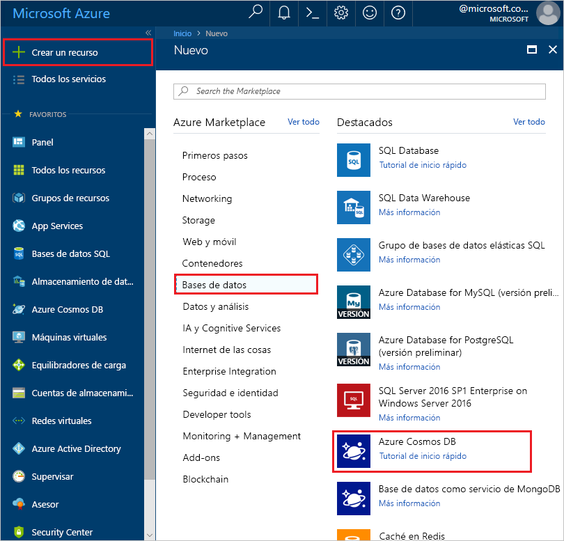
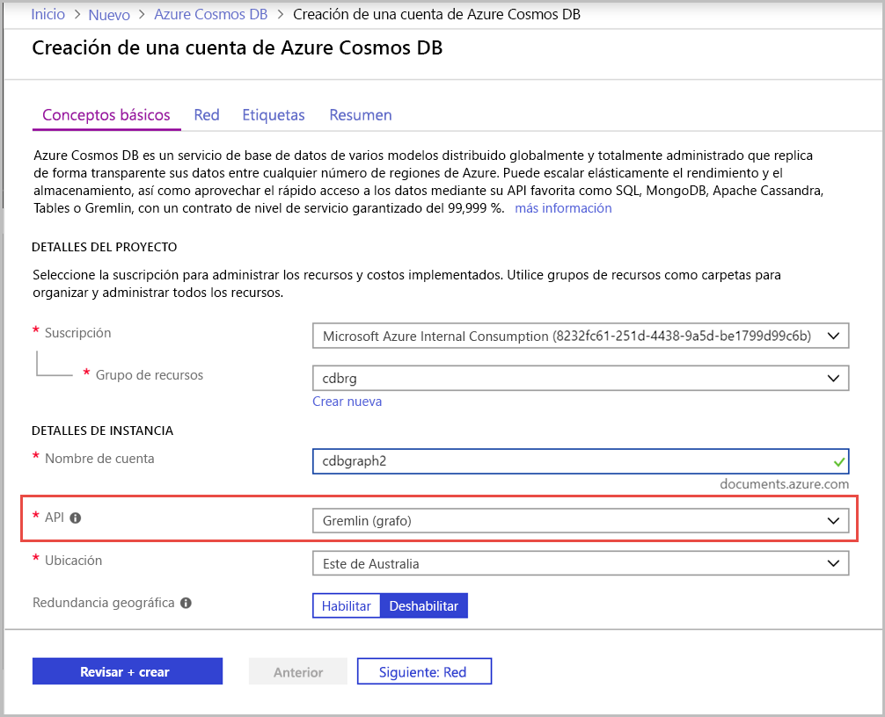
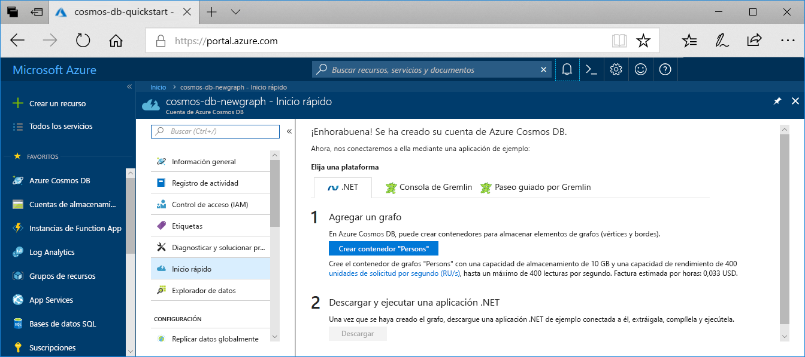

1. En una nueva ventana del explorador, inicie sesión en [Azure Portal](https://portal.azure.com/).

2. Haga clic en **Crear un recurso** > **Bases de datos** > **Azure Cosmos DB**.
   
   

3. En la página **Crear una cuenta de Azure Cosmos DB**, especifique la configuración de la nueva cuenta de Azure Cosmos DB. 

    Configuración|Valor|DESCRIPCIÓN
    ---|---|---
    Subscription|Su suscripción|Seleccione la suscripción de Azure que quiere usar para esta cuenta de Azure Cosmos DB. 
    Grupo de recursos|Crear nuevo  A continuación, escriba el mismo nombre único que se proporcionó en el identificador|Seleccione **Crear nuevo**. A continuación, escriba un nombre nuevo de grupo de recursos para la cuenta. Para simplificar, utilice el mismo nombre del identificador. 
    Nombre de cuenta|Escriba un nombre único.|Escriba un nombre único para identificar la cuenta de Azure Cosmos DB. Dado que *documents.azure.com* se anexa al identificador que se proporciona para crear el identificador URI, debe usar un identificador único.  El identificador solo debe contener letras minúsculas, números y el carácter de guion (-). Debe tener una longitud de entre 3 y 31 caracteres.
    API|Gremlin (graph)|La API determina el tipo de cuenta que se va a crear. Azure Cosmos DB proporciona cinco API: Core(SQL) para bases de datos de documentos, Gremlin para bases de datos de grafos, MongoDB para bases de datos de documentos, Azure Table y Cassandra. Actualmente, debe crear una cuenta independiente para cada API.   Seleccione **Gremlin (grafo)**, ya que en esta guía de inicio rápido va a crear una tabla que funciona con la API de Gremlin.   [Más información sobre Graph API](../articles/cosmos-db/graph-introduction.md)|
    Ubicación|Seleccionar la región más cercana a los usuarios|Seleccione una ubicación geográfica para hospedar la cuenta de Azure Cosmos DB. Use la ubicación más cercana a los usuarios para proporcionarles el acceso más rápido a los datos.

    Seleccione **Revisar y crear**. Puede omitir las secciones **Red** y **Etiquetas**. 

    

4. La cuenta tarda unos minutos en crearse. Espere a que el portal muestre la página **¡Enhorabuena! Se ha creado su cuenta de Azure Cosmos DB**.

    