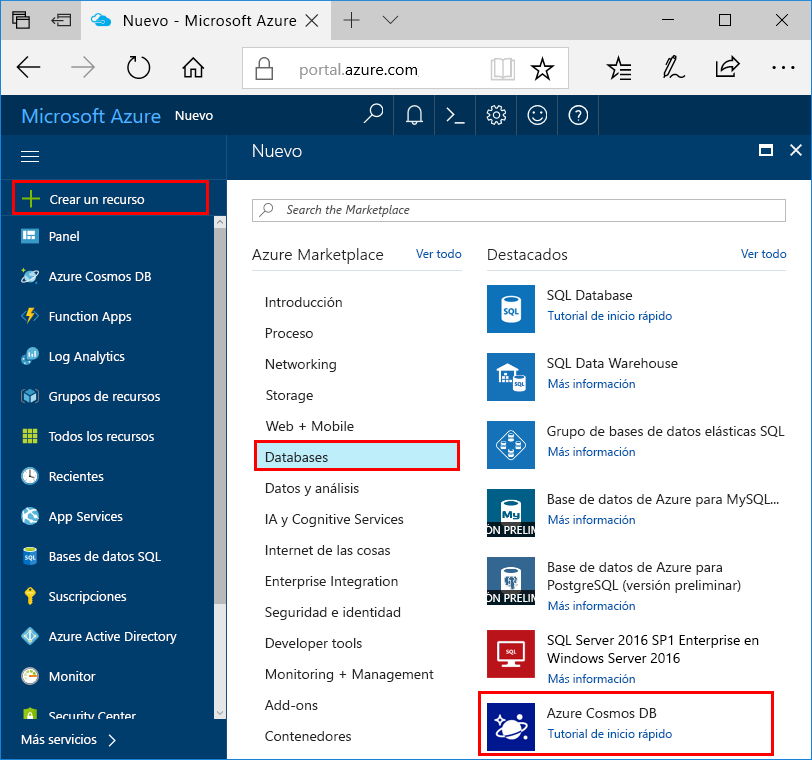
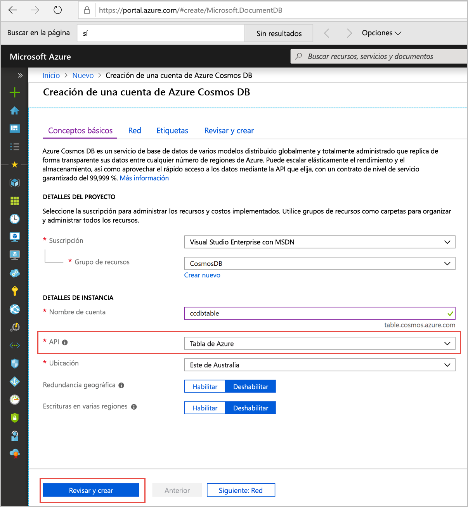
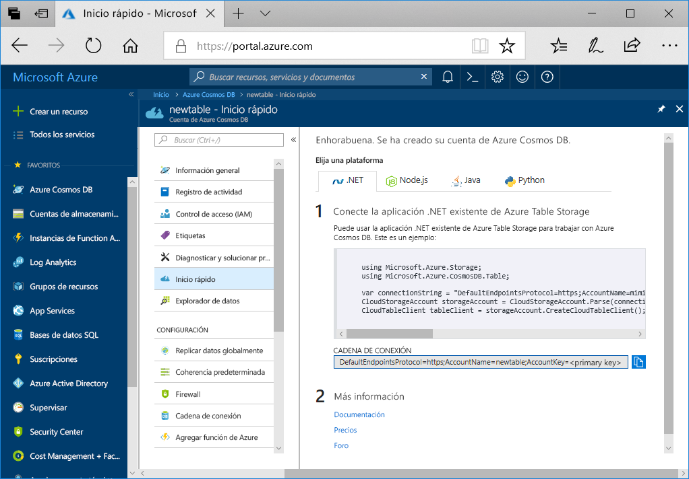

1. En una nueva ventana del explorador, inicie sesión en [Azure Portal](https://portal.azure.com/).
2. En el panel de navegación izquierdo, seleccione **Crear un recurso**. Seleccione **Bases de datos** y, luego, **Azure Cosmos DB**.
   
   

3. En la página **Crear una cuenta de Azure Cosmos DB**, especifique la configuración de la nueva cuenta de Azure Cosmos DB:
 
    Configuración|Valor|DESCRIPCIÓN
    ---|---|---
    Subscription|Su suscripción|Seleccione la suscripción de Azure que quiere usar para esta cuenta de Azure Cosmos DB. 
    Grupo de recursos|Crear nuevo  A continuación, escriba el mismo nombre único que se proporcionó en el identificador|Seleccione **Crear nuevo**. Luego, escriba un nombre nuevo de grupo de recursos para la cuenta. Para simplificar, utilice el mismo nombre del identificador. 
    Nombre de cuenta|Escriba un nombre único.|Escriba un nombre único para identificar la cuenta de Azure Cosmos DB.  El identificador solo debe contener letras minúsculas, números y el carácter de guion (-). El nombre debe tener entre 3 y 31 caracteres.
    API|tabla de Azure|La API determina el tipo de cuenta que se va a crear. Azure Cosmos DB proporciona cinco API: Core(SQL) para bases de datos de documentos, Gremlin para bases de datos de grafos, MongoDB para bases de datos de documentos, Azure Table y Cassandra. Actualmente, debe crear una cuenta independiente para cada API.   Seleccione **Tabla de Azure**, ya que en este inicio rápido va a crear una tabla que funciona con Table API.   [Más información acerca de Table API](../articles/cosmos-db/table-introduction.md).|
    Ubicación|Seleccionar la región más cercana a los usuarios|Seleccione una ubicación geográfica para hospedar la cuenta de Azure Cosmos DB. Use la ubicación más cercana a los usuarios para proporcionarles el acceso más rápido a los datos.

    En las opciones **Redundancia geográfica**  y **Escrituras en varias regiones**  puede dejar sus valores predeterminados (**Deshabilitar**) para evitar gastos de RU adicionales. Puede omitir las secciones **Red** y **Etiquetas**.

5. Seleccione **Revisar y crear**. Una vez completada la validación, seleccione **Crear** para crear la cuenta. 
 
   

6. La operación de creación de la cuenta tarda unos minutos. Verá el mensaje **La implementación está en curso**. Espere hasta que finalice implementación y seleccione **Ir al recurso**.

    
