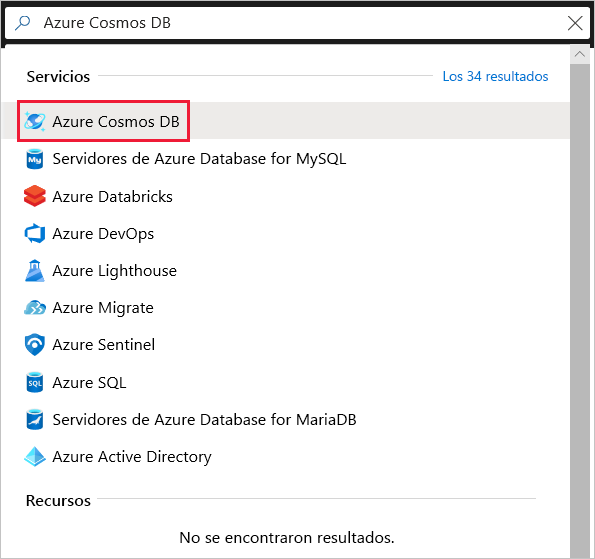
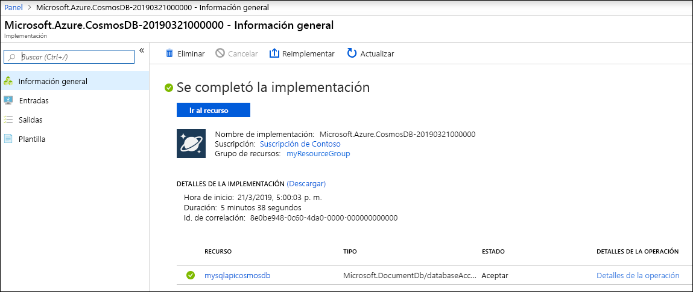
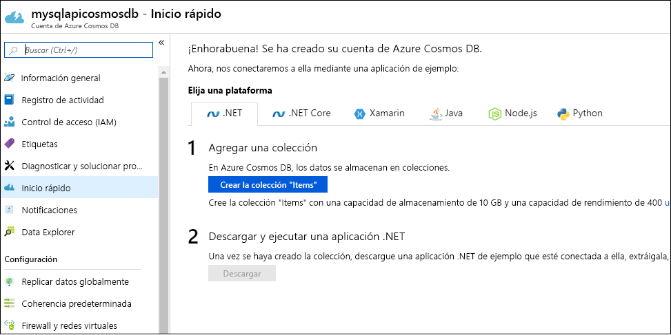

1. Vaya a [Azure Portal](https://portal.azure.com/) para crear una cuenta de Azure Cosmos DB. Busque y seleccione **Azure Cosmos DB**.

   

1. Seleccione **Agregar**.
1. En la página **Creación de una cuenta de Azure Cosmos DB** , especifique la configuración básica de la nueva cuenta de Azure Cosmos. 

    |Configuración|Value|Descripción |
    |---|---|---|
    |Subscription|Nombre de suscripción|Seleccione la suscripción de Azure que desea usar para esta cuenta de Azure Cosmos. |
    |Grupo de recursos|Definición de un nombre de grupo de recursos|Seleccione un grupo de recursos o seleccione **Crear nuevo** y escriba un nombre único para el grupo de recursos nuevo. |
    |Nombre de cuenta|Un nombre único|Escriba un nombre para identificar la cuenta de Azure Cosmos. Dado que *documents.azure.com* se anexa al nombre que se proporciona para crear el identificador URI, debe usar un nombre único.  El nombre solo puede contener letras minúsculas, números y el carácter de guion (-). Debe tener una longitud de entre 3 y 31 caracteres.|
    |API|El tipo de cuenta que se va a crear|Seleccione **Core(SQL)** para crear una base de datos de documentos y consultarla mediante la sintaxis SQL.   La API determina el tipo de cuenta que se va a crear. Azure Cosmos DB proporciona cinco API: Core (SQL) y MongoDB para datos de documento, Gremlin para datos de gráfico, Azure Table y Cassandra. Actualmente, debe crear una cuenta independiente para cada API.   [Más información acerca de SQL API](../articles/cosmos-db/documentdb-introduction.md).|
    |Aplicación de descuento por nivel Gratis|Aplicar o no aplicar|Con el nivel Gratis de Azure Cosmos DB, obtendrá los primeros 400 RU/s y 5 GB de almacenamiento gratis en una cuenta. Más información acerca del [nivel Gratis](https://azure.microsoft.com/pricing/details/cosmos-db/).|
    |Location|Región más cercana a los usuarios|Seleccione una ubicación geográfica para hospedar la cuenta de Azure Cosmos DB. Use la ubicación más cercana a los usuarios para que puedan acceder de la forma más rápida posible a los datos.|
    |Tipo de cuenta|Producción o no producción|Seleccione **Producción** si la cuenta se va a usar para una carga de trabajo de producción. Seleccione **No producción** si la cuenta se va a usar para entornos que no son de producción, como desarrollo, pruebas, control de calidad o almacenamiento provisional. Se trata de una configuración de etiquetas de recursos de Azure que ajusta la experiencia del portal, pero no afecta a la cuenta de Azure Cosmos DB subyacente. Este valor se puede cambiar en cualquier momento.|

> [!NOTE]
> Puede tener una cuenta de Azure Cosmos DB de nivel Gratis por cada suscripción de Azure y debe optar por tenerla al crear la cuenta. Si no ve la opción para aplicar el descuento por nivel Gratis, significará que en otra cuenta de la suscripción ya se ha habilitado el nivel Gratis.
   
   

1. Seleccione **Revisar + crear**. Puede omitir las secciones **Red** y **Etiquetas**.

1. Revise la configuración de la cuenta y seleccione **Crear**. La operación de creación de la cuenta tarda unos minutos. Espere hasta que la página del portal muestre **Se completó la implementación** . 

    

1. Seleccione **Ir al recurso** para ir a la página de la cuenta de Azure Cosmos DB. 

    
