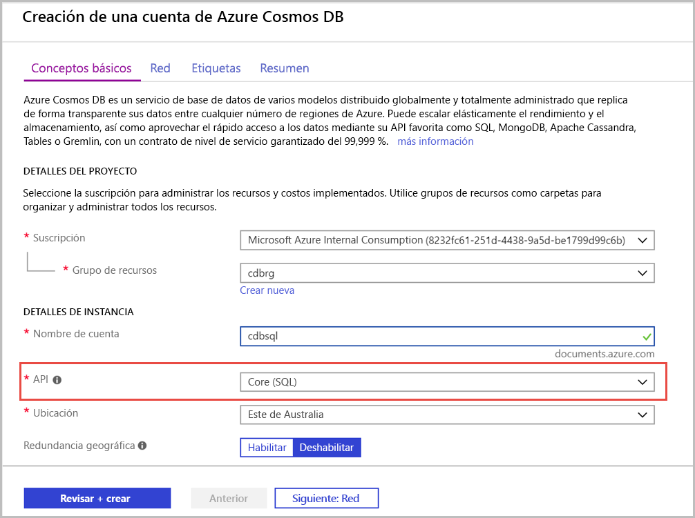

1. Inicie sesión en el [Azure Portal](https://portal.azure.com/).
1. Seleccione **Crear un recurso** > **Bases de datos** > **Azure Cosmos DB**.
   
   

1. En la página **Creación de una cuenta de Azure Cosmos DB** , especifique la configuración básica de la nueva cuenta de Azure Cosmos. 
 
    |Configuración|Valor|DESCRIPCIÓN |
    |---|---|---|
    |Subscription|Nombre de la suscripción|Seleccione la suscripción de Azure que desea usar para esta cuenta de Azure Cosmos. |
    |Grupo de recursos|Definición de un nombre de grupo de recursos|Seleccione un grupo de recursos o seleccione **Crear nuevo** y escriba un nombre único para el grupo de recursos nuevo. |
    | Nombre de cuenta|Escriba un nombre único.|Escriba un nombre para identificar la cuenta de Azure Cosmos. Dado que *documents.azure.com* se anexa al identificador que se proporciona para crear el identificador URI, debe usar un identificador único.  El identificador solo puede contener letras minúsculas, números y el carácter de guion (-). Debe tener una longitud de entre 3 y 31 caracteres.|
    | API|Core (SQL)|La API determina el tipo de cuenta que se va a crear. Azure Cosmos DB proporciona cinco API: Core (SQL) y MongoDB para datos de documento, Gremlin para datos de gráfico, Azure Table y Cassandra. Actualmente, debe crear una cuenta independiente para cada API.   Seleccione **Core(SQL)** para crear una base de datos de documentos y consultarla mediante la sintaxis SQL.   [Más información acerca de SQL API](../articles/cosmos-db/documentdb-introduction.md).|
    | Ubicación|Seleccionar la región más cercana a los usuarios|Seleccione una ubicación geográfica para hospedar la cuenta de Azure Cosmos DB. Use la ubicación más cercana a los usuarios para que puedan acceder de la forma más rápida posible a los datos.|
   
   

1. Seleccione **Revisar + crear**. Puede omitir las secciones **Red** y **Etiquetas**. 

1. Revise la configuración de la cuenta y seleccione **Crear**. La operación de creación de la cuenta tarda unos minutos. Espere hasta que la página del portal muestre **Se completó la implementación** . 

    

1. Seleccione **Ir al recurso** para ir a la página de la cuenta de Azure Cosmos DB. 

    
