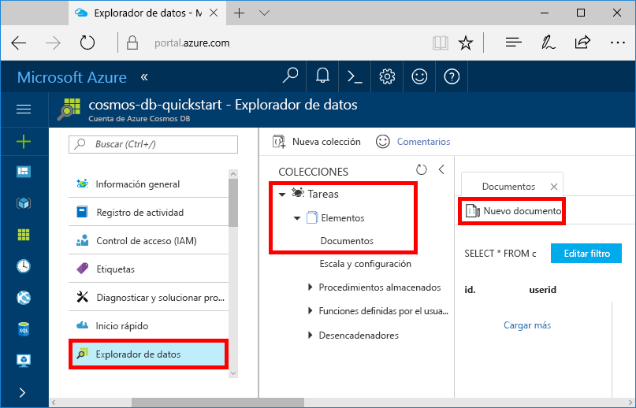
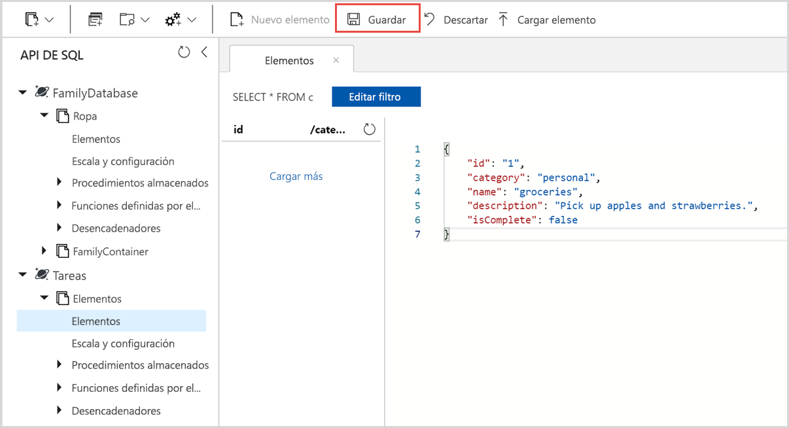

Ahora, puede agregar datos al nuevo contenedor con el Explorador de datos.

1. En el **Explorador de datos**, expanda la base de datos **Tareas** y, después, el contenedor **Elementos**. Seleccione **Elementos** y, después, **Nuevo elemento**.

   
  
2. Ahora, agregue un documento al contenedor con la estructura siguiente.

     ```json
     {
         "id": "1",
         "category": "personal",
         "name": "groceries",
         "description": "Pick up apples and strawberries.",
         "isComplete": false
     }
     ```

3. Después de agregar el archivo JSON a la pestaña **Documentos**, seleccione **Guardar**.

    

4.  Cree y guarde un documento más donde insertará un valor único para la propiedad `id` y cambie las demás propiedades como corresponda. Los nuevos documentos pueden tener la estructura que quiera, ya que Azure Cosmos DB no impone ningún esquema en los datos.