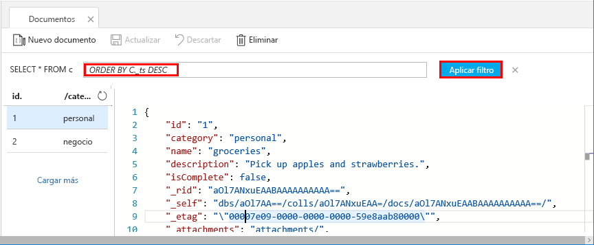
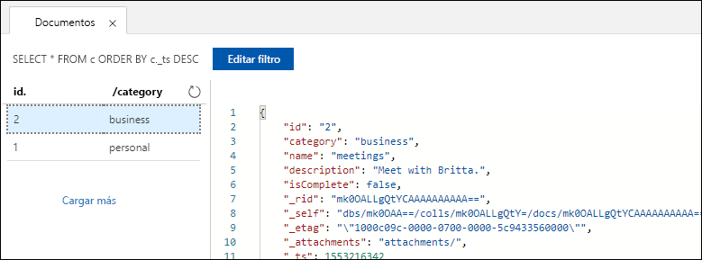

Ahora puede usar consultas en Data Explorer para recuperar y filtrar los datos.

1. En la parte superior de la pestaña **Documentos** de Data Explorer, examine la consulta predeterminada `SELECT * FROM c`. Esta consulta recupera y muestra todos los documentos de la colección por orden de identificador. 
   
   
   
1. Para cambiar la consulta, seleccione **Editar filtro**, reemplace la consulta predeterminada por `ORDER BY c._ts DESC`y, después, seleccione **Aplicar filtro**.
   
   

   Esta consulta modificada muestra los documentos en orden descendente según su marca de tiempo, por lo que ahora el segundo documento aparece en primer lugar. 
   
   

Si está familiarizado con la sintaxis de SQL, puede especificar cualquiera de las [consultas SQL](../articles/cosmos-db/sql-api-sql-query.md) admitidas en el cuadro de predicado de consulta. También puede usar Data Explorer para crear procedimientos almacenados, UDF y desencadenadores para la lógica de negocios del servidor. 

Data Explorer proporciona un acceso sencillo en Azure Portal a todas las características de acceso a datos mediante programación integrado que está disponible en las API. Use también el portal para escalar el rendimiento, obtener las claves y cadenas de conexión, y revisar las métricas y los contratos de nivel de servicio de la cuenta de Azure Cosmos DB. 

