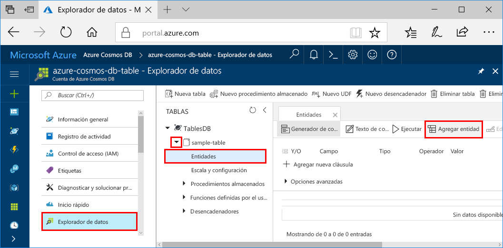
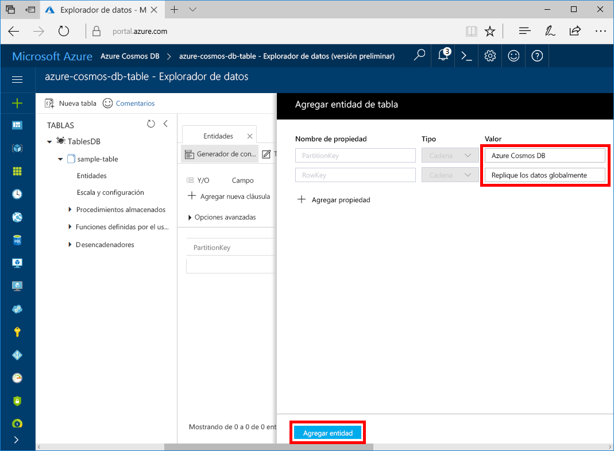

Ahora puede agregar datos a la nueva tabla mediante el Explorador de datos.

1. En el Explorador de datos, expanda **sample-table** y haga clic en **Entidades** y en **Agregar entidad**.

   
2. Ahora agregue datos al cuadro de valores de PartitionKey y RowKey y haga clic en **Agregar entidad**.

   
  
    Ahora puede agregar más entidades a la tabla, editar las entidades o consultar los datos en el Explorador de datos. En el Explorador de datos también puede escalar el rendimiento y agregar procedimientos almacenados, funciones definidas por el usuario y desencadenadores a su tabla.