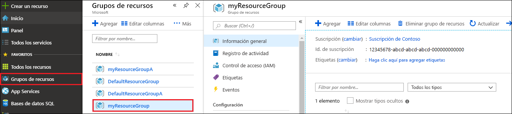
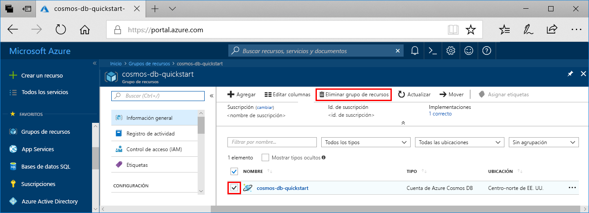

Cuando haya terminado tanto con la aplicación web como con la cuenta de Azure Cosmos DB, puede eliminar los recursos de Azure que creó para no tener más gastos. Para eliminar los recursos:

1. En Azure Portal, seleccione **Grupos de recursos** a la izquierda del todo. Si el menú de la izquierda está contraído, seleccione el  para expandirlo.

2. Seleccione el grupo de recursos que creó para este inicio rápido.  

   

2. En la nueva ventana, seleccione **Eliminar grupo de recursos**.

      

3. En la ventana siguiente, escriba el nombre del grupo de recursos que desea eliminar y, después, seleccione **Eliminar**.

