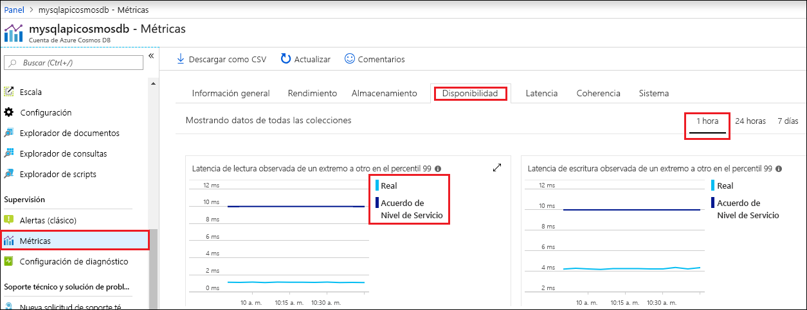

Azure Portal supervisa el rendimiento, capacidad de almacenamiento, disponibilidad, latencia y coherencia de su cuenta de Cosmos DB. Los gráficos de las métricas asociadas con un [Acuerdo de Nivel de Servicio (SLA) de Azure Cosmos DB](https://azure.microsoft.com/support/legal/sla/cosmos-db/) muestran el rendimiento real en comparación con el valor de este acuerdo. Este conjunto de métricas hace que la supervisión de los Acuerdos de Nivel de Servicio sea transparente.

Para revisar las métricas y los Acuerdos de Nivel de Servicio: 

1. Seleccione **Métricas** en el menú de navegación de la cuenta de Cosmos DB.
   
2. Seleccione una pestaña como **Latencia** y seleccione un período de tiempo a la derecha. Compare las líneas **Real** y **SLA** de los gráficos.
   
   
   
3. Revise las métricas de las otras pestañas. 

