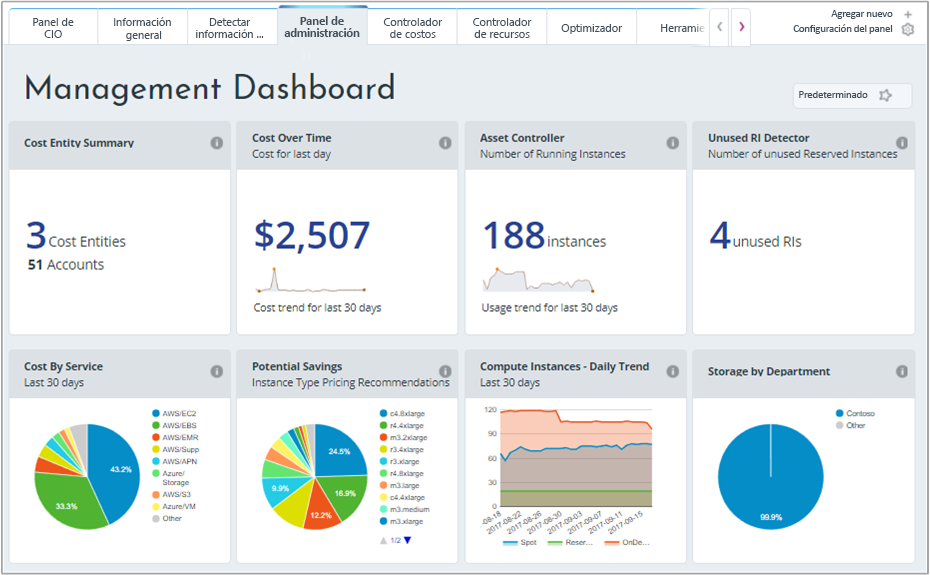
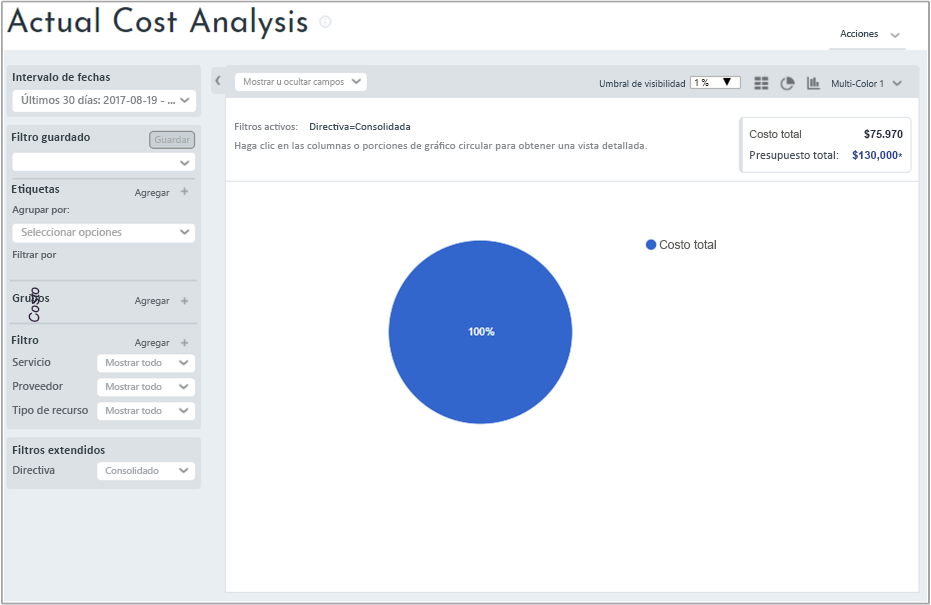
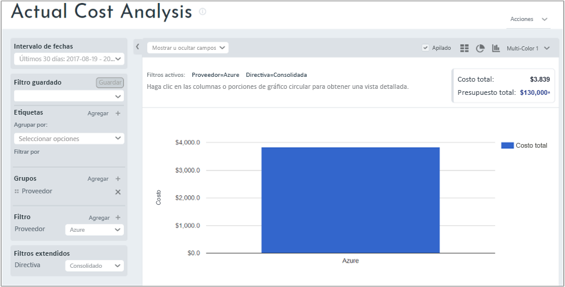
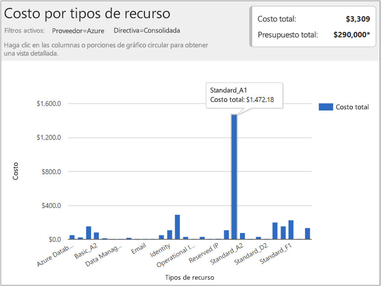
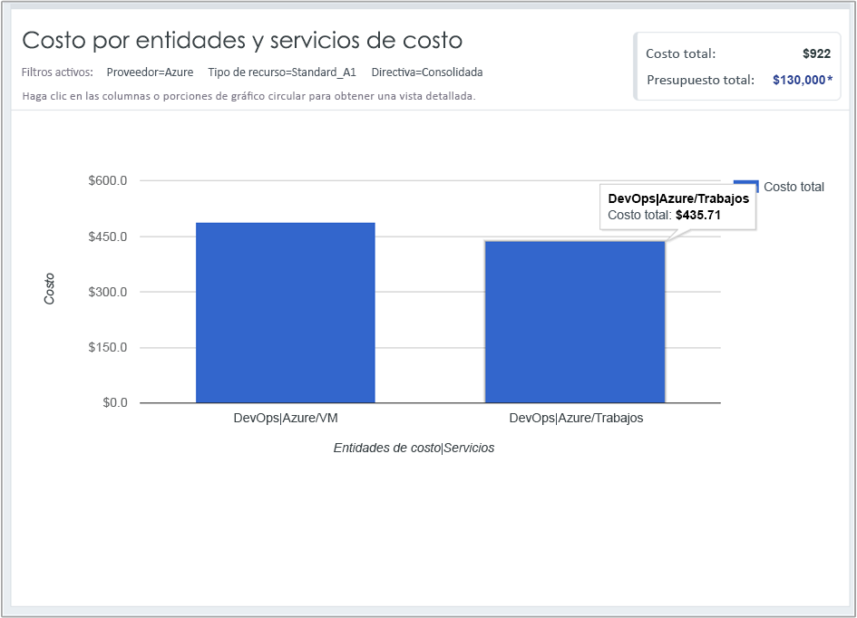

## Visualización de datos de costos

La administración de costos de Azure por Cloudyn proporciona acceso a todos los datos de recursos en la nube. Desde los informes de panel, puede buscar informes estándar y personalizados en una vista con pestañas. Los siguientes son ejemplos de un panel y un informe populares que muestran los datos de costo inmediatamente.

En este ejemplo, el panel de administración muestra los costos consolidados para la empresa Contoso a través de todos sus recursos de nube. Contoso usa Azure, AWS y Google. Los paneles proporcionan información de un vistazo y son una forma rápida de navegar por los informes.  

Si no está seguro del propósito de un informe en un panel, mantenga el puntero sobre el símbolo **i** para ver una explicación. Haga clic en cualquier informe de un panel para ver el informe completo.

También puede ver los informes con el menú de informes en la parte superior del portal. Eche un vistazo al gasto de recursos de Azure en Contoso durante los últimos 30 días. Haga clic en **Costos** > **Análisis de costos** > **Análisis del costo real**. Borre todos los valores si no hay ningún conjunto para etiquetas, grupos o filtros en el informe.

En este ejemplo, $122 273 es el costo total y el presupuesto es $290 000.

Ahora, vamos a modificar el formato de informe y establecer grupos y filtros para restringir los resultados de los costos de Azure. Establezca el **intervalo de fechas** en los últimos 30 días. En la parte superior derecha, haga clic en el símbolo de columna para darle formato de gráfico de barras y, en Grupos, seleccione **Proveedor**. Después, establezca un filtro para **Proveedor** en **Azure**.

En este ejemplo, el costo total de los recursos de Azure era de $3309 durante los últimos 30 días.

Haga clic con el botón derecho en la barra Proveedor (Azure) y explore en profundidad en **Tipos de recursos**.

En la siguiente imagen se muestran los costos en los recursos de Azure que incurre Contoso. El total era $3309. En este ejemplo, aproximadamente la mitad de los costos se destinaban VM Standard_A1 y aproximadamente la otra mitad de los costos se destinaban a varios servicios de Azure e instancias de VM.

Haga clic con el botón derecho en un tipo de recurso y seleccione **Cost Entities** (Entidades de costo) para ver las entidades y los servicios que ha consumido el recurso. En la siguiente imagen de ejemplo, el almacenamiento con redundancia local se establece como tipo de recurso. Contoso|Azure/Storage consumió $15,65. Engineering|Azure Storage consumió $164,25. Shared Infrastructure|Azure/Storage consumió $116,58. El costo total de los servicios es de $296.

Para visualizar un tutorial de vídeo sobre cómo ver los datos de facturación en la nube, consulte [Analyzing your cloud billing data vs. time with Azure Cost Management by Cloudyn](https://youtu.be/G0pvI3iLH-Y) (Análisis de los datos frente al tiempo de facturación en la nube con Azure Cost Management de Cloudyn).
