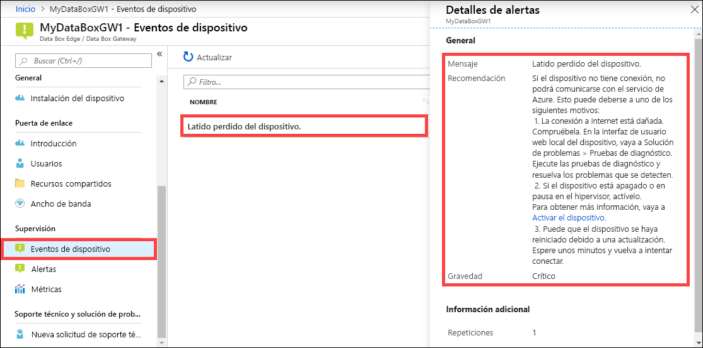

Para ver un evento de dispositivo, siga estos pasos en Azure Portal.

1. En Azure Portal, vaya al recurso Data Box Edge o Data Box Gateway y, después, a **Supervisión > Eventos de dispositivo**.
2. Seleccione un evento para ver los detalles de la alerta. Siga los pasos necesarios para resolver la condición de la alerta.

    