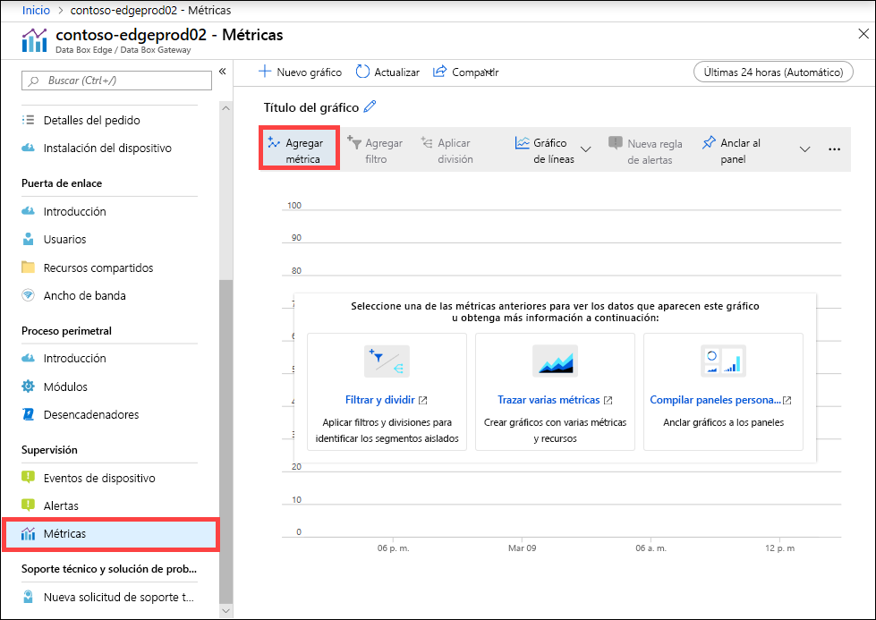
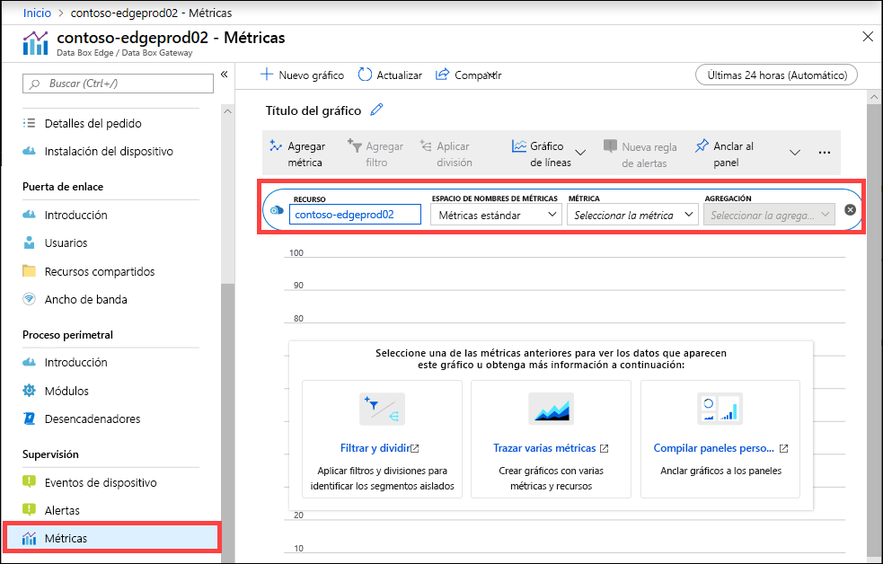
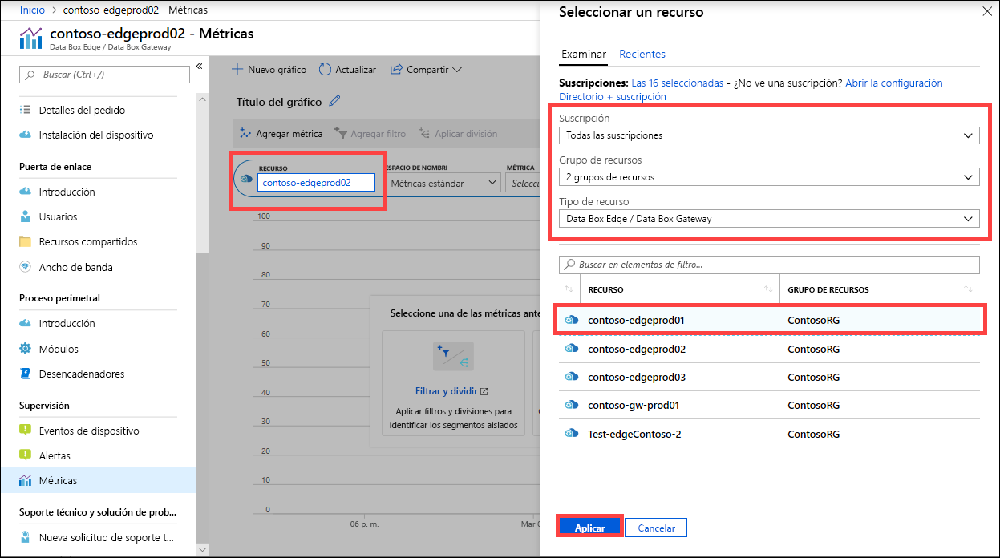
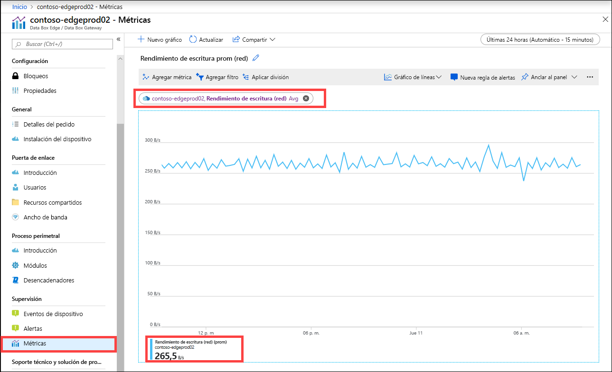
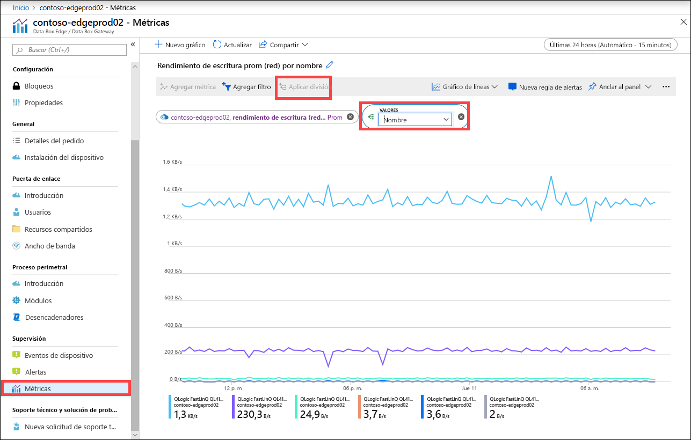
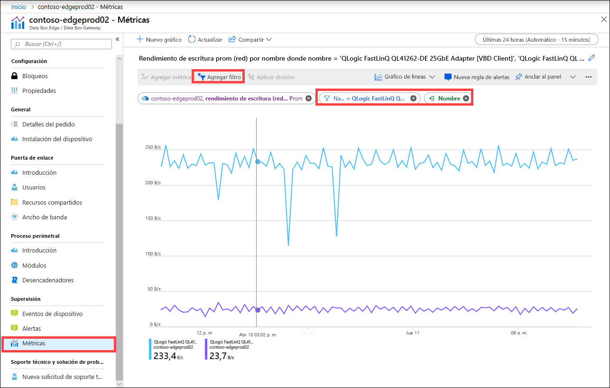
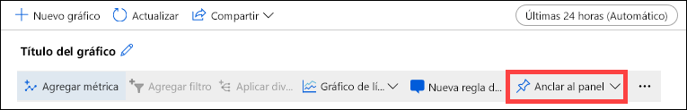

También puede ver las métricas para supervisar el rendimiento del dispositivo y, en algunos casos, para solucionar problemas del dispositivo.

Para crear un gráfico para las métricas del dispositivo seleccionadas, siga estos pasos en Azure Portal.

1. Para el recurso en Azure Portal, vaya a **Supervisión > Métricas** y seleccione **Agregar métrica**.

    

2. El nombre del recurso se rellena automáticamente.  

    

    Para especificar otro recurso, selecciónelo. En la hoja **Seleccionar un recurso**, seleccione la suscripción, el grupo de recursos, el tipo de recurso y el recurso específico para el que quiera mostrar las métricas y seleccione **Aplicar**.

    

3. En la lista desplegable, seleccione una métrica para supervisar el dispositivo. Las métricas pueden ser **Métricas de capacidad** o **Métricas de transacciones**. Las métricas de capacidad están relacionadas con la capacidad del dispositivo. Las métricas de transacción están relacionadas con las operaciones de lectura y de escritura en Azure Storage.

    |Métricas de capacidad                     |DESCRIPCIÓN  |
    |-------------------------------------|-------------|
    |**Capacidad disponible**               | Se refiere al tamaño de los datos que se pueden escribir en el dispositivo. En otras palabras, esta es la capacidad que puede estar disponible en el dispositivo.   Puede liberar la capacidad del dispositivo mediante la eliminación de la copia local de los archivos que tienen una copia tanto en el dispositivo como en la nube.        |
    |**Capacidad total**                   | Hace referencia al número total de bytes en el dispositivo para escribir datos. También se conoce como el tamaño total de la memoria caché local.    Ahora puede aumentar la capacidad de un dispositivo virtual existente mediante la adición de un disco de datos. Agregue un disco de datos a través de la administración del hipervisor para la VM y, después, reinicie la VM. El bloque de almacenamiento local del dispositivo de puerta de enlace se expandirá para adaptarse al disco de datos recién agregado.   Para obtener más información, vaya a [Add a hard drive for Hyper-V virtual machine](https://www.youtube.com/watch?v=EWdqUw9tTe4) (Adición de un disco duro para la máquina virtual de Hyper-V). |
    
    |Métricas de transacciones              | DESCRIPCIÓN         |
    |-------------------------------------|---------|
    |**Bytes cargados en la nube (dispositivo)**    | Suma de todos los bytes cargados en todos los recursos compartidos en el dispositivo        |
    |**Bytes cargados en la nube (recurso compartido)**     | Bytes cargados por recurso compartido. Puede ser:    Valor medio: suma de todos los bytes cargados por uno o varios recursos compartidos    Valor máx.: número máximo de bytes cargados desde un recurso compartido   Valor mín.: número mínimo de bytes cargados desde un recurso compartido      |
    |**Rendimiento de descarga en la nube (recurso compartido)**| Bytes descargados por recurso compartido. Puede ser:    Valor medio: suma de todos los bytes leídos o descargados en uno o varios recursos compartidos    Valor máx.: número máximo de bytes descargados desde un recurso compartido   Valor mín.: número mínimo de bytes descargados desde un recurso compartido  |
    |**Rendimiento de lectura en la nube**            | Suma de todos los bytes leídos desde la nube en todos los recursos compartidos en el dispositivo     |
    |**Rendimiento de carga en la nube**          | Suma de todos los bytes escritos en la nube en todos los recursos compartidos en el dispositivo     |
    |**Rendimiento de carga en la nube (recurso compartido)**  | Suma de todos los bytes escritos en la nube desde uno o varios recursos compartidos. Se trata de un valor medio, máx. y mín. por recurso compartido      |
    |**Rendimiento de lectura (red)**           | Incluye el rendimiento de la red del sistema para todos los bytes leídos desde la nube. Esta vista puede incluir datos no restringidos a los recursos compartidos.   La división mostrará el tráfico a través de todos los adaptadores de red en el dispositivo. Esto incluye los adaptadores que no están conectados ni habilitados.      |
    |**Rendimiento de escritura (red)**       | Incluye el rendimiento de la red del sistema para todos los bytes escritos en la nube. Esta vista puede incluir datos no restringidos a los recursos compartidos.   La división mostrará el tráfico a través de todos los adaptadores de red en el dispositivo. Esto incluye los adaptadores que no están conectados ni habilitados.          |
    |**Proceso perimetral: uso de memoria**      | Esta métrica no es aplicable para Data Box Gateway y, por tanto, no se ha rellenado.          |
    |**Proceso perimetral: porcentaje de CPU**    | Esta métrica no es aplicable para Data Box Gateway y, por tanto, no se ha rellenado.         |

4. Cuando se selecciona una métrica en la lista desplegable, también se pueden definir agregaciones. La agregación hace referencia al valor real que se agrega durante un intervalo de tiempo especificado. Los valores agregados pueden ser un valor medio, un valor mín. o un valor máx. Seleccione el valor que quiera para la agregación: medio, mín. o máx.

    

5. Si la métrica que seleccionó tiene varias instancias, tendrá disponible la opción de división. Seleccione **Aplicar división** y, después, seleccione el valor por el que quiere ver el desglose.

    

6. Si solo quiere ver el desglose para algunas instancias, puede filtrar los datos. Por ejemplo, en este caso, si solo quiere ver el rendimiento de la red para las dos interfaces de red conectadas en el dispositivo, se podrían filtrar esas interfaces. Seleccione **Agregar filtro** y especifique el nombre de la interfaz de red para el filtrado.

    

7. También puede anclar el gráfico al panel para facilitar el acceso.

    

8. Para exportar los datos del gráfico a una hoja de cálculo de Excel u obtener un vínculo al gráfico para poder compartirlo, seleccione la opción de recurso compartido en la barra de comandos.

    