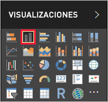
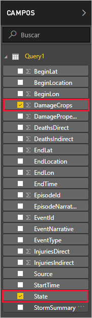
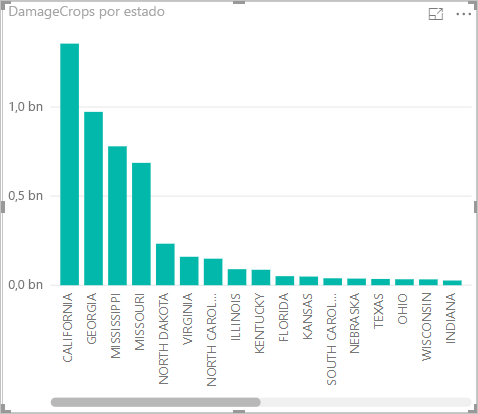

Ahora que tiene datos en Power BI Desktop, puede crear informes basados en esos datos. Podrá crear un informe sencillo con un gráfico de columnas que muestre los daños en las cosechas por estado.

1. En el lado izquierdo de la ventana principal de Power BI, seleccione la vista de datos.

    

1. En el panel **VISUALIZACIONES**, seleccione el gráfico de columnas agrupadas.

    

    Un gráfico en blanco se agrega al lienzo.

    

1. En la lista **CAMPOS**, seleccione **DamageCrops** y **Estado**.

    

    Ahora tiene un gráfico que muestra los daños en las cosechas de las primeras 1000 filas de la tabla.

    

1. Guarde el informe.