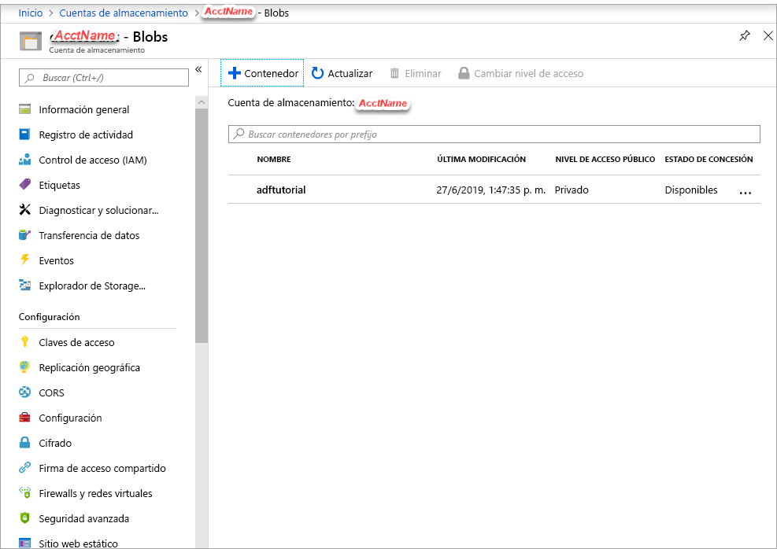
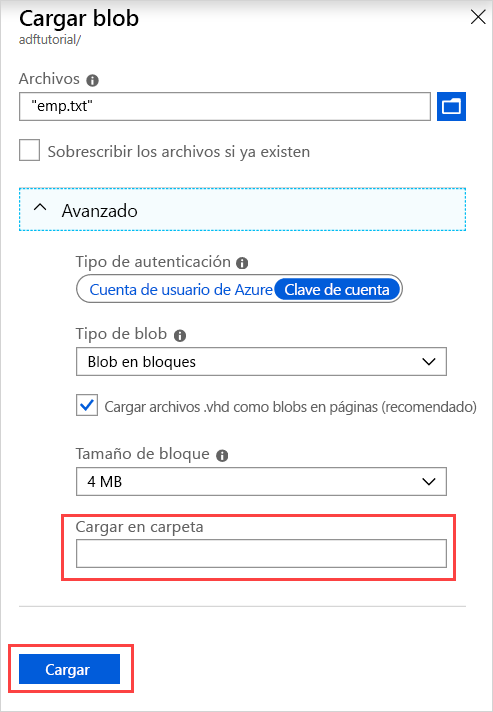

## <a name="prerequisites"></a>Prerrequisitos

### <a name="azure-subscription"></a>Suscripción de Azure
Si no tiene una suscripción a Azure, cree una [cuenta gratuita](https://azure.microsoft.com/free/) antes de empezar.

### <a name="azure-roles"></a>Roles de Azure
Para crear instancias de Data Factory, la cuenta de usuario que use para iniciar sesión en Azure debe ser un miembro de los roles *colaborador* o *propietario*, o de *administrador* de la suscripción de Azure. Para ver los permisos que tiene en la suscripción, vaya a [Azure Portal](https://portal.azure.com), seleccione su nombre de usuario en la esquina superior derecha, seleccione el icono " **...** " para ver más opciones y, después, seleccione **Mis permisos**. Si tiene acceso a varias suscripciones, elija la correspondiente.

Para crear y administrar recursos secundarios para Data Factory incluidos los conjuntos de datos, servicios vinculados, canalizaciones, desencadenadores y entornos de ejecución de integración, se aplican los siguientes requisitos:

- Para crear y administrar recursos secundarios en Azure Portal, debe pertenecer al rol **Colaborador de Data Factory** en el nivel de grupo de recursos u otro nivel superior.
- Para crear y administrar recursos secundarios con Powershell o el SDK, el rol de **Colaborador** en el nivel de recurso u otro nivel superior es suficiente.

Para obtener instrucciones de ejemplo sobre cómo agregar un usuario a un rol, consulte el artículo sobre la [adición de roles](../articles/cost-management-billing/manage/add-change-subscription-administrator.md).

Para más información, consulte los siguientes artículos:

- [Rol de Colaborador de Data Factory](../articles/role-based-access-control/built-in-roles.md#data-factory-contributor)
- [Roles y permisos para Azure Data Factory](../articles/data-factory/concepts-roles-permissions.md)

### <a name="azure-storage-account"></a>Cuenta de Azure Storage
En esta guía de inicio rápido, use una cuenta de Azure Storage (en concreto Blob Storage) de uso general como almacén de datos de *origen* y *destino*. Si no dispone de una cuenta de Azure Storage de uso general, consulte el artículo [Creación de una cuenta de almacenamiento](../articles/storage/common/storage-account-create.md), donde se indica cómo crearla. 

#### <a name="get-the-storage-account-name"></a>Obtención del nombre de la cuenta de almacenamiento
En este inicio rápido necesitará el nombre de su cuenta de Azure Storage. El siguiente procedimiento especifica los pasos necesarios para obtener el nombre de una cuenta de almacenamiento: 

1. En un explorador web, vaya a [Azure Portal](https://portal.azure.com) e inicie sesión con su nombre de usuario y contraseña de Azure.
2. En el menú de Azure Portal, seleccione **Todos los servicios** y, a continuación, seleccione **Almacenamiento** > **Cuentas de almacenamiento**. También puede buscar y seleccionar *cuentas de almacenamiento* desde cualquier página.
3. En la página **Cuentas de Storage**, filtre por su cuenta de almacenamiento (si fuera necesario) y, después, seleccione su cuenta de Storage. 

También puede buscar y seleccionar *cuentas de almacenamiento* desde cualquier página.

#### <a name="create-a-blob-container"></a>Creación de un contenedor de blobs
En esta sección se crea un contenedor de blobs denominado **adftutorial** en la instancia de Azure Blob Storage.

1. En la página de la cuenta de almacenamiento, seleccione **Información general** > **Contenedores**.
2. En la barra de herramientas de la página *\<Nombre de cuenta>*  - **Contenedores**, seleccione **Contenedor**.
3. En el cuadro de diálogo **Nuevo contenedor**, escriba **adftutorial** para el nombre y seleccione **Aceptar**. La página *\<Nombre de cuenta>*  - **Contenedores** está actualizada para incluir **adftutorial** en la lista de contenedores.

   

#### <a name="add-an-input-folder-and-file-for-the-blob-container"></a>Agregar una carpeta de entrada y un archivo para el contenedor de blobs
En esta sección, creará una carpeta denominada **entrada** en el contenedor que acaba de crear y cargará un archivo de ejemplo en la carpeta de entrada. Antes de empezar, abra un editor de texto, como el **Bloc de notas**, y cree un archivo denominado **emp.txt** con el siguiente contenido:

```emp.txt
John, Doe
Jane, Doe
```

Guarde el archivo en la carpeta **C:\ADFv2QuickStartPSH**. (Si la carpeta no existe, créela). A continuación, vuelva a Azure Portal y siga estos pasos:

1. En la página *\<Nombre de cuenta>*  - **Contenedores** donde lo dejó, seleccione **adftutorial** en la lista actualizada de contenedores.

   1. Si ha cerrado la ventana o ha pasado a otra página; inicie sesión de nuevo en [Azure Portal](https://portal.azure.com).
   1. En el menú de Azure Portal, seleccione **Todos los servicios** y, a continuación, seleccione **Almacenamiento** > **Cuentas de almacenamiento**. También puede buscar y seleccionar *cuentas de almacenamiento* desde cualquier página.
   1. Seleccione la cuenta de almacenamiento y, después, seleccione **Contenedores** > **adftutorial**.

2. En la barra de herramientas de la página del contenedor **adftutorial**, seleccione **Cargar**.
3. En la página **Cargar blob**, seleccione **Archivos** y, a continuación, busque y seleccione el archivo **emp.txt**.
4. Expanda el título **Avanzado**. La página aparece ahora como a continuación:

   
5. En el cuadro **Cargar en carpeta**, escriba **input**.
6. Seleccione el botón **Cargar**. Debería ver el archivo **emp.txt** y el estado de la carga en la lista.
7. Seleccione el icono **Cerrar** (**X**) para cerrar la página **Cargar blob**.

Mantenga abierta la página del contenedor **adftutorial**. Úsela para comprobar la salida al final de esta guía de inicio rápido.